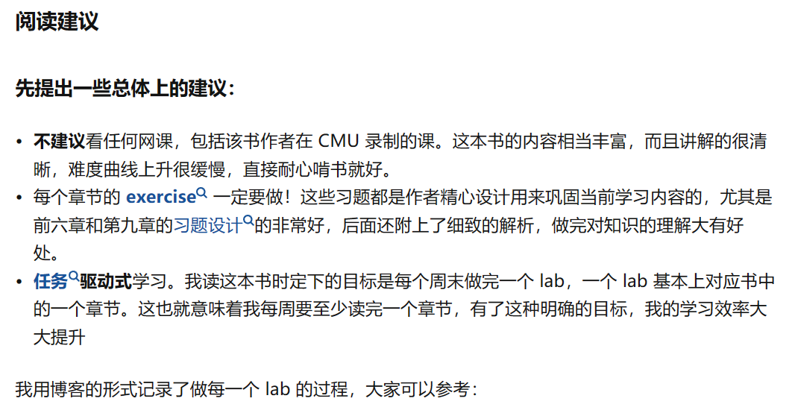

# C++ 查漏补缺

## 知识扩展

- [C++面试-STL篇，细节有点多 - 知乎 (zhihu.com)](https://zhuanlan.zhihu.com/p/614287445?utm_source=wechat_session&utm_medium=social&utm_oi=869896098955792384)；
- [你真的了解 c++ 智能指针吗？ - 知乎 (zhihu.com)](https://zhuanlan.zhihu.com/p/666995512)；
- [cpu cache 体系结构 - 知乎 (zhihu.com)](https://zhuanlan.zhihu.com/p/666581673)；
- [带你详细了解Linux内核源码的构成及其作用 - 知乎 (zhihu.com)](https://zhuanlan.zhihu.com/p/664311343)。

## 项目练习

### How-to-Make-a-Computer-Operating-System

如何用 C++ 制作一个计算机操作系统，这个项目就告诉你。

与其说这是一个项目，倒不如说是一本教大家如何从头开始用 C/C++ 编写计算机操作系统的在线书籍，如果能搞下来，对你的帮助会很大。

> 链接：[GitHub - SamyPesse/How-to-Make-a-Computer-Operating-System: How to Make a Computer Operating System in C++](https://link.zhihu.com/?target=https%3A//github.com/SamyPesse/How-to-Make-a-Computer-Operating-System)。

## 推荐书籍

### 《深入理解计算机系统（CSAPP）》

> 阅读方法：[如何阅读《深入理解计算机系统》这本书？ - 知乎 (zhihu.com)](https://www.zhihu.com/question/20402534)。

帖子作者：早睡晚起。

## 学习经验

- [后端太卷，半路转了嵌入式 (qq.com)](https://mp.weixin.qq.com/s/EBnq_q0pT3YnJdS7Sk7ocg)
- [OS内核，如何拿捏？ (qq.com)](https://mp.weixin.qq.com/s/4CajKz7bN5XA3kLzMJA6Pg)

