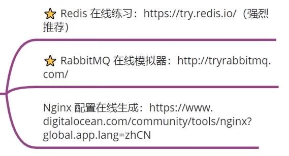

# Java 后端学习路线

## Java 基础

推荐书籍：

- 《Head First Java》
- 《Java核心技术 卷一》（巩固基础）
- 《Java核心技术 卷二》（补充）

## 计算机基础

### 计算机网络

推荐书籍：

- 《图解 HTTP》
- 《图解 TCP/IP》
- 《计算机网络自顶向下方法》
- 《TCP/IP 详解卷一》

### 操作系统

学习重点：

- 线程、进程
- 进程/线程间通信
- 进程调度算法
- 进程/线程状态
- 死锁
- 内存管理

Linux：

- 常用命令
- 文件系统
- shell 脚本

Linux 推荐书籍：

- 韩顺平《一周学会 Linux》
- 《鸟哥的 Linux 私房菜》
- 《UNIX 环境高级编程》

## 数据库

学习重点：

- MySQL 基础
- MySQL 调优

推荐书籍：

- 《MySQL 必知必会》
- 《SQL 基础教程》
- 《SQL 进阶教程》

练习：SQL 自学网

## Java web

### 基础知识

- 前端基础：HTML、CSS、JavaScript、Vue
- XML
- JSON
- Servlet
- Filter
- Listener
- JSP
- JSTL
- Cookie
- Session
- Tomcat

### 开发框架

- Spring
- SpringBoot
- Mybatis
- Mybatis-plus
- Spring Cache
- Sharding-JDBC

### 开发工具

- Git
- GitHub
- Wireshark
- Swagger（接口文档）
- Postman（接口测试）

## Java 高级

推荐视频：

- 尚硅谷《JUC 并发编程》
- 尚硅谷《JVM 全套教程详解》
- 狂神说 Java《JVM 快速入门篇》

推荐书籍：

- 《Java 并发编程实战》
- 《深入理解 Java 虚拟机》
- 《图解设计模式》

推荐网站：

- 菜鸟教程：设计模式

## 中间件

### Redis（缓存）

学习重点：

- 数据类型
- 常用操作
- Java API
- 主从复制
- 哨兵集群
- 持久化
- 实际应用

推荐书籍：《Redis 设计与实现》

推荐视频：尚硅谷

### RabbitMQ（消息队列）

学习重点：

- 作用
- 生产消费模型
- 交换机模型
- 死信队列
- 延迟队列
- 消息持久化
- Java API
- 集群

推荐视频：尚硅谷

### Nginx（网关）

学习重点：

- 作用
- 正向代理
- 反向代理（负载均衡）
- 常用命令
- 配置
- 动静分离（ 网站部署）
- 集群

推荐视频：尚硅谷

在线练习：

### Kafka（消息队列）

## Netty 网络编程

推荐视频：尚硅谷

## 微服务

开发框架：

- Dubbo
- Zookeeper
- Springcloud
- Springcloud Alibaba

推荐视频：尚硅谷

## 容器

- Docker
- K8S

推荐视频：狂神说 Java

## CI/CD

推荐视频：狂神说 Java

## 参考资料

- [鱼皮怒肝 Java 学习路线一条龙！ (qq.com)](https://mp.weixin.qq.com/s/nWC8e2GfvFq7W4MEdg-OPQ)
- [Java 面试指南 | JavaGuide](https://javaguide.cn/)
- [「代码随想录」刷题攻略 (qq.com)](https://mp.weixin.qq.com/s/zLyWzB0erh3cdinESvisBQ)