# 消息队列

## 1 基本概念

### 1.1 什么是 MQ？

本质上是一个队列，存放的内容为消息，是一种跨进程的通信机制，用于上下游传递消息，是一种“逻辑解耦+物理解耦”的消息通信服务。

### 1.2 为什么要用 MQ？

- 流量削峰

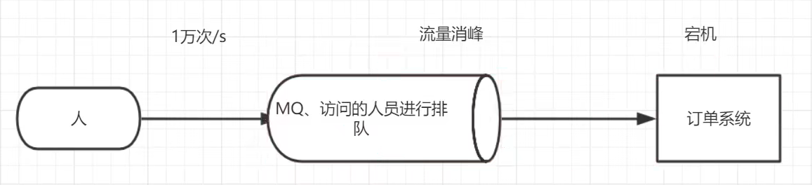

- 应用解耦
- 异步处理

### 1.3 MQ 的分类

- ActiveMQ
- Kafka
- RocketMQ
- RabbitMQ

### 1.4 MQ 的选择

## 2 RabbitMQ

### 2.1 基本概念

消息中间件：接收并转发消息。

举例（快递站）：

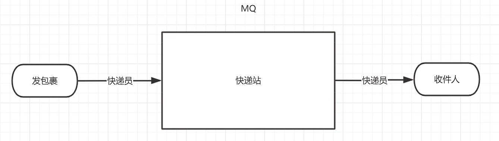

### 2.2 四大核心概念

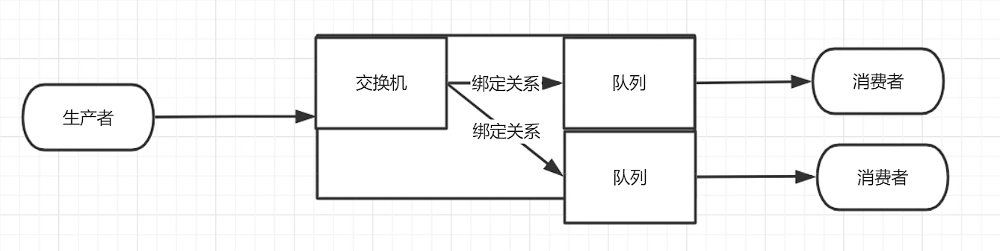

- 生产者
- 交换机
- 队列
- 消费者

注意：

- 一个消息队列中可以有多个交换机
- 一个交换机可以绑定多个队列

### 2.3 六大核心模式

- 简单模式
- 工作模式
- 发布/订阅模式
- 路由模式
- 主题模式
- 发布确认模式

### 2.4 名词解释

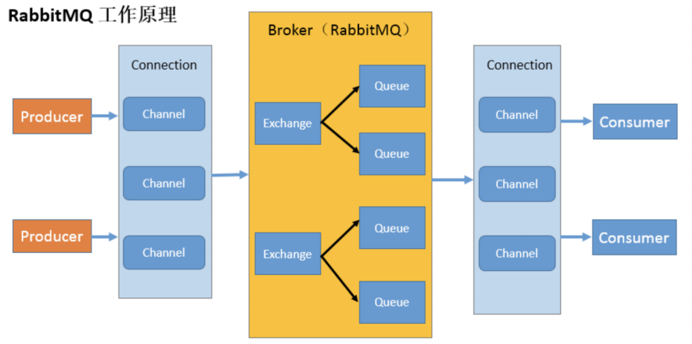

- Broker：消息队列（接收和分发消息的应用）
- Virtual host：类似于在自己的电脑中创建的多个虚拟机
- Connection：连接（每一个生产者/消费者会与消息队列之间建立 TCP 连接）
- Channel：信道（即发送消息的通道，信道是连接内部建立的逻辑连接，每一个连接里可以有多个信道）
- Exchange
- Queue
- Binding

### 2.5 安装

应先安装 Erlang 语言环境，再安装 RabbitMQ 应用。

# 简单模式

## 1 依赖

- maven 编译插件
- rabbitmq 客户端依赖
- 操作文件流依赖

## 2 生产者代码

## 3 消费者代码

# 工作模式

任务队列（将任务封装为消息并将其发送到队列），避免立即执行资源密集型任务，而不得不等待它完成。

## 1 轮询分发消息

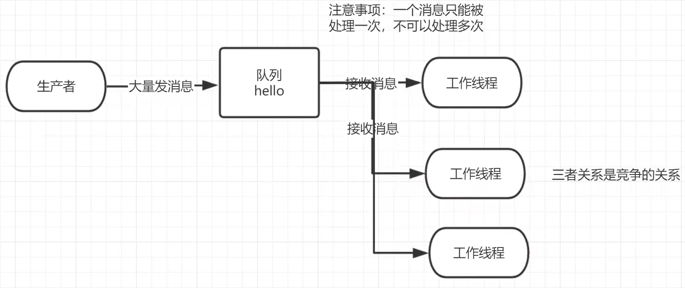

代码：

```java
// 工具类
public class RabbitMqUtils {
    // 得到一个连接的 channel
    public static Channel getChannel() throws Exception {
        // 创建一个连接工厂
        ConnectionFactory factory = new ConnectionFactory();
        factory.setHost("182.92.234.71");
        factory.setUsername("admin");
        factory.setPassword("123");
        Connection connection = factory.newConnection();
        Channel channel = connection.createChannel();
        return channel;
    }
}

// 生产者
public class Task01 {
    private static final String QUEUE_NAME = "hello";

    public static void main(String[] args) throws Exception {
        try (Channel channel = RabbitMqUtils.getChannel();) {
            /**
             * 生成一个队列：
             * 1.队列名称
             * 2.durable：队列里面的消息是否持久化，默认消息存储在内存中
             * 3.exclusive：该队列是否只供一个消费者进行消费，是否进行共享，为 true 代表可以被多个消费者消费
             * 4.autoDelete：是否自动删除，最后一个消费者断开连接以后，该队列是否自动删除，为 true 代表自动删除
             * 5.arguments：其他参数
             */
            channel.queueDeclare(QUEUE_NAME, false, false, false, null);
            
            // 从控制台当中接受信息
            Scanner scanner = new Scanner(System.in);
            while (scanner.hasNext()) {
                String message = scanner.next();
                /**
                 * 发送一个消息：
                 * 1.发送到那个交换机
                 * 2.路由的 key 是哪个（这里填队列名称）
                 * 3.其他的参数信息
                 * 4.发送消息的消息体（二进制字节流），使用 UTF-8 编码可以防止中文出现乱码
                 */
                channel.basicPublish("", QUEUE_NAME, null, message.getBytes("UTF-8"));
                System.out.println("发送消息完成:" + message);
            }
        }
    }
}

// 消费者
public class Worker01 {
    private static final String QUEUE_NAME = "hello";

    public static void main(String[] args) throws Exception {
        Channel channel = RabbitMqUtils.getChannel();
        
        // 接收到消息的处理逻辑
        DeliverCallback deliverCallback = (consumerTag, delivery) -> {
            // 获取消息体（消息包括：消息头、消息体...）
            String receivedMessage = new String(delivery.getBody());
            System.out.println("接收到消息:" + receivedMessage);
        };
        
        // 接收失败（取消接收）的处理逻辑
        // 比如：在消费的时候队列被删除了
        CancelCallback cancelCallback = (consumerTag) -> {
            System.out.println(consumerTag + "消费者取消消费接口回调逻辑");
        };
        
        System.out.println("C2 消费者启动等待消费......");
        /**
         * 消费者消费消息：
         * 1.消费哪个队列
         * 2.消费成功之后是否要自动应答，为 true 代表自动应答，为 false 代表手动应答
         * 3.消息如何进行消费的回调
         * 4.消费者未成功消费的回调
         */
        channel.basicConsume(QUEUE_NAME, true, deliverCallback, cancelCallback);
    }
}
```

## 2 消息应答

### 2.1 基本概念

目的：为了保证消息不丢失。

消息应答：消费者在接收到消息并处理该消息之后，告诉 RabbitMQ 它已经处理了，RabbitMQ 可以把该消息删除了。

### 2.2 自动应答

自动应答：只要将消息发送给消费者就删除队列中的消息，不管该消息是否已经被处理完成。

当生产和消费的速度相匹配时，就使用自动应答。

### 2.3 手动应答

手动应答：将消息发送给消费者，并且等待消费者处理完成之后才会删除对应的消息。

推荐使用手动应答的方式。

常用方法：

- `Channel.basicAck`
- `Channel.basicNack`
- `Channel.basicReject`

### 2.4 批量应答

可以批量应答并减少网络的阻塞（`multiple` 参数）。

建议不使用批量应答（即将 `multiple` 设置为 `false`），因为这样可能会造成消息的丢失。

### 2.5 消息自动重新入队

消息在手动应答时是不会丢失的，会被放回队列重新消费。

注意：

> 如果消息被消费了，但是应答的时候发生了问题导致无法正常应答，那也算是没消费。
>
> 因为你没有应答成功，这种情况下需要保证消费的幂等性。
>
> 消费两次肯定要考虑，所以在服务端就要做消息的幂等处理。

### 2.6 手动应答代码

```java
public class Work03 {
    private static final String ACK_QUEUE_NAME = "ack_queue";

    public static void main(String[] args) throws Exception {
        Channel channel = RabbitMqUtils.getChannel();
        
        System.out.println("C1 等待接收消息处理时间较短");
        
        // 消息消费的时候如何处理消息
        DeliverCallback deliverCallback = (consumerTag, delivery) -> {
            String message = new String(delivery.getBody());
            SleepUtils.sleep(1);
            System.out.println("接收到消息:" + message);
            /**
             * 1.消息标记 tag
             * 2.是否批量应答未应答消息
             */
            channel.basicAck(delivery.getEnvelope().getDeliveryTag(), false);
        };
        
        // 采用手动应答
        boolean autoAck = false;
        channel.basicConsume(ACK_QUEUE_NAME, autoAck, deliverCallback, (consumerTag) -> {
            System.out.println(consumerTag + "消费者取消消费接口回调逻辑");
        });
    }
}
```

### 2.7 手动应答效果

生成者分别发送：a b c d。

有两个生产者 c1 和 c2。

1. 一开始 c1 和 c2 都正常工作，c1 会收到 a，c2 会收到 b。
2. 然后 c2 挂了。
3. c1 会收到 c，然后 c1 会收到 d。（d 本应由 c2 消费，但是因为它挂了，消息被重新转发给了 c1）

注意：

> 原理和 http 一样，消费者没有响应则发送给其他的消费者。
>
> 这里会导致消息重复消费。
>
> c2 订阅了队列，因此队列可以知道 c2 有没有挂掉。

## 3 持久化

### 3.1 基本概念

确保消息不会丢失需要做两件事：将队列和消息都标记为持久化。

### 3.2 队列的持久化

可以在 RabbitMQ 后台看到 `Features` 为 `D`。

  代码：

```java
// 声明一个持久化的队列
boolean durable = true;
channel.queueDeclare(队列名, durable, false, false, null);
```

如果之前声明的队列不是持久化的，则需要把原来的队列先删除，并重新创建一个持久化的队列，不然就会出现错误。

这个时候即使重启 RabbitMQ，持久化的队列也依然存在。

### 3.3 消息的持久化

消息原本是存储在内存中的，开启持久化后变为存储在磁盘中。

需要在消息的生产者修改代码：

```java
// 当 durable 为 true 时
channel.basicPublish("", 队列名, MessageProperties.PERSISTENT_TEXT_PLAIN, message.getBytes("UTF-8"));
```

该持久化策略仍存在问题，消息仍可能会被丢失。

### 3.4 不公平分发

意思就是如果这个任务我还没有处理完或者我还没有应答你，你先别分配给我，我目前只能处理一个任务，然后 RabbitMQ 就会把该任务分配给没有那么忙的那个空闲消费者，当然如果所有的消费者都没有完成手上任务，队列还在不停的添加新任务，队列有可能就会遇到队列被撑满的情况，这个时候就只能添加新的消费者或者改变其他存储任务的策略。

需要设置消费者信道的参数：`channel.basicQos(1)`

注意：

> 视频中这里讲错了，并且这里设置的 1 需要和手动确认模式配合才能达到想要的效果。
>
> 这里表示一个消费者每个信道每次可以取多少条消息。
>
> 这就相当于设置 consumer 的信道容量，0 就是无限大，1 就是 1，2 就是 2，但是分发方式还是轮询，只不过容量满了就会跳过。

可以在 RabbitMQ 后台看到 `Prefetch count` 显示为 `1`。

### 3.5 预取值

预取值：`prefetch`

预先指定给每个消费者分发的消息数量。

需要设置消费者信道的参数：`channel.basicQos(2)`

注意：

> 预期值的意思就是最多可以囤多少没处理的消息，超过就不给发了。
>
> 这个应该理解为每次处理完设置的 prefetch 的数量后才能获取下一批 prefetch 数量的消息。
>
> 预取值可以理解为单个消费者积压消息的上限。就是如果信道最多堆积 2 条，消费者持有 1 条，则一共被认为 3 条（队列中）。
>
> 预取值 = 不公平分发 + 信道最大容量。
>
> 用 For 循环连续发送 10 条数据，前 2 条会给到 C1，后边 5 条给到 C2，当 C2 还没消费完一条消息时并且 C1 已经消费了一些消息后，后面的消息会向 C1 分配，直到 C2 完成了一条消息的消费后才继续给 C2 分配消息。

# 发布/确认模式

## 1 基本概念

发布/确认：生产者发布消息给消息队列后，当 RabbitMQ 在磁盘上完成了消息的持久化之后，需要向生产者进行应答，以保证消息不会丢失。

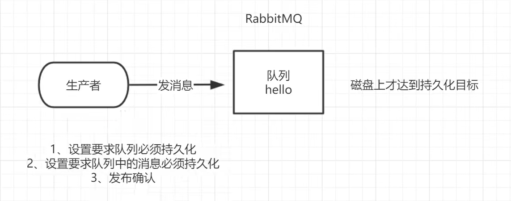

发布确认是解决数据不丢失的重要环节。

## 2 发布确认的策略

### 2.1 开启发布确认的方法

生产者：`channel.confirmSelect()`

默认没有开启。

### 2.2 单个发布确认

每发一条，确认一条，是同步的方式。

缺点：发布的速度特别慢。

代码：

```java
class test {
    public static void publishMessageIndividually() throws Exception {
        try (Channel channel = RabbitMqUtils.getChannel()) {
            String queueName = UUID.randomUUID().toString();
            channel.queueDeclare(queueName, false, false, false, null);

            // 开启发布确认
            channel.confirmSelect();

            long begin = System.currentTimeMillis();

            for (int i = 0; i < MESSAGE_COUNT; i++) {
                String message = i + "";
                // 发布消息
                channel.basicPublish("", queueName, null, message.getBytes());
                // 等待确认（阻塞）
                // 若服务端返回 false 或超时未返回，生产者会重发消息
                boolean flag = channel.waitForConfirms();
                if (flag) {
                    System.out.println("消息发送成功");
                }
            }

            long end = System.currentTimeMillis();
            System.out.println("发布" + MESSAGE_COUNT + "个单独确认消息,耗时" + (end - begin) + "ms");
        }
    }
}
```

### 2.3 批量发布确认

性能更高（速度更快），但是当出错时，无法知道具体是哪条消息出错了。

代码：

```java
class test {
    public static void publishMessageBatch() throws Exception {
        try (Channel channel = RabbitMqUtils.getChannel()) {
            String queueName = UUID.randomUUID().toString();
            channel.queueDeclare(queueName, false, false, false, null);

            // 开启发布确认
            channel.confirmSelect();

            // 批量确认消息大小
            int batchSize = 100;

            // 未确认消息个数
            int outstandingMessageCount = 0;
            
            long begin = System.currentTimeMillis();
            
            for (int i = 0; i < MESSAGE_COUNT; i++) {
                String message = i + "";
                channel.basicPublish("", queueName, null, message.getBytes());
                outstandingMessageCount++;
                if (outstandingMessageCount == batchSize) {
                    // 等待确认（阻塞）
                    channel.waitForConfirms();
                    outstandingMessageCount = 0;
                }
            }
            
            // 为了确保还有剩余没有确认消息，再次确认
            if (outstandingMessageCount > 0) {
                channel.waitForConfirms();
            }
            
            long end = System.currentTimeMillis();
            System.out.println("发布" + MESSAGE_COUNT + "个批量确认消息,耗时" + (end - begin) + "ms");
        }
    }
}
```

### 2.4 异步发布确认

逻辑复杂，但是性能好（可靠性、传输效率），是非阻塞的。

通过回调函数来保证消息的可靠传递。

给消息编号，后续可以通过消息序号知道哪些消息发布成功了，哪些失败了。

不管消息队列是否收到生产者发布的消息，它都会进行应答，分为确认和未确认两种。

代码：

```java
class test {
    public static void publishMessageAsync() throws Exception {
        try (Channel channel = RabbitMqUtils.getChannel()) {
            String queueName = UUID.randomUUID().toString();
            channel.queueDeclare(queueName, false, false, false, null);

            // 开启发布确认
            channel.confirmSelect();

            /**
             * 线程安全有序的一个哈希表，适用于高并发的情况：
             * 1.轻松的将序号与消息进行关联
             * 2.轻松批量删除条目，只要给到序列号
             * 3.支持并发访问
             * 这里官网用的是 ConcurrentNavigableMap
             * 注意这里为什么不用 ConcurrentHashMap，因为后续如果需要批量删除的话，需要将连续的将一段 Key 删除，这就需要 Key 是有序存储的，所以 HashMap 不符合
             */
            ConcurrentSkipListMap<Long, String> outstandingConfirms = new ConcurrentSkipListMap<>();

            /**
             * 确认收到消息的一个回调：
             * 1.消息序列号
             * 2.true：可以确认小于等于当前序列号的消息，false：只确认当前序列号消息
             */
            ConfirmCallback ackCallback = (sequenceNumber, multiple) -> {
                if (multiple) {
                    /**
                     * 批量确认：
                     * headMap 的返回值是一个从第一个 Key 到传入 headMap 方法的 key 之间所有元素组成的一个子跳表
                     * 返回的是 <= 当前序列号的已经被确认的消息，是一个 map
                     * 跳表相比于简单的哈希表的区别是：
                     * 跳表的 Key 是按照插入顺序来的，看源码可以知道 headMap 方法是得到传进去的 Key 到第一个 Key 的所有 Key。
                     * 目的是可以调用 clear 进行批量删除。
                     * headMap 有一个重载方法，要把第二个参数设置为 true，返回小于等于当前序号的元素集合，不然最后一个消息删除不了。
                     */
                    ConcurrentNavigableMap<Long, String> confirmed = outstandingConfirms.headMap(sequenceNumber, true);
                    // 已确认的消息从跳表清除以释放内存
                    confirmed.clear();
                } else {
                    /**
                     * 单个确认：
                     * 直接清除当前序列号（key）的消息
                     */
                    outstandingConfirms.remove(sequenceNumber);
                }
            };

            /**
             * 未确认收到消息的一个回调：
             * 1.消息序列号
             * 2.true：可以确认小于等于当前序列号的消息
             *   false：确认当前序列号消息
             */
            ConfirmCallback nackCallback = (sequenceNumber, multiple) -> {
                // 将未确认的消息重发
                String message = outstandingConfirms.get(sequenceNumber);
                System.out.println("发布的消息" + message + "未被确认，序列号" + sequenceNumber);
            };

            /**
             * 添加一个异步确认的监听器（非阻塞）：
             * 1.确认收到消息的回调
             * 2.未收到消息的回调
             */
            channel.addConfirmListener(ackCallback, nackCallback);

            long begin = System.currentTimeMillis();

            for (int i = 0; i < MESSAGE_COUNT; i++) {
                String message = "消息" + i;
                /**
                 * 获取下一个消息的序列号：channel.getNextPublishSeqNo()
                 * 通过序列号与消息体进行一个关联
                 */
                outstandingConfirms.put(channel.getNextPublishSeqNo(), message);
                channel.basicPublish("", queueName, null, message.getBytes());
            }

            long end = System.currentTimeMillis();
            System.out.println("发布" + MESSAGE_COUNT + "个异步确认消息,耗时" + (end - begin) + "ms");
        }
    }
}
```

### 2.5 异步未确认消息的处理

把未确认的消息放到一个基于内存的能被发布线程访问的队列（`ConcurrentLinkedQueue`），这个队列在 `ConfirmCallback` 与发布线程（生产者）之间进行消息的传递。

注意：

> 不管是成功还是失败，回调函数只能拿到发布消息时的一个编号。也就是说，回调函数中，是不知道你当时发送了什么的。同时，因为回调是批量确认的，所以使用基于链表的并发集合是最正确的。

### 2.6 总结

- 单个发布确认：同步等待确认，简单，但吞吐量非常有限。
- 批量发布确认：批量同步等待确认，简单，吞吐量高，但出现问题后很难排查是哪条消息出现了问题。
- 异步发布确认：性能和资源使用效率高，并且在出现错误的情况下可以很好地控制，但是其逻辑较为复杂，代码实现困难。

# 交换机

发布/订阅模式：一个消息发送给多个消费者。一个交换机绑定两个队列，一条消息同时发送给两个队列。

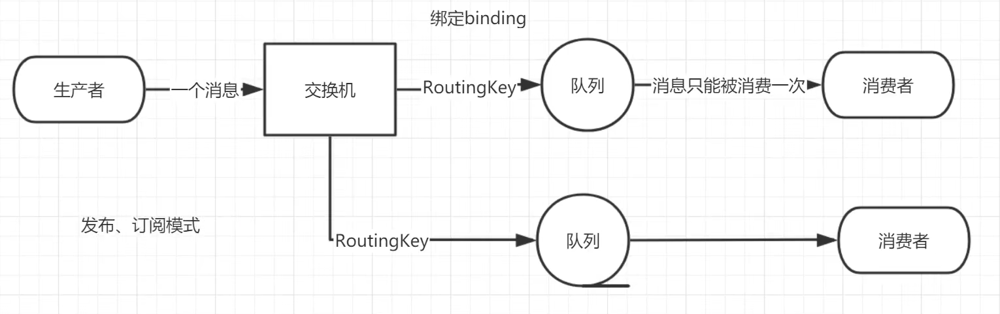

## 1 基本概念

### 1.1 交换机的概念

交换机：接收生产者发送的消息，并将消息转发给一个或多个队列。

### 1.2 交换机的分类

- 直接（direct）或路由
- 主题（topic）
- 标题（headers）
- 扇出（fanout）或发布/订阅

### 1.3 无名交换机

无名（默认）交换机，用空字符串 `""` 表示。

消息通过交换机能路由并发送到哪个队列，是由 `routingKey(bingdingkey)` 指定的。使用默认交换机时，可以直接使用队列名称。

## 2 临时队列

临时队列：不持久化的队列，一旦断开了消费者的连接，队列将被自动删除。

可以让 RabbitMQ 服务器为临时队列指定一个随机的名称。

创建方式：`String queueName = channel.queueDeclare().getQueue();`

## 3 绑定

将一个交换机与一个或多个队列进行绑定（binding）。

交换机中的消息通过 `Routing key` 进行路由与转发：

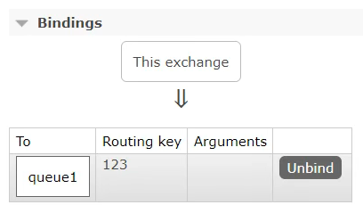

流程总结：

1. 交换机接收生产者发布的消息
2. 消息根据 `Routing key` 路由转发到对应的队列
3. 队列将消息发送到消费者

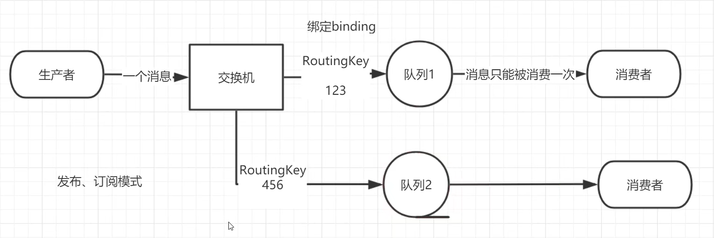

## 4 发布/订阅模式

### 4.1 基本概念

发布/订阅：将收到的所有消息广播到它知道的所有队列中。

交换机 type：`fanout`

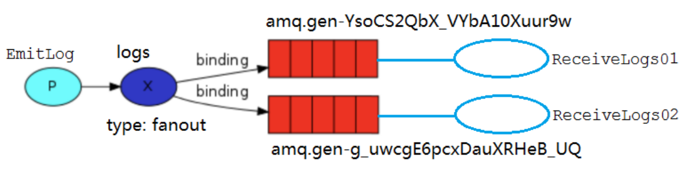

### 4.2 示例

代码：

```java
// 消费者
public class ReceiveLogs01 {
    private static final String EXCHANGE_NAME = "logs";

    public static void main(String[] argv) throws Exception {
        Channel channel = RabbitUtils.getChannel();

        // 声明交换机
        channel.exchangeDeclare(EXCHANGE_NAME, "fanout");

        /**
         * 生成一个临时的队列 队列的名称是随机的
         * 当消费者断开和该队列的连接时 队列自动删除
         */
        String queueName = channel.queueDeclare().getQueue();

        // 把该临时队列绑定我们的 exchange，其中 routingkey 为空字符串
        channel.queueBind(queueName, EXCHANGE_NAME, "");

        System.out.println("等待接收消息,把接收到的消息打印在屏幕.....");

        DeliverCallback deliverCallback = (consumerTag, delivery) -> {
            String message = new String(delivery.getBody(), "UTF-8");
            System.out.println("控制台打印接收到的消息" + message);
        };

        channel.basicConsume(queueName, true, deliverCallback, consumerTag -> {
        });
    }
}

// 生产者
public class EmitLog {
    private static final String EXCHANGE_NAME = "logs";

    public static void main(String[] argv) throws Exception {
        try (Channel channel = RabbitUtils.getChannel()) {
            /**
             * 声明一个 exchange
             * 1.exchange 的名称
             * 2.exchange 的类型
             */
            channel.exchangeDeclare(EXCHANGE_NAME, "fanout");

            Scanner sc = new Scanner(System.in);
            System.out.println("请输入信息");
            while (sc.hasNext()) {
                String message = sc.nextLine();
                // 这里的消息是发到交换机上，由交换机再发给指定的队列，而不是直接发到队列中
                channel.basicPublish(EXCHANGE_NAME, "", null, message.getBytes("UTF-8"));
                System.out.println("生产者发出消息" + message);
            }
        }
    }
}
```

注意：

> 为什么消费者端还需要声明交换机呢？（以下观点仅供参考）
>
> - 在生产者声明交换机，然后绑定队列。在消费者声明队列，取数据。
> - 如果交换机在生产者中定义，发消息时如果没打开消费者的话，消息会丢失。
> - 因为在消费者声明交换机启动的时候，生产者没有启动，不会保存，不然光在生产者声明，先启动消费者会报错。
> - 这样不用区分先启动消费者还是先启动生产者。
> - 生产者中声明交换机和队列，那要用到的所有队列都需要在生产者创建并与交换机绑定；而在消费者中，只需要创建自己的队列并与交换机绑定。
> - 消费者不声明交换机，谁先启动都不会报错，照样能收到消息。
> - 生产者只面向交换机，消费者只面向队列，不需要定义交换机，启动时当然是 server -> publisher -> consumer 的启动顺序。
> - 生产者和消费者两边都可以不用声明交换机，一样可以接收，只要绑定了就行。
> - 纠正一下，交换机已经在生产者里声明了，消费者不用额外声明，知道名字就行。
> - 这个重复声明是没有错的，因为方法里写死了交换机，信道显式声明能错？
> - 三个地方都声明是为了线程启动的顺序可以随意。因为要用到所以要声明，不然谁先声明谁先启动。
> - 消费者里可以不用声明交换机，但是绑定要在消费者里绑定。
>
> 关于 routingKey：
>
> - 空串，是指用默认的队列，是在内存中生成的随机队列对象。
> - 这种类型是广播，即使是 key 不相同的队列，也能获取到消息。这里就算不是空串也能收到消息。

总结：

1. 生产者通过交换机去发布消息，交换机实际上就相当于大喇叭。
2. 大喇叭（交换机）喊话，不用在意谁听到谁没听到。
3. 只要在大喇叭附近的人（即跟交换机绑定的队列）都能听到大喇叭讲的话。
4. 而附近的人的朋友们（消费者）想知道消息就要问。
5. 附近的人告诉他们的朋友（消费者从队列取消息）。
6. 所以生产者只要对接交换机（拿大喇叭喊话）。
7. 消费者要从与交换机绑定的队列里取消息。
8. 所以消费者要声明交换机、队列，并把他俩绑定起来。

## 5 路由模式

### 5.1 回顾

发布/订阅模式与路由模式的区别：

- 发布/订阅模式（扇出）：绑定同一个交换机的多个队列的 `routingKey` 相同。交换机直接将消息进行广播，不够灵活。
- 路由模式（直接交换机）：绑定同一个交换机的多个队列的 `routingKey` 不同。交换机只会将消息发送到它绑定的 `routingKey` 的队列中。

注意：

> 在发布订阅模式下，就算 routingKey 不同，只要队列绑定了交换机，就能收到消息。
>
> 扇出模式只看交换机，与 routingKey 无关。

### 5.2 基本概念

交换机中的消息会根据生产者发布时设置的 `routingKey` 路由到对应的队列中。

交换机 type：`direct`

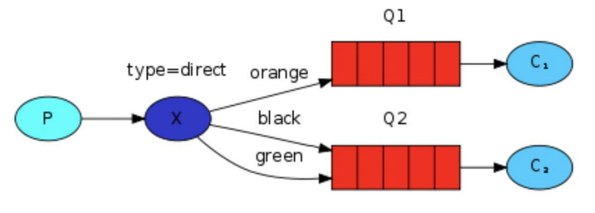

### 5.3 多重绑定

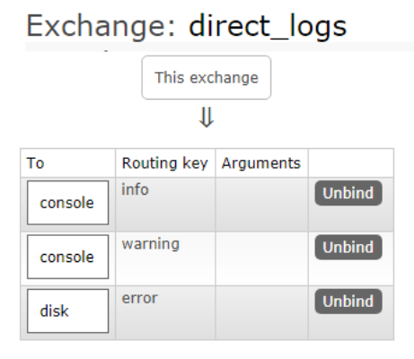

注意：

> 一个信道可以有多个队列，一个队列可以绑定多个交换机，一个交换机可以有多个 routingKey？

### 5.4 示例

代码：

```java
// 消费者
public class ReceiveLogsDirect01 {
    private static final String EXCHANGE_NAME = "direct_logs";

    public static void main(String[] argv) throws Exception {
        Channel channel = RabbitUtils.getChannel();

        // 声明交换机
        channel.exchangeDeclare(EXCHANGE_NAME, BuiltinExchangeType.DIRECT);

        // 声明并绑定队列
        String queueName = "disk";
        channel.queueDeclare(queueName, false, false, false, null);
        // routingKey 为 error 的消息会被发送到此队列
        channel.queueBind(queueName, EXCHANGE_NAME, "error");

        System.out.println("等待接收消息.....");

        DeliverCallback deliverCallback = (consumerTag, delivery) -> {
            String message = new String(delivery.getBody(), "UTF-8");
            message = "接收绑定键:" + delivery.getEnvelope().getRoutingKey() + ",消息:" + message;
            File file = new File("C:\\work\\rabbitmq_info.txt");
            FileUtils.writeStringToFile(file, message, "UTF-8");
            System.out.println("错误日志已经接收");
        };

        channel.basicConsume(queueName, true, deliverCallback, consumerTag -> {
        });
    }
}

// 生产者
public class EmitLogDirect {
    private static final String EXCHANGE_NAME = "direct_logs";

    public static void main(String[] argv) throws Exception {
        try (Channel channel = RabbitUtils.getChannel()) {
            // 声明交换机
            channel.exchangeDeclare(EXCHANGE_NAME, BuiltinExchangeType.DIRECT);

            // 创建多个 routingKey
            Map<String, String> bindingKeyMap = new HashMap<>();
            bindingKeyMap.put("info", "普通 info 信息");
            bindingKeyMap.put("warning", "警告 warning 信息");
            bindingKeyMap.put("error", "错误 error 信息");
            bindingKeyMap.put("debug", "调试 debug 信息");

            for (Map.Entry<String, String> bindingKeyEntry : bindingKeyMap.entrySet()) {
                String bindingKey = bindingKeyEntry.getKey();
                String message = bindingKeyEntry.getValue();
                // 发送消息到交换机，为每一条消息设置其 routingKey
                channel.basicPublish(EXCHANGE_NAME, bindingKey, null, message.getBytes("UTF-8"));
                System.out.println("生产者发出消息:" + message);
            }
        }
    }
}
```

## 6 主题模式

### 6.1 回顾

路由模式的：可以将不同的消息路由到不同的队列（有选择性地接受消息），但是却无法将一条消息同时发送到多个队列。

发布/订阅模式：可以实现一个 routingKey 绑定多个队列，但是却不够灵活。

### 6.2 基本概念

看到：P45

网址：[45-Topic交换机的作用_哔哩哔哩_bilibili](https://www.bilibili.com/video/BV1cb4y1o7zz/?p=45&spm_id_from=pageDriver&vd_source=2754a9b73cb316d2cad8eb1195f5aa23)
