# INVIDIA GPU & CUDA 入门学习

## 概述

AI 芯片：

- 通用处理器 CPU；
- 通用图形处理器 GPU；
- AI 专用处理器 NPU/TPU。

大纲：

- 硬件基础：GPU 工作原理、GPU AI 编程本质；
- 英伟达 GPU 架构：从 Fermi 到 Hopper 架构、Tensor Code 和 NVLink（AI 相关）；
- GPU 图形处理流水线：图形流水线基础、GPU 逻辑模块划分、图形处理算法到硬件。

> 参考资料：https://github.com/chenzomi12/DeepLearningSystem/tree/main/Hardware。

## GPU 工作原理

### CPU vs GPU

关注重点：

- CPU：延迟、并发（Concurrency，能够处理多个任务的功能，但不一定是同时）；
- GPU：最大化吞吐量、并行度（Parallelism，同时可以执行多少任务）。

硬件设计：

- GPU 的 DRAM 时延（数据搬运、指令执行的延迟）远高于 CPU；
- GPU 的线程数远高于 CPU（有非常多的线程，为大量大规模任务并行而去设计的）。

总结：

- CPU：希望在一个线程里完成所有的工作（串行，优化线程的执行速率和效率）；
- GPU：利用多线程对循环进行展开，来提高硬件整体的利用率（并行，用足够多的线程去解决延迟的问题）。

### GPU 缓存机制

HBM（High Bandwidth Memory，高带宽内存）：显存，GPU 里的主内存。

多级缓存：

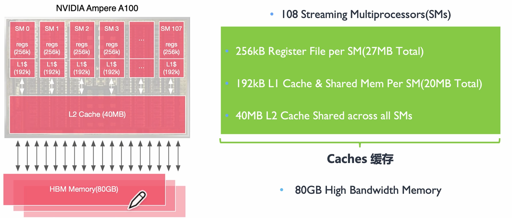

实际计算的时候，希望尽快将缓存用完，然后去换下一批数据上来。

如果 GPU 里没有自己的 HBM，那么每一次计算都需要去 CPU 里读取数据（通过 PCIe），延迟太高。

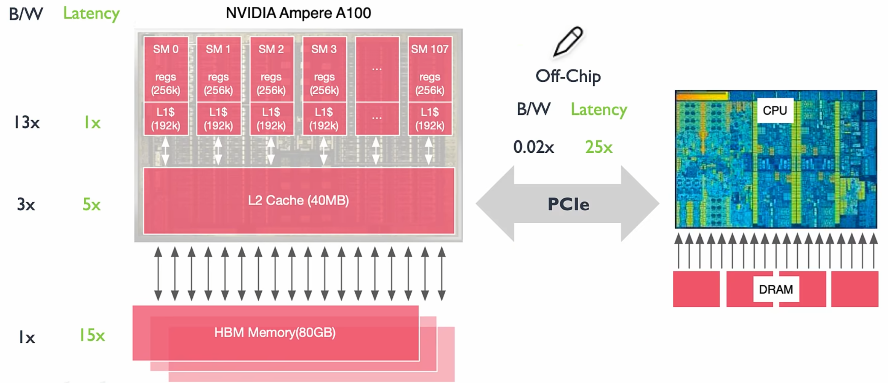

计算强度：

> 计算强度就是：假设你往 L1 cache 里面传了一个字节，这个字节参与了 8 个时钟周期的运算，则计算强度就是 8，每种算法都有一个对应的计算强度，这个值越低，就越受制于内存带宽。

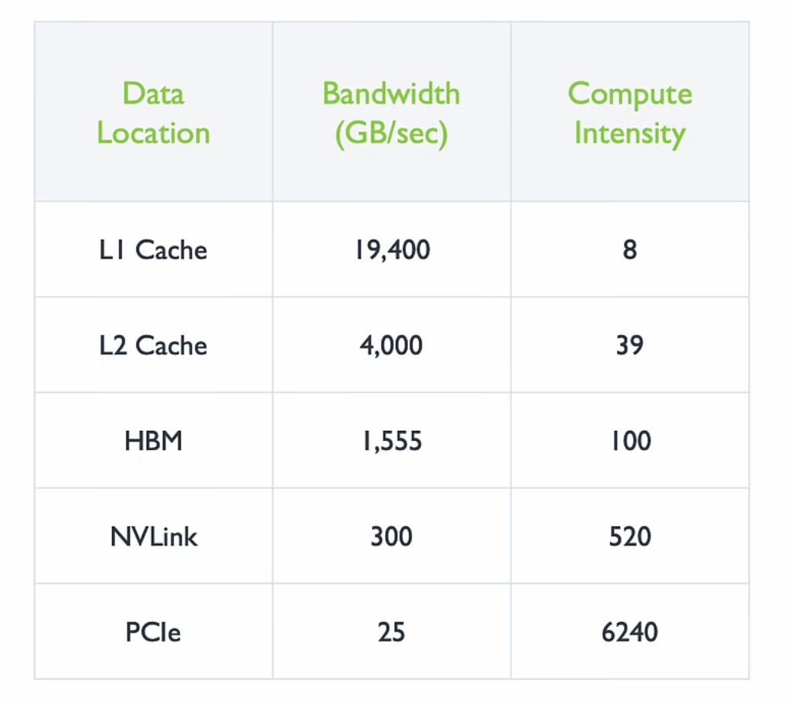

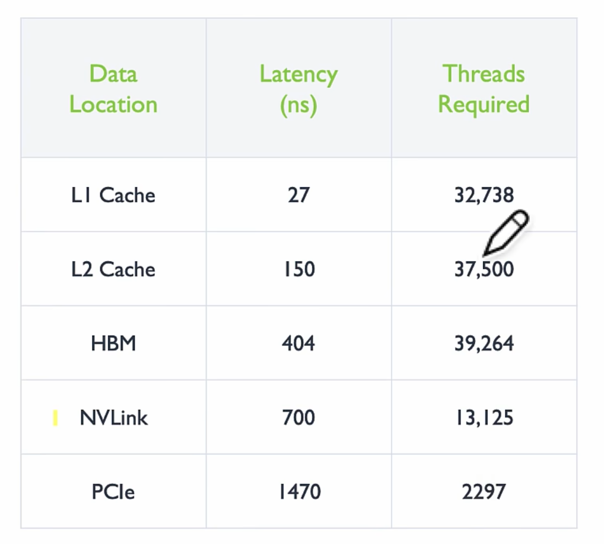

只有线程数足够多，才能让整个系统的内存处于忙碌的状态。

### GPU 线程机制

SM：基本的运算单元。

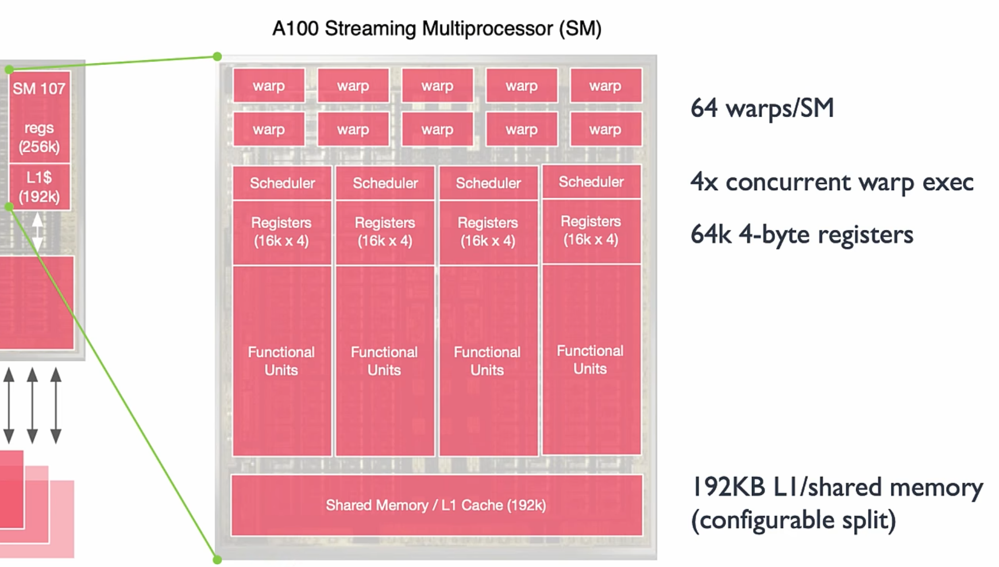

在一个时钟周期内，可以执行多个 warp。

每 4 个 warp 可以做一个并发的执行。

GPU 里提供了大量的线程，超配的线程数可以支持对不同层级的数据进行搬运和计算。

### GPU 线程分级

在 AI 计算中，不是所有的计算都可以支持线程独立运算，有些计算模式的数据之间互相依赖，线程之间需要进行配合。——线程分层执行。


- 一个图片可以划分为多个网格 Grid，表示所有要执行的任务；
- 一个网格 Grid 中包含了很多（超配的）具有相同线程 Thread 数量的块 Block；
- 一个块 Block 中的线程之间独立执行，可以通过本地数据共享 Local Data Share 同步交换数据。

这样，在同一个 Block 中，可以同时执行大量相关的操作，并且超配的 Block 数也可以弥补数据处理的延迟。

### AI 计算与 GPU 的关系

两个 N 维矩阵做矩阵乘法，计算复杂度为：o(N<sup>2</sup>) * o(2N) = o(N<sup>3</sup>)。

计算强度越高？内存的搬运越快，内存数据的刷新越快。


随着矩阵不断增大，GPU 里的内存就会逐渐空闲下来（不是指内存的容量降低，而是指内存的搬运越慢），因为此时 GPU 的计算单元需要花费更多的时间去对矩阵进行运算。

因此，AI 的计算需要找到一个平衡点（计算与带宽），以匹配矩阵计算的强度。——Tensor Core，专门用于矩阵计算，以提高计算的强度（提升单芯片浮点运算的能力）。

总结：

AI 计算不仅仅只是看算力的大小，还需要考虑算力与数据读取速度（内存、带宽、时延）之间的匹配程度。

不管算得有多快，如果内存来不及搬运，那么超额的算力也是没用的。

解决方法：

- 通过超配的线程来掩盖时延；
- 通过多级缓存来平衡计算和带宽的 Gap；
- 通过 Tensor Core 来增加峰值算力（提高计算强度，以支持更大的矩阵运算）。

## GPU 架构

### 大纲

GPU 基础概念：

- 硬件基本概念：SM、SP、CUDA Core；
- CUDA 并行计算平台、CUDA 线程层次结构；
- 算力计算 NVIDIA Peak FLOPs。

从 Fermi 到 Volta 架构

从 Turing 到 Hopper 架构

Tensor Core 和 NVLink 详解

### GPU 基础概念

#### 硬件基本概念

左：CPU，右：GPU。

GPU 几乎主要由计算单元 ALU 组成，仅有少量的控制单元和存储单元。

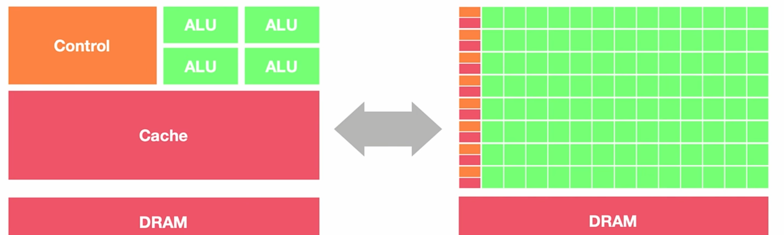

- GPC：Graph Possessed Cluster，图像处理簇；
- TPC：Texture Possessed Cluster，纹理处理簇；
- SM：Stream Multiprocessors，流式多处理器；
- HBM：High Band Memory，高带宽处理器。

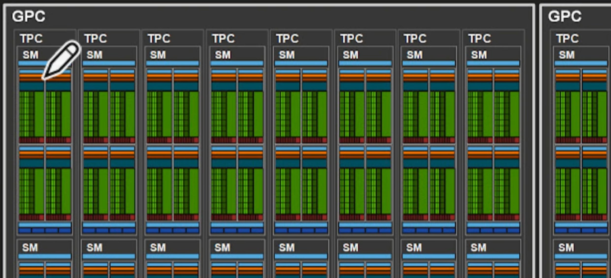

- 一个 GPC 包含多个 TPC；
- 一个 TPC 包含多个 SM；
- 一个 SM 包含多个 Block、Thread 以及各种 CUDA Tensor Core。

SM：流式多处理器。

核心组件：CUDA 核心、共享内存、寄存器。

包含许多为线程执行数学运算的 Core，是 NVIDIA 的核心。

每一个 SM 都可以并发地执行数百个线程。


> 线程分级：网格、块、线程。
>
> 一个线程块（Block）是放在一个 SM 中去执行。

SM 包括：

- CUDA Core：向量运行单元（FP32-FPU、FP64-DPU、INT32-ALU）；
- Tensor Core：张量运算单元（FP16、BF16、INT8、INT4，专门针对 AI 的矩阵计算）；
- Special Function Units：特殊函数单元，SFU，超越函数和数学函数；
- warp Scheduler：线程束调度器；
- Dispatch Unit：指令分发单元；
- Multi Level Cache：多级缓存（L0/L1 Instruction Cache、L1 Data Cache & Shared Memory）；
- Register File：寄存器堆；
- Load/Store：访问存储单元（LD/ST，负责处理数据）。

SP：Stream Processor，流处理器（CUDA Core 的前身）。

后来，CUDA Core 演变为了单独的 FP32、FPU、INT32-ALU。

warp：线程束。

逻辑上，所有的线程是并行的。但从硬件的角度看，不是所有的线程都能在同一时刻去执行的。

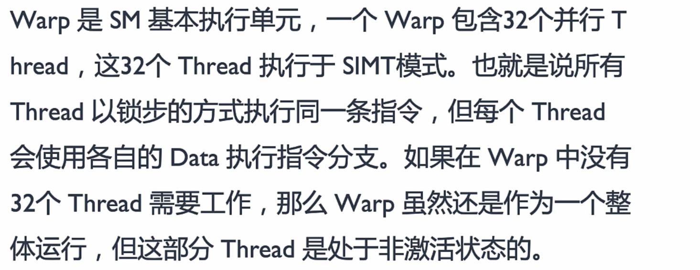

#### CUDA 基本概念

CUDA：Compute Unified Device Architecture。

- 并行计算架构（Parallel Computing Architecture）：用于控制 GPU 里各种并行的硬件；
- 编程模型（Programming Model）：基于 LLVM 构建了 CUDA 编译器，方便开发者使用 C/C++、Python 进行开发。

> CUDA 实现了软硬件的解耦。

主设概念：主机程序（host）和设备程序（device）之间可以进行通信（数据拷贝）。

通过 GPU 进行并行操作，计算完成后将结果传递给 CPU 进行处理。

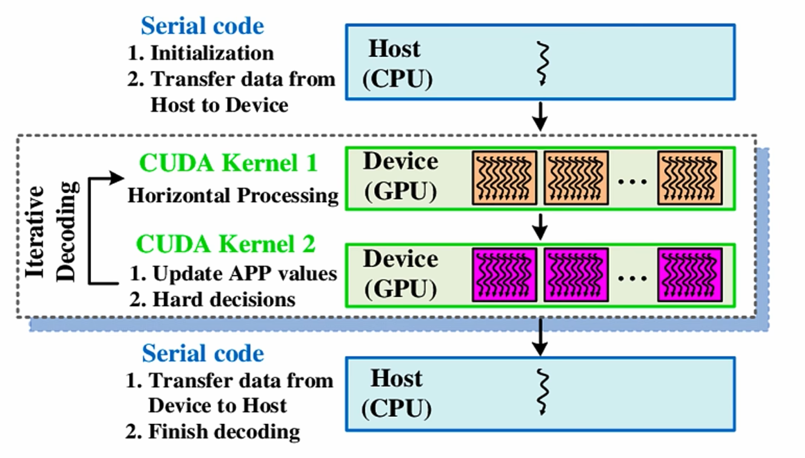

CUDA 程序架构：

- host 代码部分在 CPU 上执行，是普通 C 代码；
- device 代码部分在 GPU 上执行（.cu 文件）。当遇到数据并行处理的部分，CUDA 就会将程序编译成 GPU 能执行的程序，并传送到 GPU，这个部分叫做 kernel。

cuda_device.cu：

```c++
#include <iostream>
#include <math.h>

// __global__是变量声明符，作用是将add()函数变成可以在GPU上运行的函数（kernel）
__global__
void add(int n, float *x, float *y)
{
    for(int i = 0; i < n; i++)
    {
        y[i] = x[i] + y[i];
    }
}

int main(void)
{
    int N = 1<<25;
    float *x, *y;
    
    // 在cuda里开辟内存
    cudaMallocManaged(&x, N*sizeof(float));
    cudaMallocManaged(&y, N*sizeof(float));
    
    // initialize x and y arrays on the host
    for (int i = 0; i < N; i++)
    {
        x[i] = 1.0f;
        y[i] = 2.0f;
    }
    
    // 在GPU上执行kernel函数
    add<<<1, 1>>>(N, x, y);
    
    // CPU需要等待cuda上的代码运行完毕，才能对数据进行读取
    cudaDeviceSynchronize();
    
    // 释放cuda内存
    cudaFree(x);
    cudaFree(y);
    
    return 0;
}
```

线程层次结构：

执行一个 kernel 时，所有的线程都会封装在一个 Grid 里面。同一个 Grid 里面的线程可以共享全局内存。

> `__global__` 里的数据都是共享的。

Block 间并行执行，并且无法通信，也没有执行顺序。每个 Block 中有一个共享内存（Shared Memory），同一个 Block 里的 Thread 是可以同步的，通过共享内存进行通讯和数据之间的传输。

CUDA 并行程序，会被多个 Thread 执行。


CUDA 与 GPU 硬件的对应关系：

- 一个 Block 线程块只在一个 SM 上通过 warp 进行调度；
- 一旦在 SM 上调起了 Block 线程块，就会一直保留到执行完 kernel；
- 一个 SM 可以同时保存多个 Block 线程块，块间并行地执行。


#### 算力计算


### GPU 架构

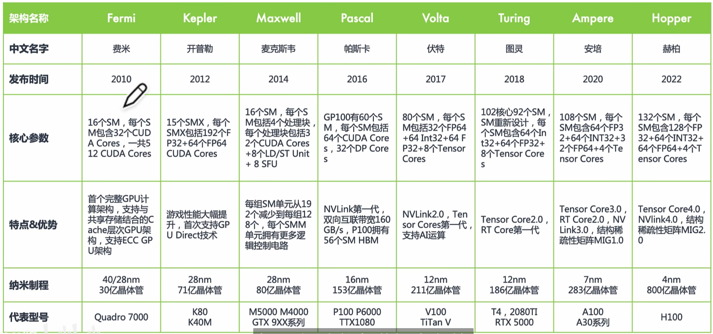

Fermi 架构：提出了首个完整的 GPU 计算架构。

Kepler 架构；

Maxwell 架构；

Pascal 架构：提出了 NVLink，让单台服务器里面的 GPU 可以进行数据的互联，是用于 CPU 和 GPU 之间进行通信的 PCIe 的带宽的 3 倍，避免了数据通过 PCIe 回传到 CPU 的内存里面，从而减少了数据传输的延迟，实现了整个网络的拓扑互联。

Volta 架构：

- 将 CUDA Core 进行了拆分，分离了 FPU 和 ALU；
- 独立线程调度：每个线程都有独立的 PC（Program Counter）和 Stack；
- 提出了 Tensor Core：针对深度学习提供张量计算核心，专门针对卷积运算进行加速；
- GRF & Cache。

Turing 架构：提出了 RT Core（Ray Tracing Core），用于三角形与光线的求交。

Ampere 架构：提出 NVSwitch，单卡之间通过 NVLink 互联，多卡之间通过 NVSwitch 互联；

Hopper 架构。

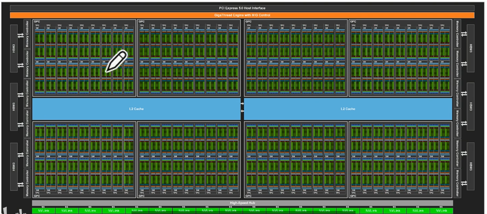

### Tensor Core

#### 基本原理

混合精度是指在底层硬件算子（Tensor Core）层面，使用半精度（FP16）作为输入和输出，使用全精度（FP32）进行中间结果计算从而不损失过多精度的技术。

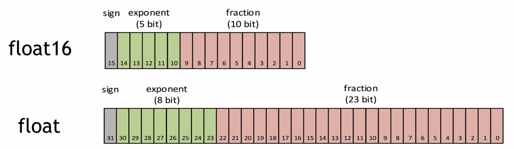

每个 Tensor Core 每周期能执行 `4*4*4` GEMM，即 64 个 FMA。


Tensor Core 可以通过 Warp 把多个线程聚合起来一起进行计算和控制。最终对外提供一个 `16*16*16` 的 API 给到 CUDA。

### NVLink

……
