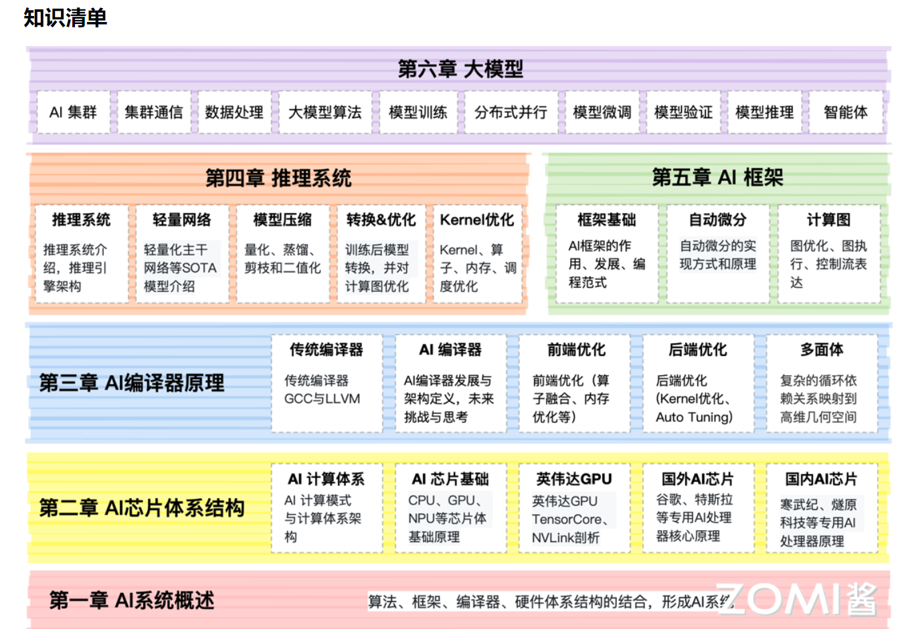

# AI Infra

## 概述

AI 全栈底层技术：

学习路线：

## 学习资料

**MLsys**：

- [<u>AI System</u>](https://chenzomi12.github.io/)；
- [<u>Fazzie 马千里</u>](https://fazzie-key.cool/2023/02/21/MLsys/)；
- [<u>SiriusNEO's Github</u>](https://github.com/siriusneo)；
- [<u>SiriusNEO's Blog</u>](https://me.tric.space/)；
- [<u>Ziming Liu</u>](https://maruyamaaya.github.io/)；
- [<u>ezyang’s blog</u>](http://blog.ezyang.com/about/)。

**PyTorch**：

- [<u>PyTorch internals</u>](http://blog.ezyang.com/2019/05/pytorch-internals/)；
- [<u>PyTorch dispatcher</u>](http://blog.ezyang.com/2020/09/lets-talk-about-the-pytorch-dispatcher/)；
- [<u>PyTorch 从入门到深入</u>](https://zhuanlan.zhihu.com/p/716453924)；
- [<u>PyTorch 张量并行</u>](https://zhuanlan.zhihu.com/p/711574586)。

**推理引擎**：

- [<u>CMU 陈天奇 推理综述：Towards Efficient Generative Large Language Model Serving: A Survey from Algorithms to Systems</u>](https://arxiv.org/pdf/2312.15234)；
- [<u>vLLM 备忘录</u>](https://zhuanlan.zhihu.com/p/730817485)；
- [<u>vLLM 源代码分析</u>](https://me.tric.space/2023/07/10/vllm/)；
- [<u>清华大模型推理综述</u>](https://www.53ai.com/news/LargeLanguageModel/2024072020894.html)。
