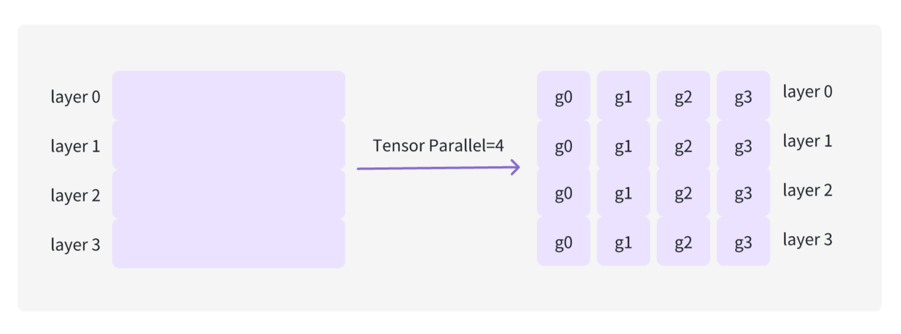

# 基本概念

tensor parallel？
data parallel
pipeline parallel？

张量并行也可以理解为拆模型，例如把一个 nn.Linear 层拆分到两个 GPU 上，张量并行是针对层内做的，流水线并行针对层间来做的。（对于分布式推理，通过创建多个 worker 执行完整模型的一部分）

显存？
DSL（领域特定语言）？
自回归 Transformer ？

激活（activation）？

MoE ？

triton ？

overhead ？
