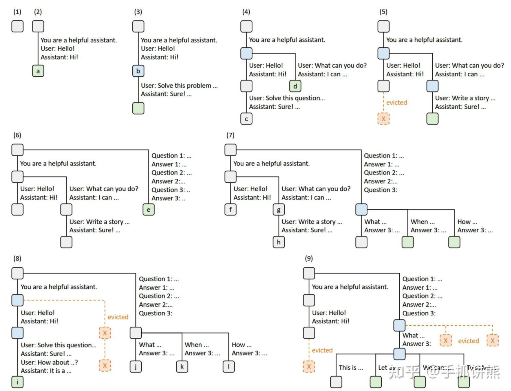
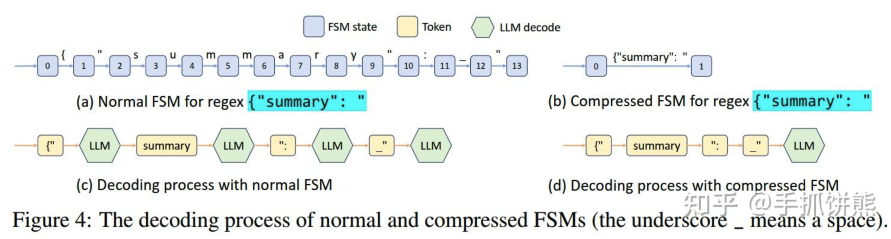
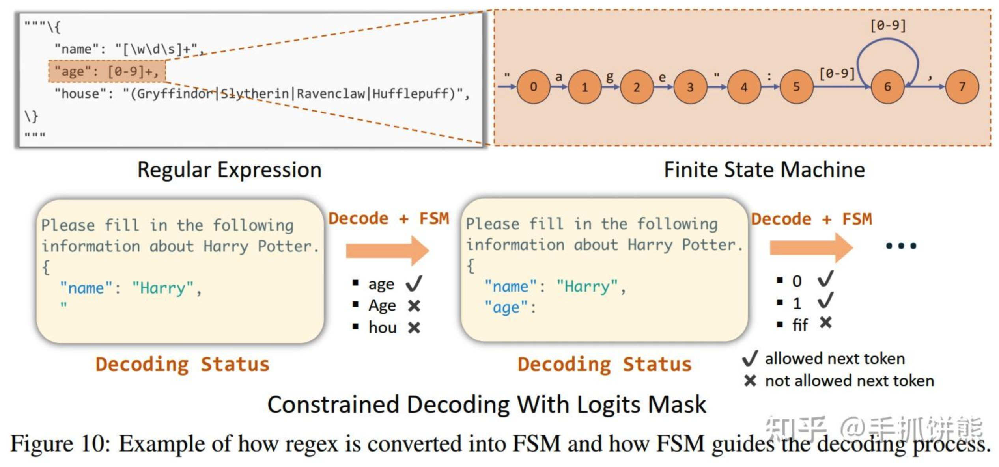
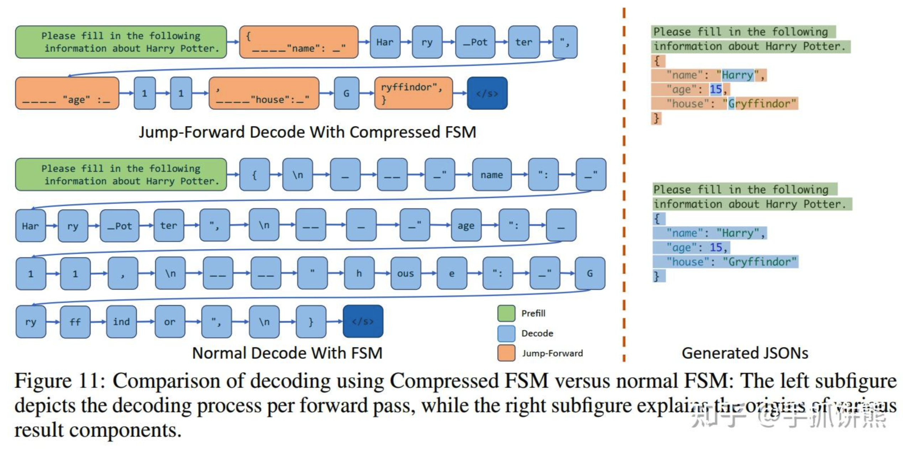

# SGLang 学习笔记

## SGLang 技术原理

### 核心技术

前端部分：

- SGLang DSL：大模型应用开发的领域特定语言。

后端部分：

- Efficient KV Cache Reuse with **RadixAttention**；
- Efficient **Constrained Decoding** with Compressed Finite State Machine；
- Efficient Endpoint Calling with **API Speculative Execution**。

与 vLLM 的区别：LangChain + 推理服务 -> SGLang DSL + SGLang 服务。

### RadixAttention

**RadixAttention（基数注意力）**：
在运行时自动且系统地重复使用 KV 缓存。
系统会将缓存保留在基数树中的提示和生成结果中，从而实现高效的前缀搜索、重复使用、插入和驱逐。
实施了 LRU 驱逐策略和缓存感知调度策略以提高缓存命中率。

**Radix 树**：
Radix 树的边不仅可以标记为单个元素，还可以标记为长度可变的元素序列。
利用 Radix 树来管理 token 序列和它们对应的 KV 缓存张量之间的映射。
LRU 驱逐策略：首先驱逐最近最少使用的叶。通过首先驱逐叶，我们能够重新使用它们的公共祖先，直到这些祖先成为叶并也被驱逐。

### Constrained Decoding

**Constrained Decoding（约束解码）**：
在受限制约束条件下，利用 FSM（压缩有限状态机），一次解码多个 token，减少了 LLM generate 执行过程中 forward 的次数。
支持对结构化输出（如 json 格式）进行更快的约束解码。
SGLang 分析约束并构建一个 FSM 来表示该约束。此方法在任何可能的情况下将多 token 路径压缩成单步路径，允许一次解码多个 token 以实现更快的解码速度。

SGLang 在压缩 FSM 中创建了一个 Fast Constrained Decoding 运行时环境，此运行时环境会分析 FSM，并将 FSM 中相邻的单一过渡边压缩为单个边（如图 4 (b) 所示），这样它便能够识别何时可以同时解码多个标记。在图 4 (d) 中，压缩过渡边中的多个标记可以在一次前向传递中解码，这极大地加速了解码过程。

将正则表达式转化为一个有限状态机（FSM），以便在解码期间指导生成过程，可以根据 FSM 的当前状态转换来过滤无效标记。

**Jump Forward Decode** with Compressed Finite State Machine：

### API Speculative Execution

API Speculative Execution 是一种针对黑盒 API 模型的新优化，它通过使用推测执行来加速执行并降低多次调用 SGLang 程序的 API 成本。

示例：
两个 gen 原语对应于两个 API 调用，这意味着用户需要承担 2 次上下文的输入 token 费用。
在 SGLang 中，我们可以对第一次调用启用推测执行，并忽略停止条件，让它继续生成更多标记。解释器将保留额外的生成输出，并使用它匹配和重用于之后的原语。

## 参考资料

- [<u>官方文档</u>](https://github.com/sgl-project/sgl-learning-materials)；
- [<u>SGLang：LLM推理引擎发展新方向</u>](https://zhuanlan.zhihu.com/p/711378550)；
- [<u>SGLang 技术分析</u>](https://zhuanlan.zhihu.com/p/711167552)。
