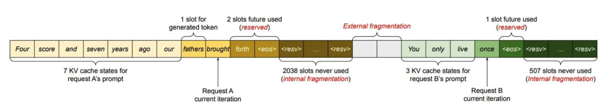
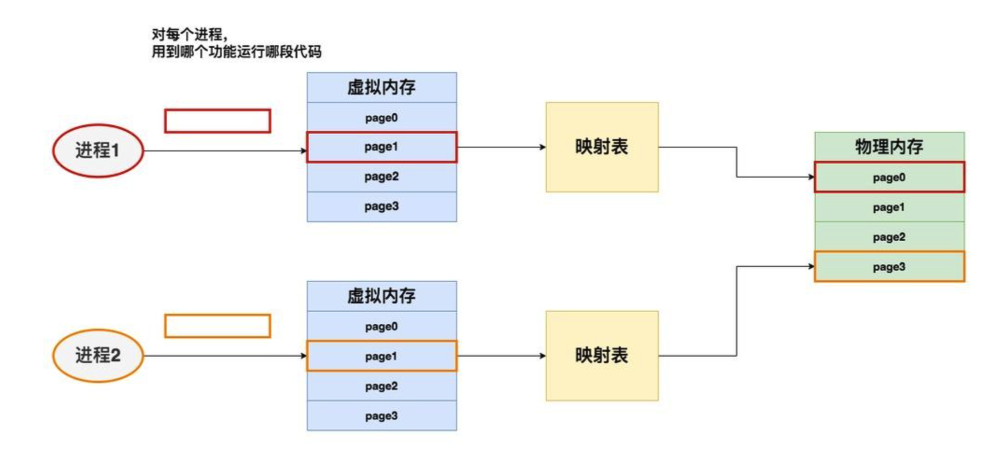
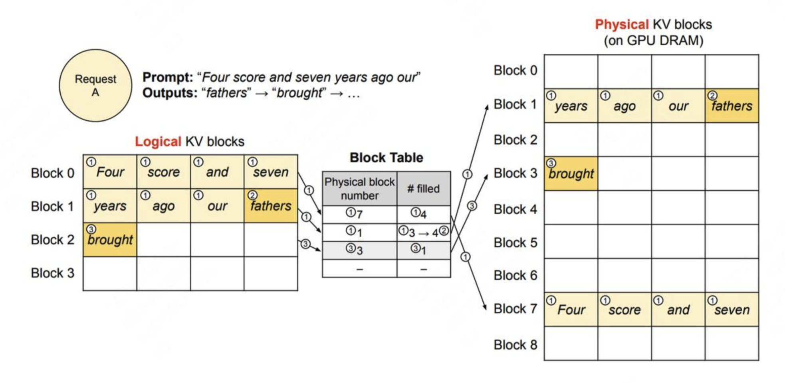
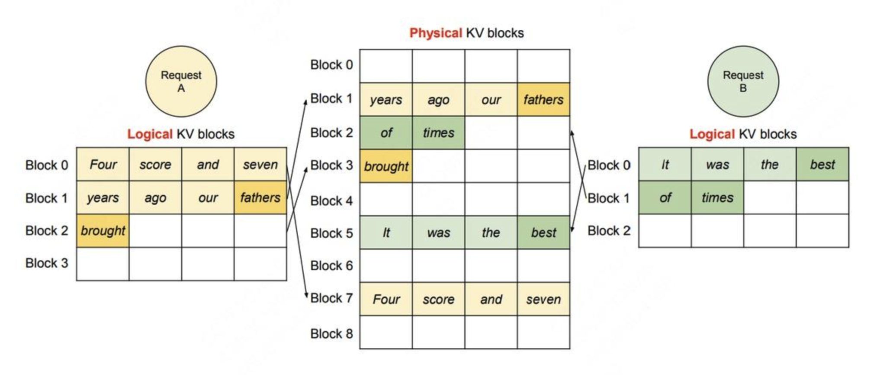

# vLLM 学习笔记

## vLLM 技术原理

核心技术：**PagedAttention**，设计灵感来自操作系统的**虚拟内存分页管理**技术。

### LLM 推理过程

对于训练好的模型，一种常用的部署方式是将其打包成一个推理服务（server），它接收客户端发送来的请求（request），读取请求中的数据（prompt）来做推理。

推理引擎使用 **KV cache** 技术来加速推理过程中 attention 的计算，可以分为以下两个阶段：

1. **Prefill**：为 prompt token 预填充（计算）KV cache；
2. **Decode**：逐一生成 token，并缓存自己的 K/V 值（transformer 的 Q/K/V）。

如何优化 KV cache，节省显存，提高推理吞吐量，是 LLM 推理框架需要解决的重点问题。

vLLM 原理：减少内存碎片，提高显存利用率，使得每一时刻推理服务能处理的请求更多，提高吞吐量。

### PagedAttention 原理

动态地为请求分配 KV cache 显存，提升显存利用率。

操作系统的**虚拟内存**：给每个进程分配一个虚拟内存（只有该线程使用），虚拟内存负责统一规划代码、数据等如何在物理内存上最终落盘。

进程 -> 虚拟内存 -> MMU（内存管理单元，虚拟内存到物理内存的映射表）-> 物理内存。

- **分段管理**：虚拟内存会尽量为每个进程在物理内存上找到一块连续的存储空间；
- **分页管理**：动态分配内存，用到哪个 page，就把虚拟内存中的这个 page 加载到物理内存（虚拟内存帮我们做物理内存的映射），用完之后，在物理内存中可以将该 page 占用的内存清空。

**页（page）**：将物理内存划分为固定大小的块，每一块被称为页。从物理内存中模拟出来的虚拟内存也按相同的方式做划分。

对于一个进程，虽然它在物理内存上的存储不连续（可能分布在不同的 page 中），但它在自己的虚拟内存上是连续的。通过模拟连续内存的方式，既解决了物理内存上的碎片问题，也方便了进程的开发和运行。

PagedAttention 与虚拟内存分页管理的对应关系：

|    虚拟内存分页     |        PagedAttention         |            说明            |
| :------------------ | :---------------------------- | :------------------------- |
| 进程                | 请求（request）               |                            |
| 页（page）          | 块（block）                   | 可装 16 个 token 的 K/V 值 |
| 虚拟内存            | 逻辑内存（logical KV block）  |                            |
| 内存管理单元（MMU） | 块表（block table）           | 内存映射表                 |
| 物理内存            | 物理内存（physical KV block） | GPU 显存                   |

Decode 阶段：当我们计算时，我们使用的是逻辑块，即形式上这些 token 都是连续的。与此同时，vLLM 后台会通过 block table 这个映射关系，帮我们从物理块上获取数据做实际计算。通过 PagedAttention，每个 request 都会认为自己在一个连续且充足的存储空间上操作，尽管物理上这些数据的存储并不是连续的。

### 调度策略

动态 batch：推理内核引擎（LLMEngine）在实际运作时，batch_size 是可以动态变更的。在每一个推理阶段（prefill 算一个推理阶段，每个 decode 各算一个推理阶段）处理的 batch_size 可以根据当下显存的实际使用情况而变动。

当请求发来时，都先进入 LLMEngine Scheduler 的 waiting 队列中。当模型准备执行下一个推理阶段时，Scheduler 再根据设定的策略，决定哪些数据可以进入 running 队列进行推理。

总结：**先来先服务，后来先抢占，GPU 不够就先 swap 到 CPU 上**。在一个推理阶段处理尽可能多的请求，解决高并发场景下的推理吞吐问题。

## vLLM 项目架构

**LLMEngine**（核心组件）：

- `add_request()`：request -> api server -> LLMEngine 的 `add_request()` -> 将 request 转换为 SequenceGroup -> 加入 Scheduler 的 waiting 队列；
- `abort_request()`：客户端断开连接 -> LLMEngine 的 `abort_request()`；
- `step()`：执行一次推理过程（一个 prefill 算一次推理，每个 decode 各算一次推理）。

**Scheduler（调度器）**：负责管理三个队列：waiting、running、swapped。每一次调度都保证这一次 `step()` 的数据全部处于 prompt/prefill 阶段，或全部处于 decode/auto-regressive 阶段。

## 参考资料

原理讲解：

- [<u>vLLM PagedAttention 官方文档</u>](https://docs.vllm.ai/en/stable/dev/kernel/paged_attention.html)；
- [<u>vLLM 备忘录</u>](https://zhuanlan.zhihu.com/p/730817485)；
- [<u>vLLM 核心技术 PagedAttention 原理</u>](https://zhuanlan.zhihu.com/p/691038809)；
- [<u>vLLM & PagedAttention 论文深度解读（一）—— LLM 服务现状与优化思路</u>](https://zhuanlan.zhihu.com/p/656939628)；

架构讲解：

- [<u>vLLM 整体架构解析</u>](https://zhuanlan.zhihu.com/p/691045737)；

源码阅读：

- [<u>PagedAttention 代码走读</u>](https://zhuanlan.zhihu.com/p/668736097)；
- [<u>LLM 高速推理框架 vLLM 源代码分析</u>](https://zhuanlan.zhihu.com/p/641999400)；
- [<u>深入浅出理解 PagedAttention CUDA 实现</u>](https://zhuanlan.zhihu.com/p/673284781)；

## 不懂的概念

- tensor parallel（对于分布式推理，通过创建多个 worker 执行完整模型的一部分）/data parallel/pipeline parallel？
- 显存？
