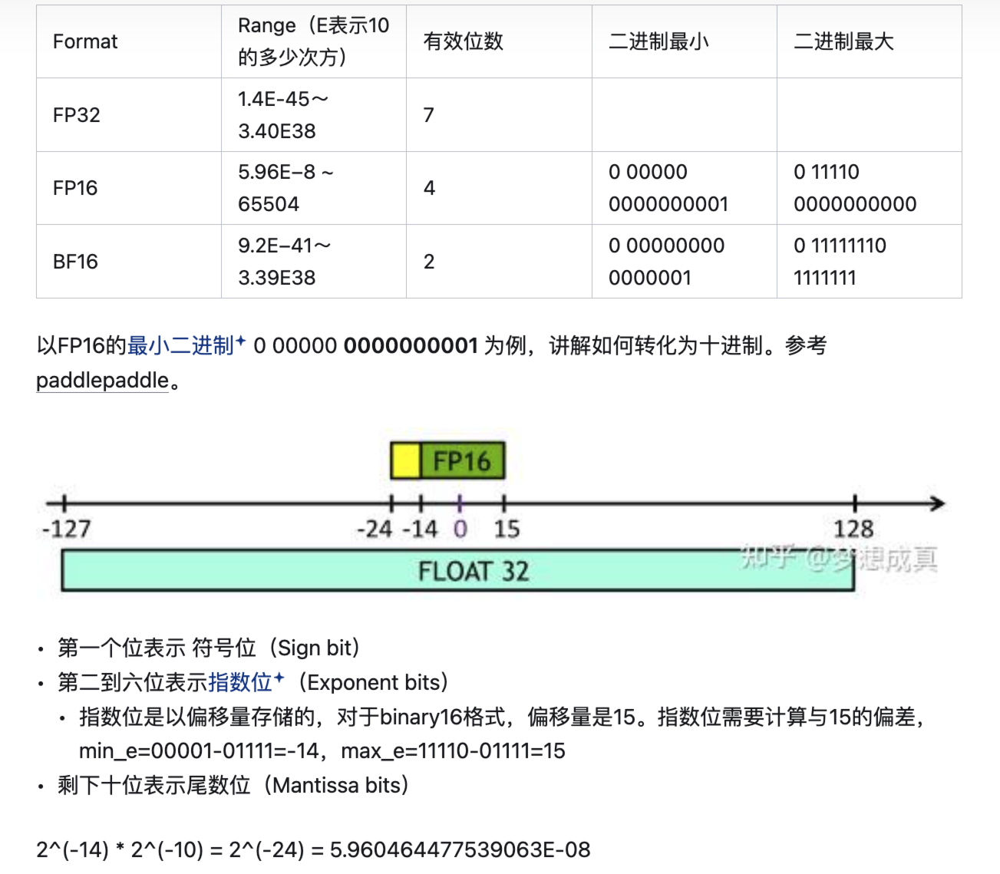
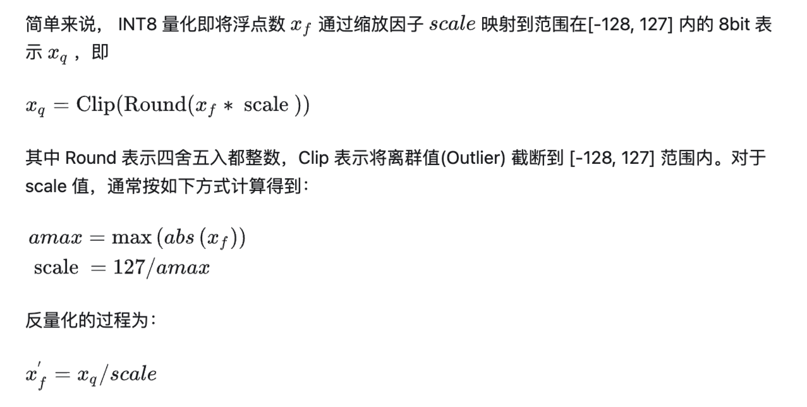
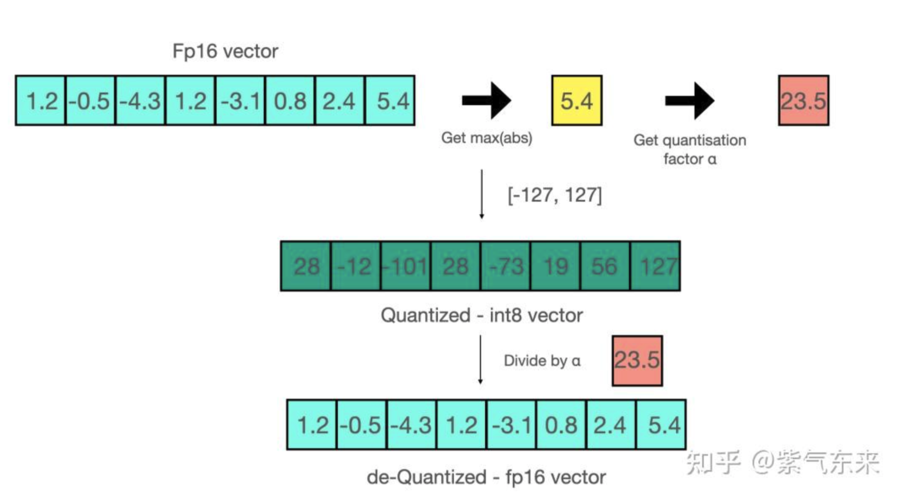
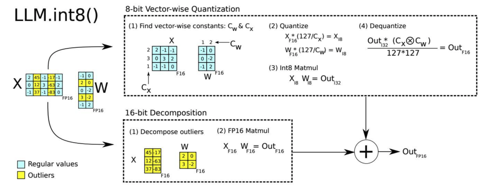

# 推理加速

## 模型量化

### 数值类型

LLM 的训练和推理要尽量使用 BF16，而不是 FP16/HF16/FP32。

- **FP32**：单精度浮点数，用 8 bit 表示指数，23 bit 表示小数；
- **FP16**：半精度浮点数，用 5 bit 表示指数，10 bit 表示小数；
- **BF16**：对 FP32 单精度浮点数截断数据（小数部分），即用 8 bit 表示指数，7 bit 表示小数。

> 这里的计算方式不太懂？

**BF16 vs HF16**：

BF16 拥有 7 位精度，而 HF16 拥有 10 位精度。这表明在表示接近于 1 的小数值时，HF16 比 BF16 能提供更高的精度。然而，BF16 拥有与 FP32 相同的 8 位指数部分，因而能够表示与 FP32 几乎一样广泛的数值范围，这对于避免上溢和下溢非常重要。尽管 BF16 在尾数精度上不如 HF16，但在深度学习应用中，这种较宽的数值范围通常比尾数的额外几位精度更为重要。这是因为深度学习模型通常对权重的尾数精度不是非常敏感，而更依赖于能够处理范围广泛的梯度和权重值。

**总结**：

量化后速度并不能明显提高，但占用的显存显著减少。

在训练时，为保证精度，主权重始终为 FP32。而在推理时，FP16 权重通常能提供与 FP32 相似的精度，这意味着在推理时使用 FP16 权重，仅需一半 GPU 显存就能获得相同的结果。

### 常用量化方法

**INT8 量化**：

可以通过组合各种技巧，例如逐行或逐向量量化，来获取更精确的结果。

**混合精度分解**：

- 蓝色块：正常范围内的值做 INT8 量化，左边矩阵按行量化，右边矩阵按列量化，做完 INT8 的矩阵乘后，再反量化回 FP16；
- 黄色块：离群值不做量化，单独拿出来做 FP16 的矩阵乘。

最后，将蓝色块和黄色块拼接回一个矩阵。

### 其它量化方法

- AWQ；
- GGUF；
- GPTQ；
- SmoothQuant。

## 模型结构改进

### FlashAttention

[<u>FlashAttention Github</u>](https://github.com/Dao-AILab/flash-attention)。

### PagedAttention

vLLM。

## Dynamic Batch

**Static Batching**：

**Dynamic Batching**：

一旦生成序列结束标记，我们就在其位置插入一个新序列。这样可以实现更高的 GPU 利用率，因为 GPU 不会等待所有序列完成才开始新的序列。

**LLM 推理是 memory-IO bound（约束）的, 不是 compute bound 的**。

换句话说，目前将 1MB 数据加载到 GPU 计算核心所需的时间比这些计算核心对 1 MB 数据执行 LLM 计算所需的时间要长。这意味着 LLM 推理的吞吐量，很大程度上被一个 batch 中可以匹配多大高带宽的 GPU 内存所决定。

## Speculative Inference

## 参考资料

- [<u>LLM 推理加速方式汇总</u>](https://zhuanlan.zhihu.com/p/688736901)；
- [<u>LLM 推理加速调研</u>](https://zhuanlan.zhihu.com/p/699776257)；
- [<u>大语言模型的模型量化（INT8/INT4）技术</u>](https://zhuanlan.zhihu.com/p/627436535)；
- [<u>Continuous Batching</u>](https://www.anyscale.com/blog/continuous-batching-llm-inference)；
- [<u>Understanding GPU Performance</u>](https://docs.nvidia.com/deeplearning/performance/dl-performance-gpu-background/index.html#understand-perf)。
