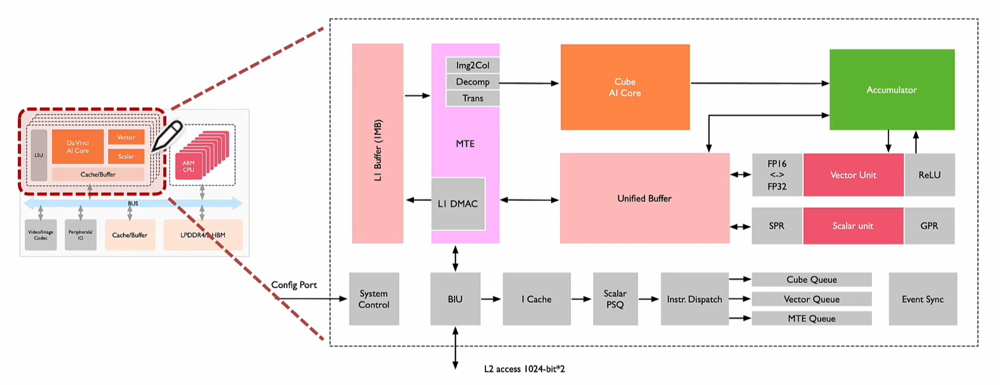

# Ascend NPU 架构 & CANN 平台入门学习

## 大纲

- SOC 架构；
- AICore 达芬奇架构；
- AICore 计算模式；

## Ascend SOC 架构

### Ascend 310 架构

- AI Core：计算核心，负责执行矩阵、向量、标量计算密集的算子任务，采用达芬奇架构；
- AI CPU：承担非矩阵类复杂计算，即负责执行不适合跑在 AI Core 上的算子；
- TS Core：作为任务调度器（Task Scheduler，TS），以实现计算任务在 AI Core 上的高效分配和调度（专门服务于 AI Core 和 AI CPU，不承担任何其它的工作）；
- ARM CPU：控制芯片整体运行；
- Cache & Buffer；
- DVPP：数字视觉预处理子系统，完成图像视频编解码。

### Ascend 910 架构

- AI Core：32 个，上下各 16 个，中间放 buffer，方便更快地取数据；
- Taishan Core：一部分为 AI CPU，承担部分 AI 计算，一部分为 Ctrl CPU，负责 SoC 控制功能，两类 CPU 占用核数由软件分配；
- TS CPU：负责任务调度，把算子任务切分之后，通过硬件调度器（HWTS）分发给 AI Core 或 AI CPU 执行计算；
- Cache & Buffer；
- Nimbus：提供 PCIe 接口和 Host CPU 对接；提供 NIC 用于跨服务器传递数据；集成一个 ARM CPU 核，执行启动、功耗控制等硬件管理任务。

## AICore 达芬奇架构

### 达芬奇架构

Cube 单元执行的是 MAC（矩阵乘加）操作。

Cube 单元目前为 `16*16*16`，通常矩阵乘中两矩阵很大，因此数据是分块（Tiling）送入 Cube 单元的，每送完一块，结果存放到累加器，最后得到结果。

达芬奇架构：

- 计算单元：包含矩阵计算单元（DaVinci Core）、向量计算单元（Vector）、标量计算单元（Scalar）；
- 存储系统：AI Core 片上存储单元和相应数据通路构成存储系统；
- 控制单元：计算过程提供指令控制，负责 AI Core 的运行。

### 计算单元

Cube Unit：每次执行可以完成 fp16 的矩阵乘，如 C = A(`16*16`) * B(`16*16`)，更大的矩阵运算需要先对矩阵进行分块（在 L1 Buffer 中进行缓存）。

Vector Unit：算力低于 Cube，灵活度高（如数学中的求倒数、平方根等），Vector 所有计算的源数据和目标数据都会存储在 Unified Buffer 中（Unified Buffer 再与 L1 Buffer 进行交互），并按 32 Byte 对齐。

Scalar Unit：负责各类型标量数据运算和程序流程控制，算力最低，功能上类比小核 CPU，完成整个程序循环控制、分支判断、Cube/Vector 等指令地址和参数计算以及基本算术运算等。

Accumulator（累加器）：把当前矩阵乘的结果与上一次计算的结果相加，可以用于完成卷积中增加 bias 等操作。

### 存储单元

- 存储控制单元；
- 缓冲区；
- 寄存器。

AI Core 采用了大容量片上缓冲区（L1 Buffer）设计，通过增大片上缓存的数据量来减少数据从片外搬运到 AI Core 中的频次，从而降低数据搬运过程中所产生的功耗和时延，有效控制整体计算耗能和提升性能。
