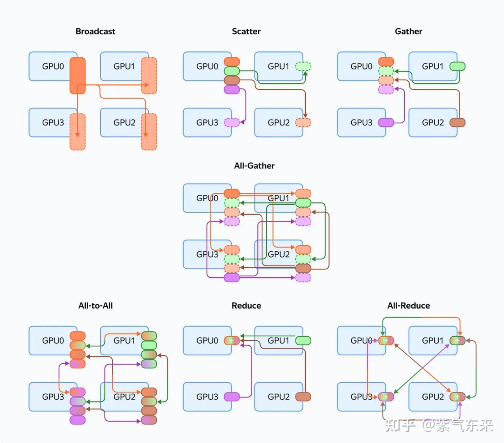

# 分布式训练

## Ray

Ray：通用分布式计算引擎。

- **Head 节点**：是 Ray Cluster 的调度中心；
- **Worker 节点**：除了 Head 节点之外，其他都是 Worker 节点，承载具体的工作负载；
- **Driver 进程**：当用户向 Ray Cluster 上提交了一个 Job，Ray 会挑选节点来运行 Driver，执行用户代码，作业结束后 Driver 销毁；
- **Worker 进程**：是 Ray 中 Task 和 Actor 的载体。

## DP/DDP/FSDP

- [<u>FSDP 原理</u>](https://cnblogs.com/rossiXYZ/p/15815013.html)。

## 通信原语

- reduce（规约操作包括：SUM、MIN、MAX、PROD、LOR 等）；
- all reduce（= reduce + broadcast = reduce-scatter + all-gather）；
- scatter（切片 & 分发）；
- gather（聚合）；
- all gather（= gather + broadcast）；
- broadcast（广播）；
- all-to-all。

### 通信库

深度学习框架 -> 通信库（统一封装的通信接口）-> 底层硬件。

- Message Passing Interface (MPI)；
- NVIDIA Collective Communication Library (NCCL)。

### 参考资料

- [<u>通信原语及其性能分析</u>](https://zhuanlan.zhihu.com/p/706135598?utm_campaign=shareopn&utm_medium=social&utm_psn=1851187423171723265&utm_source=wechat_session)
