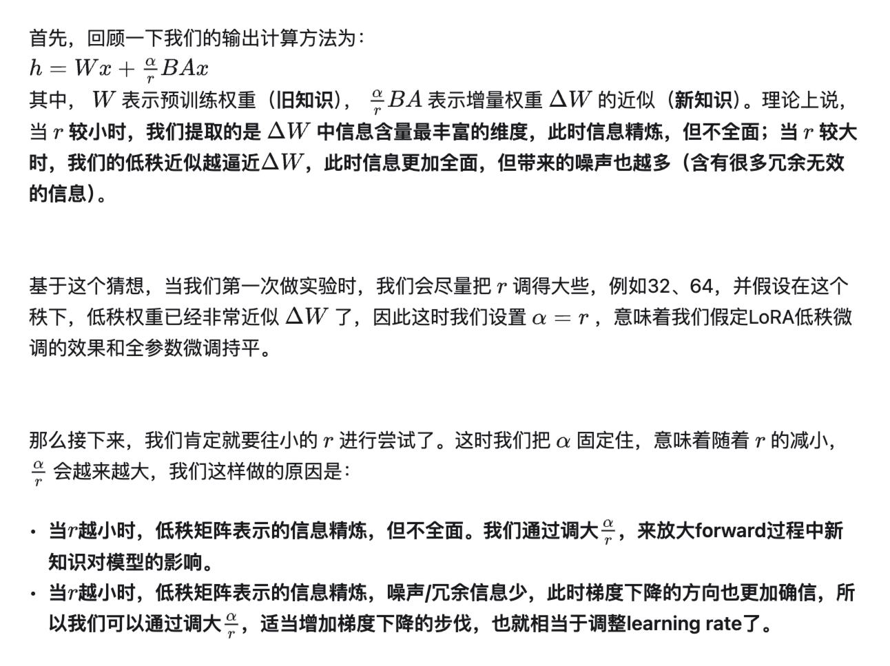

# LoRA 微调

学习目标：

- 了解 LoRA 技术诞生背景，学习 LoRA/QLoRA/LONGLoRA 等主流 LoRA 技术的动机、原理和优缺点等知识；
- 基础 llama-factory 框架，在 NPU 上完成 Qwen 模型的 LoRA 微调；
- 通过社区交流/演讲等方式了解真实的用户如何在生产环境进行微调及改进（如：k8s），并以 LoRA 大模型微调为主题，在组内完成技术分享。

## 背景介绍

**微调**：把已经训练好的模型（pretrained model）拿来，给它吃特定的下游任务数据，使得模型在预训练权重上继续训练，直至满足下游任务性能标准。

**全量微调**：在下游任务的训练中，对预训练模型的每一个参数都做更新（训练代价昂贵）。

**局部微调**：

**Adapter Tuning**：在微调时，除了 Adapter 的部分，其余的参数都是被冻住的（freeze），这样我们就能有效降低训练的代价。

缺点：添加了 Adapter 后，模型整体的层数变深，会增加训练速度和推理速度。

- 需要耗费额外的运算量在 Adapter 上；
- 并行训练时（例如：Transformer 架构常用的张量模型并行），Adapter 层会产生额外的通讯量，增加通讯时间。

**Prefix Tuning**：通过对输入数据增加前缀（prefix）来做微调（prefix 不仅可以加在输入层，还可以加在 Transformer Layer 输出的中间层）。在后续微调中，只需要冻住模型其余部分，单独训练 prefix token 相关的参数即可，每个下游任务都可以单独训练一套 prefix token。prefix 的作用是引导模型提取输入中的特定信息，进而更好地生成结果。

缺点：

- 较难训练，且模型的效果并不严格随 prefix 参数量的增加而上升；
- 使输入层有效信息长度减少。为了节省计算量和显存，我们一般会固定输入数据长度。增加了 prefix 之后，留给原始文字数据的空间就少了，因此可能会降低原始文字中 prompt 的表达能力。

总结：**全参数微调太贵，Adapter Tuning 存在训练和推理延迟，Prefix Tuning 难训且会减少原始训练数据中的有效文字长度**。

## LoRA 技术原理

LoRA（Low-Rank Adaptation，低秩适配器）：

### 训练

为了计算 B 的梯度，我们需要用到和全参数微调过程中一样大小的中间值结果。对 LoRA 来说，这一层的峰值显存，和全量微调基本是一致的（甚至略高）。

- LoRA 并不是作用在模型的每一层；
- LoRA 虽然会导致某一层的峰值显存高于全量微调，但计算完梯度后，这个中间结果就可以被清掉了，不会一直保存；
- 待训练权重从 `d*d` 降为 `2*r*d`，需要保存的 optimizer states 也减少了。

### 推理

在推理过程中，合并低秩矩阵和预训练权重，然后正常做 forward 推理。这样我们完全不会更改模型的架构，因此不会像 Adapter Tuning 一样产生推理上的延时。

在切换不同下游任务时，我们可以灵活从 W 中移除低秩权重的部分。每个下游任务，都可以有自己的一套低秩权重。可以将“预训练权重”和“低秩权重”分开存储。

### 超参数 r

**秩**表示的是矩阵的信息量。如果矩阵中的某一维，总可以通过其余维度线性推导而来，那么对模型来说，这一维的信息是冗余的，是重复表达的。秩不满，我们称为秩亏（rank deficient），否则称为满秩（full rank）。

全参数微调中的增量权重可能也存在冗余的信息，因此我们并不需要用完整的 `d*d` 尺寸来表示它。找出增量权重中真正有用的特征维度：SVD 分解（奇异值分解）。

微调的目的是给模型注入和下游任务相关的领域新知识，我们的目的是要去新知识中拆解信息量丰富的维度。

W 确定，其秩 r 就确定，其 SVD 分解的结果就确定。

LoRA 的做法：**把秩 r 当成一个超参，再让模型自己去学低秩矩阵 A 和 B**。

### 超参数 a

### 实验结论

小秩空间中，信息量越高的那几维特征，和大秩空间的相交度越高，因此它们也是小秩空间表现能持平大秩空间的主要原因，这也更加论证了作者所说的“低秩”的有效性。

模型会尽可能往信息最丰富的维度学，但不能保证 r 取多少，最终学出来的一定就是客观存在的增量权重 W 的 top r，只能说当 r 取的比较小时，模型更有可能贴近真正的 top r；当 r 取比较大时，模型学出的是部分有价值的信息和一些噪声（另外，也许增量权重 W 真正的秩还可能小于 r 呢），而这个实验则刚好论证了这一点。

设置两组不同的随机种子，跑出两组不同的低秩矩阵。两组低秩矩阵都能学到的信息，大概率就是有用的信息了。

预训练权重（旧知识）和增量权重（新知识）的分布间是存在显著差异的。增量权重对预训练权重中那些没有强调的信息进行了放大，秩越小，放大程度越明显（根据 r 进行了缩放）。

## 参考资料

- [<u>大模型低秩适配器 LoRA 原理</u>](https://zhuanlan.zhihu.com/p/646831196)；
- [<u>大模型低秩适配器 LoRA 源码解读与实操</u>](https://zhuanlan.zhihu.com/p/654897296)；
- [<u>AdaLoRA，能做“财务”预算的低秩适配器</u>](https://zhuanlan.zhihu.com/p/657130029)。
