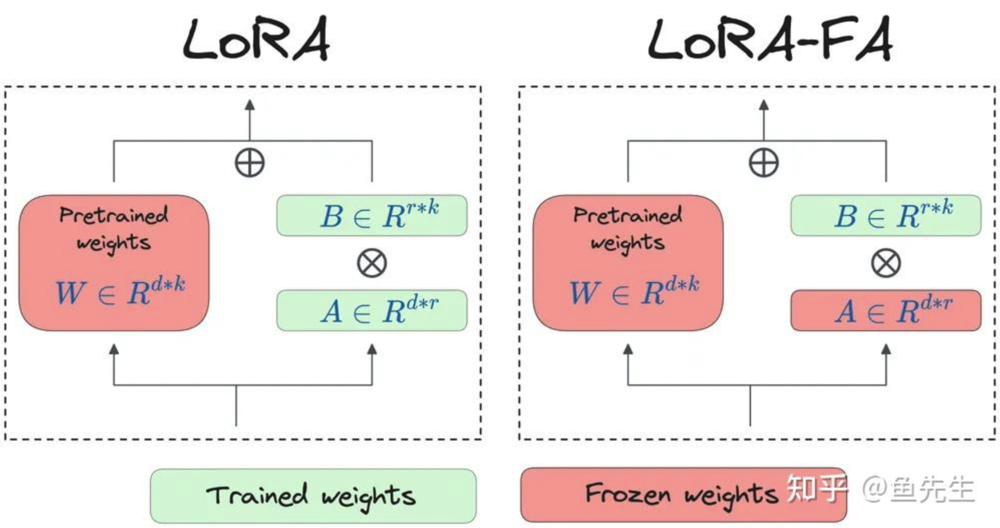

# LoRA 微调

> 学习目标：
>
> - 了解 LoRA 技术诞生背景，学习 LoRA/QLoRA/LONGLoRA 等主流 LoRA 技术的动机、原理和优缺点等知识；
> - 基础 llama-factory 框架，在 NPU 上完成 Qwen 模型的 LoRA 微调；
> - 通过社区交流/演讲等方式了解真实的用户如何在生产环境进行微调及改进（如：k8s），并以 LoRA 大模型微调为主题，在组内完成技术分享。

## 背景介绍

**微调**：把已经训练好的模型（pretrained model）拿来，给它吃特定的下游任务数据，使得模型在预训练权重上继续训练，直至满足下游任务性能标准。

**全量微调**：在下游任务的训练中，对预训练模型的每一个参数都做更新（训练代价昂贵）。

**局部微调**：

**Adapter Tuning**：在微调时，除了 Adapter 的部分，其余的参数都是被冻住的（freeze），这样我们就能有效降低训练的代价。

缺点：添加了 Adapter 后，模型整体的层数变深，会增加训练速度和推理速度。

- 需要耗费额外的运算量在 Adapter 上；
- 并行训练时（例如：Transformer 架构常用的张量模型并行），Adapter 层会产生额外的通讯量，增加通讯时间。

**Prefix Tuning**：通过对输入数据增加前缀（prefix）来做微调（prefix 不仅可以加在输入层，还可以加在 Transformer Layer 输出的中间层）。在后续微调中，只需要冻住模型其余部分，单独训练 prefix token 相关的参数即可，每个下游任务都可以单独训练一套 prefix token。prefix 的作用是引导模型提取输入中的特定信息，进而更好地生成结果。

缺点：

- 较难训练，且模型的效果并不严格随 prefix 参数量的增加而上升；
- 使输入层有效信息长度减少。为了节省计算量和显存，我们一般会固定输入数据长度。增加了 prefix 之后，留给原始文字数据的空间就少了，因此可能会降低原始文字中 prompt 的表达能力。

总结：**全参数微调太贵，Adapter Tuning 存在训练和推理延迟，Prefix Tuning 难训且会减少原始训练数据中的有效文字长度**。

## LoRA 技术原理

LoRA（Low-Rank Adaptation，低秩适配器）：


> 问题：
>
> - 为什么可以这样拆分？怎么拆？（SVD 分解）
> - 这样拆为什么有效？（经实验证明可以）
> - 为什么要这样初始化？（矩阵 A 和 B 只要有一个为 0 就行）
> - 与其它竞品相比的优势？


LoRA在做推理时有一个显著的优势：可以将低秩适配器的权重直接合并到预训练权重里，这样就和全参数微调一样，不会产生推理上的额外耗时。

### 训练

为了计算 B 的梯度，我们需要用到和全参数微调过程中一样大小的中间值结果。对 LoRA 来说，这一层的峰值显存，和全量微调基本是一致的（甚至略高）。

- LoRA 并不是作用在模型的每一层；
- LoRA 虽然会导致某一层的峰值显存高于全量微调，但计算完梯度后，这个中间结果就可以被清掉了，不会一直保存；
- 待训练权重从 `d*d` 降为 `2*r*d`，需要保存的 optimizer states 也减少了。

### 推理

在推理过程中，合并低秩矩阵和预训练权重，然后正常做 forward 推理。这样我们完全不会更改模型的架构，因此不会像 Adapter Tuning 一样产生推理上的延时。

在切换不同下游任务时，我们可以灵活从 W 中移除低秩权重的部分。每个下游任务，都可以有自己的一套低秩权重。可以将“预训练权重”和“低秩权重”分开存储。

### 超参数 r

**秩**表示的是矩阵的信息量。如果矩阵中的某一维，总可以通过其余维度线性推导而来，那么对模型来说，这一维的信息是冗余的，是重复表达的。秩不满，我们称为秩亏（rank deficient），否则称为满秩（full rank）。

全参数微调中的增量权重可能也存在冗余的信息，因此我们并不需要用完整的 `d*d` 尺寸来表示它。找出增量权重中真正有用的特征维度：SVD 分解（奇异值分解）。

微调的目的是给模型注入和下游任务相关的领域新知识，我们的目的是要去新知识中拆解信息量丰富的维度。

W 确定，其秩 r 就确定，其 SVD 分解的结果就确定。

LoRA 的做法：**把秩 r 当成一个超参，再让模型自己去学低秩矩阵 A 和 B**。

### 超参数 a


### 实验结论

小秩空间中，信息量越高的那几维特征，和大秩空间的相交度越高，因此它们也是小秩空间表现能持平大秩空间的主要原因，这也更加论证了作者所说的“低秩”的有效性。

模型会尽可能往信息最丰富的维度学，但不能保证 r 取多少，最终学出来的一定就是客观存在的增量权重 W 的 top r，只能说当 r 取的比较小时，模型更有可能贴近真正的 top r；当 r 取比较大时，模型学出的是部分有价值的信息和一些噪声（另外，也许增量权重 W 真正的秩还可能小于 r 呢），而这个实验则刚好论证了这一点。

设置两组不同的随机种子，跑出两组不同的低秩矩阵。两组低秩矩阵都能学到的信息，大概率就是有用的信息了。

预训练权重（旧知识）和增量权重（新知识）的分布间是存在显著差异的。增量权重对预训练权重中那些没有强调的信息进行了放大，秩越小，放大程度越明显（根据 r 进行了缩放）。

## 源码分析

```python
import loralib as lora
# ------------------------------------------------
# model是指已经添加过lora低秩适配器的model
# 其lora相关的layer，名字都以"lora_"开头
# ------------------------------------------------
model = Model()

# ------------------------------------------------
# 使用lora微调时，我们冻结pretrain，只训练低秩适配器
# 通过mark_only_lora_as_trainable，我们将所有
# 不是以"lora_"开头的参数层的requires_grad设为False
# ------------------------------------------------
lora.mark_only_lora_as_trainable(model)
```

经过改造的基础模型分为“预训练部分”和“低秩适配器”部分。

当我们开启 `model.train()` 时，我们是用拆开的预训练和低秩适配器做训练的；当我们开启 `model.eval()` 时，我们则是先将低秩适配器合入预训练权重，再做推理。

> 问题：
>
> - 预训练模型要如何改写？
> - 模型的训练（train）和验证（validate）具体逻辑是怎么样的？
> - 低秩适配权重是否要合进预训练权重，怎么合进预训练权重？

使用 `lora.MergedLinear` 改写原始训练模型。

```python
class Attention(nn.Module):
    def __init__(self, nx, n_ctx, config, scale=False):
        super(Attention, self).__init__()
        # ...

        # ------------------------------------------------
        # 使用lora.MergedLinear改写attention层
        # 改写过后的attention层包括预训练部分和低秩适配器部分
        # ------------------------------------------------
        self.c_attn = lora.MergedLinear(
            nx, # embed_dim
            n_state * 3, # embed_dim * 3，因为这里将qkv融合成一个矩阵处理
            r=config.lora_attn_dim, # r值，即lora中的秩
            lora_alpha=config.lora_attn_alpha, # alpha值，用于表示微调过程中对新知识的侧重程度
            lora_dropout=config.lora_dropout, # dropout值
            enable_lora=[True, False, True], # 表示对qkv三个矩阵中的q，v做低秩适配，k保持原样
            fan_in_fan_out=True, # 表示在计算时是否要做矩阵专置
            merge_weights=False # 表示是否想将低秩适配权重合并到预训练权重中
        )

        # ...
```

LoRA 的参数：

- `r`：即 LoRA 中的秩；
- `alpha`：用于表示微调过程中对新知识的侧重程度；
- `dropout`：？

> 在作者之前的研究中发现，对于数据经过矩阵 B、但还没有过激活层时的那个数值，其波动幅度和 r 有相关性。因此通过 1/r 这样的因子，来消除这种影响，使得模型训练更稳定，否则，就需要去调 learning rate 了（猜想之所以波动幅度和 r 相关，也是因为越大的 r 带来的噪声冗余越多，这点之前在原理篇有给过分析）。从这点上说，alpha 可以纯被解释为模型对新知识的侧重程度，而 1/r 则是一种 scaling rate。

`train_validate()`（训练核心函数）：

```python
def train_validate(...):
    # 模型训练：开启训练模式，此时 pretrain 和低秩适配部分是分开的
    model.train()

    # ...

    # 遍历每一个 batch
    for idx, data in enumerate(train_loader):
        # ...
        # 梯度累积更新
        # ...

        # 模型验证：开启 model.eval()，记录基于验证数据集的最好模型效果
        valid_loss, valid_ppl = evaluate(model, valid_loader, args)

        # ...

        # 验证完毕后，需要重新开启 model.train() 模式
        model.train()
        distributed_sync(args)
    
    # 保存模型训练结果，只保存 lora 部分的结果
```

梯度累积更新：我们有时不会一个 step 更新一次梯度，而是累积若干次 step（即代码中的 grac_acc 值）再做一次梯度更新。

- 减少模型的更新频率，一定程度上加速训练速度；
- 节省显存。可以理解为，当一个大 batch 将显存打爆时，我把它拆成若干个小 batch 来跑，此时我们理所当然希望这个大 batch 和这若个干小 batch 对梯度计算的结果尽量是一样的。（？）

> 对于 pytorch 来说，我们知道梯度是挂在 tensor.grad 这个属性下的。如果你做完 loss.backward()，但是不做 optimizer.zero_grad()，那么权重的 tensor.grad 这个属性就会累加。

`lora.MergedLinear`：……

## LoRA 的变体

### LoRA

LoRA 的核心理念是相对于全量微调而言，只训练极少的参数，同时保持全量微调所能达到的性能。

- 放大了其针对新任务或新数据集所需的特定适应性；
- 模型的 Checkpoint size 大小减少；
- 使用 LoRA 微调时训练速度提高了，这是因为在 LoRA 的训练过程中，绝大部分参数都未计算梯度；
- 不会引入推理延迟。这是由于其简单的线性设计，使其部署时可以将新添加的矩阵（A 和 B）与冻结权重（W）合并，因此可以完全按照常规方式推理；
- 超参数 r 比相应权重矩阵的维度小几个数量级。我们注意到 r=1 的表现几乎与任何其他更高的阶数一样好，这即表明，低秩矩阵 A 和 B 可以是简单的行矩阵或和列矩阵。

### LoRA-FA

LoRA-FA（Frozen-A）：



- 矩阵 A 在初始化后被冻结，作为随机投影；
- 矩阵 B 在用零初始化之后进行训练（就像在原始 LoRA 中一样）。这将参数数量减半，但具有与普通LoRA 相当的性能。

这种方法确保模型权重的调整保持在一个低秩空间内，从而最大限度地减少存储全秩输入激活所需的内存。

使用 LoRA-FA 而不是 LoRA 时，并未出现模型性能显著下降的情况（甚至超过 LoRA）。

> 问题：
>
> - 什么是输入激活内存？

### VeRA

VeRA（Vector-based Random Matrix Adaptation，基于向量的随机矩阵适应）技术可以进一步减少 LoRA 中可训练参数数量，同时能够匹配或接近 LoRA 的精度。


在 VeRA 中，矩阵 A 和 B 被冻结和随机化，并在所有模型层之间共享。这消除了在不同层之间训练和更新大量参数的需求，简化了模型架构。VeRA 不更新这些矩阵 A 和 B ，而是专注于学习小型的、层特定的缩放向量（layer-specific scaling vectors），记作 b 和 d ，它们是此设置中唯一的可训练参数。这些向量不跨层共享。

- 矩阵 A 从正态分布中随机初始化，并且在微调过程中不进行训练。与 LoRA 的不同在于，VeRA 的这个权重矩阵在所有层之间共享；
- 矩阵 B 也从正态分布中随机初始化。在 LoRA 中，B 的初始化值是零，但在 VeRA 中不能这样做，因为矩阵 B 不训练，初始化为零将导致输出全为零。这个权重矩阵也在所有层之间共享；
- 向量 d 的初始值为全 1，并在微调过程中进行训练；
- 向量 b 的初始值为全 0，同样微调过程中进行训练。以零初始化确保在微调开始时不对模型进行任何更新。

VeRA 的内存需求明显更低。此外，VeRA 的可训练参数数量比 LoRA 小几个数量级。

大多数情况下，VeRA 与 LoRA 的性能指标差异不大。

### QLoRA

### LongLoRA

### 其它

- Delta-LoRA
- LoRA+
- LoRA-drop
- ……

## 参考资料

- [<u>大模型低秩适配器 LoRA 原理</u>](https://zhuanlan.zhihu.com/p/646831196)；
- [<u>大模型低秩适配器 LoRA 源码解读与实操</u>](https://zhuanlan.zhihu.com/p/654897296)；
- [<u>AdaLoRA，能做“财务”预算的低秩适配器</u>](https://zhuanlan.zhihu.com/p/657130029)；
- [<u>LoRA 系列微调技术概述</u>](https://zhuanlan.zhihu.com/p/990958034)。
