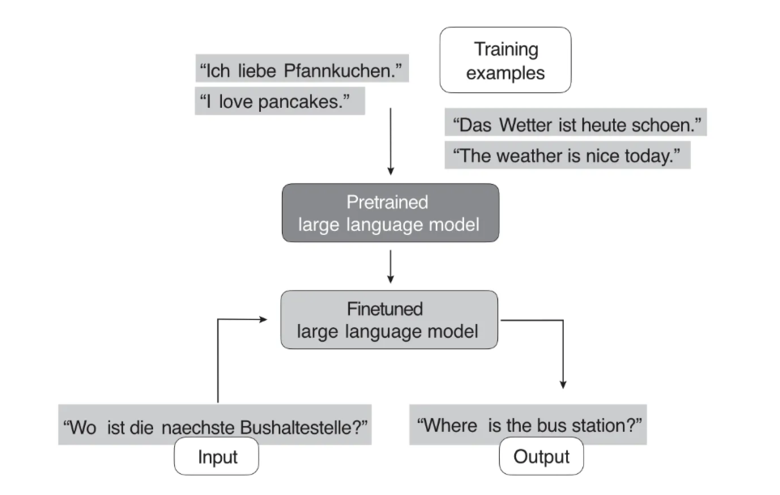
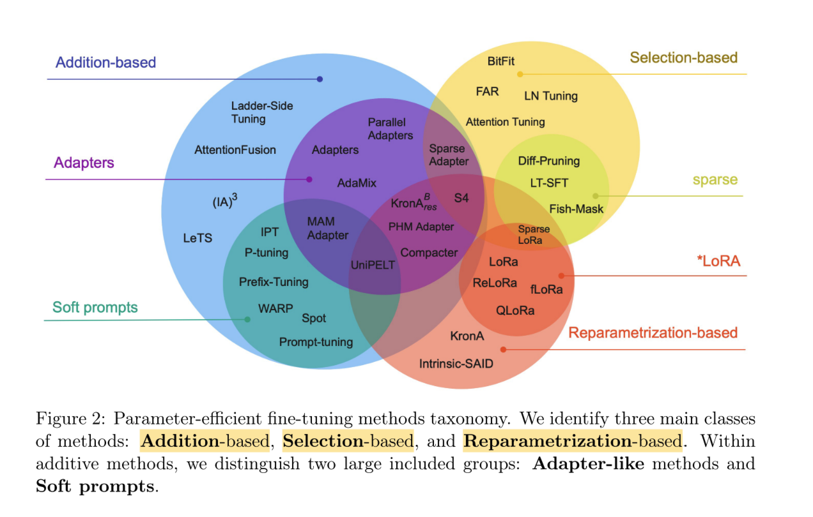
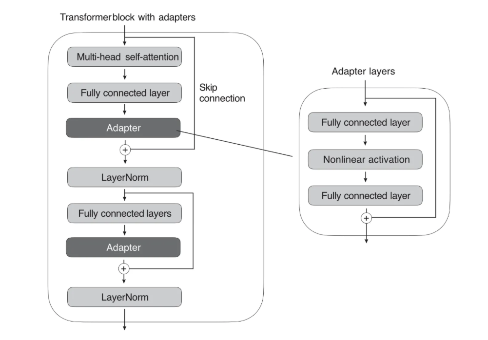
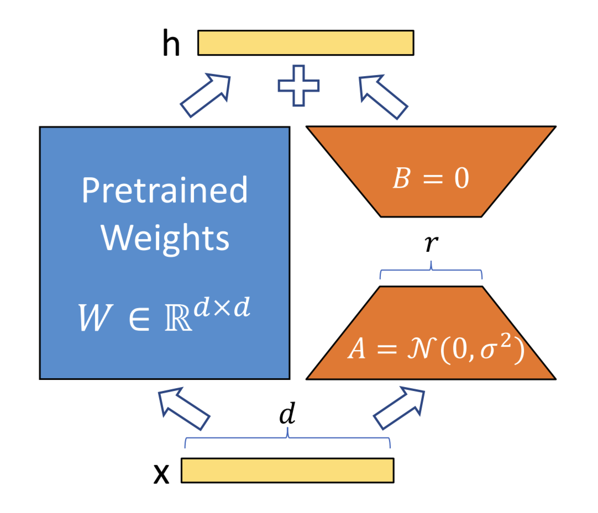
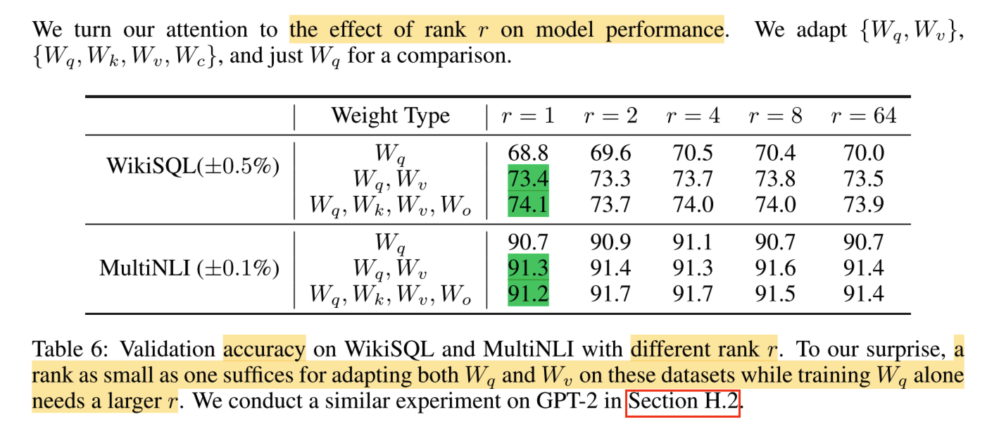
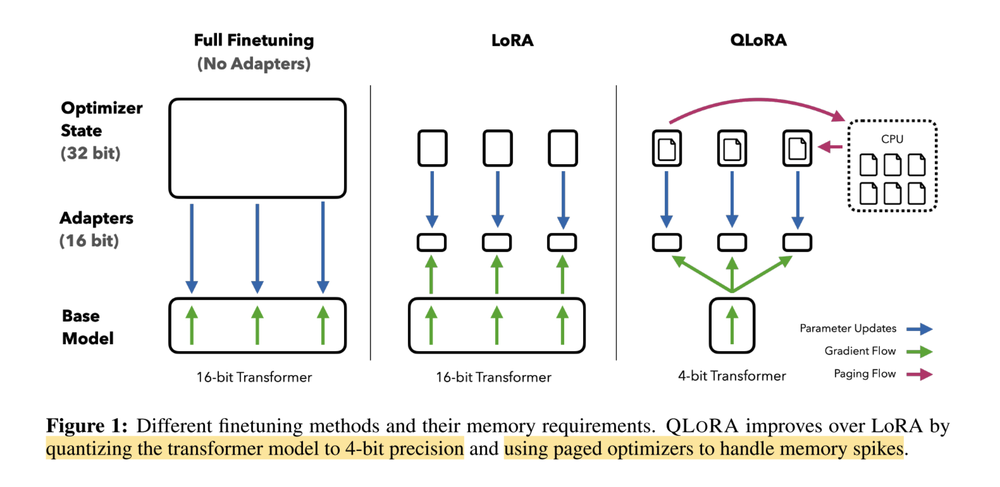

# 大模型微调知识全景

[toc]

## 大模型开发的流程是什么？


### pre-training

- **预训练（Pre-Training）**：利用海量数据、大量算力通过无监督训练得到基座模型。预训练后的模型具备强大的语言生成能力，但由于它主要是无监督训练的结果，可能不会直接适应具体的任务（如问答、对话），需要进一步的微调；
- **增量预训练（Continued Pre-Training）**: 一般垂直大模型是基于通用基座大模型进行二次的训练，为了给模型注入领域知识，就需要用领域内的语料进行继续预训练。

### post-training

- **监督微调（Supervised Fine-Tuning, SFT）**：这一阶段是对基座模型进行微调，让模型能够适用于特定任务；
- **偏好对齐（Reinforcement Learning from Human Feedback, RLHF）**：这一阶段通过引入人类反馈进一步优化模型的生成质量，使其生成的回答更符合用户的期望和人类的价值观（对齐人类偏好）。由于直接从人类获取反馈的成本较高，通常会先训练一个奖励模型（Reward Model，RM）来代替人类打分，这样可以在 RL 的框架下实现大规模的自动优化。

> 下面将深入介绍大模型微调的相关知识。

## 什么是大模型微调？

大模型微调一般指的是监督微调（SFT），即使用特定下游任务的数据继续训练“预训练模型（基座模型）”，使得模型能够满足特定下游任务的性能标准。

举例：将 base 大模型微调为一个可以将德语翻译为英语的模型。



举例：开源模型为了能够直接使用，一般会提供经过问答任务微调的版本，即 Chat 模型。


## 为什么需要大模型微调？

- **提升特定任务表现**：预训练模型虽然有广泛的语言理解能力，但在特定任务上（如情感分析、问答系统、机器翻译等）的表现可能不尽如人意。微调通过在任务特定的数据上进一步训练，使模型能够更好地理解和执行该任务；
- **领域适应性**：预训练模型可能在一些通用领域表现良好，但在特定领域（如医学、法律、金融等）中可能难以准确理解专业术语和内容结构。通过微调，可以让模型更好地适应这些领域的语言特点，提高在这些领域中的应用效果；
- **数据稀缺性**：对于一些数据稀缺的任务或领域，获取大量标签数据可能比较困难。微调允许在有限的数据集上进行有效训练，从而在数据稀缺的情况下也能取得较好的性能；
- **防止过拟合**：预训练过程中模型可能会过度拟合于无监督学习的任务（如下一个词预测），而在特定任务中表现不佳。通过微调，可以让模型专注于特定任务的数据，这有助于减少过拟合的风险，提高模型在该任务上的泛化能力；
- **成本效益**：与使用 prompt 来引导模型行为相比，微调通常可以更高效地优化模型的表现。微调后的模型通常可以更直接地执行任务，减少了对复杂提示的依赖。同时，微调可以在更小的模型上实现类似于大型模型的性能，从而降低推理的计算成本和延迟，比如与使用通用的 GPT-3.5 模型相比，经过微调的小型模型（如LLaMA-7B）在成本效益上可能更具优势，尤其是在特定任务的执行上。

## 大模型微调的方法有哪些？

- **全量参数更新 Full Fine-tuning（FFT）**：对预训练模型的所有参数进行更新，训练速度较慢，消耗机器资源较多；
- **参数高效微调 Parameter-Efficient Fine-Tuning（PEFT）**：只对部分参数做调整，训练速度快，消耗机器资源少。

### FFT 的问题

- 训练的成本会比较高，因为全量微调的参数量跟预训练的是一样多的。随着模型规模变得越来越大，这使得在消费级硬件上进行全量微调变得不可行；
- 灾难性遗忘（Catastrophic Forgetting），用特定训练数据去微调可能会把这个领域的表现变好，但也可能会把原来表现好的别的领域的能力变差。

### PEFT 的好处

allows us to reuse pretrained models while minimizing the computational and resource footprints, updating a subset of the model parameters.

1. Reduced computational costs (requires fewer GPUs and GPU time);
2. Faster training times (finishes training faster);
3. Lower hardware requirements (works with smaller GPUs & less smemory);
4. Better modeling performance (reduces overfitting);
5. Less storage (majority of weights can be shared across different tasks).

### PEFT 的分类

- **Addition-based methods:** Addition-based methods augment the pre-trained model with additional parameters or layers and train only the newly introduced elements.
  - **Adapters:** proposing the addition of fully-connected networks after attention and FFN layers in Transformer.
  - **Soft Prompts:**
    - **Prompt Tuning:** proposes to prepend the input embeddings.
    - **Prefix Tuning:** shared trainable parameters are prepended to the hidden states of all layers.
  - ...
- **Selective methods:** selects parameters to tune based on carefully designed selection criteria.
- **Reparametrization-based methods:** leverage low-rank representations to minimize the number of trainable parameters.
  - **LoRA:** Parameter update for a weight matrix in LoRA is decomposed into a product of two low-rank matrices.
  - **GLoRA**
  - **AdaLoRA**
  - **QLoRA**
- **Hybrid methods:** ...

主流的几种 PEFT：**Prompt Tuning、Prefix Tuning、LoRA、QLoRA**。




## 各类微调方法的原理是什么？

### In-Context Learning

#### 核心原理

In-Context Learning is a valuable and user-friendly method for situations where direct access to the large language model (LLM) is limited, such as when interacting with the LLM through an API or user interface.

in-context learning aims to provide context or examples of the task within the input or prompt, allowing the model to infer the desired behavior and generate appropriate responses. This approach takes advantage of the model’s ability to learn from vast amounts of data during pretraining, which includes diverse tasks and contexts.

For example, suppose we want to use in-context learning for few-shot German–English translation using a large-scale pretrained language model like GPT-3. To do so, we provide a few examples of German–English translations to help the model understand the desired task, as follows:


#### 优点

- It can be particularly useful when labeled data for finetuning is limited or unavailable.
- It also enables rapid experimentation with different tasks without finetuning the model parameters in cases where we don’t have direct access to the model or where we interact only with the model through a UI or API (for example, ChatGPT).

#### 缺点

Generally, in-context learning does not perform as well as finetuning for certain tasks or specific datasets since it relies on the pretrained model’s ability to generalize from its training data without further adapting its parameters for the particular task at hand.

> 对比传统方法：However, if we have access to the LLM, adapting and finetuning it on a target task using data from a target domain usually leads to superior results.

### Full Fine-tuning（FFT）

……

### Hard Prompt Tuning

#### 核心原理

Hard prompt tuning aims to optimize the prompt itself to achieve better performance. Prompt tuning does not modify the model parameters, but it may involve using a smaller labeled dataset to identify the best prompt formulation for the specific task.

For example, to improve the prompts for the previous German–English translation task, we might try the following three prompting variations:


#### 缺点

- performance is usually not as good as full model finetuning, as it does not update the model’s parameters for a specific task, potentially limiting its ability to adapt to task-specific nuances.
- prompt tuning can be labor intensive since it requires either human involvement comparing the quality of the different prompts or another similar method to do so.

### Soft Prompt Tuning

prepend a trainable parameter tensor (the “soft prompt”) to the embedded query tokens. The prepended tensor is then tuned to improve the modeling performance on a target dataset using gradient descent.

```python
x = EmbeddingLayer(input_ids)
x = concatenate([soft_prompt_tensor, x], dim=seq_len)
output = model(x)
```

where the soft_prompt_tensor has the same feature dimension as the embedded inputs produced by the embedding layer. Consequently, the modified input matrix has additional rows (as if it extended the original input sequence with additional tokens, making it longer).

Prompt Tuning 可以看作是 Prefix Tuning 的简化版本，它给每个任务定义了自己的 Prompt，然后拼接到数据上作为输入，但只在输入层加入 prompt tokens（在输入 embedding 层加入一段定长的可训练的向量，在微调的时候只更新这一段 prompt 的参数），另外，virtual token 的位置也不一定是前缀，插入的位置是可选的。

### P-Tuning

P-Tuning，简称 PT，是一种针对于大模型的 soft-prompt 方法，包括两个版本：

- **P-Tuning**：仅对大模型的 Embedding 加入新的参数；
- **P-Tuning v2**：将大模型的 Embedding 和每一层前都加上新的参数，这个也叫深度 prompt。

### Prefix Tuning

#### 核心原理

通过对输入数据增加前缀（Prefix）来做微调，即在输入 token 之前构造一段任务相关的 virtual tokens 作为 Prefix，训练的时候只更新 Prefix 部分的参数，每个下游任务都可以单独训练一套 prefix token。

prepend trainable tensors (soft prompts) to each transformer block instead of only the embedded inputs, which can stabilize the training.


```python
def transformer_block_with_prefix(x):
    soft_prompt = FullyConnectedLayers(soft_prompt)  # Prefix
    x = concatenate([soft_prompt, x], dim=seq_len)
    x = SelfAttention(x)
    x = LayerNorm(x + residual)
    residual = x
    x = FullyConnectedLayers(x) 
    x = LayerNorm(x + residual)
    return x
```

prefix 的作用是引导模型提取输入中的特定信息，进而更好地生成结果。

Based on intuition from prompting, we believe that having a proper context can steer the LM without changing its parameters.


#### 缺点

- 较难训练，且模型的效果并不严格随 prefix 参数量的增加而上升；
- 输入层有效信息长度减少。为了节省计算量和显存，我们一般会固定输入数据长度。增加了 prefix 之后，留给原始文字数据的空间就少了，因此可能会降低原始文字中 prompt 的表达能力。

### Adapter Tuning

#### 核心原理

在微调时，除了 Adapter 的部分，其余的参数都是被冻住的（freeze），这样我们就能有效降低训练的代价。

In the original adapter method, additional fully connected layers were added after the multi-head self-attention and existing fully connected layers in each transformer block.

Only the new adapter layers are updated when training the LLM, while the remaining transformer layers remain frozen. the first fully connected layer in an adapter block projects its input into a low-dimensional representation, while the second layer projects it back into the original input dimension.



```python
def transformer_block_with_adapter(x):
    residual = x
    x = SelfAttention(x)
    x = FullyConnectedLayers(x)  # Adapter
    x = LayerNorm(x + residual)
    residual = x
    x = FullyConnectedLayers(x)
    x = FullyConnectedLayers(x)  # Adapter
    x = LayerNorm(x + residual)
    return x
```

#### 缺点

添加了 Adapter 后，模型整体的层数变深，会拖慢模型训练和推理的速度。

> 总结：FFT 成本太高，Adapter Tuning 存在训练和推理延迟，Prefix Tuning 难训且会减少原始训练数据中的有效文字长度 -> 引入 LoRA 系列。

### LoRA (Low-Rank Adaptation)

#### 核心原理

finding a combination of fewer dimensions that can effectively capture most of the information in the original data.

LoRA 使用 $\mathbf{A}$ 和 $\mathbf{B}$ 两个与原模型并行的低秩矩阵来代替原本的增量权重矩阵 $\mathbf{\Delta W}$，从而可以在保证模型性能的同时，有效降低需要训练的参数量。



对于输入 $\mathbf{x}$，模型的输出 $\mathbf{h}$ 为：

$$
\mathbf{h} = \mathbf{W}\mathbf{x} + \mathbf{\Delta W}\mathbf{x} \approx \mathbf{W}\mathbf{x} + \mathbf{B}\mathbf{A}\mathbf{x}
$$

其中 $\mathbf{W}、\mathbf{\Delta W} \in \mathbb{R}^{d \times d}$，$\mathbf{A} \in \mathbb{R}^{r \times d}$（初始化为正态分布），$\mathbf{B} \in \mathbb{R}^{d \times r}$（初始化为零），$r$ 为矩阵 $\mathbf{\Delta W}$ 的秩。

#### 优点

- **节约内存**：在训练时，需要更新的权重数量从 $d \times d$ 下降到了 $2 \times d \times r$，显著降低了模型微调对硬件性能的要求；
- **保证性能**：在推理时，可以将 LoRA 的权重直接合并到预训练权重中，从而可以保证推理的速度不受影响；
- **灵活易用**：针对不同的下游任务，用户可以训练不同的 LoRA，并且在微调完成后，只需要保存新增的这一部分权重（不同任务间共享预训练模型的权重），相比于存储整个模型的权重，只需要极少的内存。

#### 数学原理

- 为什么可以将 $\mathbf{\Delta W}$ 拆分为 $\mathbf{A}$ 和 $\mathbf{B}$？这样做为什么是有效的？
- $r$ 作为一个超参数，它的取值是如何影响 LoRA 的表现的？
- $\mathbf{A}$ 和 $\mathbf{B}$ 为什么要这样初始化？

**为什么可以将 $\mathbf{\Delta W}$ 拆分为 $\mathbf{A}$ 和 $\mathbf{B}$？这样做为什么是有效的？**

在回答这个问题之前，我们需要先了解一个基本概念——**SVD（Singular Value Decomposition，奇异值分解）**。

对于一个非零的 $m \times n$ 实矩阵 $\mathbf{M} \in \mathbb{R}^{m \times n}$，我们可以将其表示为以下三个实矩阵乘积形式的运算：

$$
\mathbf{M} = \mathbf{U}\mathbf{Σ}\mathbf{V}^{T}
$$

其中 $\mathbf{U}$ 是 $m$ 阶正交矩阵，$\mathbf{V}$ 是 $n$ 阶正交矩阵，$\mathbf{Σ}$ 是由降序排列的对角线元素组成的 $m \times n$ 矩形对角矩阵。

$$
\mathbf{Σ} = diag(\sigma_{1}, \sigma_{2}, ..., \sigma_{p}) \\
\sigma_{1} \geq \sigma_{2} \geq ... \geq \sigma_{p} \geq 0
$$

$\mathbf{U}\mathbf{Σ}\mathbf{V}^{T}$ 称为矩阵 $\mathbf{M}$ 的奇异值分解，$\sigma_{i}$ 称为矩阵 $\mathbf{M}$ 的奇异值，$\mathbf{U}$ 的列向量称为左奇异向量，$\mathbf{V}$ 的列向量称为右奇异向量。

矩阵 $\mathbf{M}$ 的奇异值分解一定存在，但不一定唯一。

上面的矩阵分解方式又叫做**完全奇异值分解**，而实际中更加常用的则是其紧凑形式和截断形式。

**紧奇异值分解：**

设有 $m \times n$ 实矩阵 $\mathbf{M}$，其秩为 $r$，则有紧奇异值分解为：

$$
\mathbf{M} = \mathbf{U}_{r}\mathbf{Σ}_{r}\mathbf{V}^{T}_{r}
$$

其中 $\mathbf{U}_{r}$ 是 $m \times r$ 矩阵，$\mathbf{V}_{r}$ 是 $n \times r$ 矩阵，$\mathbf{Σ}_{r}$ 是 $r$ 阶对角矩阵。矩阵 $\mathbf{U}_{r}$ 由完全奇异值分解中 $\mathbf{U}$ 的前 $r$ 列构成，矩阵 $\mathbf{V}_{r}$ 由完全奇异值分解中 $\mathbf{V}$ 的前 $r$ 列构成，矩阵 $\mathbf{Σ}_{r}$ 由完全奇异值分解中 $\mathbf{Σ}$ 的前 $r$ 个对角线元素构成。

**截断奇异值分解：**

与“紧奇异值分解”类似，只不过这里只保留最大的 $k$ 个奇异值（$k < r$）及其对应的奇异向量，有：

$$
\mathbf{M} \approx \mathbf{U}_{k}\mathbf{Σ}_{k}\mathbf{V}^{T}_{k}
$$

在实际应用中，常常需要对矩阵的数据进行压缩，将其近似表示，奇异值分解提供了一种方法。**奇异值分解是在平方损失（弗罗贝尼乌斯范数）意义下对矩阵的最优近似**。紧奇异值分解对应着无损压缩，截断奇异值分解对应着有损压缩。

因此，SVD 的原理告诉我们，**可以用低秩矩阵来近似地表达原矩阵**。

“奇异值分解在统计中的主要应用为主成分分析（PCA）。数据集的特征值（在 SVD 中用奇异值表征）按照重要性排列，降维的过程就是舍弃不重要的特征向量的过程，而剩下的特征向量张成空间为降维后的空间。”

具体地，在 LoRA 中，将矩阵 $\mathbf{U}_{k}\mathbf{Σ}_{k}$ 合并为了一个矩阵 $\mathbf{B} \in \mathbb{R}^{m \times k}$，将矩阵 $\mathbf{V}^{T}_{k}$ 表示为了矩阵 $\mathbf{A} \in \mathbb{R}^{k \times n}$，从而可以用更少的数据量来表示矩阵 $\mathbf{\Delta W}$。

在实际微调中，由于事先并不知道矩阵 $\mathbf{\Delta W}$ 中具体的值（除非我们先全参微调一遍，但是这样的话就没必要用 LoRA 了），我们无法直接计算出 $\mathbf{\Delta W}$ 的 SVD 分解结果，因此论文作者将秩 $r$ 作为一个超参数，并让模型在训练中自己去学习矩阵 $\mathbf{A}$ 和 $\mathbf{B}$ 的值。

#### 实验分析

**实验一：不同微调方法的效果对比**

在论文中，作者将 LoRA 与其它微调方法在多种场景下的表现进行了对比，如下图所示：


**实验结论：LoRA 在显著降低了微调参数量的同时，还能在大部分场景下保证最优的性能。**

**实验二：不同 $r$ 对微调效果的影响**

**$r$ 作为一个超参数，它的取值是如何影响 LoRA 的表现的？**

作者对比了当 $r$ 取不同值时，对模型不同的层应用 LoRA 的效果，如下图所示：



可以看出：

- 当我们同时对 $\mathbf{W}_{q}$ 和 $\mathbf{W}_{v}$ 应用 LoRA 时，哪怕取了一个很小的 $r=1$，其效果也超过了单独对 $\mathbf{W}_{q}$ 应用 LoRA 且 $r=64$ 时的表现；
- 在同一行（同样的 Weight Type）内，取 $r=1$ 与 $r=64$ 的结果差异不大。

**实验结论：增量权重矩阵 $\mathbf{\Delta W}$ 的秩可能很小，因此我们能够用秩很小的两个矩阵来近似表达该矩阵。**

到此为止还没完，作者还做了更进一步的实验，来证明 LoRA 这种分解方式的有效性。 **(´･_･`)**

**实验三：$\mathbf{\Delta W}$ 的左奇异矩阵 $\mathbf{U}$ 不同子空间的相似度对比**

作者对比了 $\mathbf{U}_{A_{r=8}}$ 和 $\mathbf{U}_{A_{r=64}}$ 不同维度子空间的相似度，其中 $\mathbf{U}_{A_{r=8}}$ 为 $r=8$ 时矩阵 $\mathbf{A}$ 的左奇异矩阵，$\mathbf{U}_{A_{r=64}}$ 同理。

子空间相似度的计算方式：


> 这里的 $\lVert ... \rVert_{F}$ 为上面提到的“弗罗贝尼乌斯范数”。

实验结果如下图所示（图 3 和图 4 分别为图 1 和图 2 的左下角部分）：


这个图可能比较难理解，下面举例进行说明：

当 $i=1$ 时，$j$ 从 $1$ 取到 $64$，发现颜色都比较浅（相似度高），说明当 $r=8$ 时，$\mathbf{\Delta W}$ 分解出的矩阵 $\mathbf{A}_{r=8}$ 的左奇异矩阵 $\mathbf{U}_{A_{r=8}}$ 的第一个左奇异向量表示的特征（或者说信息）与 $\mathbf{A}_{r=64}$ 的前 64 个左奇异向量组成的子空间表示的特征重合度很高，即**高秩矩阵（$r=64$）的大部分信息都已经包含在了低秩矩阵（$r=8$）的前几维子空间中**。

**实验结论：越靠前的奇异向量（奇异值按降序排序）包含的信息越多（或者说越重要），不管 $r$ 取多大，前几维（如 $r<8$）子空间表示的信息都是差不多的，越后面（如 $8<r<64$）的子空间包含的有效信息越少，噪声越多，再次证明了用低秩矩阵近似表达高秩矩阵的有效性**。

**实验四：$\mathbf{\Delta W}$ 与 $\mathbf{W}$ 不同子空间的相似度对比**

与实验三类似，作者还比较了 $\mathbf{\Delta W}$ 与 $\mathbf{W}$ 不同维度子空间的相似度，如下图所示：


其中，$i$ 表示使用预训练权重矩阵 $\mathbf{W}$ 的前 $i$ 个左奇异向量组成的子空间，$j$ 表示使用 $\mathbf{\Delta W}$ 的前 $j$ 个左奇异向量组成的子空间（$j \leq r$）。

可以看出，$\mathbf{W}$ 中靠前（靠上）的奇异向量组成的子空间与 $\mathbf{\Delta W}$ 的子空间相似度并不高，反而是 $\mathbf{W}$ 中最后的一些奇异向量与 $\mathbf{\Delta W}$ 中的奇异向量有较高的相似度。

**实验结论：$\mathbf{\Delta W}$ 中学习到的特征都是原来预训练权重矩阵中没有被强调的部分，说明 $\mathbf{\Delta W}$ 能够有效学习到针对特定下游任务、区别于原特征的新特征，证明了 LoRA 在微调方面的有效性。**

#### 超参数

LoRA 引入了一个超参数 $\alpha$，可以看作是学习率，同时也代表了 LoRA 对从特定下游任务学习而来的特征的放大程度，有：

$$
\mathbf{h} = \mathbf{W}\mathbf{x} + \mathbf{\Delta W}\mathbf{x} \approx \mathbf{W}\mathbf{x} + \frac{\alpha}{r}\mathbf{B}\mathbf{A}\mathbf{x}
$$

最佳实践：在实际微调中，一般先随机设置一个 $r$，并让 $\alpha = r$，然后保持 $\alpha$ 不变，通过不断调整 $r$ 的值来调整微调的效果。

### QLoRA (Quantized LoRA)

QLoRA 的核心工作是模型量化，通过定义一个 NF4 的精度单位将原模型的参数精度减小了数倍，从而大幅节约了训练时占用的显存。

对于 LLM 的参数 W（预训练参数），我们首先将它量化到 NF4 的精度，在进行特征计算时，我们通过双重反量化将它还原到 BF16 精度。QLoRA 也在原参数一侧添加了一个与原参数并行的低秩适配器，它的精度是 BF16。

QLoRA 有一个 NF4 的存储数据类型和 BF16 的计算数据类型。在进行前向和反向传播时，我们需要将存储数据类型反量化为计算数据类型，但是计算梯度时我们只计算添加的适配器的梯度，这一点和 LoRA 是一致的。



#### 核心原理

- 结合了分位数量化和分块量化的四位标准浮点数量化（4-bit NormalFloat Quantization）；
- 对模型进行两次量化的双重量化（Double Quantization），它的第二次量化只作用在第一次量化产生的量化常数上，可以进一步节约显存占用；
- 分页优化（Paged Optimizer），使用 CPU 内存代替 GPU 显存保存部分梯度参数。

#### 优缺点

- Memory used ⬇: save GPU memory.
- Training time ⬆: increased training runtime caused by the additional quantization and dequantization of the pretrained model weights.

#### 分位数量化

**分位数量化（Quantile Quantization）**：隶属于非线性量化，分位数（Quantile）在数学上的定义指的是把顺序排列的一组数据分割为若干个相等块的分割点的数值。

**量化分位数的计算：**

1. 根据每个块的特征的绝对值的最大值，我们为每个块保存一个量化常数（每个块中的特征取绝对值后的最大值）；
2. 计算每个张量的量化值（实际值/该块的量化常数）；
3. 在 Q（normal_map）中找到与每个张量最接近的值，并将其量化为该值对应的索引值。

在模型保存时，除了要保存量化后的值，我们还要保存每个块对应的量化常数，因为这个值在我们进行反量化时需要用到。在反量化时，我们以量化结果作为索引，从 Q 中查找到它对应的分位数，再乘以为每个块保存的量化常数，便可以得到最终的结果。

`normal_map` 的计算：

```python
from scipy.stats import norm
import torch

def create_normal_map(offset=0.9677083, use_extra_value=True):
    if use_extra_value:
        # one more positive value, this is an asymmetric type
        v1 = norm.ppf(torch.linspace(offset, 0.5, 9)[:-1]).tolist() # 正数部分
        v2 = [0]*(256-15) ## we have 15 non-zero values in this data type
        v3 = (-norm.ppf(torch.linspace(offset, 0.5, 8)[:-1])).tolist() #负数部分
        v = v1 + v2 + v3
    else:
        v1 = norm.ppf(torch.linspace(offset, 0.5, 8)[:-1]).tolist()
        v2 = [0]*(256-14) ## we have 14 non-zero values in this data type
        v3 = (-norm.ppf(torch.linspace(offset, 0.5, 8)[:-1])).tolist()
        v = v1 + v2 + v3

    values = torch.Tensor(v)
    values = values.sort().values
    values /= values.max()
    assert values.numel() == 256
    return values


Q = create_normal_map()
# Q = [-1.0, -0.6961928009986877, -0.5250730514526367, -0.39491748809814453, -0.28444138169288635, -0.18477343022823334, -0.09105003625154495, 0.0, 0.07958029955625534, 0.16093020141124725,0.24611230194568634, 0.33791524171829224, 0.44070982933044434, 0.5626170039176941, 0.7229568362236023, 1.0]
```

**示例：**

假设一个张量有 16 个值，它的被分成了 4 块：

```python
input_blocked_tensor = [[-1.28645003578589, -1.817660483275528, 9.889441349505042, 0.010208034676132627],
                        [-15.009014631551885, 1.4136255086268115, -7.815595761491153, 10.766760590950263], 
                        [-0.731406153917959, 3.468224595908726, 2.445252541840315, -8.970824523299282], 
                        [-9.641638854625175, 7.696158363188889, -5.323939281255154, 5.97160401402024]]
```

根据每个块的特征的绝对值的最大值，我们为每个块保存一个量化常数，它的计算方式是每个块中特征的绝对值中最大的那个：

```python
c1 = max(|-1.28645003578589|, |-1.817660483275528|, |9.889441349505042|, |0.010208034676132627|) = 9.889441349505042
c2 = max(|-15.009014631551885|, |1.4136255086268115|, |-7.815595761491153|, |10.766760590950263|) = 15.009014631551885
c3 = max(|-0.731406153917959|, |3.468224595908726|, |2.445252541840315|, |-8.970824523299282|) = 8.970824523299282
c4 = max(|-9.641638854625175|, |7.696158363188889|, |-5.323939281255154|, |5.97160401402024|) = 9.641638854625175
```

最后我们便可以计算这个张量的量化值了。例如第一个值 `-1.28645003578589`，它除以这个块的量化常数 `c1` 后得到 `-0.13008318572517502`，我们可以在 `Q` 中找到与它最接近的值是 `-0.09105003625154495`，这个值在 `Q` 中对应的索引是 `6`，因此这个值被量化后的值是 `6`。

```python
Q = [-1.0, -0.6961928009986877, -0.5250730514526367, -0.39491748809814453, -0.28444138169288635, -0.18477343022823334, -0.09105003625154495, 0.0, 0.07958029955625534, 0.16093020141124725,0.24611230194568634, 0.33791524171829224, 0.44070982933044434, 0.5626170039176941, 0.7229568362236023, 1.0]
```

同理我们可以得到这个输入张量所有的值量化后的结果。

```python
[[6, 5, 15, 7],
 [0, 8, 2, 14],
 [6, 11, 10, 0],
 [0, 14, 2, 13]]
```

在模型保存时，除了要保存量化后的值，我们还要保存每个块对应的量化常数，因为这个值在我们进行反量化时需要用到。

在反量化时，我们以量化结果作为索引，从 `Q` 中查找到它对应的分位数，再乘以为每个块保存的量化常数 `ci`，便可以得到最终结果。

```python
[[-0.9004339933799617, -1.8273060011889755, 9.889441349505042, 0.0],
 [-15.009014631551885, 1.1944218804231184, -7.880829111886221, 10.850869732860506],
 [-0.816793898052648, 3.0313783372030603, 2.2078302737800004, -8.970824523299282],
 [-9.641638854625175, 6.970488722350373, -5.062564734402345, 5.424549965245643]]
```

**解决了什么问题？**

如果我们粗暴的使用 round 操作去映射到低精度的更近的值，我们可能造成大量的数据都被量化到同一个数上，这样特征之间的差异性在量化过程中就被丢失了。使用分位数将张量分成了大小相同的若干个块，这样我们得到更加均匀的量化特征，这也就是分位数量化。每两个分位数的中点便是模型量化到这个区间映射的值。

#### 双重量化

QLoRA 的双重量化是指对量化常数再做一次 8 bit 的量化，在进行量化常数的量化时，QLoRA 以每 256 个量化常数为一组再做一次量化。

在进行反量化时我们也需要进行两次反量化才能把量化后的值还原。

**好处：**

减少了存储量化常数带来的额外显存占用。

#### 分页优化

QLoRA 的分页优化其实就是当显存不足时，将保存的部分梯度检查点转移到 CPU 内存上，和计算机的内存数据转移到硬盘上的常规内存分页一个道理。

### LongLoRA

- shift short attention：更好地处理长 context；
- 相比于加到 query/key/value 等部分上的 lora，这里是将 lora 加到 embedding 和 normaliztion 层上。

### LoRA 系列其它微调方法

- LoRA-FA
- VeRA
- Delta-LoRA
- LoRA+
- LoRA-drop
- DoRA
- ……

### Reinforcement Learning with Human Feedback (RLHF)

In RLHF, a pretrained model is finetuned using a combination of supervised learning and reinforcement learning.

Human feedback is collected by having humans rank or rate different model outputs, providing a reward signal. The collected reward labels can be used to train a reward model that is then used to guide the LLMs’ adaptation to human preferences. The reward model is learned via supervised learning, typically using a pretrained LLM as the base model, and is then used to adapt the pretrained LLM to human preferences via additional finetuning.


RLHF uses a reward model instead of training the pretrained model on the human feedback directly because involving humans in the learning process would create a bottleneck since we cannot obtain feedback in real time.

**RM**：训练一个奖励模型（Reward Model），用于评估生成模型的输出质量。收集生成模型输出及其对应的人类反馈。这些反馈可以是评分、选择最佳输出、直接修改等形式。使用这些反馈数据训练奖励模型，使其能够对生成的输出进行评分。奖励模型通常是一个监督学习模型，通过最小化预测评分与人类反馈评分之间的差距进行训练。

**RL**：使用强化学习算法（如 PPO（Proximal Policy Optimization））进一步优化第一步中生成的模型，使其输出更符合人类反馈的期望。

### 总结

How to use and finetune pretrained LLMs?


Fine-tuning all layers of a pretrained LLM remains the gold standard for adapting to new target tasks, but there are several efficient alternatives for using pretrained transformers (enable effective application of LLMs to new tasks while minimizing computational costs and resources).

## 大模型微调的框架有哪些？

- **huggingface/transformers**：提供了丰富的预训练模型和微调工具，支持大多数主流的 NLP 任务（如文本分类、序列标注、生成任务等），适合进行快速实验和生产部署；
- **huggingface/peft**：huggingface 开源的微调基础工具；
- **modelscope/ms-swift**：modelscope 开源的轻量级微调框架，以中文大模型为主，支持各类微调方法；可以通过执行脚本进行微调，也可以在代码环境中一键微调；自带微调数据集和验证数据集，可以一键完成微调和验证；
- **hiyouga/LLaMA-Factory**：全栈微调工具，支持海量模型和各种主流微调方法；支持通过脚本微调、基于 Web 端微调（使用简单）；自带基础训练数据集；除微调外，支持增量预训练和全量微调；
- **NVIDIA/Megatron-LM**：NVIDIA 开发的大模型训练框架，支持大规模的预训练和微调，适用于需要极高性能和规模的大模型训练和微调。

总结：

- 快速实验选择 transformers；
- 普通规模选择 LLaMA-Factory；
- 超大规模选择 Megatron-LM。

## 如何在生产环境中进行微调？

### 实践案例

#### 整体架构和组件


- Helm Char: 管理配置（食谱）
- PyTorchJob with multiple workers for fine tuning the model: 执行微调（厨师）
- Persistent Volume Claim (PVC) used as a shared storage: 存储数据（冰箱）
- Secret for gated models (Optional)
- Data access pod (Optional)

**Helm Char:**

brings together all the different components that are used for our job and allows us to deploy everything using one `helm install` command.

**Storage (NFS storage location):**

We need a storage location that can be shared among the workers to access the dataset, and save model files. We are using a vanilla K8s cluster with an NFS backed storage class.

our NFS storage location doesn't get added to the container. Instead, the storage location gets mounted into the container so that we have access to read and write from that location without it being built into the image. To achieve this, we are using a **persistent volume claim (PVC)**.

[<u>PersistentVolume</u>](https://kubernetes.io/docs/concepts/storage/persistent-volumes/) subsystem provides an API for users and administrators that abstracts details of how storage is provided from how it is consumed.

A **PersistentVolumeClaim (PVC)** is a request for storage by a user. It is similar to a Pod. Pods consume node resources and PVCs consume PV resources. Pods can request specific levels of resources (CPU and Memory). Claims can request specific size and access modes (e.g., they can be mounted ReadWriteOnce, ReadOnlyMany, ReadWriteMany, or ReadWriteOncePod, see AccessModes).

**Secret:**

The last ingredient that we're adding in is the secret sauce. Gated or private models require you to be logged in to download the model. For authentication from the K8s job, we define a secret with a Hugging Face User Read Only Access Token. The token from the secret will be mounted into the container. If the model being trained is not gated or private, this isn't required.

### Kubeflow

#### 整体介绍

This tutorial requires **Kubeflow** to be installed on your cluster. Kubeflow provides features and custom resources that simplify running and scaling machine learning workloads on K8s clusters. In this example, we are going to be using the **PyTorch training operator** from Kubeflow. The PyTorch training operator allows us to run distributed PyTorch training jobs on the cluster without needing to manually set environment variables.

Kubeflow is a community and ecosystem of open-source projects to address each stage in the machine learning (ML) lifecycle with support for best-in-class open source tools and frameworks. Kubeflow makes AI/ML on Kubernetes simple, portable, and scalable.


- Standalone Kubeflow Components
- Kubeflow Platform

**Standalone Kubeflow Components:**

The Kubeflow ecosystem is composed of multiple open-source projects that address different aspects of the ML lifecycle. Many of these projects are designed to be usable both within the Kubeflow Platform and independently. These Kubeflow components can be installed standalone on a Kubernetes cluster. It provides flexibility to users who may not require the full Kubeflow Platform capabilities but wish to leverage specific ML functionalities such as model training or model serving.

...

**Kubeflow Platform:**

The Kubeflow Platform refers to the full suite of Kubeflow components bundled together with additional integration and management tools. Using Kubeflow as a platform means deploying a comprehensive ML toolkit for the entire ML lifecycle.

**Kubeflow Overview Diagram:**


**Kubeflow Ecosystem:**


> 目前还不支持昇腾 NPU。

#### 使用 Kubeflow 进行微调

**ML Lifecycle for Production and Development Phases:**


In the **Data Preparation step** you ingest raw data, perform feature engineering to extract ML features for the offline feature store, and prepare training data for model development. Usually, this step is associated with data processing tools such as Spark, Dask, Flink, or Ray.

In the **Model Development step** you choose an ML framework, develop your model architecture and explore the existing pre-trained models for fine-tuning like BERT or Llama.

In the **Model Optimization step** you can optimize your model hyperparameters and optimize your model with various AutoML algorithms such as neural architecture search and model compression. During model optimization you can store ML metadata in the Model Registry.

In the **Model Training step** you train or fine-tune your model on the large-scale compute environment. You should use a distributed training if single GPU can’t handle your model size. The results of the model training is the trained model artifact that you can store in the Model Registry.

In the **Model Serving step** you serve your model artifact for online or batch inference. Your model may perform predictive or generative AI tasks depending on the use-case. During the model serving step you may use an online feature store to extract features. You monitor the model performance, and feed the results into your previous steps in the ML lifecycle.

**LLM Fine-Tuning with Training Operator:**

[PyTorch Training (PyTorchJob)](https://www.kubeflow.org/docs/components/training/user-guides/pytorch/): The PyTorchJob is a Kubernetes custom resource to run PyTorch training jobs on Kubernetes. The Kubeflow implementation of the PyTorchJob is in the **training-operator**.


Once user executes train API, Training Operator creates PyTorchJob with appropriate resources to fine-tune LLM.

Storage initializer InitContainer is added to the PyTorchJob worker 0 to download pre-trained model and dataset with provided parameters.

PVC with ReadOnlyMany access mode attached to each PyTorchJob worker to distribute model and dataset across Pods. Note: Your Kubernetes cluster must support volumes with ReadOnlyMany access mode, otherwise you can use a single PyTorchJob worker.

Every PyTorchJob worker runs LLM Trainer that fine-tunes model using provided parameters.

## 参考资料

- [<u>Scaling Down to Scale Up: A Guide to Parameter-Efficient Fine-Tuning</u>](https://arxiv.org/abs/2303.15647)
- [<u>Prefix-Tuning: Optimizing Continuous Prompts for Generation</u>](https://arxiv.org/abs/2101.00190)
- [<u>LoRA: Low-Rank Adaptation of Large Language Models</u>](https://arxiv.org/abs/2106.09685)
- [<u>李航《统计学习方法》</u>](https://book.douban.com/subject/33437381/)
- [<u>QLoRA: Efficient Finetuning of Quantized LLMs</u>](https://arxiv.org/abs/2305.14314)
- [<u>浅谈 DeepLearning 的浮点数精度 FP32/FP16/TF32/BF16……</u>](https://medium.com/@averyaveavi/%E6%B7%BA%E8%AB%87deeplearning%E7%9A%84%E6%B5%AE%E9%BB%9E%E6%95%B8%E7%B2%BE%E5%BA%A6fp32-fp16-tf32-bf16-%E4%BB%A5llm%E7%82%BA%E4%BE%8B-9bfb475e50be)
- [<u>LongLoRA: Efficient Fine-tuning of Long-Context Large Language Models</u>](https://arxiv.org/abs/2309.12307)
- [<u>New LLM Pre-training and Post-training Paradigms</u>](https://magazine.sebastianraschka.com/p/new-llm-pre-training-and-post-training)
- [<u>Finetuning Large Language Models</u>](https://magazine.sebastianraschka.com/p/finetuning-large-language-models?utm_source=publication-search)
- [<u>Using and Finetuning Pretrained Transformers</u>](https://magazine.sebastianraschka.com/p/using-and-finetuning-pretrained-transformers?utm_source=publication-search)
- [<u>Practical Tips for Finetuning LLMs Using LoRA</u>](https://magazine.sebastianraschka.com/p/practical-tips-for-finetuning-llms?utm_source=publication-search)
- [<u>LLM 微调理论</u>](https://qiankunli.github.io/2023/10/29/llm_finetune_theory.html)
- [<u>GPT 是如何炼成的：大模型微调基础概念指北</u>](https://www.lixueduan.com/posts/ai/04-finetune-concept/)
- [<u>图解大模型微调系列之：大模型低秩适配器 LoRA（原理篇）</u>](https://zhuanlan.zhihu.com/p/646831196)
- [<u>图解大模型微调系列之：大模型低秩适配器 LoRA（源码解读与实操篇）</u>](https://zhuanlan.zhihu.com/p/654897296)
- [<u>图解 Fine-tuning：LoRA 系列微调技术概述</u>](https://zhuanlan.zhihu.com/p/990958034)
- [<u>QLoRA（Quantized LoRA）详解</u>](https://zhuanlan.zhihu.com/p/666234324)
- [<u>LongLoRA - 高效微调长上下文的 LLMs</u>](https://zhuanlan.zhihu.com/p/659226557)
- [<u>LLM 长 context 微调技巧 - LongLora</u>](https://zhuanlan.zhihu.com/p/658043624)
- [<u>LoRA、QLoRA、LoRA+、LongRA、DoRA、MaLoRA、GaLore方案都知道吗？</u>](https://zhuanlan.zhihu.com/p/8954237216)
- [<u>LLM 微调实践</u>](https://qiankunli.github.io/2024/07/28/llm_finetune_practice.html)
- [<u>Fine Tuning a LLM Using Kubernetes with Intel® Xeon® Scalable Processors</u>](https://huggingface.co/blog/dmsuehir/llama2-fine-tuning-k8s)
- [<u>How to Fine-Tune LLMs with Kubeflow</u>](https://www.kubeflow.org/docs/components/training/user-guides/fine-tuning/)
- [<u>LLM Fine-Tuning with Training Operator - Architecture</u>](https://www.kubeflow.org/docs/components/training/reference/fine-tuning/)
- [<u>LLM Fine-Tuning with the Training Operator</u>](https://www.kubeflow.org/docs/components/training/explanation/fine-tuning/)
