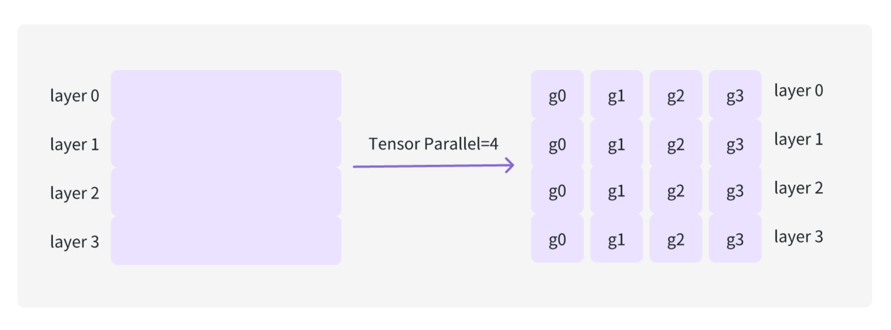

# 基本概念

tensor parallel ？
data parallel ？
pipeline parallel ？

张量并行也可以理解为拆模型，例如把一个 nn.Linear 层拆分到两个 GPU 上，张量并行是针对层内做的，流水线并行针对层间来做的。（对于分布式推理，通过创建多个 worker 执行完整模型的一部分）。

参考资料：

- [流水线并行](https://zhuanlan.zhihu.com/p/613196255)
- [数据并行-1](https://zhuanlan.zhihu.com/p/617133971)
- [数据并行-2](https://zhuanlan.zhihu.com/p/618865052)
- [张量并行](https://zhuanlan.zhihu.com/p/622212228)
- [模型并行-1](https://zhuanlan.zhihu.com/p/629121480)
- [模型并行-2](https://zhuanlan.zhihu.com/p/634377071)

显存 ？

DSL（领域特定语言）？

自回归 Transformer ？

激活（activation）？

MoE（混合专家模型）？

triton ？

overhead ？

MLP 层 ？模型不同层（attention, mlp, embedding等）

SVD ？
