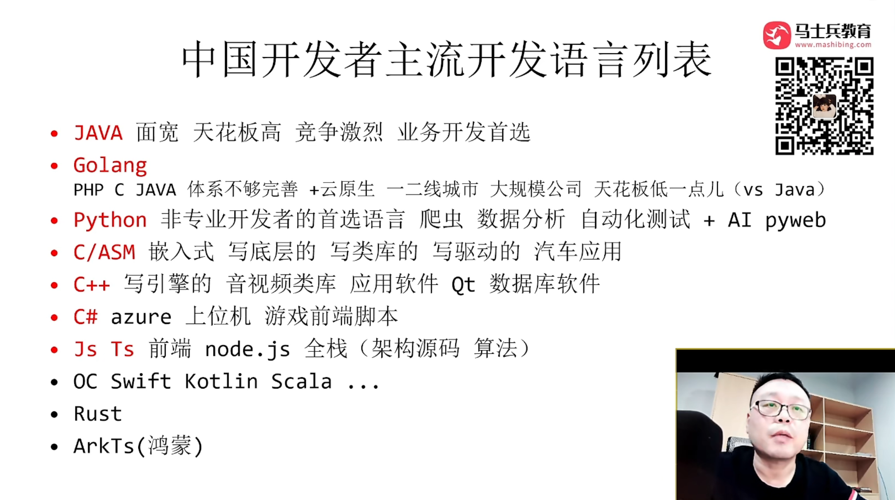

# 2024 年 IT 行业发展情况分析

## 中国主流开发语言就业情况

Java 后端的架构方向，两大核心：

- 大并发量：分布式、微服务、中间件、缓存、消息队列、存储、云原生；
- 大数据量：数据存储、数据清洗、数据湖、数据仓库。

其它能力的学习：源码、设计。

## IT 行业发展情况

后端因为更了解业务逻辑，所以比前端的天花板更高。

AI 方向的岗位：AI 算法工程师（985 硕博）、AI API 调用工程师（调包侠）。

大数据方向的岗位：数据分析（钱少）、数据挖掘（里面比较好的方向：结合 AI，做商业智能（BI））、数据开发（写 SQL）、大数据平台开发。（集中在一二线城市、大公司）

测试：自动化（测试开发）、测试管理、测试平台开发、质量控制。（门槛低、钱少、岗位少）

运维：自动化运维（DevOps）、大数据运维、云原生运维、安全运维。

游戏：……。

区块链、web3、元宇宙：去中心化。（海外业务偏多，有法律风险）

安全：……。