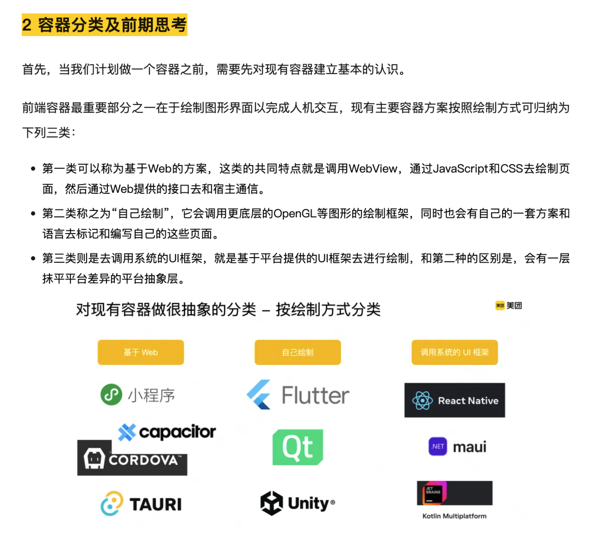
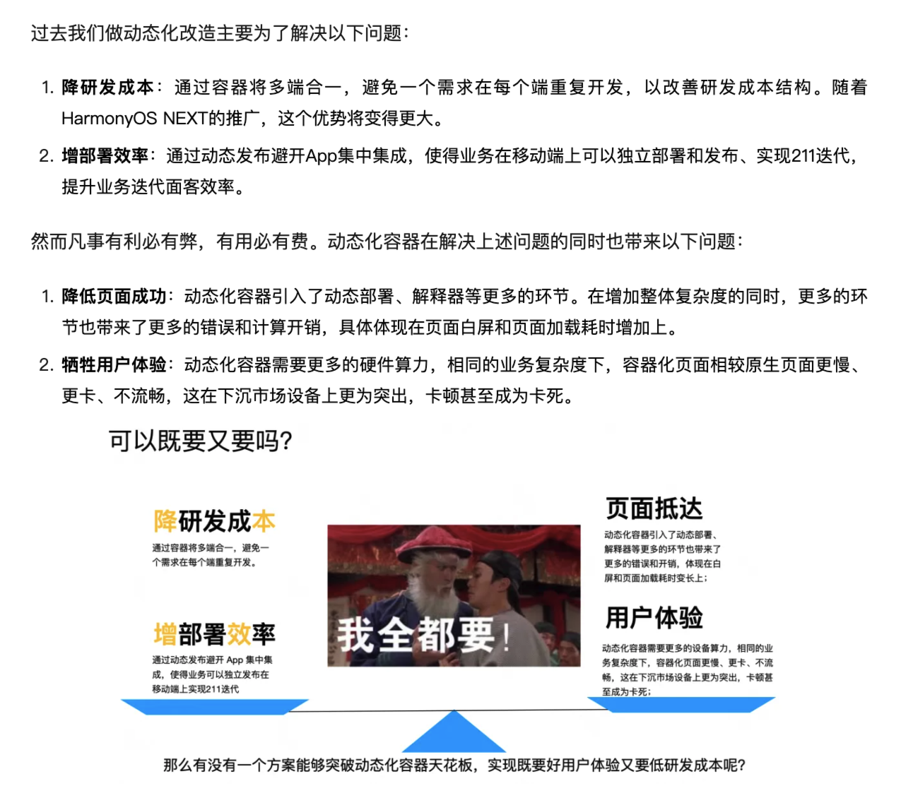

# 计算开源-外部知识分享账号-运营方案

## 一、账号定位

国内最前沿的开源知识分享平台，内容包括 AI 技术/开源文化/技术洞察。

目前账号定位为中立账号，不和华为昇腾强绑定，以“开源”相关知识作为核心竞争力。

## 二、整体方案

### 2.1 内容收集

按分类收集投稿：

- 技术分享类：科普类（介绍某种技术）/实践类（运用什么技术解决了什么问题？）；
- 开源文化类：开源社区运营/组织架构等开源相关知识分享；
- 开源洞察类：前沿资讯解读（如：PyTorch 大会/Nvidia 发布会等，发布了什么最新的技术/政策？对当下的技术发展有什么影响？）。

可以用一些开源社区的小礼品作为激励，鼓励大家进行投稿，不只是针对计算开源开发与运营部的人，计算下的其它部门也可以鼓励他们进行投稿。

团队内的“天天向上”等分享会的内容可以作为技术分享类文章的内容来源（TODO：后续怎么让大家持续有规律地参与到文章的写作中？）。

### 2.2 内容整理

计算开源运营团队：

- 账号 logo 制作；
- 投稿收集/激励；
- 文章排版；
- 文章配图；
- 账号运营；
- ……

## 三、如何写好一篇技术文章

### 3.1 写作思路

- 摘要（几句话说清楚本文的主要内容）
- 目录
- 背景（业务场景/问题和挑战）
- 设计方案（整体架构图/基本概念/核心功能/效果收益）
- 总结与展望
- 参考资料（附录）/相关文章（推荐阅读）/作者信息/Q & A

### 3.2 写作技巧

- 分点归纳总结，不要流水账；
- 丰富的配图（每写几段话就配一张图），用图来解释概念/架构，可以适当使用表情包（增加风趣）；
- 篇幅（字数）适当，具体可以参考下面的文章；
- ……

**示例：**

---

---

### 3.3 参考文章

- [<u>美团外卖前端容器化演进实践</u>](https://mp.weixin.qq.com/s?__biz=MjM5NjQ5MTI5OA==&mid=2651751072&idx=1&sn=5b8d510f6b8ff2d06e8bc44606e12e00&chksm=bd125bed8a65d2fb8bcff8623a82fe06b667d2a75c5c6a32a2ce17d392d71dca97c973ed0aff&scene=21#wechat_redirect)
- [<u>大前端：如何突破动态化容器的天花板？</u>](https://mp.weixin.qq.com/s/ocGLvUmAnglZbcKRmK72Yg)
- [<u>作为开发者，我如何提高任务型大模型应用的响应性能</u>](https://mp.weixin.qq.com/s/_4s8HiRASW59V9S0YMRRww)

## 四、洞察类文章写作方法分析

归类整理大会内容，给出解读/总结。

形式：文字+PPT+现场照片。

参考：《KubeCon North America Salt Lake City 2024》。
