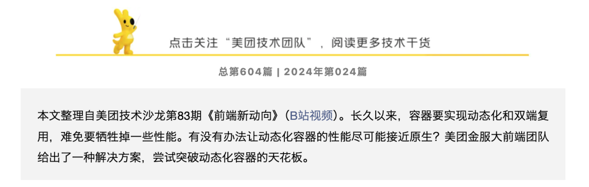
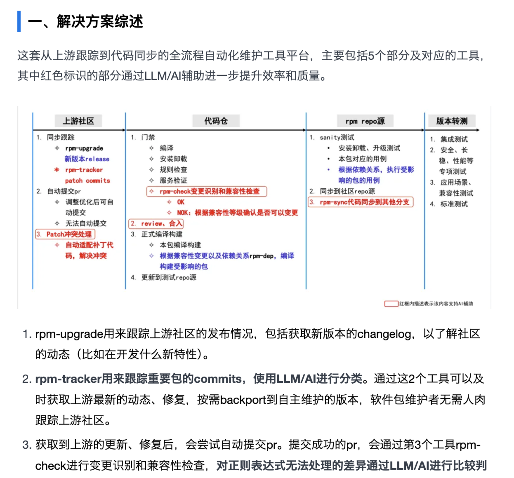
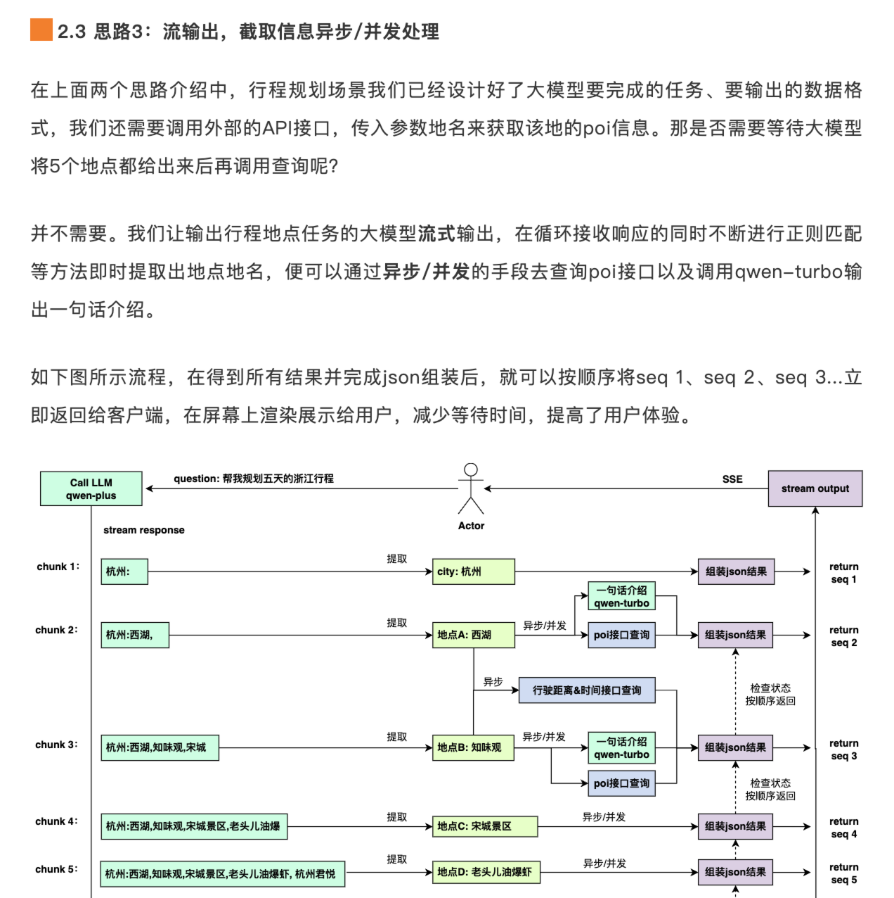
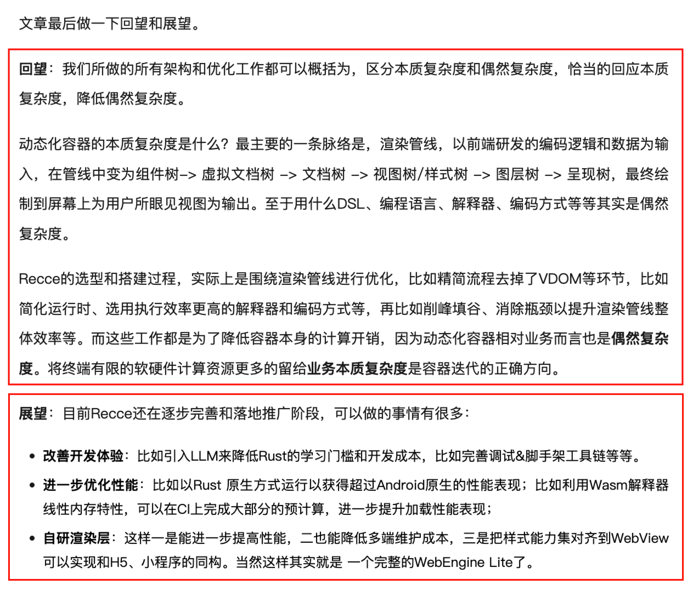
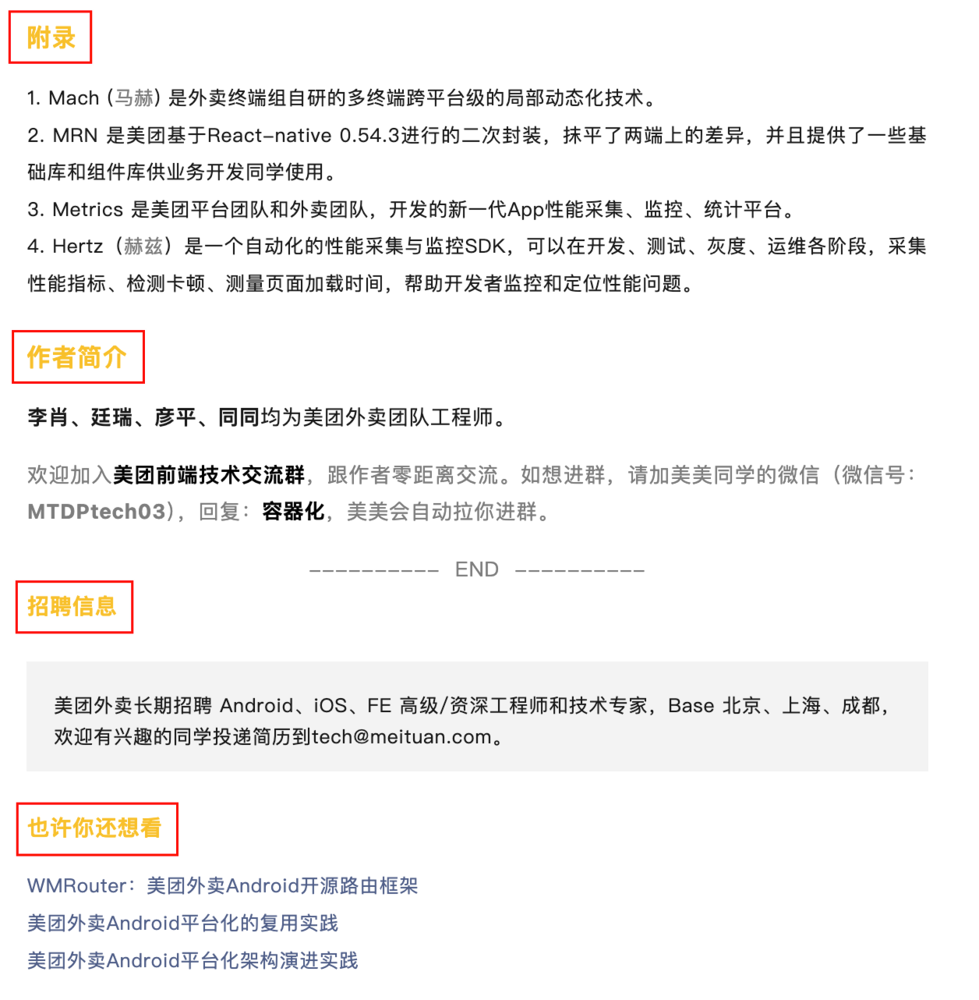

# 计算开源-外部知识分享账号-运营方案

## 一、账号定位

国内最前沿的开源知识分享平台，内容包括 AI 技术/开源文化/技术洞察。

目前账号定位为中立账号，不和华为昇腾强绑定，以“开源”相关知识作为核心竞争力。

## 二、整体方案

### 2.1 内容收集

按分类收集投稿：

- 技术分享类：科普类（介绍某种技术）/实践类（运用什么技术解决了什么问题？）；
- 开源文化类：开源社区运营/组织架构等开源相关知识分享；
- 开源洞察类：前沿资讯解读（如：PyTorch 大会/Nvidia 发布会等，发布了什么最新的技术/政策？对当下的技术发展有什么影响？）。

团队内的“天天向上”等分享会的内容可以作为技术分享类文章的内容来源。

后续怎么让大家持续有规律地参与到文章的写作中？

- 针对团队内部的人，以类似于“天天向上”的形式进行管理（排期），每个人分配主题，可以是与自己最近工作相关的技术实践，也可以是前沿技术的探索和分享；
- 针对其它团队的人，鼓励/吸引他们写文章投稿。

可以对写得好的进行激励，比如可以用一些开源社区的小礼品作为奖励，或者奖金？

### 2.2 内容整理

计算开源运营团队：

- 账号 logo 制作；
- 投稿收集/激励；
- 文章排版；
- 文章配图；
- 账号运营；
- ……

### 2.3 质量把控

如何保证发布文章的质量？

- 团队内部赋能，学习怎么写好一篇技术博客；
- 审核机制（初步设想）：安排几个人负责审稿，基本的问题提出 review 意见，让作者回去自己修改，修改后剩下的一些格式/配图相关的问题，由运营同学负责完善；
- 梳理写作标准参考文档，大家写的时候就尽量满足标准。

## 三、如何写好一篇技术分享类文章

### 3.1 写作思路

- 摘要（几句话说清楚本文的主要内容）
- 目录（optional）
- 背景（业务场景/问题和挑战）
- 设计方案（整体架构图/基本概念/核心功能/效果收益）
- 总结与展望
- 参考资料（附录）/相关文章（推荐阅读）/作者信息/Q & A

### 3.2 写作技巧

---

文章开头，给出摘要，简单介绍本文的主要内容，让读者能够快速识别出本文是不是自己当前想要了解的。

---

下一步可以介绍自己要展示的某种技术的背景/基本概念/架构。

介绍背景：某项技术的发展历程，有哪些 tradeoff？有什么挑战？过去的解决方案是什么？

> tips:
>
> - 配图可以像下面一样适当使用表情包以增加风趣；
> - 分点归纳总结，不要流水账。

也可以直接开门见山地介绍自己想分享的某项技术。使用架构图/流程图等可视化的方式，代替大段的文字描述，尽量使用图像+少量说明性文字的形式，简单明了地介绍清楚自己的内容。

---

介绍具体的实现过程/落地方案：尽量用图描述，原理是什么？用什么方法解决了什么样的问题？效果如何？

---

总结与展望：

- 总结：回顾本文内容，进行总结；
- 展望：还需要改进的地方有哪些？该技术未来的发展发向是什么？

---

其它：

- 参考资料（附录）：说明相关资料来源；
- 相关文章（推荐阅读）：增加账号上其它文章的阅读量和曝光度；
- 作者信息：增加作者的成就感，促进继续投稿，形成正循环；
- Q & A：解答常见疑问，问题可以来源于团队中其它成员，也可以是网上很多人问的；
- 招聘信息：给团队打个小广告。

---

个人经验：

- 用自己的话进行描述，不要生搬硬套别人的原文，更不要直接把英文翻译后的内容照搬，要保证基本的语义连贯和通顺，符合中文的阅读习惯（如果真的想尽可能地还原英文的本意，可以直接引用小段的英文原文，也不要自己没理解清楚瞎翻译）；
- 可以用自问自答的方式，引起读者的思考和继续向下阅读的欲望。在文章开头或中间提出一些问题，然后再进行解答。

其它 tips：

- 丰富的配图（每写几段话就配一张图），用图来解释概念/架构，可以适当使用表情包（增加风趣）；
- 篇幅（字数）适当；
- ……

---

### 3.3 参考文章

- [<u>美团外卖前端容器化演进实践</u>](https://mp.weixin.qq.com/s?__biz=MjM5NjQ5MTI5OA==&mid=2651751072&idx=1&sn=5b8d510f6b8ff2d06e8bc44606e12e00&chksm=bd125bed8a65d2fb8bcff8623a82fe06b667d2a75c5c6a32a2ce17d392d71dca97c973ed0aff&scene=21#wechat_redirect)
- [<u>大前端：如何突破动态化容器的天花板？</u>](https://mp.weixin.qq.com/s/ocGLvUmAnglZbcKRmK72Yg)
- [<u>作为开发者，我如何提高任务型大模型应用的响应性能</u>](https://mp.weixin.qq.com/s/_4s8HiRASW59V9S0YMRRww)
- [<u>HugeSCM - 基于云的下一代版本控制系统</u>](https://mp.weixin.qq.com/s/Q5pNC4N3Gh76LiJf-7cx7g)
- [<u>大模型加持下的Linux操作系统开发和自动化维护实践</u>](https://mp.weixin.qq.com/s/dlKd0Xzckk7Oy74dHiZFlQ)

## 四、如何写好一篇开源文化类文章

**_TODO_**

## 五、如何写好一篇开源洞察类文章

- 内容：归类整理大会内容，给出解读/总结（可以分享一些自己的所见所闻，对于业界最新发展的思考）；
- 形式：文字/PPT/现场照片。

> 参考：《KubeCon North America Salt Lake City 2024》
