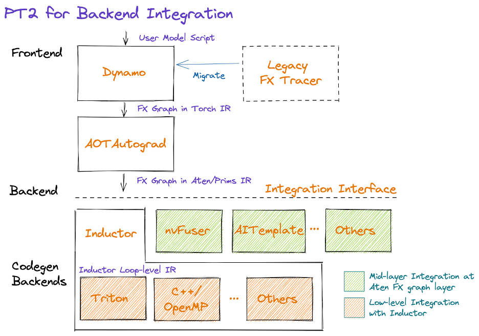

# TorchAir 学习笔记

**Eager Mode（单算子模式）：**

- 优点：立即执行并返回结果；易用、可调试；动态构建计算图（图的形状和大小可以在运行时改变）；
- 缺点：可能存在性能问题（host bound），每一次 OP 调用触发一次 python/C++ 相关处理（torch/torch-npu/CANN）。

**PyTorch 图模式演进：**

torch.jit -> lazy tensor -> **TorchDynamo**（PyTorch 2.0 正式集成，对外提供 `torch.compile` API，不光提供了成图能力，也同时发布了 Inductor 代码生成后端）

**`torch.compile` 底层原理：**

前端：

- 图定义：torch fx 定义了一种图结构表达，并且能够进行 python 代码生成；
- 图生成：TorchDynamo 解析 python 编译后的 PyCodeObject 字节码，并生成一张 fx 图（传给用户定义的 Compiler）；

后端：

- 图编译、图执行：TorchAir 是 `torch.compile` 里的一个后端，用来为昇腾提供图模式的能力。

**TorchAir 整体架构：**

- Converter：Aten IR -> Ascend IR；
- FX Interpreter：Ascend IR -> Ascend Graph；
- Graph Engine Adapter：调用 GE（Graph Engine）提供的接口进行图编译和图执行。

> Ascend IR：基于昇腾软件栈，对不同机器学习框架提供统一的 IR 接口，对接上层网络模型框架。
