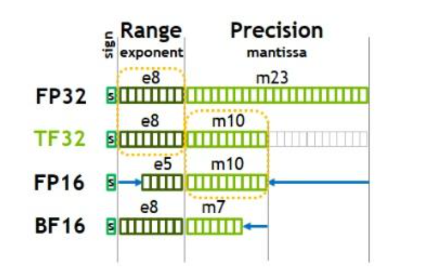
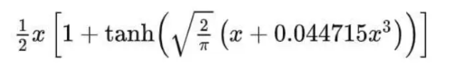
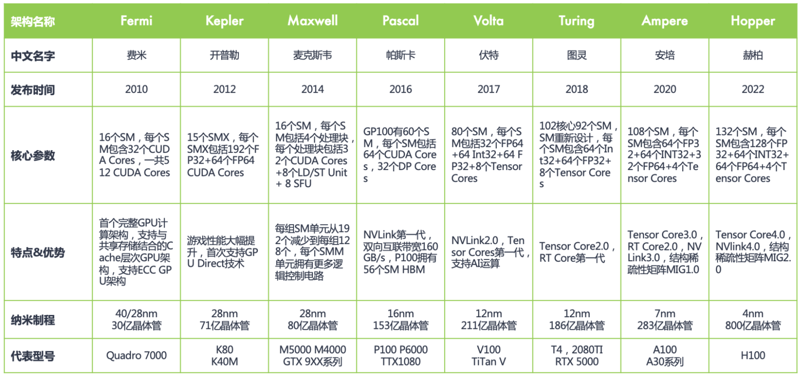

# CUDA 学习笔记

---

**学习资料：**

- 代码仓库：https://github.com/RussWong/CUDATutorial

---

## 01-02. hello world

```cpp
#include <stdio.h>
#include <cuda.h>
#include <cuda_runtime.h>

__global__ void hello_cuda() {
    // 泛指当前线程在所有block范围内的全局id
    unsigned int idx = blockIdx.x * blockDim.x + threadIdx.x;
    printf("block id = [ %d ], thread id = [ %d ] hello cuda\n", blockIdx.x, idx);
}

int main() {
    hello_cuda<<< 1, 1 >>>();
    cudaDeviceSynchronize();
    return 0;
}
```

`__global__`：CUDA kernel 函数前缀，被 CPU 调用，在 GPU 上执行。

`<<<1, 1>>>`：启动 CUDA kernel，参数含义：block 数量；每个 block 中的线程数量。

变量含义：

- `blockIdx.x`：block 的 ID；
- `blockDim.x`：block 内线程数量；
- `threadIdx.x`：block 内线程的 ID；

> 注意：`.x` 表示在 `x` 维度上，除此之外，还有 `y` 和 `z` 维度。

`cudaDeviceSynchronize()`：强制 CPU 等待 GPU 执行完成，即同步等待。

> 注意：`printf()` 是由 CPU 执行的。

## 03. 常用修饰符

- `__global__`：CUDA kernel 函数前缀，被 CPU 调用，在 GPU 上执行；
- `__host__`：由 CPU 调用并执行（无修饰时默认是 CPU 端函数）；
- `__device__`：由 GPU 调用并执行（由编译器 nvcc 确定是否 inline）；
- `__noinline__`：强制编译器不 inline；
- `__forceinline__`：强制编译器 inline。

## 04-05. CUDA 程序组成

- 由 `__global__` 修饰的 kernel 函数；
- main 函数，通过 `<<<..., ...>>>` 调用 kernel；
- 可选函数：`__host__` 和 `__device__`。

> 必备头文件：`<cuda.h>`、`<cuda_runtime.h>`。

示例程序：

```cpp
#include <stdio.h>
#include <cuda.h>
#include <cuda_runtime.h>

__global__ void sum(float *x)
{
    // 泛指当前block在所有block范围内的id
    int block_id = blockIdx.x;
    // 泛指当前线程在所有block范围内的全局id
    int global_tid = blockIdx.x * blockDim.x + threadIdx.x;
    // 泛指当前线程在其block内的id
    int local_tid = threadIdx.x;
    printf("current block=%d, thread id in current block =%d, global thread id=%d\n", block_id, local_tid, global_tid);
    x[global_tid] += 1;
}

int main() {
    int N = 32;
    int nbytes = N * sizeof(float);
    float *dx, *hx;

    /* allocate GPU mem */
    cudaMalloc((void **)&dx, nbytes); // TODO：思考为什么要用二级指针
    /* allocate CPU mem */
    hx = (float*) malloc(nbytes);

    /* init host data */
    printf("hx original: \n");
    for (int i = 0; i < N; i++) {
        hx[i] = i;
        printf("%g\n", hx[i]);
    }

    /* copy data to GPU */
    cudaMemcpy(dx, hx, nbytes, cudaMemcpyHostToDevice);

    /* launch GPU kernel */
    sum<<<1, N>>>(dx);

    /* copy data from GPU */
    cudaMemcpy(hx, dx, nbytes, cudaMemcpyDeviceToHost);

    printf("hx current: \n");
    for (int i = 0; i < N; i++) {
        printf("%g\n", hx[i]);
    }

    cudaFree(dx);
    free(hx);

    return 0;
}
```

## 06. 线程层次结构

- **Thread**：线程（硬件视角：CUDA Core）；
- **Warp**：32 个线程，是最基本的线程调度单位；
- **Block**：线程块，一组线程（硬件视角：Warps）；
- **Grid**：网格，一组线程块。

CUDA **SIMT（Single Instruction Multiple Thread）**：多个线程执行同一条指令（每个线程有自己独立的寄存器）。

> TODO：SIMT 和 SIMD 的区别？（面试常问）

## 07. 向量加法

## 08. CUDA runtime API

- `cudaMalloc()`
- `cudaMemcpy()`
- `cudaFree()`
- `cudaGetErrorString()`

## 09. kernel 计时

```cpp
int main()
{
    // ...

    cudaEvent_t start, stop;
    cudaEventCreate(&start);
    cudaEventCreate(&stop);
    cudaEventRecord(start);
    /* launch GPU kernel */
    vec_add<<<grid, bs>>>(dx, dy, dz, N);
    cudaEventRecord(stop);
    // 让 CPU 等待 stop 事件记录完成，确保后面使用 stop 计算时间时不会出现异常
    cudaEventSynchronize(stop);
    cudaEventElapsedTime(&milliseconds, start, stop);  
    
    // ...
}
```

## 10. main 函数编写流程

1. host 端申请内存并初始化数据；
2. device 端申请内存；
3. host 端数据拷贝到 device 端；
4. 计时开始；
5. 启动 kernel；
6. 计时结束；
7. device 端把结果拷贝回 host 端；
8. 对比 device 端计算结果和 host 端计算结果；
9. 释放 host 端内存和 device 端显存。

## 11. 向量化向量加法

CUDA 只支持向量化的读取和存储，但在实际计算时，还是只能一个个标量进行计算。

> `float4`：指针每偏移 1 位，在内存上移动 4 位（即每 4 个 float 数据为一个向量）。

## 12. GPU 硬件能力查询

```cpp
#include <cuda_runtime.h>
#include <cuda.h>
#include <iostream>
#include <string>

int main() {

  int deviceCount = 0;

  // 获取当前机器的GPU数量
  cudaError_t error_id = cudaGetDeviceCount(&deviceCount);
  if (deviceCount == 0) {
    printf("There are no available device(s) that support CUDA\n");
  } else {
    printf("Detected %d CUDA Capable device(s)\n", deviceCount);
  }

  for (int dev = 0; dev < deviceCount; ++dev) {
    cudaSetDevice(dev);
    // 初始化当前device的属性获取对象
    cudaDeviceProp deviceProp;
    cudaGetDeviceProperties(&deviceProp, dev);
    printf("\nDevice %d: \"%s\"\n", dev, deviceProp.name);

    // 显存容量
    printf("  Total amount of global memory:                 %.0f MBytes "
             "(%llu bytes)\n",
             static_cast<float>(deviceProp.totalGlobalMem / 1048576.0f),
             (unsigned long long)deviceProp.totalGlobalMem);

    // 时钟频率
    printf( "  GPU Max Clock rate:                            %.0f MHz (%0.2f "
        "GHz)\n",
        deviceProp.clockRate * 1e-3f, deviceProp.clockRate * 1e-6f);

    // L2 cache大小
    printf("  L2 Cache Size:                                 %d bytes\n",
             deviceProp.l2CacheSize);

    // high-frequent used
    // 注释见每个printf内的字符串
    printf("  Total amount of shared memory per block:       %zu bytes\n",
           deviceProp.sharedMemPerBlock);
    printf("  Total shared memory per multiprocessor:        %zu bytes\n",
           deviceProp.sharedMemPerMultiprocessor);
    printf("  Total number of registers available per block: %d\n",
           deviceProp.regsPerBlock);
    printf("  Warp size:                                     %d\n",
           deviceProp.warpSize);
    printf("  Maximum number of threads per multiprocessor:  %d\n",
           deviceProp.maxThreadsPerMultiProcessor);
    printf("  Maximum number of threads per block:           %d\n",
           deviceProp.maxThreadsPerBlock);
    printf("  Max dimension size of a block size (x,y,z): (%d, %d, %d)\n",
           deviceProp.maxThreadsDim[0], deviceProp.maxThreadsDim[1],
           deviceProp.maxThreadsDim[2]);
    printf("  Max dimension size of a grid size (x,y,z): (%d, %d, %d)\n",
           deviceProp.maxGridSize[0], deviceProp.maxGridSize[1],
           deviceProp.maxGridSize[2]);
  }

  return 0;
}
```

## 13. CPU 架构

**CPU 架构：**

- 运算器（ALU）；
- 控制器（Control）；
- 存储器：内存（DRAM）、缓存（Cache）。

**CPU 工作流程：**

1. 控制器从内存（用户进程中的代码段）提取指令，并放到指令寄存器；
2. 解码（指令译码）；
3. 执行（需要先从内存，从用户进程中的数据段，取数据）；
4. 写回（可选）。

**CPU 流水线：**

**级数？**——3 级流水线，即有 3 个过程（stage）。

CPU 的流水线级数越多，性能越好（最大吞吐越高），但级数不是越多越好。

级数过多的缺点：

- 电路单元更多，芯片面积 & 功耗增加；
- 未满载时，性能收益下降。

因此，应该综合考虑以寻得一个 tradeoff。

## 14. GPU 架构

**A100 GPU 架构：**

- 108 个 SM；
  - 每个 SM 有 4 个独立的区块，可以并行执行 4 组不同指令序列；
    - 每个区块有 4 个 Tensor Core（总共是 108 * 4 = 432 个）；
    - 每个区块有独立的 L0 指令缓存、Warp Scheduler、Dispatch Unit 等；
  - 每个 SM 中的 4 个区块共享 L1 指令缓存、数据缓存、Shared Memory 等；
- 6912 个 CUDA Core（即 INT32、FP32、FP64 单元）；
- ……

**CUDA 执行模型：**

kernel 启动 -> 分配 block 到 SM 上执行。

软件 -> 硬件：

- Thread -> CUDA Core
- Block（n）->（1）SM（即同一个 block 中的线程只能同时在一个 SM 上执行，而一个 SM 上可以同时执行多个 block）
- Grid -> 整个 device

> 注意：一个 Warp（32 个线程）中的线程只能同时被调度去执行某一条指令，但可以只有部分线程在执行（active thread），剩下的线程只能等待（不能去执行别的指令），直到其它线程执行完当前的指令。

## 15. GPU 存储层次结构

- **全局内存（Global）：**
  - 所有线程 + CPU；
  - 片外，访问慢；
  - 需要连续访问，减少内存事务。
- **共享内存（Shared）：**
  - 一个 block 中的线程；
  - 片上，访问快；
  - bankconflict：……（重要）
- **寄存器（Register）：**
  - 一个线程；
  - 片上，访问快；
  - spill：溢出的部分会放到 local memory 上，从而增加延迟。
- Local
- Constant
- Texture

## 16. CPU 和 GPU 架构的区别

GPU：

- 控制单元少 -> 不适合处理分支程序（if else）；
- Cache 少 -> 不适合处理数据分散的程序；
- 核心数量多 -> 不适合处理计算分散的程序；
- 核心频率低 -> 不适合处理计算量小的程序；
- 标量运算处理器 -> 不支持向量化计算，但支持向量化存取（load & store）。

## 17. 算子类型总结

**入门学习：**

- **Reduce**（规约）：softmax
- **Elementwise**（加法）：gelu、copy_if
- **Fused**（融合算子）：MatmulAndBiasAndRelu

**进阶学习：**

- **Gemm**（现在一般是直接调库，各种形状的性能已经优化得比较好了）：matmul
- **坐标变换**：concat、transpose
- **Sliding Window**：conv2d、conv3d、maxpool
- **Scan**：prefixsum、cumsum
- **Sort**：mergesort

## 18-25. Reduce 算子实现（面试高频）

Reduce：对 N 个数据做累计的算术操作（如：总和、最大值、最小值、均值等）。

### baseline

CPU 方式（单线程）+ for 循环。

### reduce_sum kernel V0

求一个 block 内的局部和。

> 注意：每个 block 中都有属于自己的 shared memory。

### reduce_sum kernel V1

除余（%）和除法（/）在任何硬件上都是一个比较耗时的操作 -> 转换为位运算

> CUDA 编译流程：cuda -> ptx -> sass -> cubin。

### reduce_sum kernel V2

**shared memory bank conflict**：一个 warp 的多个线程访问同一个 bank 的不同字段（同一列，不同行）时，这些线程只能串行执行，从而会造成性能下降。

> 注意：一个 bank 的大小为 4 字节，一块 shared memory 中有 32 个 bank。

bank conflict 解决方法：

- 对于 Reduce 场景，对半相加（方案较固定）；
- Padding 数据（仅限于 shared memory 为 2 维的场景）；
- Permute（较难）。

### reduce_sum kernel V3

相比于 V2，让空闲线程也干活。

### reduce_sum kernel V4

`__syncthreads()`（同步一个 block 内的所有线程）-> `__syncwarp()`（开销更小）。

展开最后一个迭代的 for 循环，单独去做 reduce，只在 warp 内同步。

### reduce_sum kernel V5

完全展开 for 循环，省掉 for 循环中的判断和加法指令。

省掉了 for 循环中的判断和位运算，指令减少了，因此性能就提升了。

### reduce_sum kernel V6

对所有 Block 做 reduce。

当总线程数 < 总数据量时，每个线程以 gridSize * blockSize 为步长循环读取数据。

Debug 方法：将 block 数量和 block 大小都设为 1，此时只有一个线程在工作（串行执行），便于排查问题。

## 26-27. Warp-level 编程

**在 Warp 层面进行编程的好处：**

- 可以省去 `__syncthreads()` 的开销，只需在 Warp 内同步线程；
- 更高的通信带宽（计算更快）；
- divergence-free across warps (?)

在 Warp 内，各个线程间的寄存器可以相互访问（在 block 中，只能去访问 shared memory）。

**Warp-level primitive fuction：**

- [Warp Vote Functions](https://docs.nvidia.com/cuda/cuda-c-programming-guide/index.html#warp-vote-functions)
- [Warp Match Functions](https://docs.nvidia.com/cuda/cuda-c-programming-guide/index.html#warp-match-functions)
- [Warp Reduce Functions](https://docs.nvidia.com/cuda/cuda-c-programming-guide/index.html#warp-reduce-functions)
- [Warp Shuffle Functions](https://docs.nvidia.com/cuda/cuda-c-programming-guide/index.html#warp-shuffle-functions)

使用 Warp-level primitive fuction 时，不需要手动进行线程间同步，它们会自动保证线程间执行顺序的正确性。

**常用 Warp function：**

- `__shfl_sync(mask, var, srcLane, width=warpSize)`：（被 `mask` 指定的）线程返回 srcLane 号线程中 var 变量的值（即将 srcLane 线程的 var 变量值广播给其它线程）；
- `__shfl_down_sync(mask, var, delta, width=warpSize)`：返回（被 `mask` 指定的）线程向后偏移 `delta` 个位置的线程中 `var` 变量的值；
- `__shfl_up_sync(mask, var, delta, width=warpSize)`：效果与上面相反；
- `__ballot_sync(mask, predicate)`：（被 `mask` 指定的）满足 predicate 判断条件的线程返回 bit 0，反之返回 bit 1，最后返回一个 32 位无符号整数；
- `__activemask()`：返回 32 位掩码，当前 warp 内活跃的线程对应 id 置 1，反之置 0；
- `__popc()`：返回当前 warp 中 mask 为 1 的数量；
- `__lanemask_lt()`：返回 32 位掩码，当前 warp 中小于当前线程 id 的线程对应 bit 位置 1，反之置 0。

**使用 warp level reduce 不一定比 block level reduce 快，为什么？**

因为每个 Warp 只能处理 32 个数据，当数据量很大时，需要启动很多个 Warp 去做 reduce，可能还不如直接启动一个大的 block 去做处理，开销可能反而会更小。因此，是否使用 warp level reduce 需要根据数据量做一个 tradeoff。

## 28-29. Histogram

使用原子操作，解决多线程间的访问竞争。

使用 `atomicXxx()` 可以保证当不同线程之间存在竞争时能够串行执行，但不保证不同线程执行的顺序。

## 30. copy_if kernel

用到的 warp primitive 说明：

- `__activemask()`：返回 32 位掩码，当前 warp 内活跃的线程对应 id 置 1，反之置 0；
- `__ffs(mask)`：ffs 即 find first set，是 CUDA 的内置函数，用于查找一个整数的第一个置位（即值为 1 的位）的位置，从最低位开始搜索（从 1 开始计数，因此要减 1 后才是对应的 tid）；
- `__popc(mask)`：与 ffs 类似，计算 mask 中置位的数量；
- `__shfl_sync(mask, var, srcLane, width=warpSize)`：被 `mask` 指定的线程返回 srcLane 号线程中 var 变量的值（即将 srcLane 线程的 var 变量值广播到其它 mask 线程的 var 变量中）。

## 31. 数据类型



各个数据段的含义：

- **Sign**：符号位，为 1 表示正数，为 0 表示负数；
- **Range**：指数位，表示数据的大小（整数部分）；
- **Precision**：小数位，表示数据的精度。

## 32-33. FP16 GELU 算子

GELU 常用于 Transformers MLP 中的激活函数。

**GELU 计算公式：**



**element-wise**：每个输入 X 都进行相同的计算，并且相互独立、互不干扰。

所有的 element-wise 算子都是访存密集型算子。

**访存密集型算子：**

```
计算/访存 < 算力/显存带宽
```

反之，则为**计算密集型算子**，包括：矩阵乘法、卷积，其优化手段比较 tricky。

访存密集型算子的优化思路：

- **访存角度**：向量化 load 和 store；利用 shared memory；
- **计算角度**：提高并行度，根据 GPU 资源分配尽可能多的 block。

在 NV 中，FP16 叫做 `half`。

在 CUDA 中，最多可以向量化加载 **128 bit** 的数据。当使用 FP16（16 bit）时，最多可以向量化加载 128/16=8 个数据。

> To use these functions, include the header file `cuda_fp16.h` in your program. All of the functions defined here are available in device code.
>
> - struct `__half`: This structure implements the datatype for storing half-precision floating-point numbers. The structure implements assignment, arithmetic and comparison operators, and type conversions. 16 bits are being used in total: 1 sign bit, 5 bits for the exponent, and the significand is being stored in 10 bits. The total precision is 11 bits.
> - struct `__half2`: This structure implements the datatype for storing two half-precision floating-point numbers.

参考资料：[Half Precision Intrinsics](https://docs.nvidia.com/cuda/cuda-math-api/cuda_math_api/group__CUDA__MATH__INTRINSIC__HALF.html)

## 34. MaskScaleAndElemwiseAdd 融合算子

> 思考：为什么算子融合的时候不将所有算子融合在一起？
>
> 1. 全部融合起来技术难度很大，几乎不可能实现；
> 2. 不够通用，费劲这这么大，结果算子只能用在这个模型上，并不是所有模型都长一样。
>
> 评论：实现个 flash-attention 都引起了这么大轰动，别说整个 transformer 了，如果真的能广泛应用，业界早就炸了。

## 35-36. Softmax 算子

```
(zi - M)
M = max(zi)
```

**M 的作用**：使所有输入的范围都 **<= 0**，防止输入取指数后值过大，超出了 float 的范围（溢出），从而导致结果错误。

**计算步骤拆解（相当于是一个融合算子）：**

1. reduce_max：求 M
2. exp
3. reduce_sum：求分母
4. div

**实现要点**：Vector/Thread/Warp level reduce（定义好每个线程的寄存器用量）。

## 37. 实测显存带宽

**带宽**：每秒可以读/写多少数据量的显存（GB/s）。

“关闭” GPU 缓存（L2 Cache，一般 <= 40 M）：Warm up 操作。

## 38. GPU 优化手段总结

**计算优化：**

- 充分利用 GPU 计算资源，分配尽可能多的 block，让更多的 thread/warp 在工作；
- 使用位运算或乘法代替耗时的除法指令；
- 尽可能避免 warp divergence；
- 尽可能少用 `__syncthreads()`；
- 尽可能少用 global 的 atomics 操作，转为使用 shared/warp aggregated atomics；
- 尽可能多用 warp primitive function；
- ……

**访存优化：**

- 合并访问：连续读取 global memory；
- 对齐访问：被访问数据的起始地址是数据类型的整数倍；
- 将数据搬移到 shared memory 减少访存延迟（注意消除 bank conflict）；
- 尽可能复用在寄存器上做计算而得的结果，减少对 global memory 或 shared memory 的读写；
- 向量化 load & store；
- ……

## 39. 课后练习

- [ ] 实现 concat 算子
- [ ] 实现 index_select 算子（embedding）
- [ ] 实现 im2col 算子（卷积 -> 矩阵乘）
- [ ] 实现 batch_norm 算子
- [ ] 实现“快速排序”算子
- [ ] 实现 matmul 算子

## 40. GPU Warp 调度逻辑

**为什么同一个 block 中的线程只能在一个 SM 上运行？**

因为，每个 SM 中都有一块供多个分区共享的 shared memory，如果同一个 block 中的线程能够跨 SM 执行，那么在硬件和算法的设计上会更有难度。

**Warp 发射的基本逻辑和要求：**

一个 Warp 经由 Warp Scheduler 发射需要满足：

- **依赖关系**：数据、指令都已经准备好；
- **资源需求**：寄存器、共享内存等有足够的空间；
- **功能单元**（INT32/FP32/TENSOR CORES）、**dispatch port** 有限，当它们处于空闲状态时才可以发射，否则需要排队等待。

> SFU：特殊函数单元，用于处理 sin/cos/tan 等计算。

## 41. 实测峰值算力（TODO）

……

## 42. 线程分配

**维度考虑：**

一般来说（根据先验知识），给一个 block 分配 **256/512** 个线程的时候，性能会比较好。

- Reduce（一维输入）：……；
- Softmax/Matmul（二维输入）：一个 warp/block 循环处理一行（x），在列（y）上分配多个 block；
- 卷积/Batchnorm（四维输入，NCHW）：N -> z, C -> y, HW -> x。

**数量考虑：**

一般先根据先验知识设置 block 数量或 thread 数量中的一个，再计算另一个。

**block 数量：可以根据输入数据的外层维度进行分配。**

- 一维输入：
  - 先确定 block 数量：**2～4 * SMcount**（SM 数量）；
  - 先确定 thread 数量：min(ceil(总数据量/thread 数量), max_block_nums)；
- 二维输入：和一维类似，先确定 x 维度的数量，再计算 y 维度的数量。

**thread 数量：可以根据输入数据的内层维度进行分配。**

- 一维输入：
  - 先确定 thread 数量：一般为 **128/256/512**（同时也需要考虑数据量），一般是 2 的倍数；
  - 先确定 block 数量：min(round2power2(ceil(总数据量/thread 数量)), max_thread_nums)；
- 二维输入：和一维类似，先确定 x 维度的数量，再计算 y 维度的数量。

## 43. 占有率

**占有率（occupancy）**：主要用于衡量 GPU SM 的计算利用率，与每个线程使用的寄存器数量和 shared memory 大小有关。

```
occupancy = active warp(thread) / total warp(thread)
```

occupancy 越接近 1 越好（利用率越高），一般只有 matmul/convolution 这种算子的 occupancy 才会比较低。

## 44. cudaStream 基本概念

**cudaStream**：CPU 提交 CUDA kernel 到 stream（队列），GPU 从 stream 队列中顺序启动与执行。

**四种并行：**

- CPU 上的函数和 GPU 上的 kernel 并行；
- CPU 上的函数和 CPU 到 GPU 的数据传输并行（`cudaMemCpyAsync()`）；
- CPU 到 GPU 的数据传输和 GPU 上的 kernel 并行；
- GPU 上的多个 kernel 并行（必须互相独立、互不依赖）。

启动 kernel 时指定 stream：

```cpp
kernel<<<gridSize, blockSize, smemSize, streamId>>>();
```

**cudaStream 分为两种：**

- 默认流（同步流）：
  - 其它 stream 上的操作没结束，默认流不会开始；
  - 其它 stream 开始执行之前，默认流必须先完成。
- 非默认流

**总结：默认流启动时，同一时刻只有这一个 stream 在执行。**

CUDA runtime **同步** API：

- `cudaMemcpy()`
- `cudaDeviceSynchronize()`：CPU 等待整个 GPU 上的操作执行完成；
- `cudaStreamSynchronize()`：CPU 等待 GPU 上的某个 stream 执行完成；
- `cudaEventSynchronize()`：CPU 等待 GPU 上的某个 event 执行完成；
- `cudaStreamWaitEvent()`：某个 stream 等待某个 event 执行完成；
- `cudaMalloc()`
- `cudaMallocHost()`：在 CPU 上分配 Pinned Memory（页锁定内存），使用 `cudaFreeHost()` 释放；
- `cudaMemset()`：在 GPU 显存上快速初始化或填充指定值。

CUDA runtime **异步** API：

- `cudaMemCpyAsync()`

> **CPU Pinned Memory**：这种内存也称为“固定内存”，它的特点是不会被操作系统换出到磁盘（确保物理地址固定），从而可以通过 DMA（直接内存访问）加速与设备（Device）之间的数据传输，提高数据拷贝的效率。

## 45-46. cudaStream Schedule

**实现异步的前提条件：**

- CUDA kernel 和 `cudaMemCpyAsync()` 必须都在非默认流上；
- `cudaMallocHost()` 分配的内存必须为 pinned memory。

**为什么要用 pinned memory？**

- **正确性**：`malloc()` 分配的内存为 pageable memory，对于 host 操作，系统可能会动这块内存，造成异步 copy 到 GPU 的数据不正确；
- **高性能**：对于 host 操作，系统不能动 pinned memory，该内存始终驻留在 physical memory，可以通过 DMA（直接内存访问）在 host 和 GPU 之间 copy 数据，速度更快；并且省去了临时 buffer 的创建和销毁，以及 pageable memory 到临时 buffer 的拷贝。

**多种 overlap：**

- 数据传输和 kernel 执行 overlap；
- kernel 之间并发执行。

**Stream 性能收益影响因素：**

- 存储资源（寄存器、共享内存）；
- 计算资源（CUDA CORE）；
- Issue Order（不同任务的发射顺序，入队顺序）。

**Stream 调度规则：**

分为 **kernel engine** 和 **copy engine**（又分为 **H2D** 和 **D2H**），总共是 3 个 Queue。

1. 提交 CUDA 操作（`cudaXxx()` 和 kernel）时，按照 issue 顺序分发到对应的 engine（queue）；
2. GPU 从 engine 中获取并 launch CUDA 操作：
   - CUDA 操作 launch 条件：
     - **同一 stream 之前的操作都已完成**；
     - **同一 queue 之前的操作都已 launch**；
     - **当前时刻 GPU 资源充足**。
   - 不同 stream 的 kernel 在资源充足的情况下会并发/并行执行。

> 相关 paper：《Nimble: Lightweight and Parrallel GPU Task Scheduling for Deep Learning》。

## 47-48. quantize 算子

量化算子：将输入的 FP32 数据量化为 INT8 数据。

**计算步骤：**

1. **计算 per tensor/channel 的 max 和 min**：使用 reduce kernel，利用 shared memory 进行优化；
2. **计算 scale 和 zeropoint**：标量计算，只需要启动一个线程；
3. **将 scale 和 zeropoint 带入量化公式得到每个元素的 INT8 输出**：是 element-wise 的 kernel。

## 49. CUDA 算子调试技巧

- 确保 CPU 的计算结果（baseline）一定要正确；
- 打印重要信息；
- 将并行改为串行，即将 grid_size 和 block_size 都设为 1（单线程执行）。

## 50-53. GEMV 算子

**GEMV**：矩阵向量乘法。

- **Row major**：横着访问时，缓存命中率更高；
- **Col major**：竖着访问时，缓存命中率更高。

> Q：缓存连续性？

---

**TODO：**

- 37 课：实测显存带宽（练习）
- 41 课：实测峰值算力（看视频）
- 48 课：Quantize 算子练习
- 53 课：GEMV 算子练习

**Next：**

51/53

gemv / dropout / NCU 性能分析

老师可不可以出个视频讲下cublas、cudnn、cutlass相关的知识和应用？[呲牙]

---

## 附录

### GPU 架构发展历程


