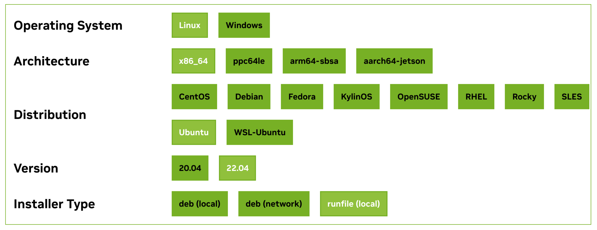

# 开发环境搭建

## NPU 环境配置

### 系统基本配置

`vim ~/.bashrc`：

```bash
# vllm:
export VLLM_USE_V1=1
export VLLM_WORKER_MULTIPROC_METHOD=spawn
export VLLM_USE_MODELSCOPE=True
# pytorch:
export PYTORCH_NPU_ALLOC_CONF=max_split_size_mb:256
# huggingface:
export HF_ENDPOINT=https://hf-mirror.com

# cann:
source /home/sss/Ascend/ascend-toolkit/set_env.sh
source /home/sss/Ascend/nnal/atb/set_env.sh
```

`vim ~/.gitconfig`:

```bash
[user]
        email = 467638484@qq.com
        name = shen-shanshan
[alias]
        pr = "!f() { git fetch -fu ${2:-$(git remote |grep ^upstream || echo origin)} refs/pull/$1/head:pr/$1 && git checkout pr/$1; }; f"
        sync = "!f() { git fetch upstream && git rebase upstream/main; }; f"
        nb = "!f() { git fetch upstream && git checkout -b $1 upstream/main && git branch; }; f"
        db = "!f() { git branch -D $1 && git branch; }; f"
        cb = "!f() { git checkout $1 ; }; f"
# 检查配置：git config --list
```

`vim ~/.pip/pip.conf`:

```bash
[global]
        index-url = https://pypi.tuna.tsinghua.edu.cn/simple
[install]
        trusted-host = https://pypi.tuna.tsinghua.edu.cn
```

`vim ~/.vimrc`：

```bash
set number
```

配置 github ssh 密钥：

```bash
# 安装 sudo
apt-get update
apt-get install sudo

# 若未安装 ssh-keygen：
sudo apt update
sudo apt install openssh-client -y

ssh-keygen -t ed25519 -C "467638484@qq.com"
eval "$(ssh-agent -s)"
ssh-add ~/.ssh/id_ed25519
cat ~/.ssh/id_ed25519.pub  # Add it to your github
# ssh-ed25519 AAAAC3NzaC1lZDI1NTE5AAAAILGL/Ax0Xd252ub/V0N2y96RdNnpm+7nWSY2jbiqUvTT 467638484@qq.com
```

参考资料：

- https://docs.github.com/en/authentication/connecting-to-github-with-ssh/generating-a-new-ssh-key-and-adding-it-to-the-ssh-agent
- https://docs.github.com/en/authentication/connecting-to-github-with-ssh/adding-a-new-ssh-key-to-your-github-account

### 安装 miniconda

```bash
# 查看操作系统：
# uname -i 或者 -r 或者 -a

wget https://repo.anaconda.com/miniconda/Miniconda3-latest-Linux-aarch64.sh
bash Miniconda3-latest-Linux-aarch64.sh

conda create -n vllm python=3.10 -y
conda activate vllm
```

### 安装 CANN

```bash
# Install required python packages.
pip3 install -i https://pypi.tuna.tsinghua.edu.cn/simple attrs 'numpy<2.0.0' decorator sympy cffi pyyaml pathlib2 psutil protobuf scipy requests absl-py wheel typing_extensions

# Download and install the CANN package.
wget --header="Referer: https://www.hiascend.com/" https://ascend-repo.obs.cn-east-2.myhuaweicloud.com/CANN/CANN%208.1.RC1/Ascend-cann-toolkit_8.1.RC1_linux-"$(uname -i)".run
chmod +x ./Ascend-cann-toolkit_8.1.RC1_linux-"$(uname -i)".run
./Ascend-cann-toolkit_8.1.RC1_linux-"$(uname -i)".run --full

source /usr/local/Ascend/ascend-toolkit/set_env.sh
source /home/sss/Ascend/ascend-toolkit/set_env.sh

wget --header="Referer: https://www.hiascend.com/" https://ascend-repo.obs.cn-east-2.myhuaweicloud.com/CANN/CANN%208.1.RC1/Ascend-cann-kernels-910b_8.1.RC1_linux-"$(uname -i)".run
chmod +x ./Ascend-cann-kernels-910b_8.1.RC1_linux-"$(uname -i)".run
./Ascend-cann-kernels-910b_8.1.RC1_linux-"$(uname -i)".run --install

wget --header="Referer: https://www.hiascend.com/" https://ascend-repo.obs.cn-east-2.myhuaweicloud.com/CANN/CANN%208.1.RC1/Ascend-cann-nnal_8.1.RC1_linux-"$(uname -i)".run
chmod +x ./Ascend-cann-nnal_8.1.RC1_linux-"$(uname -i)".run
./Ascend-cann-nnal_8.1.RC1_linux-"$(uname -i)".run --install

source /usr/local/Ascend/nnal/atb/set_env.sh
source /home/sss/Ascend/nnal/atb/set_env.sh

# 查看 cann 环境：
cat /home/sss/Ascend/ascend-toolkit/latest/aarch64-linux/ascend_toolkit_install.info
```

Install CANN `8.3.RC1.alpha003`:

```bash
wget --header="Referer: https://www.hiascend.com/" https://ascend-repo.obs.cn-east-2.myhuaweicloud.com/Milan-ASL/Milan-ASL%20V100R001C23B800TP024/Ascend-cann-toolkit_8.3.RC1.alpha003_linux-aarch64.run
chmod +x Ascend-cann-toolkit_8.3.RC1.alpha003_linux-aarch64.run
./Ascend-cann-toolkit_8.3.RC1.alpha003_linux-aarch64.run --full

source /usr/local/Ascend/ascend-toolkit/set_env.sh

wget --header="Referer: https://www.hiascend.com/" https://ascend-repo.obs.cn-east-2.myhuaweicloud.com/Milan-ASL/Milan-ASL%20V100R001C23B800TP024/Ascend-cann-kernels-910b_8.3.RC1.alpha003_linux-aarch64.run
chmod +x ./Ascend-cann-kernels-910b_8.3.RC1.alpha003_linux-aarch64.run
./Ascend-cann-kernels-910b_8.3.RC1.alpha003_linux-aarch64.run --install

wget --header="Referer: https://www.hiascend.com/" https://ascend-repo.obs.cn-east-2.myhuaweicloud.com/Milan-ASL/Milan-ASL%20V100R001C23B800TP024/Ascend-cann-nnal_8.3.RC1.alpha003_linux-aarch64.run
chmod +x ./Ascend-cann-nnal_8.3.RC1.alpha003_linux-aarch64.run
./Ascend-cann-nnal_8.3.RC1.alpha003_linux-aarch64.run --install

source /usr/local/Ascend/nnal/atb/set_env.sh

cat /usr/local/Ascend/ascend-toolkit/latest/aarch64-linux/ascend_toolkit_install.info
```

### 安装 vllm & vllm-ascend

```bash
mkdir github
cd github

# Install vLLM
git clone git@github.com:shen-shanshan/vllm.git
# git clone git@github.com:vllm-project/vllm.git
cd vllm
git remote add upstream git@github.com:vllm-project/vllm.git
VLLM_TARGET_DEVICE=empty pip install -v -e .
cd ..

# Install vLLM Ascend
# disable build custom ops
# export COMPILE_CUSTOM_KERNELS=0
git clone git@github.com:shen-shanshan/vllm-ascend.git
cd vllm-ascend
git remote add upstream git@github.com:vllm-project/vllm-ascend.git
git fetch upstream
export PIP_EXTRA_INDEX_URL=https://mirrors.huaweicloud.com/ascend/repos/pypi
pip install -v -e .
cd ..
```

## GPU 环境配置

### 安装 CUDA

查看 GPU 驱动信息：

```bash
nvidia-smi

Sat Jun 28 01:36:08 2025       
+---------------------------------------------------------------------------------------+
| NVIDIA-SMI 535.216.03             Driver Version: 535.216.03   CUDA Version: 12.2     |
|-----------------------------------------+----------------------+----------------------+
| GPU  Name                 Persistence-M | Bus-Id        Disp.A | Volatile Uncorr. ECC |
| Fan  Temp   Perf          Pwr:Usage/Cap |         Memory-Usage | GPU-Util  Compute M. |
|                                         |                      |               MIG M. |
|=========================================+======================+======================|
|   0  Tesla T4                       Off | 00000000:00:0D.0 Off |                    0 |
| N/A   31C    P8              15W /  70W |      0MiB / 15360MiB |      0%      Default |
|                                         |                      |                  N/A |
+-----------------------------------------+----------------------+----------------------+
                                                                                         
+---------------------------------------------------------------------------------------+
| Processes:                                                                            |
|  GPU   GI   CI        PID   Type   Process name                            GPU Memory |
|        ID   ID                                                             Usage      |
|=======================================================================================|
|  No running processes found                                                           |
+---------------------------------------------------------------------------------------+
```

我们安装的 CUDA 版本必须 <= 12.2。

下载 [CUDA Toolkit](https://developer.nvidia.com/cuda-toolkit-archive)：



```bash
cd ~
mkdir cuda
cd cuda
wget https://developer.download.nvidia.com/compute/cuda/12.2.0/local_installers/cuda_12.2.0_535.54.03_linux.run
sudo sh cuda_12.2.0_535.54.03_linux.run

# 默认安装到了 /usr/local/cuda-12.2/，这里我移动到了自己的家目录下
cd ~
mkdir cuda-12.2
sudo mv /usr/local/cuda-12.2/* ~/cuda-12.2/
```

如果你尚未安装驱动，可以顺便一起安装了。摁一下空格取消 Driver 安装，直接选择 Install 安装。

配置环境变量：

```bash
vim ~/.bashrc

# 配置以下环境变量
export CUDA_HOME=/home/sss/cuda-12.2
export PATH=$PATH:$CUDA_HOME/bin
export LD_LIBRARY_PATH=$LD_LIBRARY_PATH:$CUDA_HOME/lib64
# export LD_LIBRARY_PATH=$LD_LIBRARY_PATH:$CUDA_HOME/extras/CUPTI/lib64
# 保存退出

# 使配置生效
source ~/.bashrc
```

验证安装是否成功：

```bash
nvcc --version

nvcc: NVIDIA (R) Cuda compiler driver
Copyright (c) 2005-2023 NVIDIA Corporation
Built on Tue_Jun_13_19:16:58_PDT_2023
Cuda compilation tools, release 12.2, V12.2.91
Build cuda_12.2.r12.2/compiler.32965470_0
```

### 安装问题

```bash
unsupported GNU version! gcc versions later than 12 are not supported! The nvcc flag '-allow-unsupported-compiler' can be used to override this version check; however, using an unsupported host compiler may cause compilation failure or incorrect run time execution. Use at your own risk.
```

解决：安装低版本的 gcc。

```bash
sudo apt remove gcc -y
sudo apt-get install gcc-11 g++-11 -y
sudo ln -s /usr/bin/gcc-11 /usr/bin/gcc
sudo ln -s /usr/bin/g++-11 /usr/bin/g++
sudo ln -s /usr/bin/gcc-11 /usr/bin/cc
sudo ln -s /usr/bin/g++-11 /usr/bin/c++
gcc --version
```

### 参考资料

- [Ubuntu 系统如何安装 CUDA 保姆级教程](https://blog.csdn.net/Sihang_Xie/article/details/127347139)
- [CUDA Toolkit Archive](https://developer.nvidia.com/cuda-toolkit-archive)
- [CUDA Installation Guide for Linux](https://docs.nvidia.com/cuda/cuda-installation-guide-linux/index.html)
