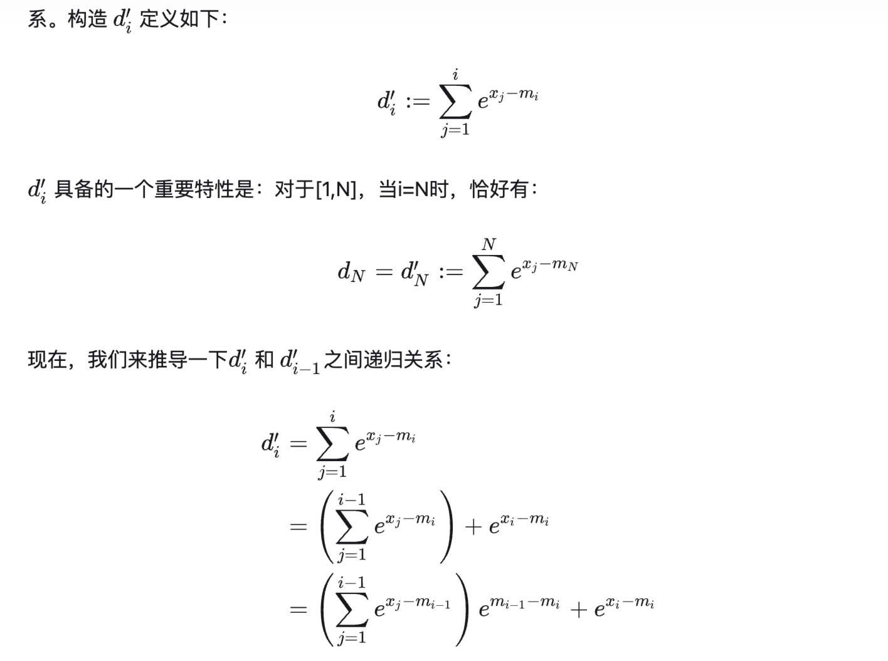
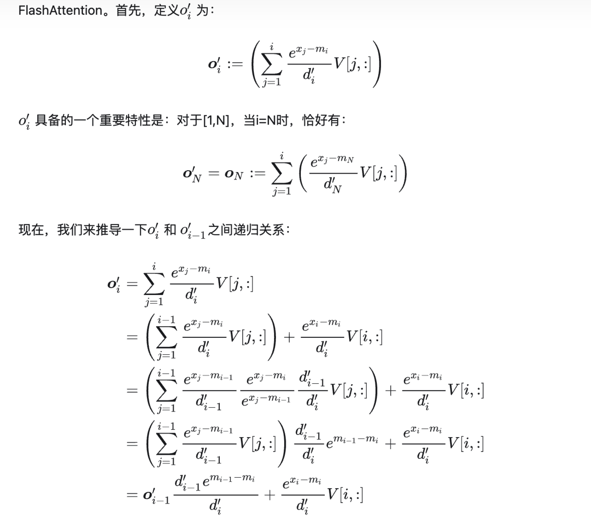

# FlashAttention

## Attention 计算方式演进历程

- Standard Self-Attention (3-pass)
- safe-softmax (3-pass)
- online-softmax (2-pass)
- FlashAttention (1-pass)

## Safe Softmax

需要对 `[1, N]` 重复遍历 3 次：

1. 找每个位置中 `Q*K^T` 的最大值；
2. 累加每个位置，得到分母；
3. 每个位置依次除以分母。

## Online Softmax

将 1 和 2 放到同一个 `[1, N]` 的循环中，从 3-pass 优化为了 2-pass。

## FlashAttention V1

将 1、2 和 3 放到同一个 `[1, N]` 的循环中，从 2-pass 优化为了 1-pass。

## FlashAttention V2

FlashAttention-2 对比 FlashAttention-1，主要是做了一些工程上的优化：

- 减少大量非 matmul 的冗余计算，增加 Tensor Cores 运算比例；
- forward pass / backward pass 均增加 seqlen 维度的并行，forward pass 交替 Q/K/V 循环顺序；
- 更好的 Warp Partitioning 策略，避免 Split-K。

## FlashAttention V3

FP16 比 FA2 更快，支持 Hopper FP8。

## 参考资料

- [<u>【原理篇】从Online-Softmax到FlashAttention V1/V2/V3</u>](https://zhuanlan.zhihu.com/p/668888063?utm_psn=1750869971390193665)
- [<u>【手撕LLM-Flash Attention】从softmax说起，保姆级超长文！！</u>](https://zhuanlan.zhihu.com/p/663932651)
- [<u>【手撕LLM-FlashAttention2】只因For循环优化的太美</u>](https://zhuanlan.zhihu.com/p/670085985)
