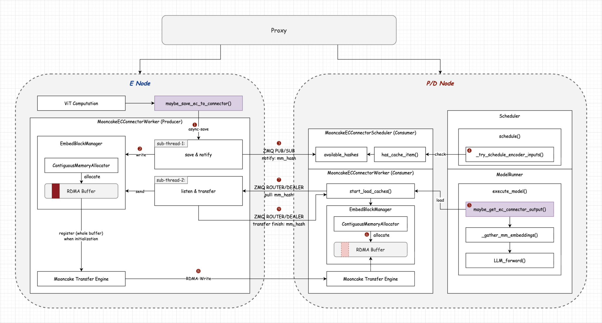
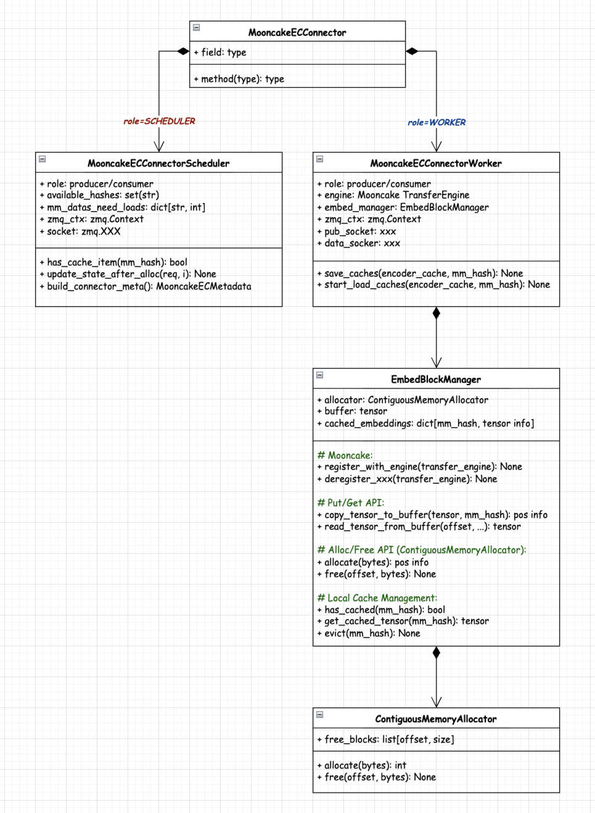

# Support Mooncake Based ECConnector for EPD

## Motivation

vLLM's **EPD (Encoder-Prefill-Decode)** disaggregation feature allows running vision encoders on separate instances from the language model prefill/decode stages. This enables independent scaling, lower TTFT for text-only requests, and cross-process reuse of encoder outputs.

The current EPD implementation uses `ECExampleConnector`, a file-based connector suitable for debugging and experimentation. For production deployments, we need a high-performance connector that supports multiple network transports (TCP, RDMA, SHM/NVLink).

`MooncakeECConnector` addresses this by leveraging the Mooncake TransferEngine, which provides a unified API across multiple transport backends.

**Key Challenge:**

Unlike KV Cache transfer (where block memory is pre-allocated at fixed addresses), encoder cache tensors are dynamically allocated with variable sizes. Each multimodal input produces an encoder output of different dimensions depending on image resolution, model architecture, etc. Mooncake's TransferEngine requires pre-registered memory for efficient transfers, so we introduce an `EmbedBlockManager` with a pre-registered GPU buffer.

**Related Discussions:**

- https://github.com/vllm-project/vllm/pull/33714#issuecomment-3882716972
- https://github.com/vllm-project/vllm-omni/issues/62#issuecomment-3559401280

**Related Works:**

- EPD of SGLang has supported mooncake transfer engine as encoder transfer backend: https://github.com/sgl-project/sglang/pull/12263
- EPD of SGLang has supported mooncake store as global encoder cache (EC pool): https://github.com/sgl-project/sglang/pull/16137
- vLLM-Omni has supported mooncake store as EC/KV data system: https://github.com/vllm-project/vllm-omni/issues/62
- vLLM-Omni has supported mooncake transfer engine as RDMA connector: https://github.com/vllm-project/vllm-omni/issues/955

## Proposed Change

### System Architecture



> [!NOTE]
> Find more details at the [design doc](https://docs.google.com/document/d/1mtvUWnzvJlc2CS6igbB2dTZ2UkjimMlBkp3dWWNfQYE/edit?usp=sharing).

### Key Components



`MooncakeECConnector` extends from `ECConnectorBase` and implements its interface in `MooncakeECConnectorScheduler` and `MooncakeECConnectorWorker`, respectively (separated according to their responsibility).

The usage of these interfaces is totally the same as the standard EPD workflow (i,e, `ExampleECConnector`).

In comparison to `ExampleECConnector`, which use Local filesystem (safetensors) for encoder cache store/transfer (disk I/O, CPU serialization) and may lead to bad performance, `MooncakeECConnector` supports various protocols (TCP/RDMA/EFA) based on Mooncake transfer engine.

> [!NOTE]
> Find more details at the [design doc](https://docs.google.com/document/d/1mtvUWnzvJlc2CS6igbB2dTZ2UkjimMlBkp3dWWNfQYE/edit?usp=sharing).

### OOT Compatibility

Support OOT transfer backend for Mooncake, such as `ascend`.

```python
ret_value = self.engine.initialize(
    hostname,
    "P2PHANDSHAKE",
    "tcp/rdma/ascend/...",
    device_name if device_name is not None else "",
)
```

### Roadmap

**Future Plan:**

- Support Mooncake store based encoder cache pool, referring to https://github.com/sgl-project/sglang/pull/16137
- Support share memory based ECConnector, referring to https://github.com/vllm-project/vllm/pull/33714

**Others Related (Check Compatibility):**

- Configurable encoder compute and cache budget: https://github.com/vllm-project/vllm/pull/34051
- Add score encoder cache manager: https://github.com/vllm-project/vllm/pull/38330
- Support ViT Full CUDA Graph: https://github.com/vllm-project/vllm/issues/38175
