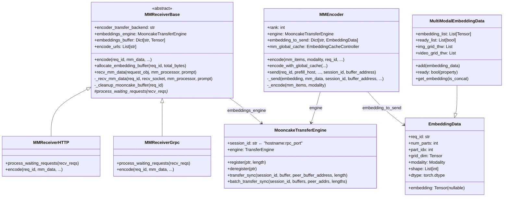
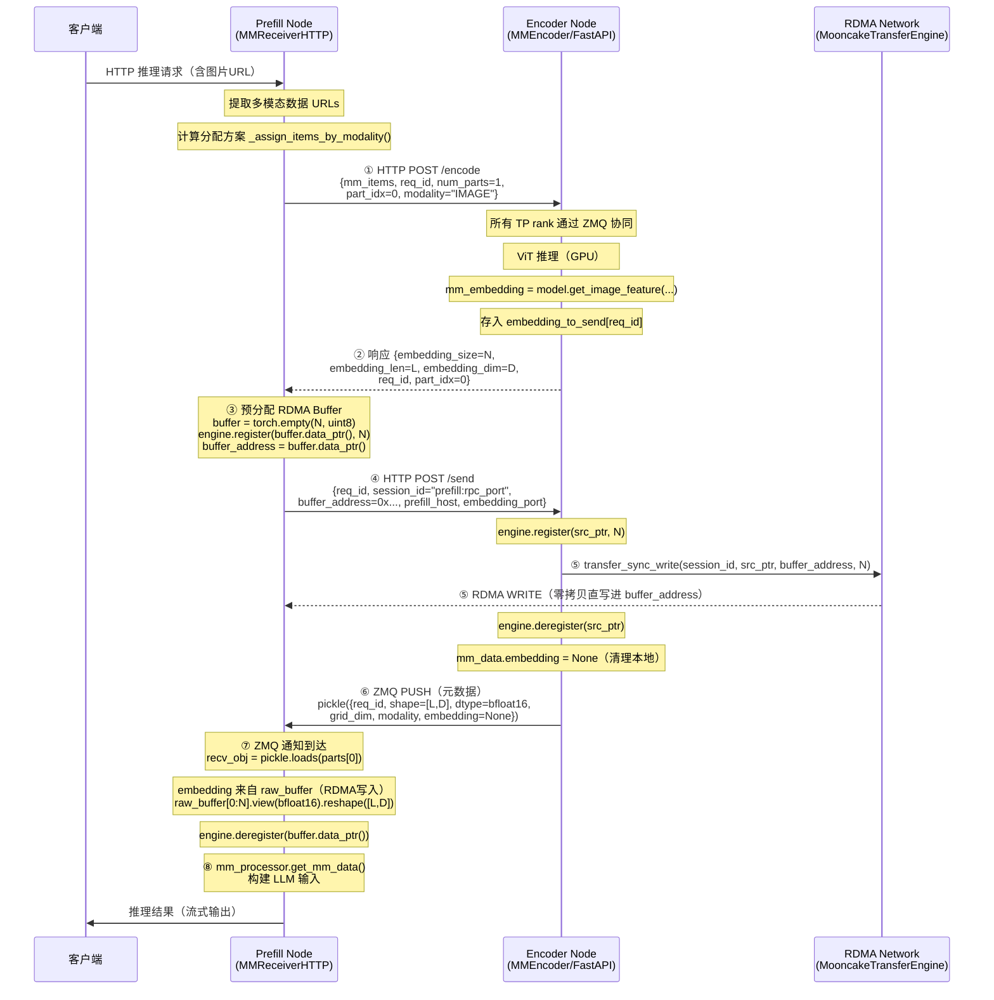
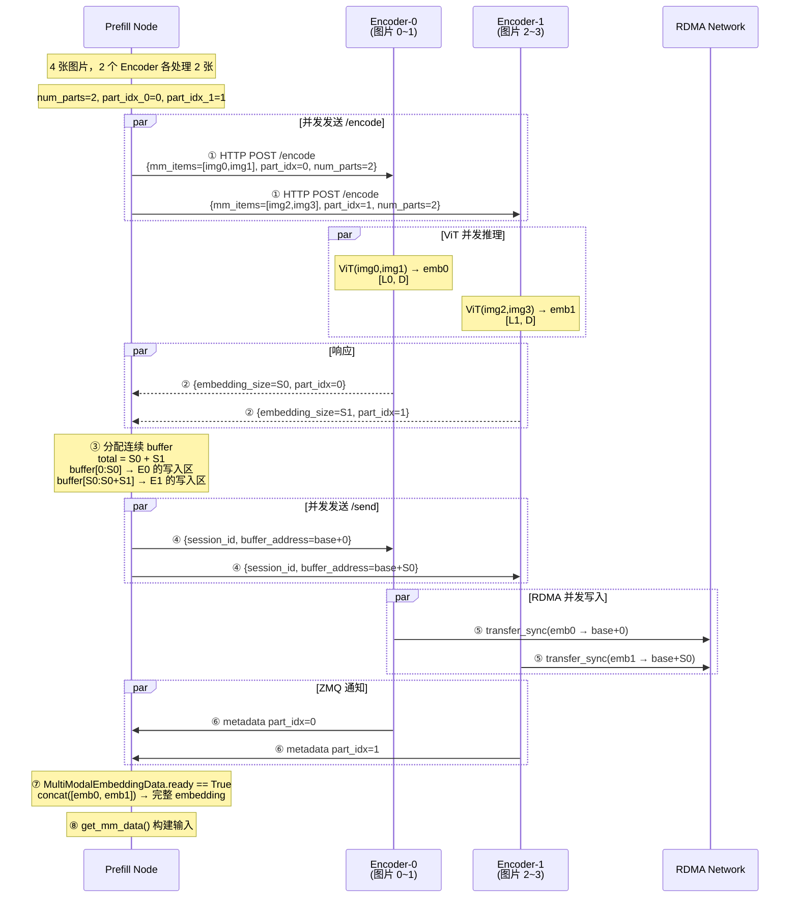

# SGLang EPD 场景：encode_server 与 encode_receiver 交互分析

> **分析范围**：`python/sglang/srt/disaggregation/encode_server.py` / `encode_receiver.py`  
> **聚焦**：以 Mooncake 作为传输后端（`encoder_transfer_backend=mooncake`）时的消息通知与数据传输机制  
> **生成日期**：2026-04-09

---

## 目录

1. [EPD 架构概览](#1-epd-架构概览)
2. [关键组件与模块](#2-关键组件与模块)
3. [传输后端对比](#3-传输后端对比)
4. [Mooncake 后端核心交互流程](#4-mooncake-后端核心交互流程)
5. [详细时序图](#5-详细时序图)
6. [关键代码解析](#6-关键代码解析)
7. [多 Encoder 与多 Part 机制](#7-多-encoder-与多-part-机制)
8. [技术原理深度解析](#8-技术原理深度解析)
9. [zmq_to_scheduler 后端对比](#9-zmq_to_scheduler-后端对比)
10. [性能分析与优势](#10-性能分析与优势)

---

## 1. EPD 架构概览

EPD（Encode-Prefill-Decode）是 SGLang 为多模态大模型设计的三级算力分离架构：

```
┌─────────────────────────────────────────────────────────────────┐
│                     用户请求（含图片/视频/音频）                    │
└──────────────────────────────┬──────────────────────────────────┘
                               │
         ┌─────────────────────▼─────────────────────┐
         │              Encode Node（编码节点）          │
         │  • 运行 ViT / 音频编码器                      │
         │  • 将原始多模态数据转化为 embedding 向量         │
         │  • encode_server.py: MMEncoder              │
         │  • FastAPI 服务（/encode、/send）             │
         └─────────────────────┬─────────────────────┘
                               │
                    ┌──────────▼──────────┐
                    │   Mooncake RDMA      │
                    │   (embedding 传输)    │
                    └──────────┬──────────┘
                               │
         ┌─────────────────────▼─────────────────────┐
         │             Prefill Node（预填节点）          │
         │  • 接收 embedding，执行 LLM Prefill 计算      │
         │  • encode_receiver.py: MMReceiverHTTP       │
         │  • 生成 KV Cache 后传递给 Decode Node         │
         └─────────────────────┬─────────────────────┘
                               │
                    ┌──────────▼──────────┐
                    │    KV Cache 传输      │
                    │   (Mooncake P/D)     │
                    └──────────┬──────────┘
                               │
         ┌─────────────────────▼─────────────────────┐
         │             Decode Node（解码节点）           │
         │  • 持续解码输出 Token                         │
         └───────────────────────────────────────────┘
```

**核心设计理念**：Encode 阶段（ViT 推理）与 Prefill 阶段（LLM 注意力计算）分离到不同节点，各自独立扩展，且 embedding 数据通过 RDMA 直接写入 Prefill 节点内存，实现零拷贝高效传输。

---

## 2. 关键组件与模块

### 2.1 类关系图



### 2.2 FastAPI 路由（encode_server.py）

| 路由 | 方法 | 调用方 | 作用 |
|------|------|--------|------|
| `/encode` | POST | Prefill → Encoder | 触发 ViT 推理，返回 embedding 元信息 |
| `/send` | POST | Prefill → Encoder | 携带 RDMA bootstrap 信息，触发数据传输 |
| `/scheduler_receive_url` | POST | Encoder → Encoder | zmq_to_scheduler 后端：通知 send 目标 URL |
| `/health` | GET | 监控/负载均衡 | 健康检查 |

---

## 3. 传输后端对比

SGLang 支持三种 encoder 传输后端，核心差异在于 **控制信道** 与 **数据信道** 的分离程度：

```
┌──────────────────────┬──────────────────────┬────────────────────────────────┐
│     传输后端           │    控制信道             │     数据信道                    │
├──────────────────────┼──────────────────────┼────────────────────────────────┤
│ mooncake             │ HTTP（两阶段握手）       │ RDMA 零拷贝直写                  │
├──────────────────────┼──────────────────────┼────────────────────────────────┤
│ zmq_to_tokenizer     │ HTTP（一阶段）          │ ZMQ 消息（含 embedding 字节）      │
├──────────────────────┼──────────────────────┼────────────────────────────────┤
│ zmq_to_scheduler     │ HTTP + ZMQ URL 通知   │ ZMQ 消息（含 embedding 字节）      │
└──────────────────────┴──────────────────────┴────────────────────────────────┘
```

**mooncake 后端的核心特征**：数据（embedding tensor）不经过 HTTP/ZMQ 传输，而由 Mooncake RDMA 引擎直接写入 Prefill 节点预分配的内存，HTTP/ZMQ 仅传递元数据（形状、类型、完成信号）。

---

## 4. Mooncake 后端核心交互流程

### 4.1 总体架构图

```
Prefill Node（encode_receiver.py）              Encode Node（encode_server.py）
══════════════════════════════                 ══════════════════════════════
MooncakeTransferEngine                         MooncakeTransferEngine
  session_id = "prefill_host:rpc_port"           session_id = "encoder_host:rpc_port"
  embeddings_buffer[req_id] = Tensor             embedding_to_send[req_id] = EmbeddingData
         │                                                │
         │ ①  HTTP POST /encode                          │
         │  { mm_items, req_id, num_parts,                │
         │    part_idx, modality }                        │
         │ ─────────────────────────────────────────────►│
         │                                                │ ViT/音频编码推理
         │                                                │ mm_embedding = model(mm_items)
         │ ② 返回 { embedding_size, embedding_len,        │
         │          embedding_dim, req_id, part_idx }     │
         │ ◄─────────────────────────────────────────────│
         │                                                │
         │ ③ 预分配 RDMA Buffer                           │
         │  buffer = torch.empty(total_bytes, uint8)      │
         │  engine.register(buffer.data_ptr(), nbytes)    │
         │  buffer_address = buffer.data_ptr()            │
         │                                                │
         │ ④ HTTP POST /send                             │
         │  { req_id, session_id="prefill_host:rpc_port",│
         │    buffer_address=<raw_ptr>, ... }             │
         │ ─────────────────────────────────────────────►│
         │                                                │ ⑤ RDMA 写入
         │                                                │ engine.register(embedding.data_ptr(), nbytes)
         │                                     ═══════════╗
         │      ⑤ RDMA WRITE (零拷贝)          ║ RDMA DATA ║
         │ ◄═══════════════════════════════════╝           │
         │  embedding 字节直写至 buffer_address             │ engine.deregister(embedding.data_ptr())
         │                                                │
         │ ⑥ ZMQ PUSH（纯元数据，无 embedding）           │
         │ ◄─────────────────────────────────────────────│
         │  { req_id, shape, dtype, grid_dim,             │
         │    modality, embedding=None }                   │
         │                                                │
         │ ⑦ 从 buffer 中读取数据                          │
         │  engine.deregister(buffer.data_ptr())          │
         │  raw_buffer[offset:offset+part_bytes]           │
         │  .view(dtype).reshape(shape)                   │
         │                                                │
         │ ⑧ 构建 mm_inputs                              │
         │  mm_processor.get_mm_data(prompt, embeddings)  │
         │                                                │
```

### 4.2 五阶段流程说明

#### 阶段一：ViT 推理触发（HTTP `/encode`）

Prefill 节点向每个 Encoder 发送 HTTP POST，触发多模态编码：

```python
# encode_receiver.py: MMReceiverHTTP.encode()
encode_requests = [{
    "encoder_idx": idx,
    "mm_items": [url1, url2, ...],   # 媒体 URL 列表
    "num_parts": total_num_parts,    # 总 part 数（跨所有 encoder）
    "part_idx": part_idx,            # 本 encoder 的 part 序号
    "req_id": part_req_id,           # 格式: "{rid}_local_part_{idx}"
    "modality": modality.name,       # "IMAGE"/"VIDEO"/"AUDIO"
    "prefill_host": self.host,
    "embedding_port": embedding_port,
}, ...]
# 并发发送给所有参与的 encoder
responses = await asyncio.gather(*[session.post(url + "/encode", json=req) for req in encode_requests])
```

Encoder 端处理（`encode_server.py: handle_encode_request`）：

```python
# 1. 广播请求给所有 TP rank（通过 ZMQ）
for socket in send_sockets:
    socket.send_pyobj(request)

# 2. 运行 ViT 推理（所有 rank 协同）
nbytes, embedding_len, embedding_dim, _, _ = await encoder.encode(
    mm_items=request["mm_items"],
    modality=Modality.from_str(request["modality"]),
    req_id=request["req_id"],
    num_parts=request["num_parts"],
    part_idx=request["part_idx"],
)

# 3. rank 0 将结果缓存，等待 /send 请求
# encoder.embedding_to_send[req_id] = EmbeddingData(...)

# 4. 对 mooncake 后端：只返回元信息，不传递数据
return ORJSONResponse(content={
    "embedding_size": nbytes,    # 字节数
    "embedding_len": embedding_len,
    "embedding_dim": embedding_dim,
    "req_id": req_id,
    "part_idx": part_idx,
})
```

#### 阶段二：Buffer 预分配与 RDMA 注册（Prefill 侧）

```python
# encode_receiver.py: MMReceiverHTTP.encode()
# 按 part_idx 排序，计算总字节数
total_embedding_bytes = sum(embedding_size_list_sort)

# 分配连续内存并注册到 RDMA
buffer_address = await self.allocate_embedding_buffer(req_id, total_embedding_bytes)

# allocate_embedding_buffer() 实现:
async def allocate_embedding_buffer(self, req_id, total_bytes):
    embeddings = torch.empty(total_bytes, dtype=torch.uint8)
    self.embeddings_engine.register(
        embeddings.data_ptr(),   # CPU 内存指针
        embeddings.nbytes,       # 注册大小
    )
    self.embeddings_buffer[req_id] = embeddings
    return embeddings.data_ptr()  # 返回原始内存地址
```

**关键**：`buffer_address` 是一个原始整型内存指针，对应 Prefill 节点 CPU 内存中一块已注册到 Mooncake RDMA 的区域。

#### 阶段三：Bootstrap 信息推送（HTTP `/send`）

```python
# 对每个 part，计算其在 buffer 中的 offset
offset = 0
for idx in range(len(encode_requests)):
    response_json = response_json_list_sort[idx]
    # buffer_address_adjust = 基址 + 本 part 的偏移
    response_json.update({
        "session_id": self.embeddings_engine.session_id,   # "prefill_host:rpc_port"
        "buffer_address": offset + buffer_address,         # 此 part 写入的目标地址
    })
    # 并发发送给各 encoder
    await session.post(encode_url + "/send", json=response_json)
    offset += embedding_size_list_sort[idx]
```

#### 阶段四：RDMA 零拷贝写入（Encoder 侧 `_send`）

```python
# encode_server.py: MMEncoder._send()
async def _send(self, embedding, mm_data, session_id=None, buffer_address=None, ...):
    if self.server_args.encoder_transfer_backend == "mooncake":
        # 1. 注册源 buffer（Encoder 侧 CPU 内存）
        self.engine.register(embedding.data_ptr(), embedding.nbytes)
        
        # 2. RDMA 同步写入
        #    session_id: Prefill 节点的 RDMA 地址标识（"prefill_host:rpc_port"）
        #    embedding.data_ptr(): 源地址（Encoder 本地）
        #    buffer_address: 目标地址（Prefill 预分配内存，远端）
        self.engine.transfer_sync(
            session_id,             # 远端身份标识
            embedding.data_ptr(),   # 本地源指针
            buffer_address,         # 远端目标指针
            embedding.nbytes,       # 传输字节数
        )
        
        # 3. 注销本地 buffer
        self.engine.deregister(embedding.data_ptr())
        mm_data.embedding = None  # 释放本地 embedding 引用

    # 4. 发送纯元数据通知（ZMQ，不含 embedding 字节）
    serialized_data = pickle.dumps(mm_data)  # embedding=None，仅 shape/dtype/grid
    sock.send_multipart([serialized_data], copy=False)
```

`MooncakeTransferEngine.transfer_sync` 底层调用：

```python
# mooncake_transfer_engine.py
def transfer_sync(self, session_id: str, buffer: int, peer_buffer_address: int, length: int):
    """Synchronously transfer data to the specified address."""
    ret = self.engine.transfer_sync_write(
        session_id,           # 远端 endpoint（用于 RDMA 建立连接）
        buffer,               # 本地内存指针
        peer_buffer_address,  # 远端内存指针
        length,               # 传输字节数
    )
```

#### 阶段五：接收侧重组（Prefill `_recv_mm_data`）

```python
# encode_receiver.py: MMReceiverBase._recv_mm_data()
# 1. 等待 ZMQ 通知消息（元数据）
while recv_embedding_data is None or not recv_embedding_data.ready:
    parts = await recv_socket.recv_multipart(copy=False)
    recv_obj: EmbeddingData = pickle.loads(parts[0])
    # 对 mooncake 后端：parts 只有 1 个元素（无 embedding 数据）
    # ...累积各 part 元数据...

# 2. 所有 part 就绪后，从预分配 buffer 中读取 RDMA 写入的数据
if self.encoder_transfer_backend == "mooncake":
    raw_buffer = self.embeddings_buffer.pop(req_id)
    self.embeddings_engine.deregister(raw_buffer.data_ptr())
    
    byte_offset = 0
    for i in range(recv_embedding_data.num_parts):
        shape = recv_embedding_data.embedding_shape_list[i]  # [seq_len, hidden_dim]
        part_bytes = shape[0] * shape[1] * dtype_element_size
        recv_embedding_data.embedding_list[i] = (
            raw_buffer[byte_offset : byte_offset + part_bytes]
            .view(self.dtype)      # uint8 → float16/bfloat16
            .reshape(shape)        # [part_bytes] → [seq_len, hidden_dim]
        )
        byte_offset += part_bytes

# 3. 构建 mm_inputs 供 LLM Prefill 使用
recv_embedding = recv_embedding_data.get_embedding(is_concat=True)
mm_inputs = mm_processor.get_mm_data(prompt, recv_embedding, **extra_meta)
```

---

## 5. 详细时序图

### 5.1 Mooncake 后端完整时序（单 Encoder）



### 5.2 多 Encoder 并发时序



---

## 6. 关键代码解析

### 6.1 Session ID 的本质

```python
# mooncake_transfer_engine.py
class MooncakeTransferEngine:
    def __init__(self, hostname, gpu_id, ib_device):
        self.engine = TransferEngine()
        self.initialize(hostname=hostname, device_name=ib_device)
        
        # session_id = "hostname:rpc_port"
        # 例如: "192.168.1.10:12345"
        # rpc_port 是 Mooncake 引擎监听的 RDMA 管理端口
        self.session_id = NetworkAddress(
            self.hostname, self.engine.get_rpc_port()
        ).to_host_port_str()
```

`session_id` 是 Mooncake RDMA 端点的地址标识符：
- Prefill 节点初始化后，将 `embeddings_engine.session_id`（如 `"10.0.0.1:9999"`）通过 HTTP `/send` 请求告知 Encoder
- Encoder 的 `transfer_sync(session_id, ...)` 使用此地址与 Prefill 的 RDMA 端点建立连接并写入数据

### 6.2 Part ID 命名约定

```python
# encode_receiver.py
def create_part_req_id(original_req_id: str, part_idx: int) -> str:
    """创建唯一的 part 请求 ID，格式: {rid}_local_part_{idx}"""
    return f"{original_req_id}_local_part_{part_idx}"

def extract_original_req_id(part_req_id: str) -> str:
    """从 part ID 还原 original req_id"""
    if "_local_part_" in part_req_id:
        return part_req_id.rsplit("_local_part_", 1)[0]
    return part_req_id
```

每个 Encoder 节点使用独立的 `part_req_id` 来避免键冲突，接收侧通过 `extract_original_req_id` 还原后聚合。

### 6.3 多模态多 Part 聚合

```python
# encode_receiver.py: MultiModalEmbeddingData
class MultiModalEmbeddingData(EmbeddingData):
    def __init__(self, part_idx, num_parts, ...):
        self.ready_list = [i == part_idx for i in range(num_parts)]  # [True, False, ...]
        self.embedding_list = [embedding if i == part_idx else None for i in range(num_parts)]
        
    def add(self, embedding_data: EmbeddingData):
        """合并另一个 part 的数据"""
        pid = embedding_data.part_idx
        self.ready_list[pid] = True
        self.embedding_list[pid] = embedding_data.get_embedding()
    
    @property
    def ready(self):
        return sum(self.ready_list) == self.num_parts  # 所有 part 到齐

    def get_embedding(self, is_concat=False):
        if is_concat:
            # 按 modality 分组并 concat
            groups = defaultdict(list)
            for i, e in enumerate(self.embedding_list):
                if e is not None:
                    groups[self.modality_list[i]].append(e.cuda())
            return {mod: torch.concat(tensors).cpu() for mod, tensors in groups.items()}
```

### 6.4 跨模态负载均衡

```python
# encode_receiver.py: MMReceiverBase._assign_items_by_modality()
def _assign_items_by_modality(self, mm_data, encoder_num, random_shuffle=True):
    """
    跨模态均衡地将多模态任务分配给各 Encoder
    返回格式: {Modality.IMAGE: [2, 1, 0], Modality.VIDEO: [0, 1, 1]}
              表示 encoder0 处理 2 张图片，encoder1 处理 1 张图片...
    """
    encode_idx = list(range(encoder_num))
    if random_shuffle:
        random.shuffle(encode_idx)  # 随机打乱，防止热点
    
    num_items_assigned = OrderedDict()  # 保持 modality 顺序
    current_offset = 0
    
    for modality in modalities:
        num_items = len(mm_data_by_modality[modality])
        base = num_items // encoder_num
        remainder = num_items % encoder_num
        assignments = [base + (1 if i < remainder else 0) for i in range(encoder_num)]
        # 跨 modality 轮转 offset，均衡跨模态负载
        num_items_assigned[modality] = assignments
    
    return num_items_assigned
```

---

## 7. 多 Encoder 与多 Part 机制

### 7.1 任务分配策略

```
3 张图片 + 2 段视频，2 个 Encoder（随机打乱后顺序为 [Enc1, Enc0]）:

IMAGE 分配:
  Enc1: 2 张图片 (part_idx=0)
  Enc0: 1 张图片 (part_idx=1)

VIDEO 分配:
  Enc1: 1 段视频 (part_idx=2)  ← part_idx_offset = 2（IMAGE 占了 2 parts）
  Enc0: 1 段视频 (part_idx=3)

总 num_parts = 4
Buffer 布局:
  [0, S0)  ← Enc1 图片 embedding
  [S0, S0+S1) ← Enc0 图片 embedding
  [S0+S1, S0+S1+S2) ← Enc1 视频 embedding
  [S0+S1+S2, total) ← Enc0 视频 embedding
```

### 7.2 TP 并行下的 Encoder

Encoder 本身也是 TP 并行运行（多 GPU 协同推理 ViT）：

```
Encoder-0 (TP=2):
  ┌─────────────┐   ZMQ   ┌─────────────┐
  │ rank 0 GPU  │◄───────►│ rank 1 GPU  │
  │ (主 rank)   │         │ (副 rank)   │
  └─────────────┘         └─────────────┘
        │
        │ 只有 rank 0 发送数据
        │ embedding_to_send[req_id] 仅在 rank 0 存储
        ▼
    RDMA 传输
```

- 所有 TP rank 通过 ZMQ intra-process 消息协同完成 ViT 推理
- 仅 `rank 0` 执行 `_send()` 进行 RDMA 写入和 ZMQ 通知
- 若启用 `enable_mm_global_cache`，rank 0 通过 `broadcast` 将 cache hit/miss 掩码同步给所有 rank

---

## 8. 技术原理深度解析

### 8.1 RDMA 零拷贝传输原理

```
传统 ZMQ 传输（有拷贝）:
┌─────────────────────────────────────────────────────┐
│ Encoder Memory                                       │
│  embedding_tensor → [CPU Copy] → ZMQ Buffer          │
│                         │                           │
│                    ZMQ Socket (send)                 │
│                         │ TCP/IPC 网络传输             │
│                    ZMQ Socket (recv)                 │
│                         │                           │
│  [CPU Copy] ← ZMQ Buffer → recv_tensor               │
│ Prefill Memory                                       │
└─────────────────────────────────────────────────────┘

Mooncake RDMA 零拷贝:
┌────────────────────────────────────────────────────────────────┐
│ Encoder Memory (注册到 RDMA NIC)                                │
│   embedding.data_ptr() ─────────────────────────────────────┐  │
└─────────────────────────────────────────────────────────────│──┘
                                                              │
                    InfiniBand / RoCE 网络                    │
                    DMA (直接内存访问，不经 CPU)              │
                    ▼                                         │
┌────────────────────────────────────────────────────────────────┐
│ Prefill Memory (注册到 RDMA NIC)                                │
│   buffer_address ◄───────────────────────────────────────────┘ │
└─────────────────────────────────────────────────────────────────┘
```

**关键特性**：
1. **DMA 直接操作**：数据由 RDMA NIC 直接从 Encoder 内存复制到 Prefill 内存，CPU 全程不参与内存搬运
2. **预注册内存**：`engine.register()` 将内存页 pin 住（不可换页），RDMA NIC 可直接寻址
3. **远程写语义**：`transfer_sync_write()` 是 RDMA WRITE 原语，Encoder 主动向 Prefill 写入数据
4. **session_id 寻址**：Prefill 的 `session_id`（`host:rpc_port`）在 RDMA 层面标识远端节点，用于建立 QP（Queue Pair）连接

### 8.2 双信道设计模式

```
信道类型    传输内容                速度      CPU 参与度
─────────────────────────────────────────────────────
控制信道    HTTP (session_id,       低延迟    参与（协议栈）
(HTTP)     buffer_address, shape)   ~ms 级

数据信道    embedding tensor        高吞吐    不参与
(RDMA)     bytes（可达数百 MB/s）   硬件级

通知信道    ZMQ 完成信号            低延迟    参与
(ZMQ)      (metadata only)         ~ms 级
```

这种"控制面/数据面分离"的设计使得：
- 控制协议（HTTP）可灵活演化，无需关心数据量
- 数据传输路径（RDMA）完全绕过协议栈开销
- ZMQ 通知保证了接收侧能精确知道数据已就绪

### 8.3 Buffer 生命周期管理

```
时间轴 →
─────────────────────────────────────────────────────────────────
Prefill:
  allocate_embedding_buffer()  ←───── buffer 存在 ─────────────────► deregister()
     │ register()                                                      │
     │                                                                 │
     │ ← /send 请求 →                                                  │
     │                                                                 │
     │          RDMA WRITE 写入期间                                    │
     │          ←─────────────────►                                    │
     │                              ZMQ 通知到达                       │
     │                              ←──────────►                       │
     │                                           读取 raw_buffer       │
     │                                           ←──────────────────► │
─────────────────────────────────────────────────────────────────
Encoder:
           register(src)  transfer_sync()  deregister(src)
              ←──────────────────────────────────►
```

**关键约束**：
- Prefill 必须在发送 `/send` 请求前完成 `register()`（否则 RDMA 写入到未注册内存会失败）
- Encoder 必须在 RDMA 完成后才发送 ZMQ 通知（`transfer_sync` 是同步阻塞调用）
- Prefill 收到 ZMQ 通知后才读取 buffer（此时 RDMA 写入已完成）

### 8.4 MooncakeTransferEngine 内部结构

```
MooncakeTransferEngine
├── engine: TransferEngine (C++ 扩展)
│   ├── register_memory(ptr, len) → 将内存页 pin 并注册到 RDMA NIC
│   ├── unregister_memory(ptr) → 解注册
│   ├── transfer_sync_write(session_id, src, dst, len) → RDMA WRITE
│   └── get_rpc_port() → 返回 RDMA 管理端口
│
├── session_id = "hostname:rpc_port"
│   └── 格式: "192.168.1.10:9527"
│       用于远端节点通过 RPC 连接建立 RDMA QP
│
└── IB 设备绑定 (ib_device)
    └── 支持按 GPU ID 选择 IB 设备（避免跨 NUMA 访问）
```

---

## 9. zmq_to_scheduler 后端对比

作为对比，`zmq_to_scheduler` 后端的交互方式完全不同：

### 9.1 zmq_to_scheduler 流程

```
Prefill Scheduler                              Encoder
══════════════════                          ══════════
处理 TokenizedGenerateReqInput
发现 need_wait_for_mm_inputs=True

WaitingImageRequest 初始化:
  recv_socket = zmq.PULL()
  embedding_port = recv_socket 绑定的端口

① HTTP POST /scheduler_receive_url
  {req_id, receive_url="prefill_host:port", receive_count}
─────────────────────────────────────────────────────────►

                                           rid_to_receive_endpoint[req_id] = {url}
                                           通知 condition variable

                                           send_with_url() 循环等待 URL
                                           ② ZMQ PUSH 发送（含 embedding 字节）
                                           {metadata + embedding_tensor bytes}
◄────────────────────────────────────────────────────────

WaitingImageRequest._try_recv_mm_data():
  parts = recv_socket.recv_multipart(flags=NOBLOCK)
  metadata = pickle.loads(parts[0])
  embedding = torch.frombuffer(parts[1]).reshape(shape)  ← 数据在 ZMQ 消息里
```

### 9.2 两种后端对比

```
特性                    mooncake 后端              zmq_to_scheduler 后端
─────────────────────────────────────────────────────────────────────────
数据传输方式            RDMA 零拷贝                ZMQ 消息（含 embedding）
数据拷贝次数           0（DMA直传）                ≥2（序列化+网络栈拷贝）
网络路径               InfiniBand/RoCE            TCP/IPC
交互轮次               2（/encode + /send）        1（/scheduler_receive_url）
接收侧角色              tokenizer（HTTP接收者）     scheduler（ZMQ 接收者）
适用场景               跨节点高带宽                 同节点或开发调试
embedding 字节在 ZMQ   ✗（仅元数据）              ✓（数据在 ZMQ 消息中）
Buffer 预分配           ✓（RDMA 注册）             ✗
TP 同步                broadcast（全局缓存路径）   all_reduce（状态同步）
```

---

## 10. 性能分析与优势

### 10.1 延迟分解

```
Mooncake 后端端到端延迟:
┌─────────────────────────────────────────────────────────────────┐
│ T_total = T_http_encode + T_vit + T_buffer_alloc                │
│         + T_http_send + T_rdma + T_zmq + T_reassemble          │
│                                                                   │
│ T_http_encode  ≈ 1-5 ms  (HTTP RTT)                             │
│ T_vit         ≈ 10-200 ms (ViT 推理，与图片分辨率/数量相关)    │
│ T_buffer_alloc ≈ 0.1 ms  (内存分配+register)                   │
│ T_http_send    ≈ 1-5 ms  (HTTP RTT)                             │
│ T_rdma        ≈ 数据量/带宽 (如 100MB @ 100GB/s = 1ms)         │
│ T_zmq         ≈ 0.1 ms  (纯元数据，极小)                       │
│ T_reassemble   ≈ 0.1 ms  (buffer 切片，无拷贝)                 │
│                                                                   │
│ 与 ZMQ 后端对比:                                                 │
│ T_zmq_data = T_serialize + T_send + T_recv + T_deserialize       │
│            ≈ 数据量 * (序列化开销 + 1/带宽)                     │
│   对 100MB: ≈ 数据量/网卡带宽 + CPU序列化时间                   │
└─────────────────────────────────────────────────────────────────┘
```

### 10.2 带宽利用率

```
100GB/s InfiniBand 网络传输 1GB embedding 数据:
  Mooncake RDMA:  ~10 ms   (接近线速)
  ZMQ TCP:        ~100+ ms (含协议栈开销、CPU 复制)
```

### 10.3 CPU 解放效益

| 指标 | mooncake 后端 | zmq 后端 |
|------|-------------|---------|
| 传输期间 Encoder CPU 使用率 | 极低（DMA 操作） | 高（序列化+发送） |
| 传输期间 Prefill CPU 使用率 | 极低（等待 ZMQ 通知） | 高（接收+反序列化） |
| 可并行的 CPU 任务 | 可继续处理其他请求 | CPU 被传输阻塞 |

### 10.4 扩展性优势

```
多 Encoder 并发传输:
  ┌─────────┐         ┌─────────────────────────────────┐
  │Encoder 0│───RDMA──►│                                 │
  ├─────────┤         │    Prefill Buffer（连续内存）     │
  │Encoder 1│───RDMA──►│    [E0 part | E1 part | ...]    │
  ├─────────┤         │                                 │
  │Encoder 2│───RDMA──►│                                 │
  └─────────┘         └─────────────────────────────────┘

  所有 Encoder 并发向不同 buffer offset 写入，
  无锁冲突，真正并行化。
```

### 10.5 与全局 Embedding Cache 的协同

当启用 `enable_mm_global_cache` 时，Mooncake 后端还与 `EmbeddingCacheController`（MooncakeEmbeddingStore）协同工作：

```
encode_with_global_cache() 流程:
  Step 1: rank 0 查询 EmbeddingCacheController（两级 cache: 本地 + Mooncake Store）
  Step 2: cache miss → 所有 rank 协同运行 ViT
  Step 3: cache hit  → rank 0 从 MooncakeEmbeddingStore 异步 prefetch
  Step 4: broadcast 状态到所有 rank
  Step 5: prefetch 失败则 fallback 到 ViT
  Step 6: rank 0 组装最终 embedding 并存入 embedding_to_send

  之后仍通过 Mooncake RDMA（/send）传输最终 embedding 给 Prefill
```

这形成了两层 Mooncake 加速：
1. **EmbeddingCacheController**（MooncakeStore）：跨请求复用 embedding，避免重复 ViT 推理
2. **MooncakeTransferEngine（RDMA）**：高效将 embedding 传输到 Prefill 节点

---

## 总结

```
┌────────────────────── EPD + Mooncake 完整技术栈 ──────────────────────┐
│                                                                        │
│  encode_receiver.py                     encode_server.py              │
│  ┌─────────────────┐                   ┌──────────────────────────┐   │
│  │ MMReceiverHTTP  │                   │ MMEncoder (FastAPI)       │   │
│  │                 │  ①HTTP /encode    │                          │   │
│  │ asyncio 事件循环 │──────────────────►│ /encode handler          │   │
│  │                 │  embedding_size   │                          │   │
│  │                 │◄─────────────────│ ViT 推理 (TP协同)         │   │
│  │                 │                   │                          │   │
│  │ RDMA buffer     │  ②HTTP /send     │                          │   │
│  │ 预分配+注册      │──────────────────►│ /send handler            │   │
│  │ buffer_address  │  session_id,      │                          │   │
│  │                 │  buffer_address   │ ③RDMA transfer_sync_write│   │
│  │                 │◄═════════════════│  (零拷贝直写进 buffer)    │   │
│  │                 │  (RDMA 硬件层)    │                          │   │
│  │                 │                   │ ④ZMQ PUSH (元数据通知)   │   │
│  │ _recv_mm_data() │◄─────────────────│  shape/dtype/grid         │   │
│  │ 从 buffer 重组   │                   │                          │   │
│  │ embedding        │                   └──────────────────────────┘   │
│  │                 │                                                   │
│  │ mm_processor    │                                                   │
│  │ .get_mm_data()  │                                                   │
│  └─────────────────┘                                                   │
│                                                                        │
│  核心技术原理:                                                          │
│  • 双信道设计: HTTP(控制) + RDMA(数据) + ZMQ(通知)                    │
│  • Buffer 预注册: 接收方先分配内存并注册 RDMA，再将地址交给发送方         │
│  • RDMA WRITE 语义: 发送方主动写入接收方内存，CPU 不参与数据搬运         │
│  • session_id: 标识 RDMA 端点的地址("host:rpc_port")                  │
│  • 多 Part 并发: 多 Encoder 同时向不同 buffer offset 写入，无锁冲突   │
└────────────────────────────────────────────────────────────────────────┘
```

Mooncake 后端通过 **RDMA 零拷贝**将大规模 embedding 张量从 Encoder 节点高效传输到 Prefill 节点，相比 ZMQ 方案可显著降低传输延迟和 CPU 开销，在多模态大模型的规模化生产部署中具有重要的工程价值。
