# SGLang MooncakeStore 架构分析与 EPD 场景解析

> 源码路径：`python/sglang/srt/mem_cache/storage/mooncake_store/`  
> 生成日期：2026-04-09

---

## 目录

1. [背景概览](#1-背景概览)
2. [目录结构与文件职责](#2-目录结构与文件职责)
3. [核心类架构图](#3-核心类架构图)
4. [技术原理深度解析](#4-技术原理深度解析)
5. [HiCache 三级存储体系](#5-hicache-三级存储体系)
6. [MooncakeStore 核心工作流](#6-mooncakestore-核心工作流)
7. [EPD 场景使用详解](#7-epd-场景使用详解)
8. [配置与部署](#8-配置与部署)
9. [性能优势分析](#9-性能优势分析)
10. [总结](#10-总结)

---

## 1. 背景概览

### 1.1 什么是 Mooncake

Mooncake 是一个面向大语言模型推理加速的分布式 KV 缓存系统，其核心目标是：

- 将集群中多台机器的 DRAM/SSD 聚合为一个大型高速缓存池
- 利用 **(GPUDirect) RDMA** 技术实现零拷贝的高带宽数据传输
- 最大化利用单机多网卡资源，降低跨节点传输延迟

### 1.2 为什么 SGLang 需要 MooncakeStore

SGLang 内置了 HiCache 分层缓存体系（L1 GPU VRAM → L2 CPU DRAM → L3 远端存储）。对于长上下文、多轮对话和高并发场景，L1/L2 很快达到容量瓶颈。MooncakeStore 作为 L3 存储后端，提供了近乎无限的、可集群内共享的 KV 缓存空间。

在 EPD（Encode-Prefill-Decode）三阶段解耦架构中，MooncakeStore 还承担了另一个关键角色：**跨节点多模态 Embedding 缓存**，避免重复的 ViT 前向计算。

---

## 2. 目录结构与文件职责

```
python/sglang/srt/mem_cache/storage/mooncake_store/
├── mooncake_store.py             # KV 缓存存储核心（L3 backend）
├── mooncake_embedding_store.py   # 多模态 Embedding 分布式存储
├── embedding_cache_controller.py # Embedding 缓存控制器（多级缓存调度）
├── test_mooncake_store.py        # 接口功能测试
└── README.md                     # 官方部署文档
```

| 文件 | 核心类 | 职责 |
|------|--------|------|
| `mooncake_store.py` | `MooncakeStore`, `MooncakeBaseStore`, `MooncakeHostTensorAllocator`, `MooncakeStoreConfig` | HiCache L3 KV 缓存后端，实现 KV page 的分布式存取 |
| `mooncake_embedding_store.py` | `MooncakeEmbeddingStore` | 多模态 Embedding 向量的分布式 put/get |
| `embedding_cache_controller.py` | `EmbeddingCacheController`, `ContiguousMemoryAllocator`, `EmbeddingPrefetchOperation`, `EmbeddingInsertOperation` | 多级 Embedding 缓存控制，包含本地 pinned buffer 管理和后台异步 I/O |

---

## 3. 核心类架构图

### 3.1 类继承与依赖关系

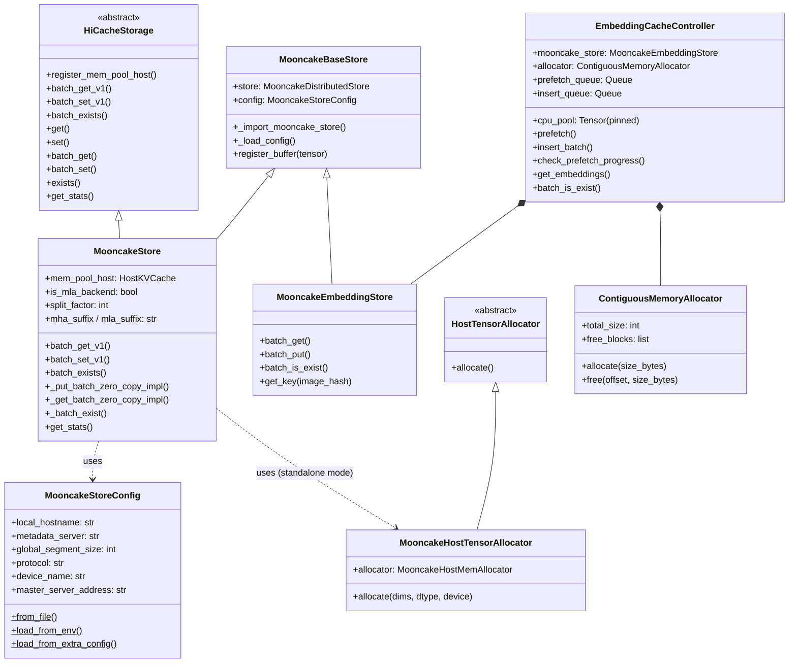

### 3.2 存储后端注册关系

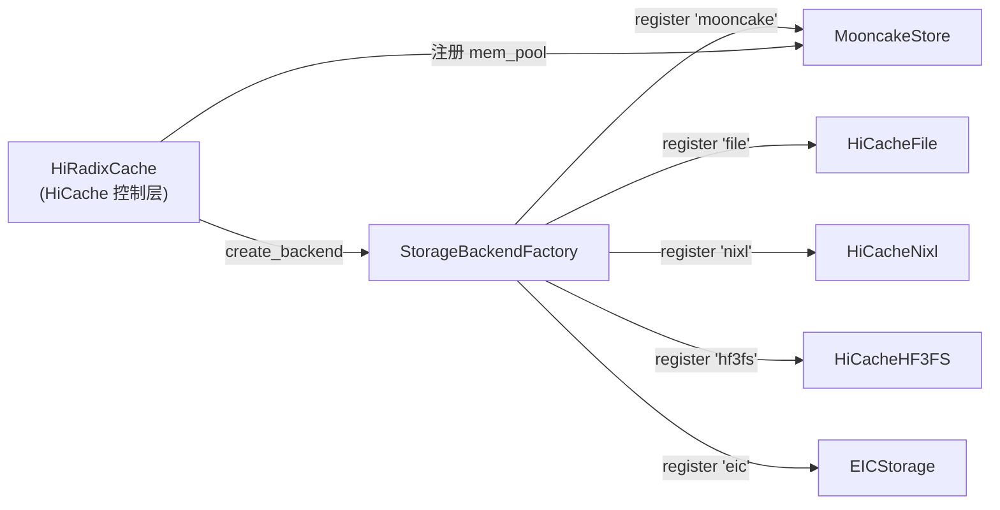

---

## 4. 技术原理深度解析

### 4.1 RDMA 零拷贝传输

传统 TCP/IP 数据传输路径：

```
CPU Memory → Kernel Buffer → Network Stack → NIC → 网络 → 对端 NIC → Kernel Buffer → CPU Memory
                ↑ 多次数据拷贝，占用大量 CPU 资源
```

RDMA 零拷贝传输路径：

```
CPU Memory (已注册 RDMA MR) ──────────────────────────────→ 对端 CPU Memory
                               NIC 直接 DMA，无需 CPU 介入
```

MooncakeStore 中零拷贝的关键代码路径：

```python
# 1. 分配 Mooncake 管理的宿主内存（自动完成 RDMA 注册）
class MooncakeHostTensorAllocator(HostTensorAllocator):
    def allocate(self, dims, dtype, device):
        ptr_int = self.allocator.alloc(size)          # 底层调用 mooncake 分配器
        c_array = ctypes.c_byte * size .from_address(ptr_int)
        tensor = torch.frombuffer(c_array, ...)       # 包装为 PyTorch tensor，零拷贝
        return tensor

# 2. 注册缓冲区到 MooncakeDistributedStore
def register_mem_pool_host(self, mem_pool_host):
    buffer = self.mem_pool_host.kv_buffer
    self.store.register_buffer(buffer.data_ptr(), buffer.numel() * buffer.element_size())

# 3. 零拷贝 put/get（直接操作内存指针）
def _put_batch_zero_copy_impl(self, key_strs, buffer_ptrs, buffer_sizes):
    return self.store.batch_put_from(key_strs, buffer_ptrs, buffer_sizes)

def _get_batch_zero_copy_impl(self, key_strs, buffer_ptrs, buffer_sizes):
    return self.store.batch_get_into(key_strs, buffer_ptrs, buffer_sizes)
```

### 4.2 MooncakeDistributedStore 架构

Mooncake 后端由三类服务构成：

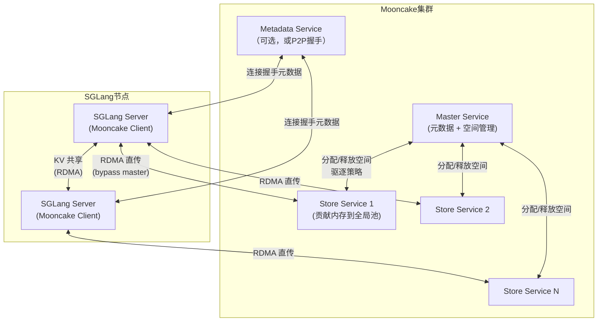

> **关键点**：数据传输直接发生在 SGLang 节点与 Store Service 之间，Master Service 只负责空间的元数据管理，不经过数据平面，确保高吞吐。

### 4.3 KV 缓存 Key 命名规则

MooncakeStore 通过 key 的命名约定区分不同的 TP rank、PP rank 和注意力头：

```python
# MHA (Multi-Head Attention) 模式 —— 每个 TP rank 分别存 K 和 V
key_{tp_rank}_k      # Key 分量
key_{tp_rank}_v      # Value 分量

# MHA + Pipeline Parallelism
key_{tp_rank}_{pp_rank}_k
key_{tp_rank}_{pp_rank}_v

# MLA (Multi-head Latent Attention, e.g. DeepSeek) 模式 —— 只有一个潜变量
key__{pp_rank}_k     # 合并的 KV 潜空间

# Split-Heads 模式（TP LCM 扩展）
key_{base_rank+i}_{pp_rank}_k  for i in range(split_factor)
```

### 4.4 ContiguousMemoryAllocator（Embedding 存储的首次适配分配器）

```
初始状态: [  free_block(0, total_size)  ]

alloc(A):  [A | free_block(A_size, total-A_size)]
alloc(B):  [A | B | free_block(A_size+B_size, total-A-B_size)]
free(A):   merge adjacent free blocks → 内存碎片整理
```

采用首次适配（First-Fit）策略，`free()` 时合并相邻空闲块防止碎片化，配合线程锁保证并发安全。

---

## 5. HiCache 三级存储体系

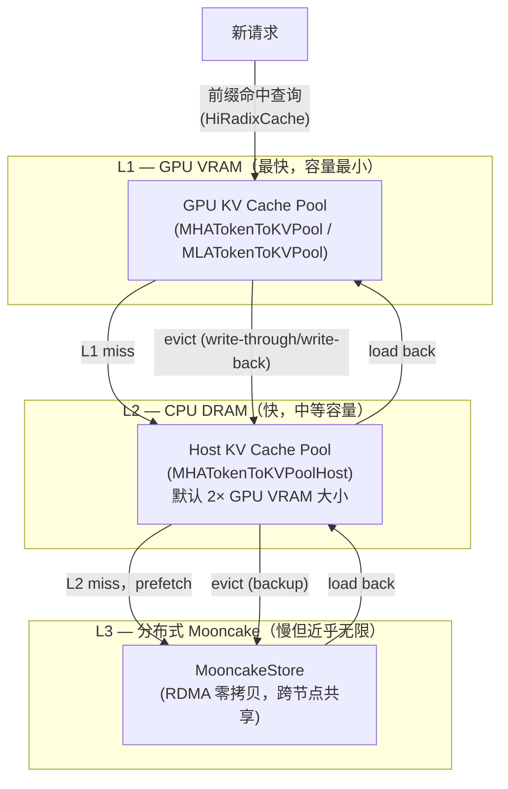

**HiCacheController** 负责调度以上所有层间的异步数据迁移：

- **write-through**: 写入 L1 同时写入 L2/L3
- **write-back**: eviction 触发时写入 L2/L3
- **prefetch**: 请求到来前提前从 L3 加载到 L2

---

## 6. MooncakeStore 核心工作流

### 6.1 初始化流程

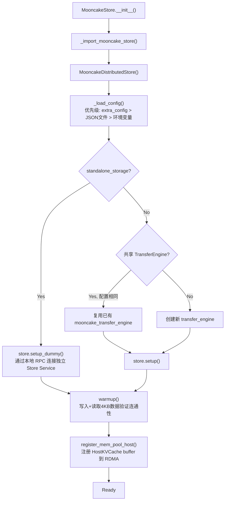

### 6.2 batch_set（KV 写入 L3）完整流程

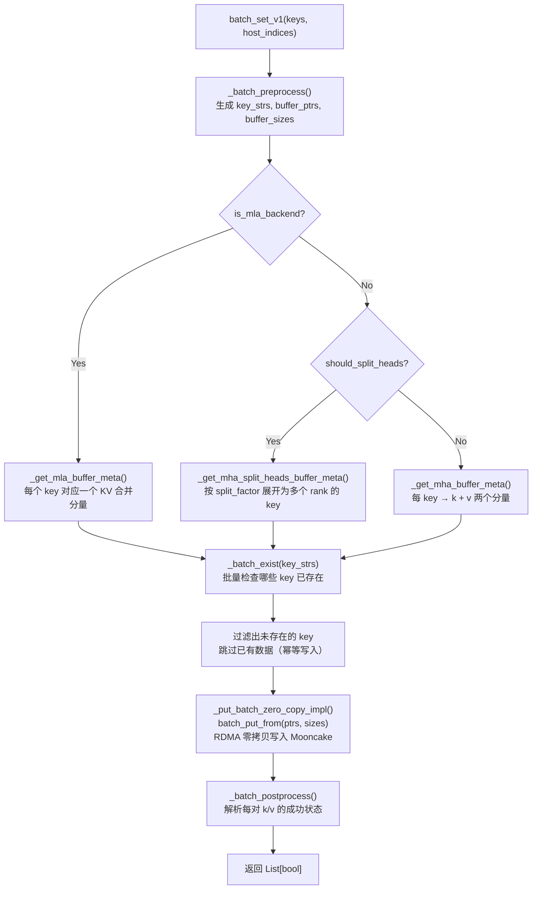

### 6.3 batch_get（KV 从 L3 读取）完整流程

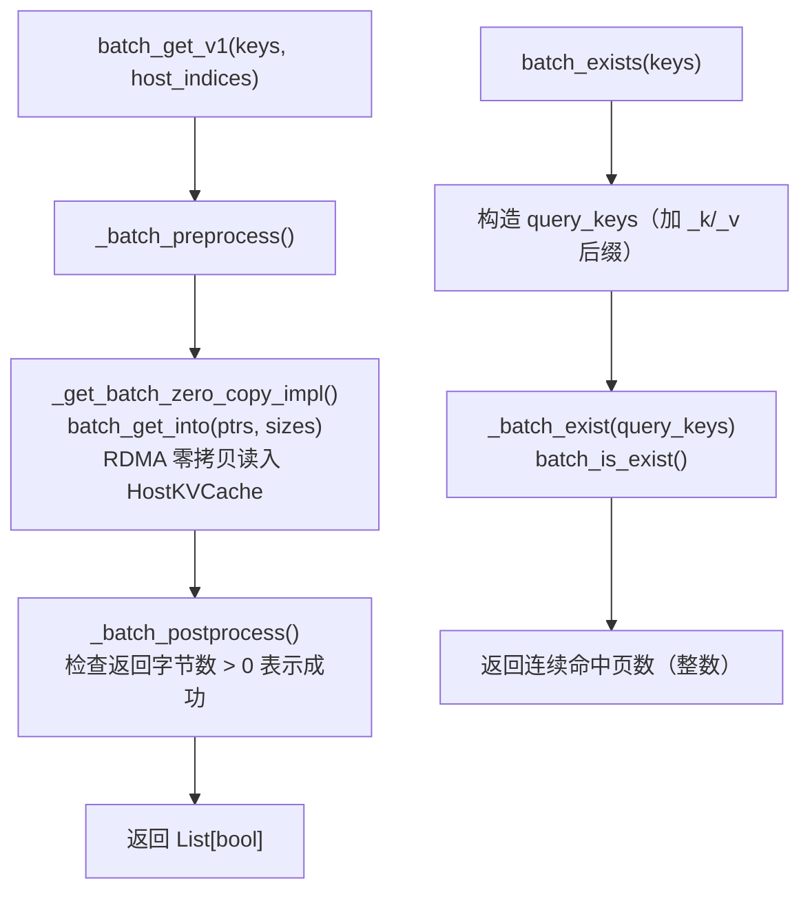

---

## 7. EPD 场景使用详解

EPD = **Encode-Prefill-Decode**，是 SGLang 针对多模态大模型的三阶段计算解耦架构：

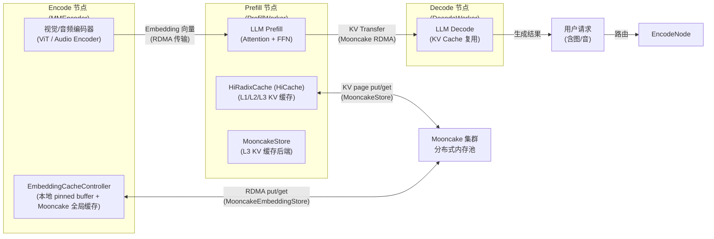

### 7.1 EPD 场景一：多模态 Embedding 全局缓存

**问题**：同一张图片可能被多个请求重复编码，ViT 前向计算代价极高（数百 ms）。

**解决方案**：`EmbeddingCacheController` + `MooncakeEmbeddingStore` 实现两级 Embedding 缓存：

```
Level 1（本地内存）：当前节点 pinned CPU buffer（4GB 可配）
Level 2（全局 Mooncake）：跨节点分布式 Embedding 存储
```

**完整请求处理流程**：

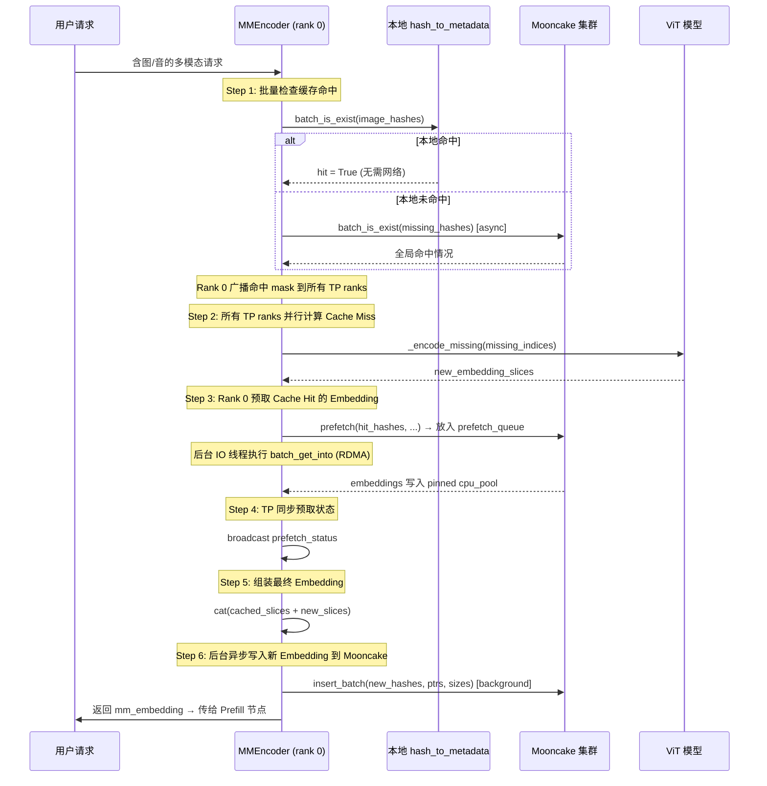

**关键实现细节**：

```python
class EmbeddingCacheController:
    def __init__(self, ...):
        # 1. Mooncake 后端 + 固定大小的 pinned 内存池
        self.mooncake_store = MooncakeEmbeddingStore()
        self.cpu_pool = torch.empty(total_pool_size_bytes, dtype=torch.uint8, pin_memory=True)
        self.mooncake_store.register_buffer(self.cpu_pool)  # RDMA 注册
        
        # 2. 变长 Embedding 的内存管理
        self.allocator = ContiguousMemoryAllocator(total_pool_size_bytes)
        self.hash_to_metadata = {}  # hash → (offset, num_tokens, dim, size)
        
        # 3. 后台 IO 线程（一个线程同时处理 GET 和 PUT 队列）
        self.io_thread = threading.Thread(target=self._io_loop, daemon=True)
        self.io_thread.start()
```

### 7.2 EPD 场景二：PD 解耦下的 KV Cache 共享（HiCache L3）

**问题**：Prefill 节点计算了大量 KV cache，但节点间无法共享，导致相同前缀被反复计算。

**解决方案**：在 Prefill Worker 上启用 HiCache + Mooncake 后端，将 KV cache 写入 Mooncake 全局池供集群内所有 SGLang 实例复用。

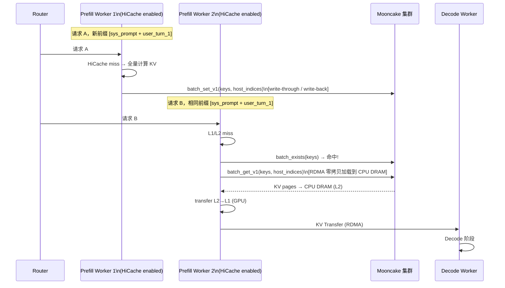

**参数示例**（README 中的 Prefill Worker 启动命令）：

```bash
MOONCAKE_MASTER=127.0.0.1:50051 \
MOONCAKE_PROTOCOL="rdma" \
MOONCAKE_GLOBAL_SEGMENT_SIZE=4294967296 \
python -m sglang.launch_server \
    --model-path [model_path] \
    --enable-hierarchical-cache \
    --hicache-storage-backend mooncake \
    --hicache-storage-prefetch-policy timeout \
    --disaggregation-mode prefill \
    --port 30000
```

### 7.3 EPD 场景三：Expert Parallelism（MooncakeEPDispatcher）

**注意**：这是 Mooncake 在 SGLang 中的第三个用途，使用的是 `mooncake_ep_buffer`（非本目录的 mooncake_store），专为 MoE（Mixture-of-Experts）模型的 Expert Parallelism token 调度设计：

```python
# python/sglang/srt/layers/moe/token_dispatcher/mooncake.py
from mooncake.mooncake_ep_buffer import Buffer

class MooncakeEPDispatcher(BaseDispatcher):
    """使用 Mooncake Buffer 进行 low-latency EP token dispatch"""
```

这属于 EP（Expert Parallelism）而非 KV 存储范畴，与本目录代码独立。

---

## 8. 配置与部署

### 8.1 部署组件关系图

```mermaid
graph TB
    subgraph 基础设施层
        MASTER["mooncake_master\n(空间管理 + 驱逐)"]
        META["http_metadata_server\n(可选，或 P2PHANDSHAKE)"]
        STORE["mooncake_store_service\n(贡献内存到池, 可选)"]
    end
    subgraph SGLang 层
        SGL["SGLang Server\n(MooncakeStore client)\n也可同时作为 store service"]
    end
    subgraph Standalone 模式（实验性）
        CLIENT["mooncake_client\n(Real Client, 管理 RDMA 和内存)"]
        DUMMY["SGLang Server\n(Dummy Client, 通过 RPC 连接)"]
    end

    MASTER <-->|分配/驱逐| STORE
    MASTER <-->|分配/驱逐| SGL
    META <-->|握手元数据| SGL
    SGL <-->|"RDMA 零拷贝"| STORE
    MASTER <-->|分配/驱逐| CLIENT
    CLIENT <-->|"RPC/IPC"| DUMMY
```

### 8.2 配置优先级

```
1. --hicache-storage-backend-extra-config 中指定 master_server_address/client_server_address
        ↓（未设置时）
2. SGLANG_HICACHE_MOONCAKE_CONFIG_PATH 指定的 JSON 文件
        ↓（未设置时）
3. 环境变量（MOONCAKE_MASTER, MOONCAKE_PROTOCOL, MOONCAKE_DEVICE, ...）
```

### 8.3 TP 并行下的内存分配

当 `tp_size > 1` 时，每个 TP rank 独立初始化一个 `MooncakeStore` 实例，各自贡献 `global_segment_size / tp_size` 的内存到全局池：

```python
per_tp_global_segment_size = self.config.global_segment_size // tp_scale_factor
ret_code = self.store.setup(..., per_tp_global_segment_size, ...)
```

这使得总贡献内存量等于 `global_segment_size`，不会因 TP 增大而成倍增长。

---

## 9. 性能优势分析

### 9.1 KV Cache L3 存储优势

| 特性 | 传统方案 | MooncakeStore |
|------|---------|---------------|
| 存储范围 | 单节点 GPU VRAM | 集群级分布式内存池 |
| 传输方式 | PCIe（CPU DRAM） | RDMA 零拷贝 |
| 跨实例共享 | 不支持 | 支持（hash key 共享） |
| 写入开销 | — | 幂等写入（已存在则跳过） |
| TP 感知 | — | 自动按 rank 分片存储 |
| MLA/MHA 支持 | — | 自适应（不同 key 后缀） |

### 9.2 Embedding 缓存优势（EPD 场景）

| 场景 | 无缓存 | 有 MooncakeEmbeddingStore |
|------|--------|--------------------------|
| 相同图片第 N 次请求 | 每次 ViT forward（~100-500ms） | RDMA 读取（~μs 级） |
| 跨节点 Embedding 共享 | 不支持 | 支持 |
| 内存效率 | 每次 GPU 计算 | CPU pinned buffer 复用 |
| TP 一致性 | 需要每 rank 各自计算 | Rank 0 预取，广播状态同步 |

### 9.3 关键路径延迟对比（理论值）

```
ViT Forward Pass (图像编码):
  └── ~200ms-500ms (取决于图像尺寸和模型大小)

MooncakeStore RDMA 读取（100KB KV page）:
  └── ~10-50μs (RDMA 延迟)
  └── 带宽：~100 GB/s (IB HDR/NDR)

Mooncake Embedding RDMA 读取（1MB embedding）:
  └── ~50-200μs
```

### 9.4 零拷贝的内存节省

```
传统路径（batch_put 需要中间 buffer）：
GPU VRAM → CPU DRAM (copy A) → Local Buffer (copy B) → Network

MooncakeStore 零拷贝路径：
CPU DRAM (已 RDMA 注册) ──────RDMA──────→ 远端节点

节省：
- 减少 1 次 CPU-side 内存拷贝
- 无需 kernel buffer 参与
- 释放 CPU cycles 用于计算
```

---

## 10. 总结

### 10.1 架构总览图

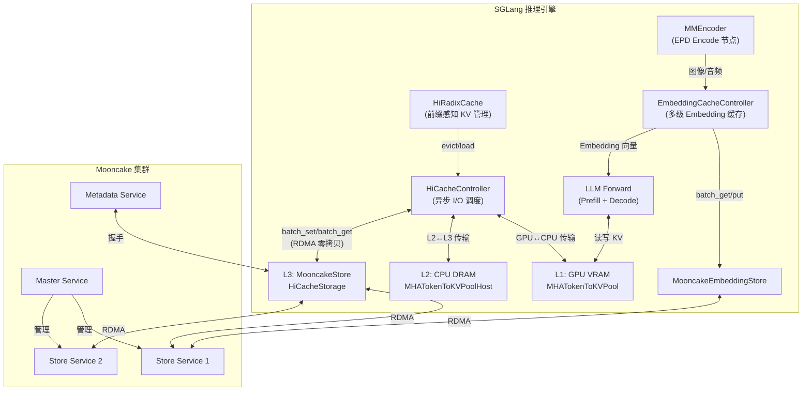

### 10.2 mooncake_store 目录的两大核心价值

| 用途 | 类 | 场景 | 核心收益 |
|------|-----|------|---------|
| **KV Cache L3 后端** | `MooncakeStore` | PD 解耦 / 长上下文 / 高并发 | 突破单节点内存限制，跨实例 KV 共享，RDMA 高带宽 |
| **Embedding 全局缓存** | `MooncakeEmbeddingStore` + `EmbeddingCacheController` | EPD 多模态 | 消除重复 ViT 计算，跨节点 Embedding 共享，后台异步 I/O |

### 10.3 设计亮点

1. **零拷贝优先**：通过 `MooncakeHostTensorAllocator` 将 CPU DRAM 直接纳入 RDMA 管理，所有数据传输均通过指针完成，无额外内存拷贝。

2. **幂等写入**：`batch_set` 先检查 key 是否存在，已存在则跳过写入，避免重复写入和竞争条件。

3. **TP/PP 感知的命名空间**：Key 后缀自动编码 tp_rank、pp_rank 信息，不同并行配置的模型可以在同一 Mooncake 集群中共存而不冲突。

4. **异步后台 I/O**：`EmbeddingCacheController` 使用独立后台线程处理 prefetch_queue 和 insert_queue，不阻塞主请求处理流程。

5. **多级降级容错**：Embedding 缓存支持完整降级链路（全局缓存命中 → 本地缓存命中 → ViT 重算），预取超时自动回退到 ViT forward，系统不会因缓存问题崩溃。

6. **共享 TransferEngine 复用**：当 PD 解耦模式和 HiCache 均使用 Mooncake 时，自动检测并复用已初始化的 `MooncakeTransferEngine`，减少重复初始化开销。
