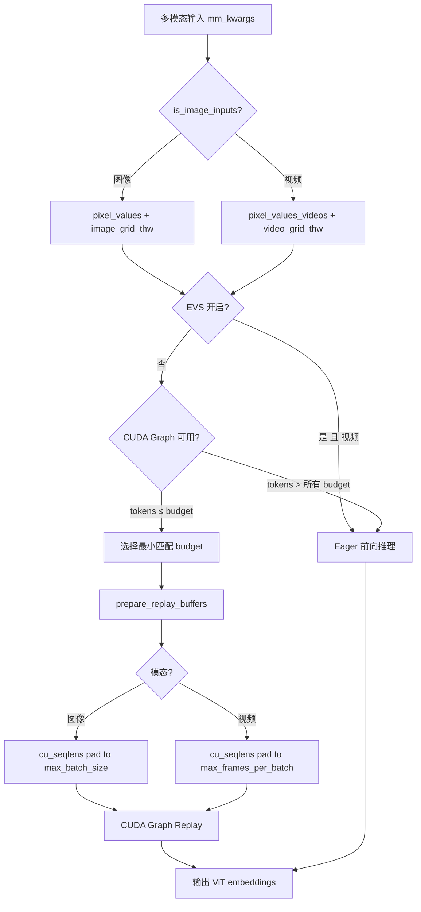

# PR #38061 优化分析与 CUDA Graph Token Budget 设置指南

> **PR**: [vllm-project/vllm#38061](https://github.com/vllm-project/vllm/pull/38061) — [MM][Perf][CG] Support ViT full CUDA graph for Qwen3-VL video inference
> **日期**: 2026-03-27

---

## 目录

- [1. PR 总结报告](#1-pr-总结报告)
- [2. 可优化的地方](#2-可优化的地方)
- [3. CUDA Graph 固定开销分析](#3-cuda-graph-固定开销分析)
- [4. 视频推理 CUDA Graph 性能优化建议](#4-视频推理-cuda-graph-性能优化建议)
- [5. Token Budget 设置指南](#5-token-budget-设置指南)

---

## 1. PR 总结报告

### 1.1 总结 (Summary)

本 PR 在 PR #35963（仅支持图像推理）的基础上，将 ViT 编码器 CUDA Graph 支持扩展至 Qwen3-VL 的**视频推理**场景。核心思路是复用图像 CUDA Graph 捕获的计算图来回放视频输入，通过引入 `max_frames_per_batch` 参数控制 `cu_seqlens` 缓冲区大小，同时增加模态感知的输入键路由机制（`modality_input_keys`），使同一个 CUDA Graph 管理器能同时处理图像和视频两种模态。

### 1.2 背景与动机 (Background & Motivation)

- **前序工作**: PR #35963 为 Qwen3-VL 的图像推理实现了 ViT 编码器的 CUDA Graph 捕获/回放，消除了编码器的 kernel launch 开销。
- **问题**: 视频推理时，每个视频包含多帧（T > 1），每帧对应一个注意力序列，导致 `cu_seqlens` 缓冲区大小超过 `max_batch_size`，原有图像模式的 CUDA Graph 无法直接复用。
- **EVS 约束**: 当 EVS（Efficient Video Sampling）剪枝启用时，token 数量是数据依赖的（需根据帧间差异动态选择保留的 token），无法被 CUDA Graph 捕获，因此仅在 EVS 关闭时启用视频 CUDA Graph。
- **性能收益**: 基准测试显示 FLASHINFER 后端 P99 延迟降低 66.9%（41.40ms → 13.70ms），FLASH_ATTN 后端 P99 降低 24.3%。

### 1.3 代码修改分析 (Code Change Analysis)

#### 修改的模块

| 文件 | 变更 | 说明 |
|------|------|------|
| `vllm/config/compilation.py` | +17 -1 | 新增 `encoder_cudagraph_max_frames_per_batch` 配置项及校验 |
| `vllm/model_executor/models/interfaces.py` | +10 -1 | Protocol 新增 `is_image_inputs()` 方法及 `max_frames_per_batch` 参数 |
| `vllm/model_executor/models/qwen3_vl.py` | +167 -39 | 实现视频模态支持：模态路由、grid 构建、capture/replay 逻辑 |
| `vllm/v1/worker/encoder_cudagraph.py` | +31 -6 | Manager 层增加 `max_frames_per_batch` 处理和模态输入键路由 |
| `vllm/v1/worker/encoder_cudagraph_defs.py` | +6 -1 | `EncoderCudaGraphConfig` 新增 `modality_input_keys` 字段 |
| `tests/v1/cudagraph/test_encoder_cudagraph.py` | +327 -0 | 视频模态的 Mock 模型及完整 GPU 测试 |

#### 架构 / 流程图



#### 关键实现细节

- **模态路由**: 通过 `is_image_inputs()` 方法判断输入模态，`_get_pixel_values_by_modality()` 和 `_get_grid_thw_by_modality()` 统一封装模态感知的数据访问。
- **`max_frames_per_batch`**: 新增配置项控制视频帧的 `cu_seqlens` 缓冲区大小。自动推断时取 `token_budget`（因为 packing 保证 `sum(T_i) <= token_budget`）。
- **Capture Grid 构建**: 当 `frames_per_item > 1` 时，使用视频格式的 grid（T > 1），使 `cu_seqlens` 在捕获时就足够大，无需额外 padding。
- **EVS 互斥**: `get_encoder_cudagraph_config()` 中检查 `is_multimodal_pruning_enabled`，仅在 EVS 关闭时将 "video" 加入 `modalities` 列表。
- **`modality_input_keys`**: `EncoderCudaGraphConfig` 新增字典字段，支持不同模态使用不同的输入张量键（如 image → `pixel_values`，video → `pixel_values_videos`）。
- **`_get_input_key_by_modality()`**: Manager 层根据模态查找正确的输入键，回放时将数据复制到正确的捕获缓冲区。

### 1.4 涉及的技术原理 (Technical Principles)

- **CUDA Graph**: 将 GPU kernel 序列录制为图，后续回放时跳过 CPU 端的 kernel launch 开销。对于 ViT 编码器这类计算图固定的模块特别有效。限制是无法处理数据依赖的动态控制流。

- **cu_seqlens 与 Flash Attention**: Flash Attention 使用 `cu_seqlens`（累积序列长度）来标记 batch 中每个序列的边界。视频中每帧是一个独立的注意力序列，因此 T 帧的视频会在 `cu_seqlens` 中产生 T 个条目，而非图像模式的 1 个。

- **Token Budget Packing**: 编码器 CUDA Graph 使用贪心 packing 策略，将多个图像/视频打包到一个固定大小的 token budget 内执行。Packing 保证 `sum(output_tokens) <= budget`，这也隐含了 `sum(T_i) <= budget`。

- **EVS (Efficient Video Sampling)**: 一种视频 token 剪枝技术，根据帧间相似度动态选择保留的 token。因为涉及 `torch.argsort` 和 boolean indexing，产生数据依赖的动态索引，无法被 CUDA Graph 捕获。

### 1.5 评论区讨论亮点 (Discussion Highlights)

- **Mergify**: 提示存在合并冲突，需要 rebase。
- **Gemini Code Assist**: 提供了自动 Code Review，确认了 PR 的核心设计合理，包括模态感知路由、EVS 互斥等关键决策。
- 当前尚无 maintainer 的实质性 review 评论（PR 仍处于 Draft 状态）。

### 1.6 风险与潜在问题 (Risk Analysis)

| 风险 | 严重程度 | 说明 |
|------|---------|------|
| `is_image_inputs` 方法命名与语义 | Low | 方法名暗示二分类（image vs non-image），但 Protocol 应考虑未来更多模态（如 audio）。建议改为更通用的 `get_modality()` 返回枚举值 |
| `max_frames_per_batch` 自动推断为 `token_budget` | Medium | 当视频帧的空间分辨率很小时（如每帧仅 1 token），`token_budget` 个帧会导致 `cu_seqlens` 缓冲区非常大，浪费显存。实际场景中每帧至少 4 tokens，但极端情况值得考虑 |
| 视频 capture 使用视频格式 grid 但 replay 可能是图像 | Low | 代码通过 `is_image_inputs` 分流处理，图像 replay 时 `cu_seqlens` 可能有多余 padding，但不影响正确性 |
| `prepare_encoder_cudagraph_replay_buffers` 中视频路径不传 `max_batch_size` | Medium | 视频路径只传了 `max_frames_per_batch`，而 `max_batch_size` 被省略（默认 None），需确认 `prepare_encoder_metadata` 在此路径下不需要 `max_batch_size` |
| 测试仅覆盖单 GPU 场景 | Medium | DP VIT + CUDA Graph 的组合测试尚未完成（TODO 中标记未完成） |
| 接口变更的向后兼容性 | Medium | `prepare_encoder_cudagraph_capture_inputs` 和 `prepare_encoder_cudagraph_replay_buffers` 新增必选参数 `max_frames_per_batch`，所有实现该 Protocol 的模型都需要更新 |
| import 路径变更 | Low | 将 `encoder_cudagraph_defs` 从 `vllm.v1.worker.gpu.mm` 移动到 `vllm.v1.worker`，可能影响其他引用该模块的代码 |

### 1.7 结论 (Conclusion)

该 PR 设计合理，在复用图像 CUDA Graph 基础设施的同时优雅地解决了视频多帧 `cu_seqlens` 缓冲区大小的核心问题。EVS 互斥的处理思路清晰且有充分的注释说明。建议关注 `is_image_inputs` 的可扩展性设计、视频 replay 路径中 `max_batch_size` 的传递完整性，以及 DP VIT 场景的测试补充。

---

## 2. 可优化的地方

### 2.1 `is_image_inputs` 方法的可扩展性

当前设计是一个布尔方法（image vs non-image），如果未来要支持 audio 等更多模态，扩展性不好。建议改为：

```python
def get_input_modality(self, mm_kwargs: dict[str, Any]) -> str:
    """Return the modality name, e.g. 'image', 'video', 'audio'."""
```

这样 `_get_input_key_by_modality` 和其他路由逻辑可以直接使用返回的 modality 字符串查 `modality_input_keys` 字典，消除所有 `if/else` 分支。

### 2.2 `prepare_encoder_cudagraph_replay_buffers` 视频路径参数传递

在 `qwen3_vl.py` 中视频路径只传了 `max_frames_per_batch`，没传 `max_batch_size`：

```python
if self.is_image_inputs(mm_kwargs):
    buffers = self.visual.prepare_encoder_metadata(
        grid_thw_list, max_batch_size=max_batch_size)
else:
    buffers = self.visual.prepare_encoder_metadata(
        grid_thw_list, max_frames_per_batch=max_frames_per_batch)
```

建议确认这是否是有意为之。如果 `prepare_encoder_metadata` 在两条路径下都需要知道两个参数，可以统一传递。

### 2.3 Mock 模型代码重复

`SimpleMockVideoViTModel` 与 `SimpleMockViTModel` 有大量重复代码（`_forward`、`select_encoder_cudagraph_items` 等逻辑几乎一样）。可以考虑：
- 提取一个 `BaseMockViTModel` 基类，子类只覆写模态相关的差异部分
- 这样新增模态的测试也更方便

### 2.4 `_get_grid_thw_by_modality` 的 `to_list` 参数

这个方法有一个 `to_list: bool = False` 参数来决定是否将 tensor 转为 list，但大部分调用处都传了 `to_list=True`。建议：
- 默认值改为 `True`，减少调用处的冗余参数
- 或者直接统一返回 list（因为 CUDA Graph 路径需要 list 格式的 grid_thw）

### 2.5 Benchmark 数据补充

PR 中 FLASH_ATTN 后端的 Mean 延迟实际上**劣化了 12.5%**（4.00ms → 4.50ms），虽然 P99 有改善。建议：
- 补充 DP VIT 场景的 benchmark（TODO 中标记未完成）
- 分析 FLASH_ATTN mean 劣化的原因，可能是 CUDA Graph 捕获/回放的固定开销在小规模输入时不划算
- 考虑增加阈值判断：当 token 数很少时 fallback 到 eager 模式

### 2.6 合并冲突

Mergify 已提示有合并冲突，需要 rebase 到最新 main 分支。

---

## 3. CUDA Graph 固定开销分析

> **结论：小规模输入时 CUDA Graph 不划算。**

### 3.1 CUDA Graph 的开销构成

1. **捕获阶段（一次性）**: 录制 kernel 序列、分配固定缓冲区、存储图拓扑结构 — 这是启动时的固定成本
2. **回放阶段（每次推理）**: 虽然跳过了 CPU 端 kernel launch，但仍有固定开销：
   - 将实际输入**拷贝到捕获时的固定缓冲区**（`input_buffer.zero_()` + slice copy）
   - 准备 replay buffers（`prepare_encoder_cudagraph_replay_buffers`，重新计算 `cu_seqlens`、`pos_embeds` 等）
   - 图回放本身的调度开销

### 3.2 为什么小规模不划算

核心矛盾：**CUDA Graph 省掉的是 CPU 端 kernel launch 开销，而不是 GPU 计算时间。**

| 输入规模 | kernel launch 开销占比 | GPU 计算时间 | CUDA Graph 收益 |
|---------|----------------------|-------------|----------------|
| 小（token 少） | 高（计算快，launch 占比大） | 很短 | 理论上该受益，但 buffer copy + replay 准备的**固定开销**可能 >= 省掉的 launch 开销 |
| 大（token 多） | 低（计算本身耗时占主导） | 长 | 省掉的 launch 开销绝对值大，且固定开销占总时间比例小 |

具体到这个 PR 的场景：

```python
# 回放时的固定开销（与输入大小无关）
input_buffer.zero_()           # 清零整个 budget 大小的缓冲区
input_buffer[:n].copy_(src)    # 拷贝实际数据
prepare_encoder_metadata(...)  # 重算 cu_seqlens, rotary_pos_emb 等
```

当输入很小时（比如一个 224×224 的图像，仅 64 tokens）：
- ViT 前向计算本身可能只需 **< 1ms**
- 但清零 + 拷贝一个按 `token_budget`（可能几千 tokens）大小分配的缓冲区、加上 replay buffer 准备，这些固定开销可能就有 **0.3-0.5ms**
- 净收益为负，eager 模式反而更快

这正好解释了 benchmark 数据中 **FLASH_ATTN Mean 劣化 12.5%**（4.00ms → 4.50ms）— 平均输入规模偏小时，CUDA Graph 的固定开销抵消了收益。而 **P99 改善 24.3%** 是因为 P99 对应的是大输入，此时 kernel launch 开销占比更大，CUDA Graph 的收益更显著。

### 3.3 优化建议

可以加一个 **minimum token 阈值**，低于该阈值时直接走 eager 路径：

```python
# 在 execute() 中
total_tokens = sum(per_item_out_tokens)
if total_tokens < MIN_CG_THRESHOLD:  # e.g. 128
    return self._eager_fallback(mm_kwargs)
```

---

## 4. 视频推理 CUDA Graph 性能优化建议

### 4.1 减少 Replay 时的固定开销

#### 4.1.1 避免每次 replay 都重算 `cu_seqlens` 和 rotary embeddings

当前每次 replay 都调用 `prepare_encoder_metadata` 重新计算所有 buffer：

```python
# qwen3_vl.py - prepare_encoder_cudagraph_replay_buffers
buffers = self.visual.prepare_encoder_metadata(
    grid_thw_list, max_frames_per_batch=max_frames_per_batch)
```

`prepare_encoder_metadata` 内部做了大量 CPU 侧计算（NumPy 拼接、padding、转 tensor），这些都是**同步操作**，会阻塞 GPU pipeline。

**优化思路**: 对相同 `grid_thw` 模式缓存 replay buffers。视频推理中很多视频分辨率相同（如统一 resize 到 256×256），相同 `grid_thw` 的 replay buffers 完全可以复用：

```python
# 伪代码
_replay_cache: dict[tuple, EncoderCudaGraphReplayBuffers] = {}

def prepare_encoder_cudagraph_replay_buffers(self, mm_kwargs, ...):
    cache_key = tuple(tuple(x) for x in grid_thw_list)
    if cache_key in self._replay_cache:
        return self._replay_cache[cache_key]
    # ... 计算 ...
    self._replay_cache[cache_key] = result
    return result
```

#### 4.1.2 `input_buffer.zero_()` 可以省略

当前 `_run_budget_graph` 中每次回放都先清零整个缓冲区：

```python
# encoder_cudagraph.py
graph_meta.input_buffer.zero_()    # 清零整个 budget 大小
graph_meta.input_buffer[:n].copy_(src)  # 只用了前 n 行
```

清零是为了让 padding 位置不影响注意力计算，但 `cu_seqlens` 已经通过掩码把 padding 位置排除了。**Flash Attention 不会读取 `cu_seqlens` 范围之外的数据**，所以 `zero_()` 是多余的，可以直接删掉，省一次全缓冲区的显存写操作。

### 4.2 优化 Budget 选择策略

#### 4.2.1 视频感知的 budget 分级

当前 budget 列表对图像和视频共用，但视频的 token 分布特征与图像不同：

- 图像：token 数 = `(h//m) * (w//m)`，通常是 64 ~ 1024
- 视频：token 数 = `T * (h//m) * (w//m)`，帧数 T 使得 token 数跳跃式增长

这意味着固定步长的 budget 列表（如 `[512, 1024, 1536, ...]`）对视频会有较大的 padding 浪费。例如一个 3 帧 224×224 的视频有 192 tokens，但最小 budget 是 512，浪费了 62%。

**优化思路**: 为视频增加更细粒度的小 budget 档位，或者根据 `T * spatial_tokens` 的常见组合自适应生成 budget 列表：

```python
# 针对视频常见帧数 (1,2,3,4,8) × 常见空间 token 数 (64,256)
# 生成更贴合的 budget: [64, 128, 192, 256, 512, 768, 1024, ...]
```

#### 4.2.2 增加小 token 阈值走 eager

如上一个问题讨论的，增加最小阈值判断：

```python
if total_out_tokens < self.min_cg_threshold:
    return self._eager_fallback(mm_kwargs)
```

### 4.3 减少视频帧的 Packing 开销

#### 当前 packing 策略对多帧视频不够高效

当前的贪心 packing 是按 **item 粒度**（整个视频）打包的。一个 8 帧的视频可能有 512 tokens，直接占满一个 budget，即使这个 budget 还有空间放其他小视频。

但更关键的是，当一个视频的 token 数 **刚好超过**某个 budget 时，会跳到下一个更大的 budget，或者 fallback 到 eager。

**优化思路**: 对于超大视频，可以考虑**帧级别拆分**——将一个长视频拆成多个帧组（chunk），每组独立走 CUDA Graph，最后拼接输出。这样能更好地利用 budget：

```python
# 如 16 帧视频拆成 2 组 × 8 帧
# 每组 token 数减半，更容易匹配到合适的 budget
```

### 4.4 Capture 阶段优化

#### 4.4.1 减少不必要的 budget 捕获

当前对每个 budget 都捕获一个 CUDA Graph，但实际推理时某些 budget 可能几乎不会命中。每个捕获的 graph 都会占用 GPU 显存（存储 kernel 参数和中间张量）。

**优化思路**: 采用 **lazy capture**（按需捕获），首次命中某个 budget 时才捕获：

```python
def _find_or_capture_budget(self, budget):
    if budget not in self.budget_graphs:
        self._capture_budget_graph(budget)
    return self.budget_graphs[budget]
```

这样可以减少启动时间和显存占用，尤其当 budget 列表很长时。

#### 4.4.2 `max_frames_per_batch` 自动推断过大

当前自动推断 `max_frames_per_batch = token_budget`，这是理论上界。但实际中每帧至少产生 `(h_min//m) * (w_min//m) >= 4` 个 token，所以真实上界是 `token_budget // 4`。

```python
# 当前：可能分配数千个 cu_seqlens 条目
max_frames = token_budget  # e.g. 4096

# 优化后：
min_tokens_per_frame = (min_h // spatial_merge) * (min_w // spatial_merge)  # 至少 4
max_frames = token_budget // min_tokens_per_frame  # e.g. 1024
```

这能将 `cu_seqlens` 缓冲区大小减少 4 倍，降低 capture 和 replay 时的显存和 padding 开销。

### 4.5 优先级总结

| 优化项 | 预期收益 | 实现难度 | 优先级 |
|-------|---------|---------|-------|
| 去掉 `input_buffer.zero_()` | 低延迟改善 | 很低 | **P0** |
| replay buffers 缓存 | 减少 CPU 同步阻塞 | 低 | **P0** |
| `max_frames_per_batch` 更紧上界 | 减少显存浪费 | 很低 | **P1** |
| 小 token 阈值走 eager | 避免小输入劣化 | 低 | **P1** |
| 视频感知的 budget 分级 | 减少 padding 浪费 | 中 | **P2** |
| Lazy capture | 减少启动时间和显存 | 中 | **P2** |
| 帧级别拆分 packing | 提升大视频利用率 | 高 | **P3** |

其中 P0 的两项改动最小、收益最直接，建议优先考虑。

---

## 5. Token Budget 设置指南

### 5.1 Token 计算公式

Qwen3-VL ViT 参数：
- `patch_size = 14`
- `temporal_patch_size = 2`（每 2 帧合并为 1 个时间步）
- `spatial_merge_size = 2`

```
T = 帧数 / temporal_patch_size
空间维度需 resize 到 patch_size × spatial_merge_size = 28 的倍数
h_patches = resize_h / patch_size
w_patches = resize_w / patch_size
输出 token 数 = T × (h_patches / spatial_merge_size) × (w_patches / spatial_merge_size)
```

### 5.2 场景一：16 帧 256×256

```
T = 16 / 2 = 8
256 / 28 = 9.14 → resize 到 252 (= 9 × 28)
h_patches = 252 / 14 = 18, w_patches = 18
grid_thw = [8, 18, 18]
输出 token 数 = 8 × 9 × 9 = 648
```

**推荐配置：**

```python
compilation_config = {
    "cudagraph_mm_encoder": True,
    "encoder_cudagraph_token_budgets": [256, 512, 768, 1024, 1536, 2048],
    "encoder_cudagraph_max_images_per_batch": 8,
    "encoder_cudagraph_max_frames_per_batch": 64,
}
```

| Budget | 覆盖场景 | 说明 |
|--------|---------|------|
| 256 | 单张图像 / 短视频 (2-4帧) | 如 `[2,18,18]` = 162 tokens |
| 512 | 中等视频 (4-8帧小分辨率) | 如 `[4,18,18]` = 324 tokens |
| **768** | **目标场景** | **648 tokens → 命中 768，padding 仅 15.6%** |
| 1024 | 更高分辨率或更多帧 | 如 `[8,20,20]` = 800 tokens |
| 1536 | 长视频 / 高分辨率 | 如 `[16,18,18]` 对应的场景 |
| 2048 | 极端场景兜底 | 避免频繁 eager fallback |

关键提示：如果 budget 列表里没有 768，648 tokens 会命中 1024，浪费 36.7%。加上 768 后浪费降到 15.6%。

### 5.3 场景二：16 帧 224×224

```
T = 16 / 2 = 8
224 / 28 = 8 → 恰好整除，无需 resize
h_patches = 224 / 14 = 16, w_patches = 16
grid_thw = [8, 16, 16]
输出 token 数 = 8 × 8 × 8 = 512
```

**推荐配置：**

```python
compilation_config = {
    "cudagraph_mm_encoder": True,
    "encoder_cudagraph_token_budgets": [128, 256, 512, 1024, 1536, 2048],
    "encoder_cudagraph_max_images_per_batch": 8,
    "encoder_cudagraph_max_frames_per_batch": 64,
}
```

| Budget | 覆盖场景 | 说明 |
|--------|---------|------|
| 128 | 单张 224×224 图像 | `[1,16,16]` = 64 tokens |
| 256 | 短视频 (4帧) | `[2,16,16]` = 128 tokens |
| **512** | **目标场景** | **512 tokens → 精确命中，零 padding** |
| 1024 | 2 个视频 packing | 2 × 512 = 1024 |
| 1536 | 3 个视频 packing | 3 × 512 = 1536 |
| 2048 | 4 个视频 packing | 4 × 512 = 2048 |

如果规格固定（都是 16帧 224×224），可以极简配置：

```python
"encoder_cudagraph_token_budgets": [512, 1024, 2048],
```

三个档位分别覆盖 1/2/4 个视频的 packing，每个都零 padding。

### 5.4 场景三：16 帧 448×448

```
T = 16 / 2 = 8
448 / 28 = 16 → 恰好整除
h_patches = 448 / 14 = 32, w_patches = 32
grid_thw = [8, 32, 32]
输出 token 数 = 8 × 16 × 16 = 2048
```

**推荐配置：**

```python
compilation_config = {
    "cudagraph_mm_encoder": True,
    "encoder_cudagraph_token_budgets": [256, 512, 1024, 2048, 4096],
    "encoder_cudagraph_max_images_per_batch": 4,
    "encoder_cudagraph_max_frames_per_batch": 64,
}
```

| Budget | 覆盖场景 | 说明 |
|--------|---------|------|
| 256 | 单张 448×448 图像 | `[1,32,32]` = 256 tokens |
| 512 | 短视频 (4帧) | `[2,32,32]` = 512 tokens |
| 1024 | 半长度视频 (8帧) | `[4,32,32]` = 1024 tokens |
| **2048** | **目标场景** | **2048 tokens → 精确命中，零 padding** |
| 4096 | 2 个视频 packing | 2 × 2048 = 4096 |

注意：`max_images_per_batch` 建议调低到 4，因为 2048 tokens/视频 已经很大。

### 5.5 场景四：4 帧 224×224

```
T = 4 / 2 = 2
224 / 28 = 8 → 整除
h_patches = 224 / 14 = 16, w_patches = 16
grid_thw = [2, 16, 16]
输出 token 数 = 2 × 8 × 8 = 128
```

**推荐配置：**

```python
compilation_config = {
    "cudagraph_mm_encoder": True,
    "encoder_cudagraph_token_budgets": [128, 256, 512, 1024],
    "encoder_cudagraph_max_images_per_batch": 8,
    "encoder_cudagraph_max_frames_per_batch": 16,
}
```

| Budget | 覆盖场景 | 说明 |
|--------|---------|------|
| **128** | **目标场景** | **128 tokens → 精确命中，零 padding** |
| 256 | 2 个视频 packing | 2 × 128 = 256 |
| 512 | 4 个视频 packing | 4 × 128 = 512 |
| 1024 | 8 个视频 packing | 8 × 128 = 1024 |

注意：128 tokens 的 ViT 前向计算极快，CUDA Graph 的固定开销占比很高，建议先 benchmark 对比 eager vs CUDA Graph，确认确实有收益再启用。

### 5.6 四种场景汇总

| 输入 | grid_thw | tokens | 最佳 budget | 建议 max_frames |
|------|----------|--------|------------|----------------|
| 4帧 224×224 | [2,16,16] | **128** | 128 | 16 |
| 16帧 224×224 | [8,16,16] | **512** | 512 | 64 |
| 16帧 256×256 | [8,18,18] | **648** | 768 | 64 |
| 16帧 448×448 | [8,32,32] | **2048** | 2048 | 32 |

规律：**token 数 = T × (h/28)² × 2**，分辨率对 token 数的影响远大于帧数（面积 vs 线性）。Budget 设置应以目标分辨率为主要依据，帧数变化在其基础上做倍数调整。

**28 的整数倍分辨率**（224、448、672...）在 budget 匹配上最友好，token 数恰好是 2 的幂次，零浪费。256 这种非整数倍的分辨率反而会产生不齐整的 token 数。
