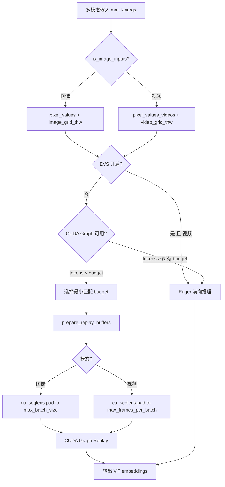

# PR #38061: [MM][Perf][CG] Support ViT full CUDA graph for Qwen3-VL video inference

> **Author**: @shen-shanshan | **State**: OPEN (Draft) | **Date**: 2026-03-25
> **Branch**: `vit-cg` → `main` | **Labels**: performance, v1, multi-modality, qwen, nvidia
> **Changes**: +558 -48 lines across 6 files

---

## 1. 总结 (Summary)

本 PR 在 PR #35963（仅支持图像推理）的基础上，将 ViT 编码器 CUDA Graph 支持扩展至 Qwen3-VL 的**视频推理**场景。核心思路是复用图像 CUDA Graph 捕获的计算图来回放视频输入，通过引入 `max_frames_per_batch` 参数控制 `cu_seqlens` 缓冲区大小，同时增加模态感知的输入键路由机制（`modality_input_keys`），使同一个 CUDA Graph 管理器能同时处理图像和视频两种模态。

## 2. 背景与动机 (Background & Motivation)

- **前序工作**: PR #35963 为 Qwen3-VL 的图像推理实现了 ViT 编码器的 CUDA Graph 捕获/回放，消除了编码器的 kernel launch 开销。
- **问题**: 视频推理时，每个视频包含多帧（T > 1），每帧对应一个注意力序列，导致 `cu_seqlens` 缓冲区大小超过 `max_batch_size`，原有图像模式的 CUDA Graph 无法直接复用。
- **EVS 约束**: 当 EVS（Efficient Video Sampling）剪枝启用时，token 数量是数据依赖的（需根据帧间差异动态选择保留的 token），无法被 CUDA Graph 捕获，因此仅在 EVS 关闭时启用视频 CUDA Graph。
- **性能收益**: 基准测试显示 FLASHINFER 后端 P99 延迟降低 66.9%（41.40ms → 13.70ms），FLASH_ATTN 后端 P99 降低 24.3%。

## 3. 代码修改分析 (Code Change Analysis)

### 3.1 修改的模块

| 文件 | 变更 | 说明 |
|------|------|------|
| `vllm/config/compilation.py` | +17 -1 | 新增 `encoder_cudagraph_max_frames_per_batch` 配置项及校验 |
| `vllm/model_executor/models/interfaces.py` | +10 -1 | Protocol 新增 `is_image_inputs()` 方法及 `max_frames_per_batch` 参数 |
| `vllm/model_executor/models/qwen3_vl.py` | +167 -39 | 实现视频模态支持：模态路由、grid 构建、capture/replay 逻辑 |
| `vllm/v1/worker/encoder_cudagraph.py` | +31 -6 | Manager 层增加 `max_frames_per_batch` 处理和模态输入键路由 |
| `vllm/v1/worker/encoder_cudagraph_defs.py` | +6 -1 | `EncoderCudaGraphConfig` 新增 `modality_input_keys` 字段 |
| `tests/v1/cudagraph/test_encoder_cudagraph.py` | +327 -0 | 视频模态的 Mock 模型及完整 GPU 测试 |

### 3.2 架构 / 流程图

### 3.3 关键实现细节

- **模态路由**: 通过 `is_image_inputs()` 方法判断输入模态，`_get_pixel_values_by_modality()` 和 `_get_grid_thw_by_modality()` 统一封装模态感知的数据访问。
- **`max_frames_per_batch`**: 新增配置项控制视频帧的 `cu_seqlens` 缓冲区大小。自动推断时取 `token_budget`（因为 packing 保证 `sum(T_i) <= token_budget`）。
- **Capture Grid 构建**: 当 `frames_per_item > 1` 时，使用视频格式的 grid（T > 1），使 `cu_seqlens` 在捕获时就足够大，无需额外 padding。
- **EVS 互斥**: `get_encoder_cudagraph_config()` 中检查 `is_multimodal_pruning_enabled`，仅在 EVS 关闭时将 "video" 加入 `modalities` 列表。
- **`modality_input_keys`**: `EncoderCudaGraphConfig` 新增字典字段，支持不同模态使用不同的输入张量键（如 image → `pixel_values`，video → `pixel_values_videos`）。
- **`_get_input_key_by_modality()`**: Manager 层根据模态查找正确的输入键，回放时将数据复制到正确的捕获缓冲区。

## 4. 涉及的技术原理 (Technical Principles)

- **CUDA Graph**: 将 GPU kernel 序列录制为图，后续回放时跳过 CPU 端的 kernel launch 开销。对于 ViT 编码器这类计算图固定的模块特别有效。限制是无法处理数据依赖的动态控制流。

- **cu_seqlens 与 Flash Attention**: Flash Attention 使用 `cu_seqlens`（累积序列长度）来标记 batch 中每个序列的边界。视频中每帧是一个独立的注意力序列，因此 T 帧的视频会在 `cu_seqlens` 中产生 T 个条目，而非图像模式的 1 个。

- **Token Budget Packing**: 编码器 CUDA Graph 使用贪心 packing 策略，将多个图像/视频打包到一个固定大小的 token budget 内执行。Packing 保证 `sum(output_tokens) <= budget`，这也隐含了 `sum(T_i) <= budget`。

- **EVS (Efficient Video Sampling)**: 一种视频 token 剪枝技术，根据帧间相似度动态选择保留的 token。因为涉及 `torch.argsort` 和 boolean indexing，产生数据依赖的动态索引，无法被 CUDA Graph 捕获。

## 5. 评论区讨论亮点 (Discussion Highlights)

- **Mergify**: 提示存在合并冲突，需要 rebase。
- **Gemini Code Assist**: 提供了自动 Code Review，确认了 PR 的核心设计合理，包括模态感知路由、EVS 互斥等关键决策。
- 当前尚无 maintainer 的实质性 review 评论（PR 仍处于 Draft 状态）。

## 6. 风险与潜在问题 (Risk Analysis)

| 风险 | 严重程度 | 说明 |
|------|---------|------|
| `is_image_inputs` 方法命名与语义 | Low | 方法名暗示二分类（image vs non-image），但 Protocol 应考虑未来更多模态（如 audio）。建议改为更通用的 `get_modality()` 返回枚举值 |
| `max_frames_per_batch` 自动推断为 `token_budget` | Medium | 当视频帧的空间分辨率很小时（如每帧仅 1 token），`token_budget` 个帧会导致 `cu_seqlens` 缓冲区非常大，浪费显存。实际场景中每帧至少 4 tokens，但极端情况值得考虑 |
| 视频 capture 使用视频格式 grid 但 replay 可能是图像 | Low | 代码通过 `is_image_inputs` 分流处理，图像 replay 时 `cu_seqlens` 可能有多余 padding，但不影响正确性 |
| `prepare_encoder_cudagraph_replay_buffers` 中视频路径不传 `max_batch_size` | Medium | 视频路径只传了 `max_frames_per_batch`，而 `max_batch_size` 被省略（默认 None），需确认 `prepare_encoder_metadata` 在此路径下不需要 `max_batch_size` |
| 测试仅覆盖单 GPU 场景 | Medium | DP VIT + CUDA Graph 的组合测试尚未完成（TODO 中标记未完成） |
| 接口变更的向后兼容性 | Medium | `prepare_encoder_cudagraph_capture_inputs` 和 `prepare_encoder_cudagraph_replay_buffers` 新增必选参数 `max_frames_per_batch`，所有实现该 Protocol 的模型都需要更新 |
| import 路径变更 | Low | 将 `encoder_cudagraph_defs` 从 `vllm.v1.worker.gpu.mm` 移动到 `vllm.v1.worker`，可能影响其他引用该模块的代码 |

## 7. 结论 (Conclusion)

该 PR 设计合理，在复用图像 CUDA Graph 基础设施的同时优雅地解决了视频多帧 `cu_seqlens` 缓冲区大小的核心问题。EVS 互斥的处理思路清晰且有充分的注释说明。建议关注 `is_image_inputs` 的可扩展性设计、视频 replay 路径中 `max_batch_size` 的传递完整性，以及 DP VIT 场景的测试补充。
