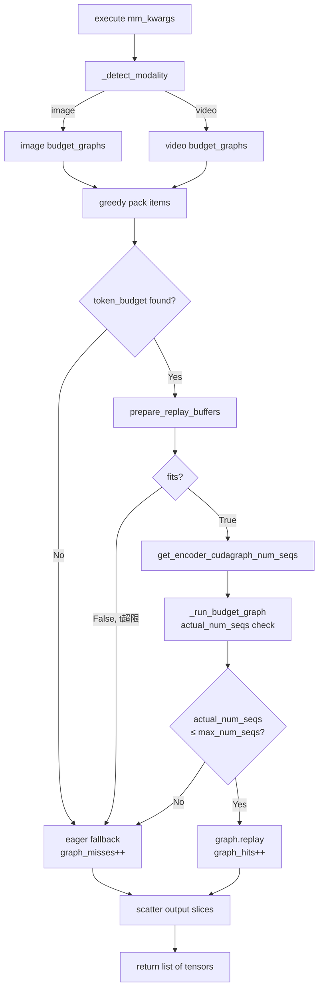

# Qwen3-VL 视频模态 Full CUDA Graph 支持实现

基于 PR [#35963](https://github.com/vllm-project/vllm/pull/35963)（已合入 main），在其图像 CUDA Graph 支持的基础上，扩展实现视频模态的 Full CUDA Graph 支持。

---

## 修改文件总览

| 文件 | 改动类型 | 说明 |
|------|---------|------|
| `vllm/v1/worker/gpu/mm/encoder_cudagraph_defs.py` | 数据结构扩展 | 新增多模态配置字段和状态字段 |
| `vllm/v1/worker/gpu/mm/encoder_cudagraph.py` | 核心逻辑扩展 | per-modality budget 管理、自动模态检测、时序帧约束检查 |
| `vllm/model_executor/models/interfaces.py` | 协议扩展 | 新增 `get_encoder_cudagraph_num_seqs` 方法 |
| `vllm/model_executor/models/qwen3_vl.py` | 模型实现 | 为所有协议方法添加视频支持 |
| `tests/v1/cudagraph/test_encoder_cudagraph.py` | 测试更新 | 适配新的多模态 API |

---

## 1. encoder_cudagraph_defs.py

### 新增字段

```python
@dataclass
class EncoderCudaGraphConfig:
    modalities: list[str]
    input_key: str            # fallback key
    buffer_keys: list[str]
    out_hidden_size: int
    modality_input_keys: dict[str, str] | None = None
    # e.g. {"image": "pixel_values", "video": "pixel_values_videos"}

@dataclass
class EncoderCudaGraphCaptureInputs:
    mm_kwargs: dict[str, Any]
    buffers: dict[str, torch.Tensor]
    max_num_seqs: int = 0
    # images: == max_batch_size (t=1)
    # videos: == max_batch_size * t_capture (总时序帧数)

@dataclass
class EncoderCudaGraphReplayBuffers:
    buffers: dict[str, torch.Tensor | None]
    fits: bool = True
    # False → 当前 batch 时序帧数超出 captured 约束 → 触发 eager fallback
```

---

## 2. encoder_cudagraph.py

### 关键改动

**`BudgetGraphMetadata`**：新增 `max_num_seqs: int = 0`

**`budget_graphs` 类型变更**：
```python
# 之前 (单模态)
budget_graphs: dict[int, BudgetGraphMetadata]

# 之后 (多模态)
budget_graphs: dict[str, dict[int, BudgetGraphMetadata]]
# 外层 key = modality ("image" / "video")
# 内层 key = token_budget
```

**新增辅助方法**：
```python
def _detect_modality(self, mm_kwargs) -> str:
    # 通过 modality_input_keys 检查 mm_kwargs 中的 key 自动推断模态
    # 无需调用方传入 modality 参数 → gpu_model_runner.py 零修改

def _get_input_key(self, modality: str) -> str:
    # 返回该模态的 pixel_values key
```

**`capture()` 循环所有模态**：
```python
def capture(self):
    for modality in self.config.modalities:       # ["image", "video"]
        for token_budget in self.token_budgets:
            self._capture_budget_graph(modality, token_budget)
```

**`_run_budget_graph()` 增加时序约束检查**：
```python
# 若实际 cu_seqlens 段数超过 captured 时的 max_num_seqs → 返回 None → eager fallback
if graph_meta.max_num_seqs > 0 and actual_num_seqs > graph_meta.max_num_seqs:
    self.graph_misses += num_items
    return None
```

---

## 3. interfaces.py（SupportsEncoderCudaGraph 协议）

新增方法：
```python
def get_encoder_cudagraph_num_seqs(self, mm_kwargs: dict[str, Any]) -> int:
    """
    返回 cu_seqlens 的总段数。
    图像：== 图片数（t=1 固定）
    视频：== sum(t for each video)（总时序帧数）
    """
    ...

# prepare_encoder_cudagraph_capture_inputs 新增 modality 参数（向后兼容）
def prepare_encoder_cudagraph_capture_inputs(
    self, token_budget, max_batch_size, device, dtype,
    modality: str = "image",          # ← 新增
) -> EncoderCudaGraphCaptureInputs: ...
```

---

## 4. qwen3_vl.py（核心实现）

### 设计常量
```python
_VIDEO_CUDAGRAPH_T_CAPTURE: int = 8
# 视频 CUDA graph 捕获时使用的固定时序维度
# temporal_patch_size=2 时，覆盖最多 2 * 8 = 16 原始帧
# 超出此 t 的视频自动 fallback 到 eager 执行
```

### get_encoder_cudagraph_config()
```python
return EncoderCudaGraphConfig(
    modalities=["image", "video"],
    input_key="pixel_values",
    buffer_keys=["pos_embeds", "rotary_pos_emb_cos", "rotary_pos_emb_sin",
                 "cu_seqlens", "max_seqlen", "sequence_lengths"],
    out_hidden_size=self.visual.out_hidden_size,
    modality_input_keys={
        "image": "pixel_values",
        "video": "pixel_values_videos",
    },
)
```

### 模态自动检测辅助方法
```python
@staticmethod
def _get_grid_thw_key(mm_kwargs) -> str:
    return "video_grid_thw" if "video_grid_thw" in mm_kwargs else "image_grid_thw"

@staticmethod
def _get_pixel_values_key(mm_kwargs) -> str:
    return "pixel_values_videos" if "pixel_values_videos" in mm_kwargs else "pixel_values"
```

### get_encoder_cudagraph_num_seqs()
```python
def get_encoder_cudagraph_num_seqs(self, mm_kwargs) -> int:
    grid_key = self._get_grid_thw_key(mm_kwargs)
    return sum(t for t, h, w in mm_kwargs[grid_key])
    # 图像：sum([1, 1, ...]) = 图片数
    # 视频：sum([t1, t2, ...]) = 总时序帧数
```

### prepare_encoder_cudagraph_capture_inputs()（视频分支）

```python
if modality == "video":
    t_capture = self._VIDEO_CUDAGRAPH_T_CAPTURE  # 8
    per_video_output = token_budget // max_batch_size
    per_frame_spatial = max(1, per_video_output // t_capture)
    grid_config = [
        [t_capture, spatial_merge_size, per_frame_spatial * spatial_merge_size]
        for _ in range(max_batch_size)
    ]
    max_num_seqs = max_batch_size * t_capture   # 总时序帧数
    # cu_seqlens buffer 大小 = max_num_seqs（而非视频数）
    buffers = self.visual.prepare_encoder_metadata(
        grid_config,
        max_batch_size=max_num_seqs,            # 关键：按总帧数分配 buffer
        max_seqlen_override=token_budget * (spatial_merge_size**2),
    )
    mm_kwargs = {
        "pixel_values_videos": dummy_pixel_values,
        "video_grid_thw": grid_config,
    }
```

### prepare_encoder_cudagraph_replay_buffers()（视频分支）

```python
if grid_key == "video_grid_thw":
    actual_total_seqs = sum(t for t, h, w in grid_thw_list)
    max_seqs_for_capture = max_batch_size * self._VIDEO_CUDAGRAPH_T_CAPTURE
    if actual_total_seqs > max_seqs_for_capture:
        return EncoderCudaGraphReplayBuffers(buffers={}, fits=False)
        # 超出捕获约束 → manager 检测到 fits=False → eager fallback
    buffers = self.visual.prepare_encoder_metadata(
        grid_thw_list,
        max_batch_size=max_seqs_for_capture,    # 保持与 capture 一致的 buffer 大小
    )
```

---

## 5. 执行流程



---

## 6. 设计要点

### 为什么需要 `max_num_seqs`？

视频的 `cu_seqlens` buffer 按**总时序帧数**而非视频数分配。捕获时固定 `t_capture=8`，`cu_seqlens` 大小为 `max_batch_size * 8`。若 replay 时实际总帧数超过此值，buffer 会溢出，必须拒绝该 replay。

### 为什么视频 `prepare_encoder_metadata` 的 `max_batch_size` 要传总帧数？

`prepare_encoder_metadata` 内部用 `max_batch_size` 来分配 `cu_seqlens` 的 padding 大小。视频 attention 是按每个时序帧划分序列的，所以 `cu_seqlens` 的段数 = 总时序帧数，不是视频数。

### 为什么 `gpu_model_runner.py` 无需修改？

`EncoderCudaGraphManager._detect_modality()` 通过 `mm_kwargs` 中的 key（`pixel_values` vs `pixel_values_videos`）自动推断模态，调用方无需感知模态。

### 视频 t 超限时的行为

`t > _VIDEO_CUDAGRAPH_T_CAPTURE`（如长视频）→ `prepare_encoder_cudagraph_replay_buffers` 返回 `fits=False` → manager 直接走 eager forward，不进入 budget graph 查找，保证功能正确性。

---

## 7. 测试文件更新（test_encoder_cudagraph.py）

| 改动 | 内容 |
|------|------|
| `_make_manager_with_budgets` | `budget_graphs = {"image": {}}` |
| `_make_manager_for_gpu` | `budget_graphs = {"image": {}}` |
| `SimpleMockViTModel` | 新增 `get_encoder_cudagraph_num_seqs()`；`prepare_encoder_cudagraph_capture_inputs` 新增 `modality` 参数 |
| `test_capture_creates_one_graph_per_budget` | 断言改为 `budget_graphs["image"]` |
