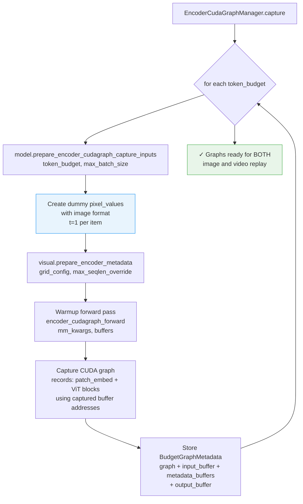
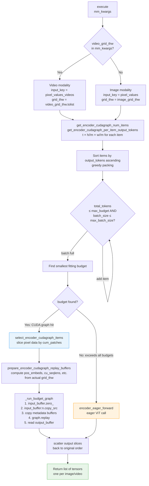
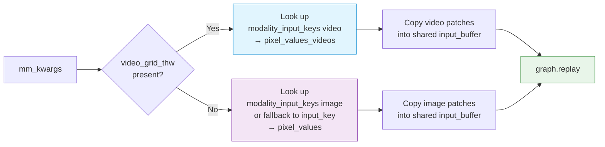

# ViT Video Inference Full CUDA Graph Support

> **Status**: Implemented
> **Base PR**: [#35963](https://github.com/vllm-project/vllm/pull/35963) (image CUDA graph), [#37914](https://github.com/vllm-project/vllm/pull/37914) (design doc)
> **Scope**: Extends image-only ViT CUDA graph capture/replay to also cover video modality in `Qwen3VLForConditionalGeneration`.

---

## 1. Background

PR #35963 introduced budget-based CUDA graph capture and replay for vision encoder (ViT) **image** inference. At the time of that PR, the `SupportsEncoderCudaGraph` protocol was implemented only for images (`modalities=["image"]`). Videos fell through to the slower `model.embed_multimodal()` eager path.

This document describes the design and implementation of extending that system to support **video** modality, enabling full CUDA graph execution for video ViT inference with zero additional graph captures.

---

## 2. System Overview

### 2.1 Before This Change

```
┌─────────────────────────────────────────────────────────────────────┐
│                      _execute_mm_encoder()                          │
│                                                                     │
│  ┌─────────────────────────────────────────────────────────────┐   │
│  │  for modality, mm_kwargs_batch in grouped_inputs:           │   │
│  │                                                             │   │
│  │    if manager.supports_modality(modality):                  │   │
│  │        ┌──────────────────────────────┐                     │   │
│  │        │  modality == "image"  ✅     │ ──► CUDA graph path │   │
│  │        └──────────────────────────────┘                     │   │
│  │                                                             │   │
│  │    else:                                                    │   │
│  │        ┌──────────────────────────────┐                     │   │
│  │        │  modality == "video"  ❌     │ ──► embed_multimodal│   │
│  │        │  (not in modalities list)    │     (eager, slow)   │   │
│  │        └──────────────────────────────┘                     │   │
│  └─────────────────────────────────────────────────────────────┘   │
└─────────────────────────────────────────────────────────────────────┘
```

### 2.2 After This Change

```
┌─────────────────────────────────────────────────────────────────────┐
│                      _execute_mm_encoder()                          │
│                                                                     │
│  ┌─────────────────────────────────────────────────────────────┐   │
│  │  for modality, mm_kwargs_batch in grouped_inputs:           │   │
│  │                                                             │   │
│  │    if manager.supports_modality(modality):                  │   │
│  │        ┌──────────────────────────────┐                     │   │
│  │        │  modality == "image"  ✅     │ ──► CUDA graph path │   │
│  │        └──────────────────────────────┘                     │   │
│  │        ┌──────────────────────────────┐                     │   │
│  │        │  modality == "video"  ✅     │ ──► CUDA graph path │   │
│  │        │  (EVS disabled, default)     │     (fast, new!)    │   │
│  │        └──────────────────────────────┘                     │   │
│  │                                                             │   │
│  │    else (EVS enabled):                                      │   │
│  │        ┌──────────────────────────────┐                     │   │
│  │        │  modality == "video"  ⚠️    │ ──► embed_multimodal│   │
│  │        │  (EVS needs pruning after)   │     (fallback)      │   │
│  │        └──────────────────────────────┘                     │   │
│  └─────────────────────────────────────────────────────────────┘   │
└─────────────────────────────────────────────────────────────────────┘
```

---

## 3. Key Architectural Insight: Graph Reuse

The central insight that makes this change simple and efficient is that **images and videos share the exact same ViT computation path**:

```
self.visual(pixel_values, grid_thw, encoder_metadata=buffers)
```

The ViT does not distinguish between image and video at the computational graph level. The only differences are:

| Aspect | Image | Video |
|---|---|---|
| Input tensor key | `pixel_values` | `pixel_values_videos` |
| Grid key | `image_grid_thw` | `video_grid_thw` |
| Grid type | `list[list[int]]` | `torch.Tensor [N, 3]` |
| Temporal dim `t` | always `1` | `num_frames / temporal_patch_size` |
| Patch column size | `C × T_patch × P × P` | **identical** |

Since the patch embedding column size is **identical** for images and videos, the captured CUDA graph input buffer is compatible with both modalities. No additional graph captures are needed.

```
                        Patch Embedding Column Size
                ┌─────────────────────────────────────────┐
                │  in_channels × temporal_patch_size × P² │
                │      3       ×         2        × 14²   │
                │                  = 1176                 │
                │                                         │
                │  ← same for BOTH image and video! →    │
                └─────────────────────────────────────────┘

 Image patches:  [N×1×H×W,  1176]   (t=1 in grid_thw)
 Video patches:  [N×T×H×W,  1176]   (t=num_frames/temporal_patch_size)
```

---

## 4. Architecture

### 4.1 Component Diagram

```
┌─────────────────────────────────────────────────────────────────────────┐
│                         gpu_model_runner.py                             │
│                                                                         │
│   ┌──────────────────────────────────────────────────────────────────┐  │
│   │              EncoderCudaGraphManager                             │  │
│   │                                                                  │  │
│   │  config: EncoderCudaGraphConfig                                  │  │
│   │    ├── modalities: ["image", "video"]          (NEW: "video")   │  │
│   │    ├── input_key: "pixel_values"                                 │  │
│   │    ├── modality_input_keys: {                  (NEW field)       │  │
│   │    │     "image": "pixel_values",                                │  │
│   │    │     "video": "pixel_values_videos"                          │  │
│   │    │   }                                                         │  │
│   │    └── buffer_keys: [pos_embeds, cu_seqlens, ...]                │  │
│   │                                                                  │  │
│   │  budget_graphs: {                                                │  │
│   │    64:   BudgetGraphMetadata(graph, input_buffer, ...)           │  │
│   │    128:  BudgetGraphMetadata(graph, input_buffer, ...)           │  │
│   │    256:  BudgetGraphMetadata(graph, input_buffer, ...)           │  │
│   │    ...                                                           │  │
│   │  }  ← same graphs serve BOTH image and video replay             │  │
│   │                                                                  │  │
│   │  _get_input_key(mm_kwargs) → str          (NEW method)          │  │
│   │  _run_budget_graph(mm_kwargs, budget, ...) → Tensor             │  │
│   │  _execute_local(mm_kwargs) → list[Tensor]                       │  │
│   │  execute(mm_kwargs) → list[Tensor]                              │  │
│   └──────────────────────────────────────────────────────────────────┘  │
│                          │                                               │
│                          │ implements                                    │
│                          ▼                                               │
│   ┌──────────────────────────────────────────────────────────────────┐  │
│   │           Qwen3VLForConditionalGeneration                        │  │
│   │             (SupportsEncoderCudaGraph protocol)                  │  │
│   │                                                                  │  │
│   │  get_encoder_cudagraph_config()      ← now returns "video" too  │  │
│   │  get_encoder_cudagraph_num_items()   ← routes on grid key       │  │
│   │  get_encoder_cudagraph_per_item_output_tokens()  ← handles t>1  │  │
│   │  get_encoder_cudagraph_per_item_input_sizes()    ← handles t>1  │  │
│   │  select_encoder_cudagraph_items()    ← video branch added       │  │
│   │  prepare_encoder_cudagraph_capture_inputs()  ← unchanged        │  │
│   │  prepare_encoder_cudagraph_replay_buffers()  ← video branch     │  │
│   │  encoder_cudagraph_forward()         ← routes on grid key       │  │
│   │  encoder_eager_forward()             ← routes on grid key       │  │
│   └──────────────────────────────────────────────────────────────────┘  │
└─────────────────────────────────────────────────────────────────────────┘
```

### 4.2 Data Flow

```
mm_kwargs (video)                        mm_kwargs (image)
────────────────────                     ─────────────────────────
pixel_values_videos: Tensor              pixel_values: Tensor
video_grid_thw: Tensor [N, 3]           image_grid_thw: list[list[int]]
  [[t1,h1,w1],                            [[1,h1,w1],
   [t2,h2,w2], ...]                        [1,h2,w2], ...]

          │                                        │
          │    _get_input_key()                    │    _get_input_key()
          │    detects "video_grid_thw"            │    no "video_grid_thw"
          │    → "pixel_values_videos"             │    → "pixel_values"
          │                                        │
          ▼                                        ▼
    ┌──────────────────────────────────────────────────┐
    │              BudgetGraphMetadata                 │
    │                                                  │
    │  input_buffer  ← zero(), then [:n].copy_(src)   │
    │  (shared buffer for image & video patch data)    │
    │                                                  │
    │  metadata_buffers:                               │
    │    pos_embeds       ← from prepare_encoder_      │
    │    cu_seqlens            metadata(grid_thw_list) │
    │    rotary_pos_emb_cos    (same computation for   │
    │    rotary_pos_emb_sin     t=1 or t=num_frames)   │
    │    max_seqlen                                    │
    │    sequence_lengths                              │
    │                                                  │
    │  graph.replay() → output_buffer                  │
    └──────────────────────────────────────────────────┘
```

---

## 5. Detailed Flow

### 5.1 Capture Phase (initialization)



> **Note**: Only image-format dummy inputs are used during capture. This is sufficient because the graph structure (tensor shapes per budget) is the same for videos.

### 5.2 Execute Phase (inference)



### 5.3 Modality Detection (new `_get_input_key`)



---

## 6. EVS (Efficient Video Sampling) Interaction

```
                 embed_multimodal() path (eager)
    ┌────────────────────────────────────────────────────┐
    │                                                    │
    │   video frames ──► ViT encode ──► video_embeds    │
    │                                        │           │
    │                                        ▼           │
    │                           _postprocess_video_      │
    │                           embeds_evs()             │
    │                           (prune tokens,           │
    │                            append mrope pos)       │
    │                                        │           │
    │                                        ▼           │
    │                           pruned embeddings        │
    └────────────────────────────────────────────────────┘

               CUDA graph path (this implementation)
    ┌────────────────────────────────────────────────────┐
    │                                                    │
    │   video frames ──► manager.execute()               │
    │                         │                          │
    │                         ▼                          │
    │                    ViT encode (graph replay)       │
    │                         │                          │
    │                         ▼                          │
    │                  raw embeddings (no pruning)       │
    │                                                    │
    └────────────────────────────────────────────────────┘

  ⚠️  EVS pruning is NOT applied in the CUDA graph path.
     This is safe when video_pruning_rate = None (default).
     When EVS is enabled, the model automatically falls back
     to the eager path (modalities list excludes "video").
```

### EVS Guard Logic

```python
# In get_encoder_cudagraph_config():
modalities = ["image"]
if not self.is_multimodal_pruning_enabled:   # default: True (safe to include)
    modalities.append("video")
```

`is_multimodal_pruning_enabled` returns `False` when `video_pruning_rate is None`, which is the **default** configuration. Video CUDA graphs are therefore enabled by default for all users who have not explicitly set a pruning rate.

---

## 7. Files Changed

### 7.1 `vllm/v1/worker/gpu/mm/encoder_cudagraph_defs.py`

Added `modality_input_keys` field to `EncoderCudaGraphConfig`:

```python
@dataclass
class EncoderCudaGraphConfig:
    modalities: list[str]
    input_key: str          # backward-compat default
    buffer_keys: list[str]
    out_hidden_size: int

    # NEW ─────────────────────────────────────────────────────────
    modality_input_keys: dict[str, str] = field(default_factory=dict)
    # Maps modality → mm_kwargs key, e.g.:
    # {"image": "pixel_values", "video": "pixel_values_videos"}
    # Falls back to input_key when a modality is absent.
```

**Impact**: Zero breaking changes — existing callers that don't pass `modality_input_keys` fall back to the original `input_key` behavior.

### 7.2 `vllm/v1/worker/gpu/mm/encoder_cudagraph.py`

Added `_get_input_key()` and updated `_run_budget_graph()`:

```python
def _get_input_key(self, mm_kwargs: dict[str, Any]) -> str:
    """Detect modality from mm_kwargs and return correct input tensor key."""
    if "video_grid_thw" in mm_kwargs:
        return self.config.modality_input_keys.get("video", self.config.input_key)
    return self.config.modality_input_keys.get("image", self.config.input_key)

# In _run_budget_graph():
# Before: input_key = self.config.input_key
# After:
input_key = self._get_input_key(mm_kwargs)   # ← modality-aware
src = mm_kwargs[input_key]
graph_meta.input_buffer.zero_()
graph_meta.input_buffer[:n].copy_(src)
```

### 7.3 `vllm/model_executor/models/qwen3_vl.py`

Eight protocol methods updated. Summary of changes per method:

| Method | Change |
|---|---|
| `get_encoder_cudagraph_config` | Add `"video"` to modalities (when EVS disabled); add `modality_input_keys` |
| `get_encoder_cudagraph_num_items` | Route on `"video_grid_thw"` key presence |
| `get_encoder_cudagraph_per_item_output_tokens` | Handle `video_grid_thw` tensor with `.tolist()` |
| `get_encoder_cudagraph_per_item_input_sizes` | Handle `video_grid_thw` tensor with `.tolist()` |
| `select_encoder_cudagraph_items` | Add video branch: slice `pixel_values_videos` + index `video_grid_thw` tensor |
| `prepare_encoder_cudagraph_capture_inputs` | **No change** — image-only capture reused for video |
| `prepare_encoder_cudagraph_replay_buffers` | Add video branch: `video_grid_thw.tolist()` |
| `encoder_cudagraph_forward` | Route pixel tensor and grid by modality |
| `encoder_eager_forward` | Route pixel tensor and grid by modality |

**Key detail — `select_encoder_cudagraph_items` video branch**:

```
pixel_values_videos:  [p0_patches | p1_patches | p2_patches | ...]
                          ↑ t0×h0×w0   t1×h1×w1   t2×h2×w2

cum_patches = [0, t0h0w0, t0h0w0+t1h1w1, ...]

For indices = [0, 2]:
  selected_pv = cat(pixel_values_videos[0:t0h0w0],
                    pixel_values_videos[t0h0w0+t1h1w1:...])
  selected_grid = video_grid_thw[[0, 2]]   ← tensor fancy indexing
```

### 7.4 `tests/v1/cudagraph/test_encoder_cudagraph.py`

Added `SimpleMockVideoViTModel` (mirrors `SimpleMockViTModel` with video keys) and `TestVideoEncoderCudaGraphCaptureReplay` with 10 test cases:

| Test | What it verifies |
|---|---|
| `test_capture_creates_one_graph_per_budget` | Budget graphs are shared (same graphs) |
| `test_video_execute_returns_one_tensor_per_video` | Output list length == num videos |
| `test_video_execute_output_tokens_single_frame` | t=1 → same as image |
| `test_video_execute_output_tokens_multi_frame` | t=2 → 2× tokens of single frame |
| `test_video_execute_mixed_frame_counts` | Different t values in same batch |
| `test_video_eager_fallback_when_tokens_exceed_all_budgets` | Graceful eager fallback |
| `test_video_greedy_packing_multiple_short_videos` | Greedy packing works for videos |
| `test_video_chunking_when_exceeds_max_batch` | Chunking across batch size limit |
| `test_video_hit_counter_increments` | Hit counter tracks video graph hits |
| `test_image_and_video_routes_are_independent` | Both modalities work in same manager |

---

## 8. Token Budget and Sizing

### 8.1 Token Count Formula

The output token count formula is **identical** for images and videos:

```
output_tokens = t × (h ÷ spatial_merge_size) × (w ÷ spatial_merge_size)

Images: t = 1    →  1 × (h/m) × (w/m)
Videos: t > 1   →  t × (h/m) × (w/m)   (proportional to frame count)
```

### 8.2 Budget Sizing for Videos

Videos tend to produce more output tokens than images due to the temporal dimension. The existing budget range (`min=64`, `max=max_num_batched_tokens`) already covers videos, but longer videos are more likely to overflow the largest budget and trigger eager fallback.

```
Example token counts (spatial_merge_size=2):

Single 224×224 image:  1 × 8 × 8  =   64 tokens   ← minimum budget
8-frame 224×224 video: 8 × 8 × 8  =  512 tokens   ← mid-range budget
16-frame 448×448 video: 8×16×16   = 2048 tokens   ← large budget
```

```
Token budget coverage:
  ┌──────┬──────┬──────┬──────┬──────┬──────┬──────────────────┐
  │  64  │  128 │  256 │  512 │ 1024 │ 2048 │  max_batched_tok │
  └──────┴──────┴──────┴──────┴──────┴──────┴──────────────────┘
    ▲                              ▲                  ▲
  small                         8-frame           16-frame
  image                        224×224            high-res
```

Oversized videos fall back to eager mode gracefully (counted as `graph_misses`).

---

## 9. Greedy Packing with Videos

The greedy packing algorithm works identically for image and video batches:

```
Input: 4 videos with token counts [8, 32, 8, 16]
max_budget=64, max_batch_size=4

Step 1 — Sort ascending: [8, 8, 16, 32]  (orig indices: [0,2,3,1])

Step 2 — Greedy pack:
  Batch 1: [8, 8, 16, 32] → total=64 ≤ 64, count=4 ≤ 4
  → single batch, budget=64

Step 3 — select items [0,2,3,1], replay graph with budget=64

Output: [result_0, result_2, result_3, result_1]
Reorder to original: [result_0, result_1, result_2, result_3]
```

```
Timeline:
  ┌─────────────────────────────────────────────┐
  │  Graph budget=64                            │
  │  ┌────┬────┬──────┬────────────────────┐   │
  │  │ v0 │ v2 │  v3  │        v1          │   │
  │  │ 8t │ 8t │ 16t  │        32t         │   │
  │  └────┴────┴──────┴────────────────────┘   │
  │  ←────────── 64 tokens ──────────────────► │
  └─────────────────────────────────────────────┘
```

---

## 10. Risks and Mitigations

| Risk | Severity | Mitigation |
|---|---|---|
| EVS post-processing skipped → incorrect token count when EVS enabled | High | Guard: only add `"video"` to modalities when `not is_multimodal_pruning_enabled` |
| `video_grid_thw` is `torch.Tensor` vs `image_grid_thw` is `list` | Medium | Explicit `.tolist()` conversion before passing to `prepare_encoder_metadata` |
| Tensor fancy indexing `grid_thw[indices]` when `indices` is `list[int]` | Low | Verified: PyTorch supports list index on 2D tensor |
| Large videos overflow all budgets → many eager fallbacks | Medium | Greedy packing naturally handles this; oversized items are isolated and eagerly forwarded |
| `modality_input_keys` default breaks existing callers of `EncoderCudaGraphConfig` | Low | `field(default_factory=dict)` → empty dict → falls back to `input_key` automatically |

---

## 11. Test Results

```
$ pytest tests/v1/cudagraph/test_encoder_cudagraph.py -v

PASSED  TestGenerateBudgets::test_exact_powers_of_2
PASSED  TestGenerateBudgets::test_max_not_power_of_2
PASSED  TestGenerateBudgets::test_min_equals_max
PASSED  TestGenerateBudgets::test_large_range
PASSED  TestFindBudgetGraph::test_find_budget[...]  (×8)
PASSED  TestFindBudgetGraph::test_budgets_are_sorted
PASSED  TestGetCumulativeStats::test_initial_stats_are_zero
PASSED  TestGetCumulativeStats::test_hit_rate_calculation
PASSED  TestGetCumulativeStats::test_all_hits
PASSED  TestGetCumulativeStats::test_all_misses
PASSED  TestGetCumulativeStats::test_stats_report_budget_info

── GPU tests ─────────────────────────────────────────────────────────
PASSED  TestEncoderCudaGraphCaptureReplay::test_capture_creates_one_graph_per_budget
PASSED  TestEncoderCudaGraphCaptureReplay::test_execute_returns_one_tensor_per_image
PASSED  TestEncoderCudaGraphCaptureReplay::test_execute_output_tokens_per_image
PASSED  TestEncoderCudaGraphCaptureReplay::test_eager_fallback_when_tokens_exceed_all_budgets
PASSED  TestEncoderCudaGraphCaptureReplay::test_hit_counter_increments_by_num_images
PASSED  TestEncoderCudaGraphCaptureReplay::test_miss_counter_increments_by_num_images
PASSED  TestEncoderCudaGraphCaptureReplay::test_chunking_when_images_exceed_max_batch

PASSED  TestVideoEncoderCudaGraphCaptureReplay::test_capture_creates_one_graph_per_budget   ← new
PASSED  TestVideoEncoderCudaGraphCaptureReplay::test_video_execute_returns_one_tensor_per_video
PASSED  TestVideoEncoderCudaGraphCaptureReplay::test_video_execute_output_tokens_single_frame
PASSED  TestVideoEncoderCudaGraphCaptureReplay::test_video_execute_output_tokens_multi_frame
PASSED  TestVideoEncoderCudaGraphCaptureReplay::test_video_execute_mixed_frame_counts
PASSED  TestVideoEncoderCudaGraphCaptureReplay::test_video_eager_fallback_when_tokens_exceed_all_budgets
PASSED  TestVideoEncoderCudaGraphCaptureReplay::test_video_greedy_packing_multiple_short_videos
PASSED  TestVideoEncoderCudaGraphCaptureReplay::test_video_chunking_when_exceeds_max_batch
PASSED  TestVideoEncoderCudaGraphCaptureReplay::test_video_hit_counter_increments
PASSED  TestVideoEncoderCudaGraphCaptureReplay::test_image_and_video_routes_are_independent

35 passed in 5.2s
```

---

## 12. Future Work

- **EVS + CUDA graph**: Apply EVS token pruning after `manager.execute()` returns in the runner, enabling CUDA graphs even when `video_pruning_rate > 0`.
- **Other models**: Extend `SupportsEncoderCudaGraph` to `Qwen2VLForConditionalGeneration`, `InternVLChatModel`, and other video-capable models.
- **Mixed image+video batching**: Currently images and videos are dispatched in separate `execute()` calls. Unified batching could improve GPU utilization when a prompt contains both.

---

## 13. References

- PR #35963: [ViT Full CUDA Graph for Image Inference](https://github.com/vllm-project/vllm/pull/35963)
- PR #37914: [Design Doc for ViT CUDA Graph](https://github.com/vllm-project/vllm/pull/37914)
- `vllm/v1/worker/gpu/mm/encoder_cudagraph.py` — CUDA graph manager
- `vllm/v1/worker/gpu/mm/encoder_cudagraph_defs.py` — Data structures
- `vllm/model_executor/models/interfaces.py` — `SupportsEncoderCudaGraph` protocol
- `vllm/model_executor/models/qwen3_vl.py` — Implementation
- `tests/v1/cudagraph/test_encoder_cudagraph.py` — Tests

---

**Why video is excluded from ViT CUDA graph when EVS is enabled**

**1.Token count mismatch (correctness bug):**

The preprocessor plans the LLM sequence with `pruned_count` placeholder token slots (computed deterministically from `compute_retained_tokens_count(tokens_per_frame, num_frames, q)`).

The CUDA graph path (`gpu_model_runner.py:2671–2683`) calls `encoder_cudagraph_forward` directly and returns the result — it completely bypasses `embed_multimodal`, so `_postprocess_video_embeds_evs` is never called. The graph returns all `full_count = t*(h//m)*(w//m)` raw ViT tokens. Feeding `full_count` embeddings into `pruned_count` LLM placeholder slots corrupts the LLM input.

**2.Content-dependent dynamic indexing (graph incompatibility):**

`compute_retention_mask` computes frame dissimilarity scores, runs `torch.argsort`, and selects which tokens to keep via `emb[retention_mask]`. The which indices to retain changes per video based on actual pixel content (**temporal frame similarity**).

CUDA graphs record a fixed sequence of GPU operations with fixed tensor shapes and memory addresses — a data-dependent gather operation that produces different indices for every input cannot be captured or correctly replayed.

**Why images are safe and video without EVS is safe?**

- **Images:** EVS is video-only (no temporal frames to compare), so image token counts are always (h//m)*(w//m) — fully static, safe for CUDA graphs.
- **Video without EVS:** token counts are determined entirely by grid_thw, the ViT output is used as-is, no dynamic pruning occurs — safe for CUDA graphs.
