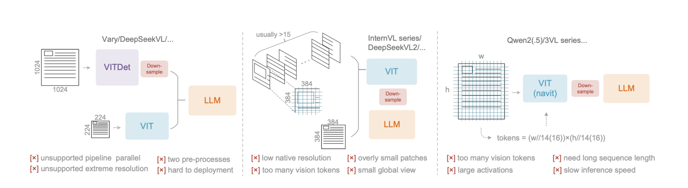
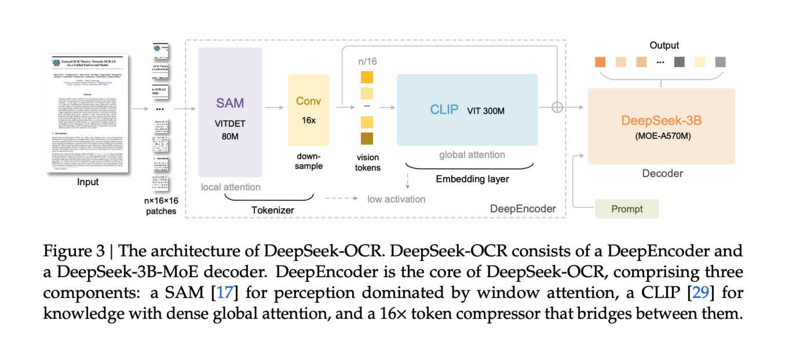
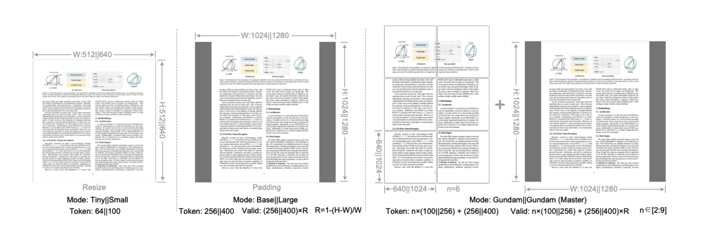
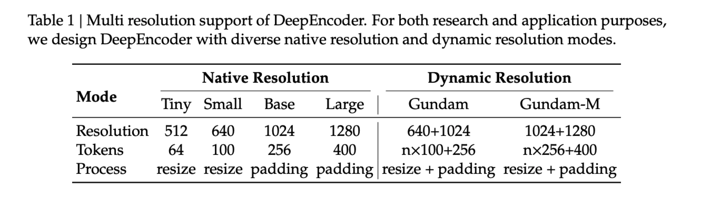

# DeepSeek-OCR

## Introduction

**DeepEncoder**, a novel architecture that maintains low activation memory and minimal vision tokens even with high-resolution inputs. It serially connects window attention and global attention encoder components through a 16× convolutional compressor. This design ensures that the window attention component processes a large number of vision tokens, while the compressor reduces vision tokens before they enter the dense global attention component, achieving effective memory and token compression.

## Related Works

Current open-source VLMs employ three main types of vision encoders:

1. **Dual-tower architecture:** utilizes parallel SAM encoder to increase visual vocabulary parameters for high-resolution image processing. ->  complicates deployment and makes encoder pipeline parallelism challenging during training.
2. **Tile-based method:** processes images by dividing them into small tiles for parallel computation, reducing activation memory under high-resolution settings. -> causing large images to be excessively fragmented and resulting in numerous vision tokens.
3. **Adaptive resolution encoding:** directly process full images through patch-based segmentation without tile parallelization. -> massive activation memory consumption that can cause GPU memory overflow. / sequence packing requires extremely long sequence lengths during training.

## DeepSeek-OCR

### Architecture

### DeepEncoder

We use SAM-base (patch-size 16) and CLIP-large as the main architectures.

For CLIP, we remove the first patch embedding layer since its input is no longer images but output tokens from the previous pipeline.

Between the two components, we use a 2-layer convolutional module to perform 16× downsampling of vision tokens. Each convolutional layer has a kernel size of 3, stride of 2, padding of 1, and channels increase from 256 to 1024.

#### Multiple Resolution Support

**Native resolution** supports four sub-modes: Tiny, Small, Base, and Large, with corresponding resolutions and token counts of 512×512 (64), 640×640 (100), 1024×1024 (256), and 1280×1280 (400) respectively. Since Tiny and Small modes have relatively small resolutions, to avoid wasting vision tokens, images are processed by directly resizing the original shape. For Base and Large modes, in order to preserve the original image aspect ratio, images are padded to the corresponding size.

**Dynamic resolution** can be composed of two native resolutions. For example, **Gundam mode** consists of n×640×640 tiles (local views) and a 1024×1024 global view.

The vision token number output by the DeepEncoder under Gundam mode is: **𝑛 × 100 + 256** (𝑛: the number of tiles is controlled within the range of 2 to 9).

For images with both width and height smaller than 640, 𝑛 is set to 0, i.e., Gundam mode will degrade to Base mode.
