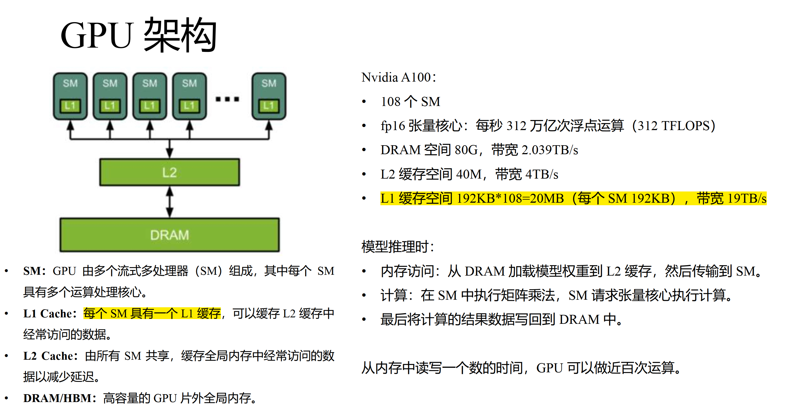

# todo

## 分布式训练 & 推理

model parallel ？
tensor parallel ？
data parallel ？
pipeline parallel ？

Megatron-LM style tensor model parallelism strategy ？
SPMD (Single Program Multiple Data) ？

参考资料：

- [流水线并行](https://zhuanlan.zhihu.com/p/613196255)
- [数据并行-1](https://zhuanlan.zhihu.com/p/617133971)
- [数据并行-2](https://zhuanlan.zhihu.com/p/618865052)
- [张量并行](https://zhuanlan.zhihu.com/p/622212228)
- [模型并行-1](https://zhuanlan.zhihu.com/p/629121480)
- [模型并行-2](https://zhuanlan.zhihu.com/p/634377071)

## 硬件相关概念

GPU DRAM / RAM ?
CPU RAM ?
SRAM ？——L1 Cache (SRAM)
HBM ?

访存 IO ？IO-Access ？

## 其它

自回归 Transformer ？

激活（activation）？

MoE（混合专家模型）？

MLP 层 ？模型不同层（attention, mlp, embedding 等）

copy-on-write mechanism

fast-transformer
