# PyTorch 深度学习实践

## 概述

> 课程链接：
>
> - [《PyTorch深度学习实践》完结合集](https://www.bilibili.com/video/BV1Y7411d7Ys/?p=1&vd_source=2754a9b73cb316d2cad8eb1195f5aa23)。

### 环境配置

> 安装教程：
>
> - [最详细的 Windows 下 PyTorch 入门深度学习环境安装与配置 CPU GPU 版 | 土堆教程_哔哩哔哩_bilibili](https://www.bilibili.com/video/BV1S5411X7FY/?spm_id_from=333.999.0.0&vd_source=2754a9b73cb316d2cad8eb1195f5aa23)。

#### 确认 GPU

GPU（Graphics Processing Unit），显卡，用于在屏幕上显示图像、视频。

驱动：让计算机识别特定的硬件。

深度学习显卡，一般是用 NVIDIA（英伟达），AMD 的显卡不能用于深度学习。因为英伟达有 CUDA 平台，让用户可以通过 CUDA 操纵显卡，从而加速深度学习的训练。

CUDA 软件的版本（Cuda runtime version）要 <= CUDA 硬件驱动的版本（Cuda driver version）。

GPU 为什么可以加速训练？因为相比于 CPU，GPU 具有大量的 ALU（逻辑处理单元）用于计算。

#### 安装 Anaconda

虚拟环境：

```
创建虚拟环境：
conda create -n [环境名称] python=版本

添加镜像加速：
conda create -n [环境名称] python=版本 -c [镜像地址]

删除虚拟环境：
conda remove -n [环境名称] --all

查看所有虚拟环境：
conda env list

进入虚拟环境：
conda activate [环境名称]

退出虚拟环境：
conda deactivate

查看已安装的包：
conda list
```

通道（channel）：就相当于下载地址。

```
添加持久通道：
conda config --add channels [通道地址]

删除通道：
conda config --remove channels [通道地址]

查看已配置的通道：
conda config --get/show
```

国内镜像（通道）：


#### 安装 CUDA

CUDA 是一个让显卡可以进行并行计算的平台（软件）。

确认版本：

1. 确定显卡算力（RTX 2060：7.5）；
2. 确定 CUDA Runtime Version，要能支持显卡的算力（CUDA SDK 10.0 以上）；
3. 确保 CUDA Runtime Version <= CUDA Driver Version。

查看 CUDA 驱动版本：

```
nvidia-smi
```


因此，10.0 <= 应该安装的 CUDA 版本 <= 11.4。

#### 更新显卡驱动

> 英伟达官网：https://www.nvidia.cn。

重新确定 CUDA Driver Version。


#### 安装 PyTorch

> PyTorch 官网：https://pytorch.org。

如果没有显卡，就装 CPU 的版本（CUDA 选 None）。如果有 GPU，就需要先去装 CUDA。安装 CUDA 的时候要选自定义，把 visual studio 的支持去掉，否则可能会出错。

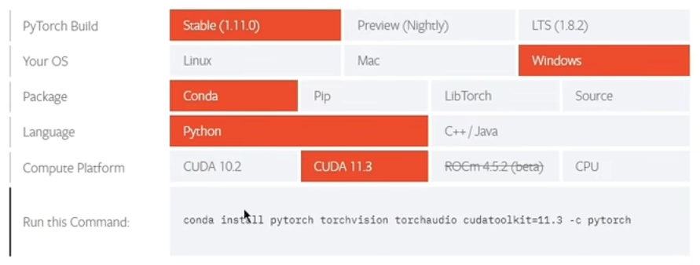

安装命令：

```
从官网下载：
conda install pytorch torchvision torchaudio pytorch-cuda=12.1 -c pytorch -c nvidia

使用镜像下载：
conda install pytorch torchvision torchaudio pytorch-cuda=12.1 -c https://mirrors.tuna.tsinghua.edu.cn/anaconda/cloud/pytorch/win-64/

综合上面两种方法：
conda install pytorch torchvision torchaudio pytorch-cuda=12.1 -c nvidia
```

#### 验证 PyTorch

```
conda activate pytorch_2.2.1
conda list
python
>> import torch
>> torch.cuda.is_availabel()
True
```

#### 注意事项


---

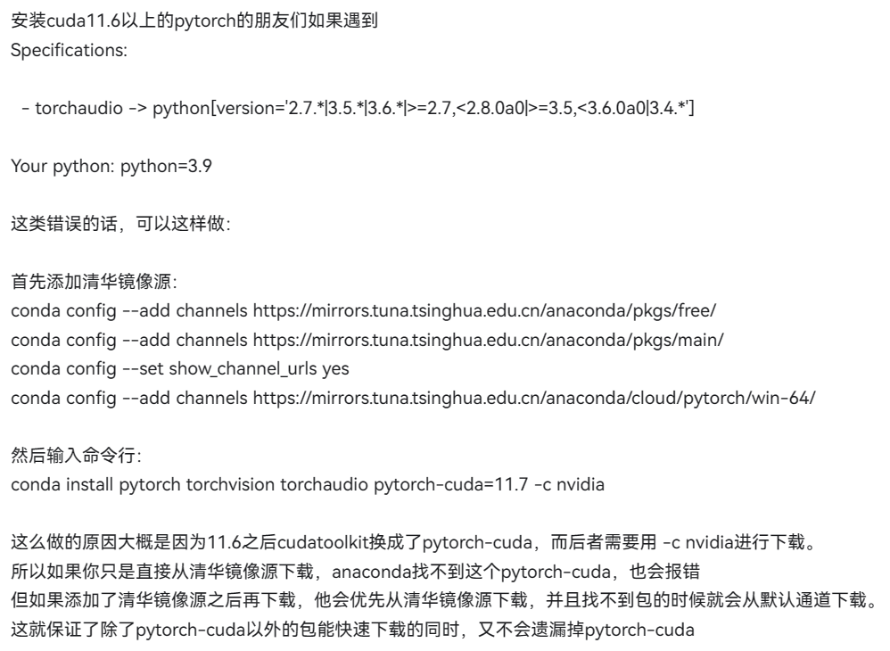

## 线性模型

训练集、开发集（验证集）、测试集。

Loss（损失函数）。

MSE（Mean Square Error，平均平方误差）。

模型训练可视化工具：Visdom。

画 3 维图形：`np.meshgrid()`。

## 梯度下降算法

### 凸优化

凸函数，凸优化，局部最优 -> 全局最优。

在优化问题中，鞍点是一种特殊的局部最优解，是一个难以优化的点，因为优化算法可能很难从鞍点附近找到全局最优解（学习高原）。

### 随机梯度下降（SGD）

含义：用单个样本（随机选一个）的 loss 对权重求导作为梯度（而不是用所有样本的 loss 求梯度），然后更新权重。

原理：这相当于引入了一个随机噪声（随机数据），当学习遇到鞍点（学习高原）时，随机噪声可能推动模型继续学习，并最终找到全局最优点。

该方法在神经网络中被证明为一种非常有效的方法。

缺点：SGD 使用单个样本进行梯度下降容易被噪声带来巨大干扰。

因此，我们可以将多个样本分为一组，作为一个 mini-batch，每一次使用一个小批量的数据进行更新。

## 反向传播

矩阵计算公式：matrix-cook-book。

tensor（张量）：是 pytorch 中用于构造数据的一个类（最基本的组件），用于存储数据的值（权重，可以保存多维数组）和梯度（loss 对权重的偏导）。

> 张量 = 数据 + 梯度。
>
> 参考资料：
>
> - [【PyTorch系例】torch.Tensor详解和常用操作_torch.tensor函数-CSDN博客](https://blog.csdn.net/sazass/article/details/109304327)。

示例：

```python
import torch

w = torch.Tensor([1.0])
# 开启计算梯度
w.requires_grad = True
```

写 tensor 代码本质上就是在构建计算图。

tensor 实例可以通过调用 backward() 方法，获得计算图中所有的梯度，并存到 w 中，然后整张计算图就被释放了。

即在每一次计算反向传播后，就会将当前的计算图释放，下一次计算 loss 时会重新构建新的计算图（这是一种非常灵活的方式）。

```python
import torch

...

# 更新权重
w.data = w.data - 0.01 * w.grad.data

# 每一次backward求得的grad会不断累计，因此，每更新一次权重，需要将grad归零
w.grad.data.zero_()

...
```

`w` 是一个 tensor，`w.grad` 也是一个 tensor。

更新权重时，只需要进行数值上的更新，而不会用到梯度，因此需要 `.data` 取到数值后再计算。

> 补充：`w.grad.item()` 获取 tensor 对应的标量，从而避免产生计算图。

总结：构建计算图（forward）使用 tensor 计算，更新权重使用 data 计算。

## 线性回归

```python
import torch

x_data = torch.tensor([[1.0], [2.0], [3.0]])
y_data = torch.tensor([[2.0], [4.0], [6.0]])


class LinearModel(torch.nn.Module):
    def __init__(self):
        super(LinearModel, self).__init__()
        self.linear = torch.nn.Linear(1, 1)

    def forward(self, x):
        y_pred = self.linear(x)
        return y_pred


model = LinearModel()

criterion = torch.nn.MSELoss()
optimizer = torch.optim.SGD(model.parameters(), lr=0.01)

for epoch in range(10000):
    # 前向传播，构建计算图
    y_pred = model(x_data)
    loss = criterion(y_pred, y_data)
    if epoch % 100 == 0:
        print(epoch, loss.item())

    # 反向传播，更新参数
    optimizer.zero_grad()
    loss.backward()
    optimizer.step()

print('w = ', model.linear.weight.item())
print('b = ', model.linear.bias.item())

# 测试模型
x_test = torch.Tensor([[4.0]])
y_test = model(x_test)
print('y_pred = ', y_test.data)
```

> pytorch 官方教程：[Learning PyTorch with Examples — PyTorch Tutorials 2.4.0+cu121 documentation](https://pytorch.org/tutorials/beginner/pytorch_with_examples.html)。

## 逻辑斯蒂回归

```python
import torch
import torch.nn.functional as F
import numpy as np
import matplotlib.pyplot as plt

# 1.prepare dataset
x_data = torch.Tensor([[1.0], [2.0], [3.0]])
y_data = torch.Tensor([[0], [0], [1]])


# 2.design model
class LogisticRegressionModel(torch.nn.Module):
    def __init__(self):
        super(LogisticRegressionModel, self).__init__()
        self.linear = torch.nn.Linear(1, 1)

    def forward(self, x):
        y_pred = F.sigmoid(self.linear(x))
        return y_pred


model = LogisticRegressionModel()

# 3.construct loss and optimizer
criterion = torch.nn.BCELoss()
optimizer = torch.optim.SGD(model.parameters(), lr=0.01)

# 4.train
for epoch in range(500):
    y_pred = model(x_data)
    loss = criterion(y_pred, y_data)
    if epoch % 100 == 0:
        print(epoch, loss.item())

    optimizer.zero_grad()
    loss.backward()
    optimizer.step()

# 5.predict
x = np.linspace(0, 10, 200)
x_t = torch.Tensor(x).view((200, 1))
y_t = model(x_t)
y = y_t.data.numpy()

plt.plot(x, y)
plt.plot([0, 10], [0.5, 0.5], c='r')
plt.xlabel('Hours')
plt.ylabel('Probility of Pass')
plt.grid()
plt.show()
```

## 多维特征处理

输入是 8 维的（8 个特征），输出是 1 维的（分为某一类的概率），N 为样本数量。


矩阵（向量）运算，可以方便利用 GPU 进行并行计算，提高整体的计算速度。

矩阵变换的本质：将一个向量从 8 维空间映射到 1 维空间（线性映射）。

神经网络的本质：通过组合多个线性变换层，并找到最优的权重，来模拟非线性变换的效果（本质上即寻找一种非线性的空间变换函数）。

通过激活函数，在层与层之间引入非线性，并经过多层处理，来拟合最终想要的非线性变换。

层数越多，神经网络的学习能力就越强。但学习能力并不是越强越好，过强的学习能力会将训练集中的噪声也学习到，从而导致过拟合（学习能力需要有泛化能力）。

如何寻找合适的层数？——超参数搜索。

## 数据集加载

Pytorch API：DataSet、DataLoader。

shuffle 的原理：DataLoader 每次加载其中的一个 batch。

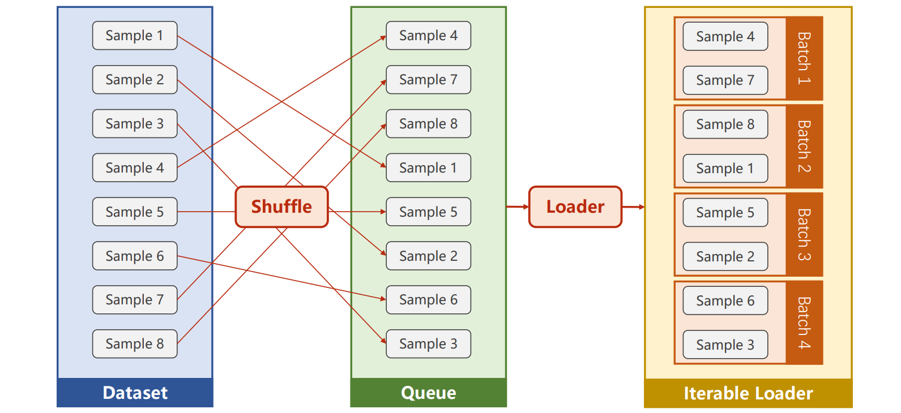

> 注意：一般只需要对训练集设置 shuffle=true，对测试集/验证集则不需要。

DataLoader 会自动将数据转换为 Tensor。

Pytorch 内置数据集：torchvision.datasets。

```python
import numpy as np
import torch
from torch.utils.data import Dataset, DataLoader


# 1.prepare dataset
class DiabetesDataset(Dataset):
    def __init__(self, file_path):
        xy = np.loadtxt(file_path, delimiter=',',
                        dtype=np.float32)
        self.len = xy.shape[0]
        self.x_data = torch.from_numpy(xy[:, :-1])
        self.y_data = torch.from_numpy(xy[:, [-1]])

    def __getitem__(self, index):
        return self.x_data[index], self.y_data[index]

    def __len__(self):
        return self.len


dataset = DiabetesDataset('./data/diabetes.csv.gz')
train_loader = DataLoader(dataset=dataset, batch_size=32,
                          shuffle=True, num_workers=5)


# 2.design model
class Model(torch.nn.Module):
    def __init__(self):
        super(Model, self).__init__()
        self.linear_1 = torch.nn.Linear(8, 6)
        self.linear_2 = torch.nn.Linear(6, 4)
        self.linear_3 = torch.nn.Linear(4, 1)
        self.sigmoid = torch.nn.Sigmoid()

    def forward(self, x):
        x = self.sigmoid(self.linear_1(x))
        x = self.sigmoid(self.linear_2(x))
        x = self.sigmoid(self.linear_3(x))
        return x


model = Model()

# 3.construct loss and optimizer
criterion = torch.nn.BCELoss()
optimizer = torch.optim.SGD(model.parameters(), lr=0.01)

# 4.training cycle
if __name__ == '__main__':
    print('dataset size: ', len(dataset))
    print('dataset size/batch: ', len(dataset) / 32)
    for epoch in range(100):
        for i, data in enumerate(train_loader, 0):
            # prepare data
            inputs, labels = data

            # forward
            y_pred = model(inputs)
            loss = criterion(y_pred, labels)
            print(epoch, i, loss.item())

            # backward
            optimizer.zero_grad()
            loss.backward()

            # update
            optimizer.step()
```

> 作业：[Titanic - Machine Learning from Disaster | Kaggle](https://www.kaggle.com/c/titanic/data)。

## 多分类问题

### Softmax 分类器

Softmax：正数化、归一化、突显主要特征。


NLLLoss：只计算正确预测对应标签的概率。


Pytorch API：交叉熵损失。


> 注意：神经网络的最后一层不做激活，直接交给交叉熵损失即可。

总结：CrossEntropyLoss = LogSoftmax + NLLLoss。

### 图像数据处理

图像数据分为单通道（H W）和多通道（H W C (Channel)）。

Pytorch API：

- transform.ToTensor()：将通道维度放到前面（N H W C -> N C H W）；
- transform.Normalize()：将数据分布转换为零一分布（均值为 0，方差为 1 正态分布），参数为 mean（均值）和 std（标准差：方差开根号）；

> 原因：使用零一分布的数据训练神经网络的效果是最好的。

- flatten()：数据输入神经网络之前，先将数据转换为一个二维矩阵；
- with torch.no_grad()：该代码块里的代码不会去计算梯度；
- torch.max(data, dim=1)：返回每一行中，第二个维度（列）的最大值及其下标。

```python
import torch
from torchvision import transforms
from torchvision import datasets
from torch.utils.data import DataLoader
import torch.nn.functional as F
import torch.optim as optim

batch_size = 64
transform = transforms.Compose([transforms.ToTensor(),
                                transforms.Normalize((0.1307,),
                                                     (0.3081,))])

train_dataset = datasets.MNIST(root='./data/mnist/',
                               train=True,
                               download=True,
                               transform=transform)
train_loader = DataLoader(train_dataset,
                          shuffle=True,
                          batch_size=batch_size)
test_dataset = datasets.MNIST(root='./data/mnist/',
                              train=False,
                              download=True,
                              transform=transform)
test_loader = DataLoader(train_dataset,
                         shuffle=False,
                         batch_size=batch_size)


class Net(torch.nn.Module):
    def __init__(self):
        super(Net, self).__init__()
        self.l1 = torch.nn.Linear(784, 512)
        self.l2 = torch.nn.Linear(512, 256)
        self.l3 = torch.nn.Linear(256, 128)
        self.l4 = torch.nn.Linear(128, 64)
        self.l5 = torch.nn.Linear(64, 10)

    def forward(self, x):
        x = x.view(-1, 784)
        x = F.relu(self.l1(x))
        x = F.relu(self.l2(x))
        x = F.relu(self.l3(x))
        x = F.relu(self.l4(x))
        # 对于分类任务，神经网络的最后一层不需要激活函数
        return self.l5(x)


model = Net()

criterion = torch.nn.CrossEntropyLoss()
optimizer = optim.SGD(model.parameters(), lr=0.01, momentum=0.5)


def train(epoch):
    running_loss = 0.0

    for batch_idx, data in enumerate(train_loader, 0):
        # 每次循环加载一个批量（64）的数据
        inputs, target = data
        optimizer.zero_grad()

        # forward + backward + update
        outputs = model(inputs)
        loss = criterion(outputs, target)
        loss.backward()
        optimizer.step()

        # 每300批（64*300个数据）计算一次loss
        running_loss += loss.item()
        if batch_idx % 300 == 299:
            print('[%d, %5d] loss: %.3f' % (
                epoch + 1, batch_idx + 1, running_loss / 300))
            running_loss = 0.0


def test():
    correct = 0
    total = 0

    with torch.no_grad():
        for data in test_loader:
            images, labels = data
            outputs = model(images)
            _, predicted = torch.max(outputs.data, dim=1)
            total += labels.size(0)  # 样本总数
            correct += (predicted == labels).sum().item()

    print(
        'Accuracy on test set: %d %%' % (100 * correct / total))


if __name__ == '__main__':
    for epoch in range(10):
        train(epoch)
        test()
```

> 作业：[Otto Group Product Classification Challenge | Kaggle](https://www.kaggle.com/c/otto-group-product-classification-challenge/data)。

## 卷积神经网络

### 卷积层

**convolution**：每一次卷积都是在做数乘（对应位置的元素相乘并相加），最后多个通道的卷积结果再叠加（求和）。


> 注意：卷积核一般都使用正方形（在二维空间上），kernel_size 即正方形的边长（如上图中的 kernel_size 为 3）。

每个输出通道都有独立的三维卷积核（filter）。


卷积层的基本参数有 4 个（4 维 Tensor）：卷积核个数 m、输入图像的 C、卷积核的 W（=kernel_size）、卷积核的 H（=kernel_size）。

> 注意：卷积层并不在乎输入图像的 W 和 H，只关心输入的 C。

总结：

- 输入的通道数，决定了卷积核的层数（C）；
- 卷积核（3 维）的个数，决定了输出的通道数。

**padding**：使用 0 填充图像的边框，从而调整卷积后的输出大小。

### 池化层

**MaxPooling**：将数据分组，并保留每组中的最大值作为结果（同一个通道）。

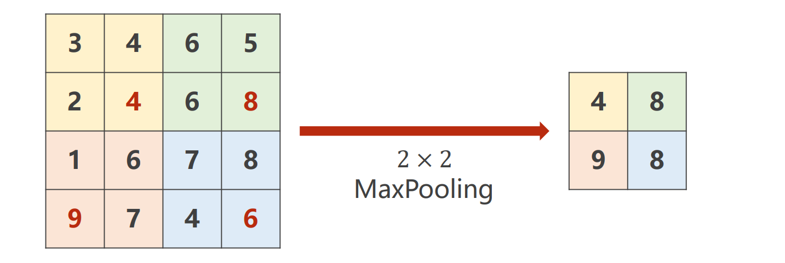

### 简单的卷积神经网络

卷积神经网络 = 卷积层 + 池化层 + 分类器。

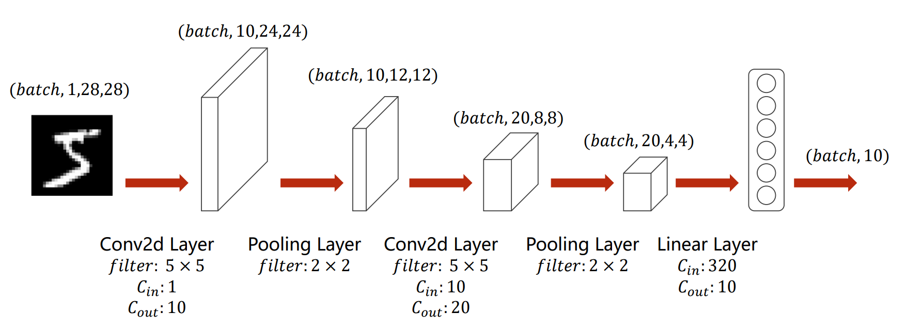

在池化层与分类器之间，需要进行 flatten，展开为一个向量。

```
x = x.view(batch_size, -1)
```

如何使用 GPU 进行计算？

- 首先，需要将模型迁移到 GPU 上，设置 device 为 cuda:0，并调用 model.to(device)，将模型的权重等参数转换为 cuda Tensor；
- 然后，将 input 和 output 的 Tensor 都迁移到 device 上。

> 注意：0 表示第一块显卡，可以为不同的任务设置不同的显卡。

### 复杂的卷积神经网络

Inception Module：

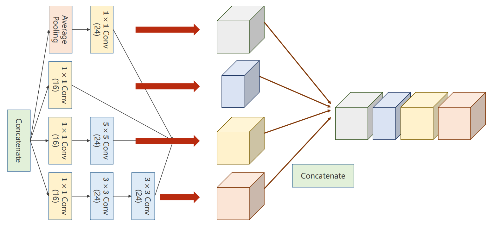

ResNet：

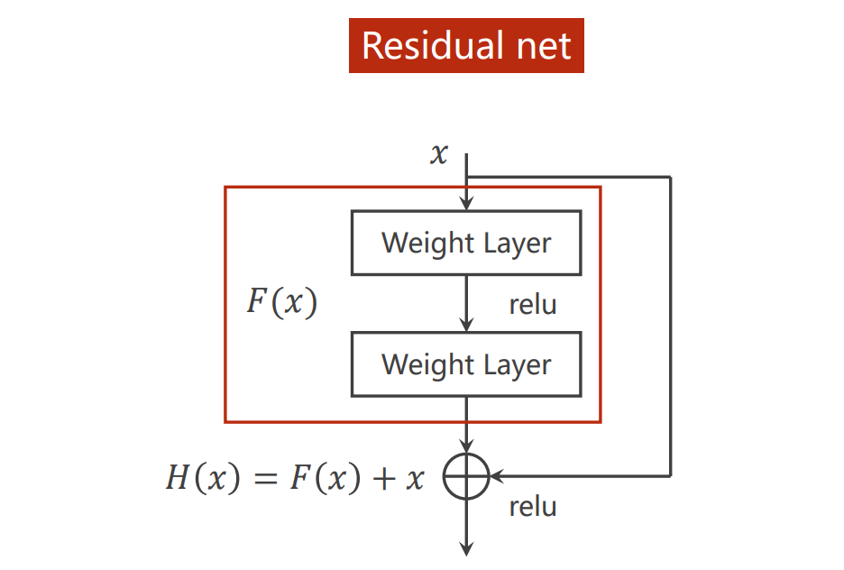

> 注意：最后是先将 F(x) 和 x 相加，再激活。前提条件：F(x) 和 x 的通道数需要保持一致。

特征提取过程越往后，可能会出现效果差的情况，如果出现效果差的就变成 0（梯度），那么还能保证上一层的特征是最好的。即可以忽略特征效果差的层，继续训练更前面的层，而不会造成梯度消失，训练无法进行。

> 参考论文：
>
> - Deep Residual Learning for Image Recognition；
> - Identity Mappings in Deep Residual Networks；
> - Densely Connected Convolutional Networks。

```python
class ResidualBlock(torch.nn.Module):
    def __init__(self, channels):
        super(ResidualBlock, self).__init__()
        self.channels = channels
        self.conv1 = torch.nn.Conv2d(channels, channels, kernel_size=3, padding=1)
        self.conv2 = torch.nn.Conv2d(channels, channels, kernel_size=3, padding=1)

    def forward(self, x):
        y = F.relu(self.conv1(x))
        y = self.conv2(y)
        return F.relu(x + y)


class CnnNet(torch.nn.Module):
    def __init__(self):
        super(CnnNet, self).__init__()
        # 卷积层
        self.conv1 = torch.nn.Conv2d(1, 16, kernel_size=5)
        self.conv2 = torch.nn.Conv2d(16, 32, kernel_size=5)
        # 池化层
        self.mp = torch.nn.MaxPool2d(2)

        # 残差模块
        self.r_block1 = ResidualBlock(16)
        self.r_block2 = ResidualBlock(32)

        # 全连接层
        self.fc = torch.nn.Linear(512, 10)

    def forward(self, x):
        in_size = x.size(0)  # 输入数据的样本数量

        # 卷积->Relu->池化->残差
        y = self.mp(F.relu(self.conv1(x)))
        y = self.r_block1(y)
        y = self.mp(F.relu(self.conv2(y)))
        y = self.r_block2(y)

        y = y.view(in_size, -1)  # flatten，将每条数据展开为一维向量
        return self.fc(y)
```

> 作业：自己实现不同的 Residual Block，并在 MNIST 数据集上进行测试。

## 循环神经网络

### RNN Cell

循环神经网络：用于处理有先后顺序的序列数据（如天气、股票、自然语言）。


RNN Cell 本质上是一个线性层（只做了一次线性运算 + 激活）。

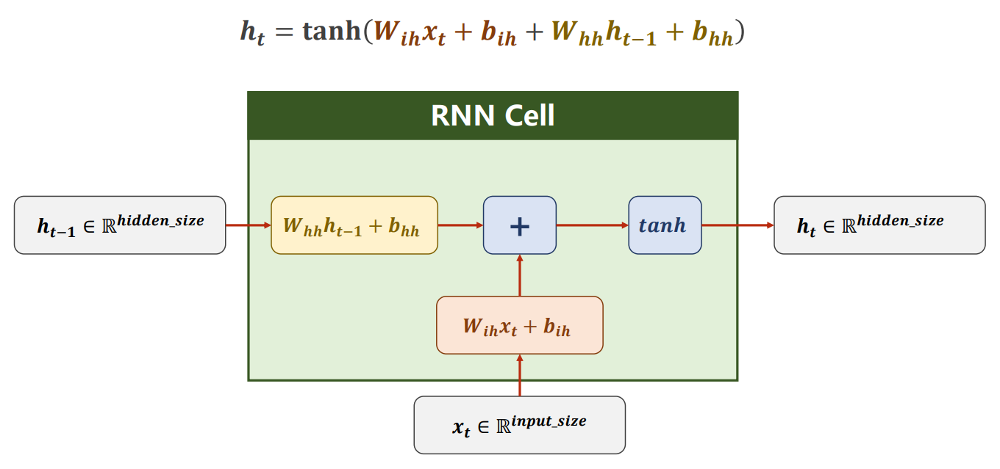

> 注意：t 代表某一时刻，t-1 为前一时刻。

输入数据的形式：

```
dataset.shape = (seqLen, batchSize, inputSize)
```

> 解释：
>
> 你用几天的数据来预测下一天天气，这个天数就是 seqLen（循环次数），一次输入几组这样的 seqLen 天，这个组数就是 batchSize（样本数）。
>
> batchSize 指有几个句子，seqLen 是句子的长度，训练时是所有的句子的第一个字先进入网络，再是第二个字。

输入的时候就需要将整个序列输入进去，RNN 模块内部会自动进行循环，并输出每一次的结果以及最后的结果。

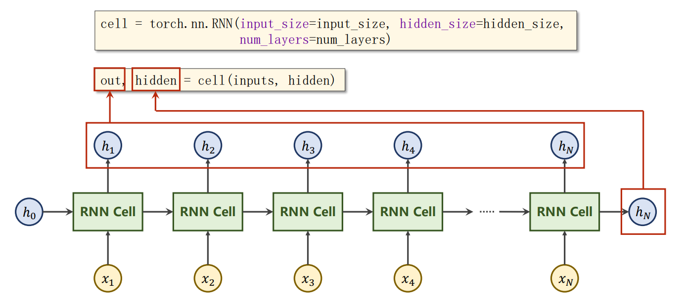

RNN 可以设置多层（numLayers）。


> 注意：同一颜色的 RNN Cell 其实都是同一个线性层（权重共享）。

将输入数据（文本）映射为数字，再转换为 One-hot（独热编码）向量。

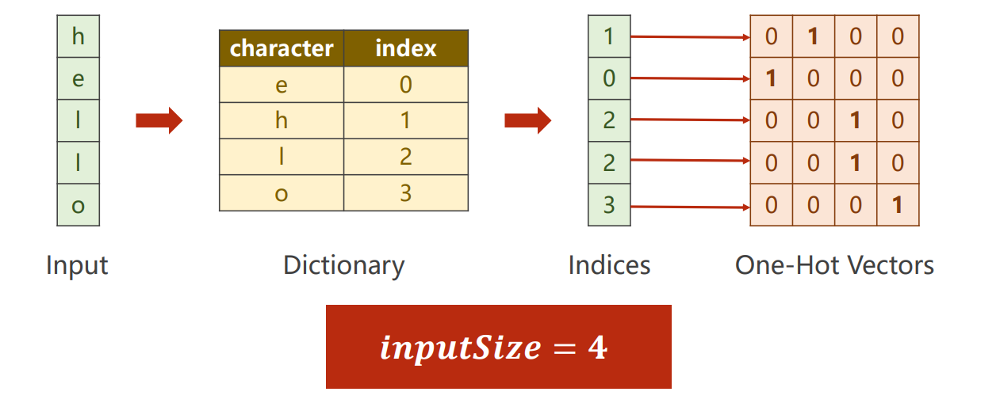

### Embedding

Word Embedding（词嵌入）：将高维稀疏矩阵（独热向量）映射到低维稠密矩阵（数据降维）。


### 双向 RNN

- 单向 RNN：只考虑过去的信息；
- 双向 RNN：不仅需要考虑过去的信息，还需要考虑未来的信息。

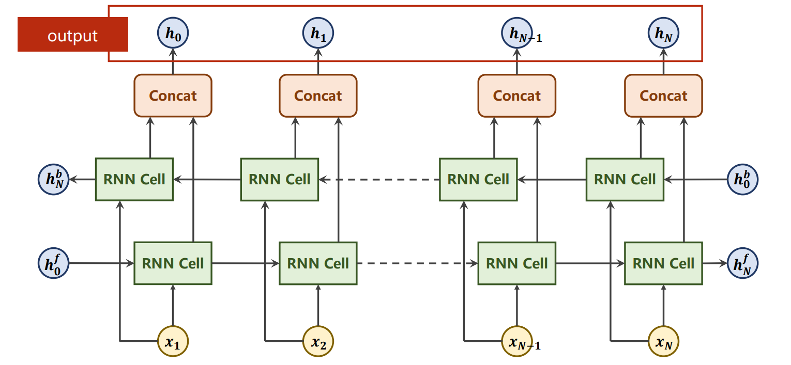

输出的 hidden 包括：[h<sub>N</sub><sup>f</sup>, h<sub>N</sub><sup>b</sup>]。

### RNN Classifier

数据预处理，编码：

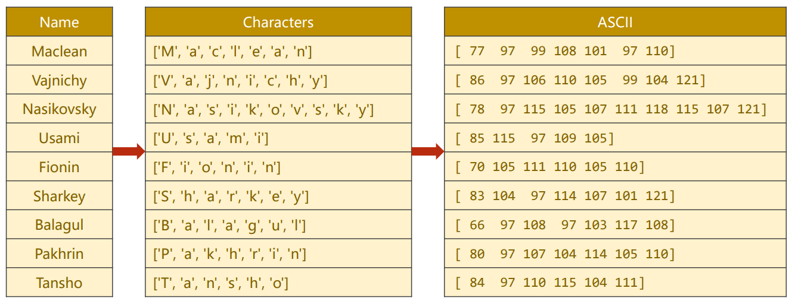

将输入数据做 padding（填充 0）和转置。

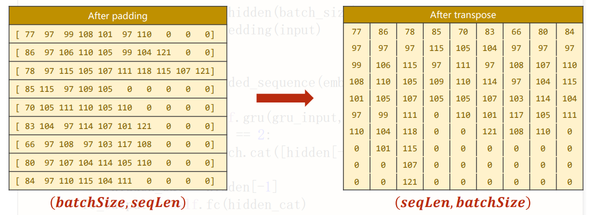

embedding：先将每一个词用 One-hot 向量表示（高维，维度为 input_size），再转换为稠密的 embedding 向量（低维，维度为 embedding_size）。

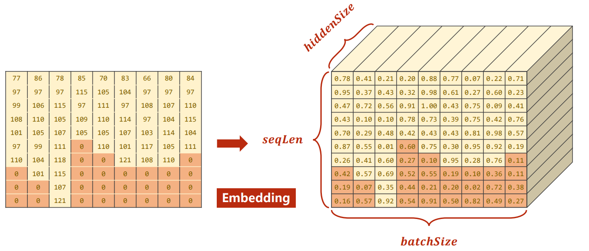

在上图中，为 0 的值被填充上了。

然后，需要按 seqLen 进行排序，方便后续处理。


pack_padded_sequence() 将同一 seq 位置的不同元素打包为一组，并依次（沿 seqLen 方向）将不同组的数据堆叠在一起。

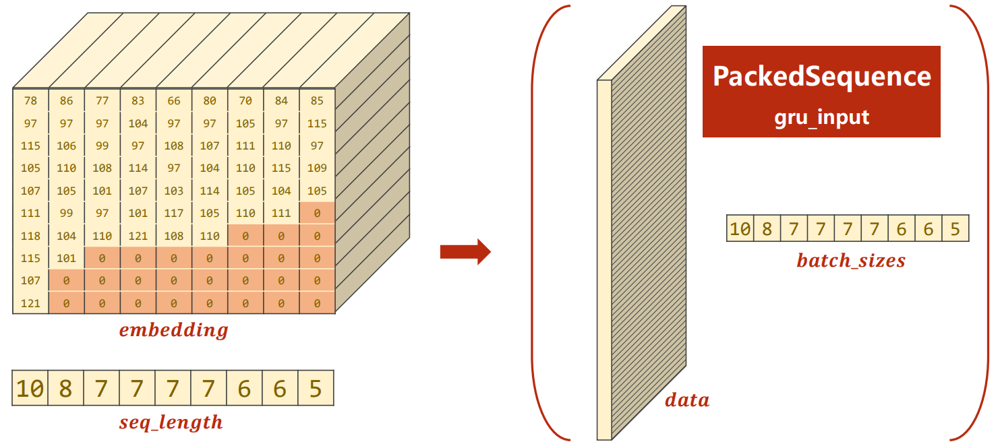

上图中的 batch_sizes 有误，应该是同一序列位置上的 batch 大小，应为：[9, 9, 9, 9, 9, 8, 6, 2, 1, 1]，这样可以便于以后判断哪些位置上的元素是由 0 填充的。

> pack_padded_sequence(embedding, seq_lengths)：
>
> - embedding shape: (seqLen, batchSize, hiddenSize)；
> - seq_lengths: a list of seqLen of each batch element (a tensor).
>
> return a PackedSequence object.
>
> PackedSequence: holds the data and list of batch_sizes (not seqLen) of a packed sequence.
>
> for example:
>
> data: 
>
> ```
> a x
> b
> c
> ```
>
> batch_size shape:
>
> ```
> [2, 1, 1]
> ```

模型结构：

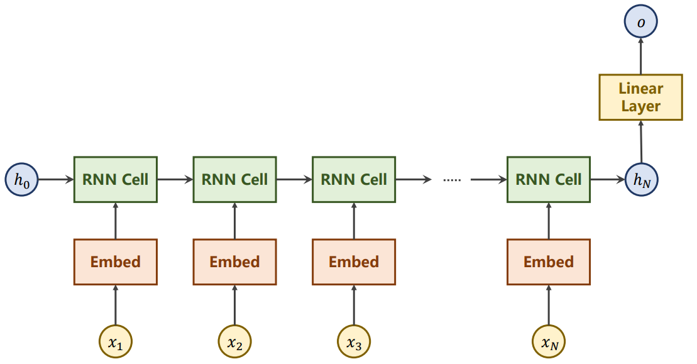

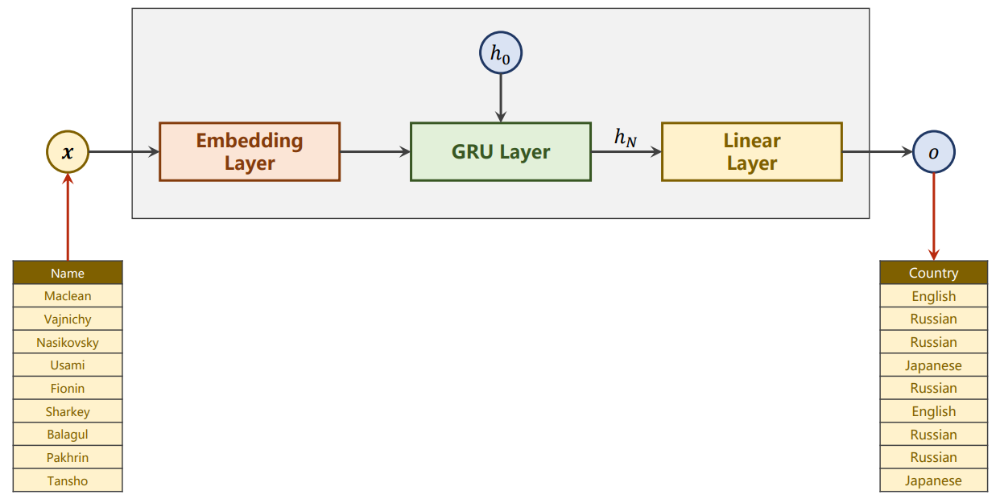

## 后续学习路线

- 完善理论知识，看《深度学习》“花书”；
- 阅读 PyTorch 官方文档；
- 复现一些经典的工作（读论文的代码、然后自己写代码，而不是只是把代码跑通就行）；
- 针对某一个细分领域，看论文（网络实现）扩充视野，并思考自己的 idea。
