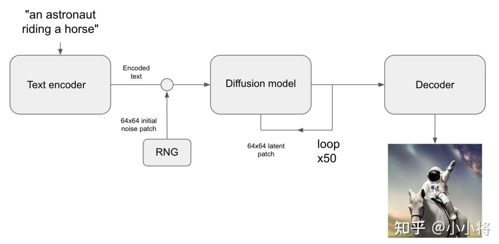
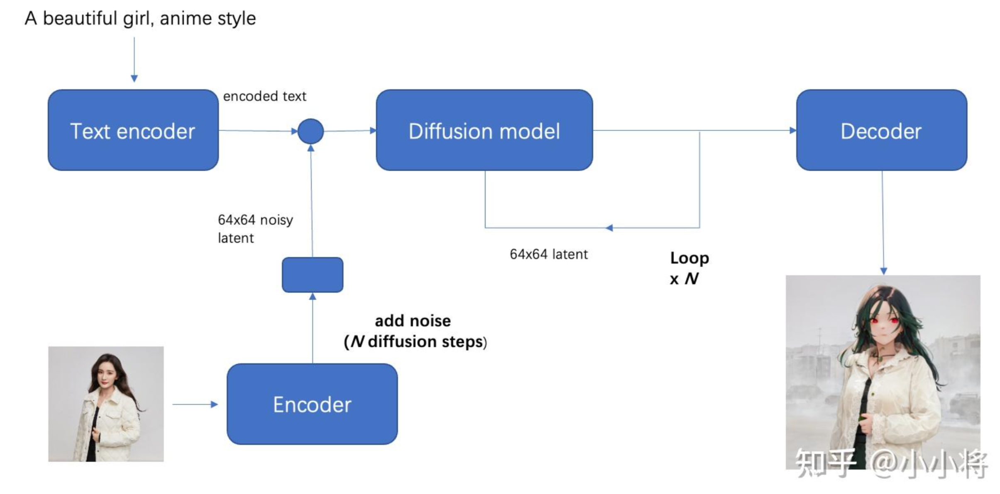

# Diffusion Models - Basic Knowledges

---

**模型结构：**

- **autoencoder**：encoder 将图像压缩到 latent 空间，而 decoder 将 latent 解码为图像；
- **CLIP text encoder**：提取输入 text 的 text embeddings，通过 cross attention 方式送入扩散模型的 UNet 中作为 condition；
- **UNet**：扩散模型的主体，用来实现文本引导下的 latent 生成。

---

**Classifier-Free Guidance（CFG）：**

在训练条件扩散模型的同时也训练一个无条件的扩散模型，同时在采样阶段将条件控制下预测的噪音和无条件下的预测噪音组合在一起来确定最终的噪音。

CFG 的具体实现非常简单，在训练过程中，我们只需要以一定的概率（比如 10%）随机 drop 掉 text 即可。

`guidance_scale`：

当 CFG 的 `guidance_scale` 越大时，生成的图像应该会和输入文本更一致（设置为 7~9 是比较稳定的，过小和过大都会出现图像质量下降）。

`negative_prompt`：

是无条件扩散模型的 text 输入，前面说过训练过程中我们将 text 置为空字符串来实现无条件扩散模型，所以这里：`negative_prompt = None = ""`。

但是有时候我们可以使用不为空的 `negative_prompt` 来避免模型生成的图像包含不想要的东西，从而提升图像生成效果。

输入的 text 或者 prompt 我们称之为“**正向提示词**”，而 negative prompt 称之为“**反向提示词**”，想要生成的好的图像，不仅要选择好的正向提示词，也需要好的反向提示词。

---

**文生图的推理流程：**

1. 首先根据输入 text 用 text encoder 提取 text embeddings，同时初始化一个随机噪音 noise（latent 上的，512x512 图像对应的 noise 维度为 64x64x4）；
2. 然后将 text embeddings 和 noise 送入扩散模型 UNet 中生成去噪后的 latent；
3. 最后送入 autoencoder 的 decoder 模块得到生成的图像。



`num_inference_steps`：指推理过程中的去噪步数或者采样步数。

SD 在训练过程采用的是步数为 1000 的 noise scheduler，但是在推理时往往采用速度更快的 scheduler，即只需要少量的采样步数（30~50 步）就能生成不错的图像。

当然采样步数越大，生成的图像质量越好，但是相应的推理时间也更久。

主流程代码：

```python
import torch
from diffusers import StableDiffusionPipeline
from PIL import Image

# 组合图像，生成 grid
def image_grid(imgs, rows, cols):
    assert len(imgs) == rows*cols

    w, h = imgs[0].size
    grid = Image.new('RGB', size=(cols*w, rows*h))
    grid_w, grid_h = grid.size
    
    for i, img in enumerate(imgs):
        grid.paste(img, box=(i%cols*w, i//cols*h))
    return grid

# 加载文生图 pipeline
pipe = StableDiffusionPipeline.from_pretrained(
    "runwayml/stable-diffusion-v1-5",  # 或者使用 SD v1.4: "CompVis/stable-diffusion-v1-4"
    torch_dtype=torch.float16
).to("cuda")

# 输入 text，这里 text 又称为 prompt
prompts = [
    "a photograph of an astronaut riding a horse",
    "A cute otter in a rainbow whirlpool holding shells, watercolor",
    "An avocado armchair",
    "A white dog wearing sunglasses"
]

generator = torch.Generator("cuda").manual_seed(42)  # 定义随机 seed，保证可重复性

# 执行推理
images = pipe(
    prompts,
    height=512,
    width=512,
    num_inference_steps=50,
    guidance_scale=7.5,
    negative_prompt=None,
    num_images_per_prompt=1,
    generator=generator
).images

grid = image_grid(images, rows=1, cols=4)
```

pipeline 内部流程代码：

```python
import torch
from diffusers import AutoencoderKL, UNet2DConditionModel, DDIMScheduler
from transformers import CLIPTextModel, CLIPTokenizer
from tqdm.auto import tqdm


model_id = "runwayml/stable-diffusion-v1-5"
# 1. 加载 autoencoder
vae = AutoencoderKL.from_pretrained(model_id, subfolder="vae")
# 2. 加载 tokenizer 和 text encoder
tokenizer = CLIPTokenizer.from_pretrained(model_id, subfolder="tokenizer")
text_encoder = CLIPTextModel.from_pretrained(model_id, subfolder="text_encoder")
# 3. 加载扩散模型 UNet
unet = UNet2DConditionModel.from_pretrained(model_id, subfolder="unet")
# 4. 定义 noise scheduler
noise_scheduler = DDIMScheduler(
    num_train_timesteps=1000,
    beta_start=0.00085,
    beta_end=0.012,
    beta_schedule="scaled_linear",
    clip_sample=False,  # don't clip sample, the x0 in stable diffusion not in range [-1, 1]
    set_alpha_to_one=False,
)

# 将模型复制到 GPU 上
device = "cuda"
vae.to(device, dtype=torch.float16)
text_encoder.to(device, dtype=torch.float16)
unet = unet.to(device, dtype=torch.float16)

# 定义参数
prompt = [
    "A dragon fruit wearing karate belt in the snow",
    "A small cactus wearing a straw hat and neon sunglasses in the Sahara desert",
    "A photo of a raccoon wearing an astronaut helmet, looking out of the window at night",
    "A cute otter in a rainbow whirlpool holding shells, watercolor"
]
height = 512
width = 512
num_inference_steps = 50
guidance_scale = 7.5
negative_prompt = ""
batch_size = len(prompt)
# 随机种子
generator = torch.Generator(device).manual_seed(2023)


with torch.no_grad():
    # 获取 text_embeddings
    text_input = tokenizer(prompt, padding="max_length", max_length=tokenizer.model_max_length, truncation=True, return_tensors="pt")
    text_embeddings = text_encoder(text_input.input_ids.to(device))[0]
    # 获取 unconditional text embeddings
    max_length = text_input.input_ids.shape[-1]
    uncond_input = tokenizer(
        [negative_prompt] * batch_size, padding="max_length", max_length=max_length, return_tensors="pt"
    )
    uncond_embeddings = text_encoder(uncond_input.input_ids.to(device))[0]
    # 拼接为 batch，方便并行计算
    text_embeddings = torch.cat([uncond_embeddings, text_embeddings])

    # 生成 latents 的初始噪音
    latents = torch.randn(
        (batch_size, unet.in_channels, height // 8, width // 8),
        generator=generator,
        device=device,
    )
    latents = latents.to(device, dtype=torch.float16)

    # 设置采样步数
    noise_scheduler.set_timesteps(num_inference_steps, device=device)

    # scale the initial noise by the standard deviation required by the scheduler
    latents = latents * noise_scheduler.init_noise_sigma  # for DDIM, init_noise_sigma = 1.0

    timesteps_tensor = noise_scheduler.timesteps

    # Do denoise steps
    for t in tqdm(timesteps_tensor):
        # 这里 latens 扩展 2 份，是为了同时计算 unconditional prediction
        latent_model_input = torch.cat([latents] * 2)
        latent_model_input = noise_scheduler.scale_model_input(latent_model_input, t)  # for DDIM, do nothing

        # 使用 UNet 预测噪音
        noise_pred = unet(latent_model_input, t, encoder_hidden_states=text_embeddings).sample

        # 执行 CFG
        noise_pred_uncond, noise_pred_text = noise_pred.chunk(2)
        noise_pred = noise_pred_uncond + guidance_scale * (noise_pred_text - noise_pred_uncond)

        # 计算上一步的 noisy latents：x_t -> x_t-1
        latents = noise_scheduler.step(noise_pred, t, latents).prev_sample
    
    # 注意要对 latents 进行 scale
    latents = 1 / 0.18215 * latents
    # 使用 vae 解码得到图像
    image = vae.decode(latents).sample
```

---

**图生图的推理流程：**

图生图（image2image）是对文生图功能的一个扩展，这个功能来源于 SDEdit 这个工作，其核心思路也非常简单：给定一个笔画的色块图像，可以先给它加一定的高斯噪音（执行扩散过程）得到噪音图像，然后基于扩散模型对这个噪音图像进行去噪，就可以生成新的图像，但是这个图像在结构和布局和输入图像基本一致。



相比文生图流程来说，这里的初始 latent 不再是一个随机噪音，而是由初始图像经过 autoencoder 编码之后的 latent 加高斯噪音得到，这里的加噪过程就是扩散过程。

> 注意：去噪过程的步数要和加噪过程的步数一致，就是说你加了多少噪音，就应该去掉多少噪音，这样才能生成想要的无噪音图像。

图生图这个功能一个更广泛的应用是在风格转换上，比如给定一张人像，想生成动漫风格的图像。

`strength`：

这个参数介于 0-1 之间，表示对输入图片加噪音的程度，这个值越大加的噪音越多，对原始图片的破坏也就越大，当 `strength=1` 时，其实就变成了一个随机噪音，此时就相当于纯粹的文生图 pipeline 了。

主流程代码：

```python
import torch
from diffusers import StableDiffusionImg2ImgPipeline
from PIL import Image

# 加载图生图 pipeline
model_id = "runwayml/stable-diffusion-v1-5"
pipe = StableDiffusionImg2ImgPipeline.from_pretrained(model_id, torch_dtype=torch.float16).to("cuda")

# 读取初始图片
init_image = Image.open("init_image.png").convert("RGB")

# 推理
prompt = "A fantasy landscape, trending on artstation"
generator = torch.Generator(device="cuda").manual_seed(2023)

image = pipe(
    prompt=prompt,
    image=init_image,
    strength=0.8,
    guidance_scale=7.5,
    generator=generator
).images[0]
```

pipeline 内部流程代码：

```python
import PIL
import numpy as np
import torch
from diffusers import AutoencoderKL, UNet2DConditionModel, DDIMScheduler
from transformers import CLIPTextModel, CLIPTokenizer
from tqdm.auto import tqdm


model_id = "runwayml/stable-diffusion-v1-5"
# 1. 加载 autoencoder
vae = AutoencoderKL.from_pretrained(model_id, subfolder="vae")
# 2. 加载 tokenizer 和 text encoder 
tokenizer = CLIPTokenizer.from_pretrained(model_id, subfolder="tokenizer")
text_encoder = CLIPTextModel.from_pretrained(model_id, subfolder="text_encoder")
# 3. 加载扩散模型 UNet
unet = UNet2DConditionModel.from_pretrained(model_id, subfolder="unet")
# 4. 定义 noise scheduler
noise_scheduler = DDIMScheduler(
    num_train_timesteps=1000,
    beta_start=0.00085,
    beta_end=0.012,
    beta_schedule="scaled_linear",
    clip_sample=False,  # don't clip sample, the x0 in stable diffusion not in range [-1, 1]
    set_alpha_to_one=False,
)

# 将模型复制到 GPU 上
device = "cuda"
vae.to(device, dtype=torch.float16)
text_encoder.to(device, dtype=torch.float16)
unet = unet.to(device, dtype=torch.float16)

# 预处理 init_image
def preprocess(image):
    w, h = image.size
    w, h = map(lambda x: x - x % 32, (w, h))  # resize to integer multiple of 32
    image = image.resize((w, h), resample=PIL.Image.LANCZOS)
    image = np.array(image).astype(np.float32) / 255.0
    image = image[None].transpose(0, 3, 1, 2)
    image = torch.from_numpy(image)
    return 2.0 * image - 1.0

# 参数设置
prompt = ["A fantasy landscape, trending on artstation"]
num_inference_steps = 50
guidance_scale = 7.5
strength = 0.8
batch_size = 1
negative_prompt = ""
generator = torch.Generator(device).manual_seed(2023)

init_image = PIL.Image.open("init_image.png").convert("RGB")

with torch.no_grad():
    # 获取 promp t的 text_embeddings
    text_input = tokenizer(prompt, padding="max_length", max_length=tokenizer.model_max_length, truncation=True, return_tensors="pt")
    text_embeddings = text_encoder(text_input.input_ids.to(device))[0]
    # 获取 unconditional text embeddings
    max_length = text_input.input_ids.shape[-1]
    uncond_input = tokenizer(
        [negative_prompt] * batch_size, padding="max_length", max_length=max_length, return_tensors="pt"
    )
    uncond_embeddings = text_encoder(uncond_input.input_ids.to(device))[0]
    # 拼接 batch
    text_embeddings = torch.cat([uncond_embeddings, text_embeddings])

    # 设置采样步数
    noise_scheduler.set_timesteps(num_inference_steps, device=device)
    # 根据 strength 计算 timesteps
    init_timestep = min(int(num_inference_steps * strength), num_inference_steps)
    t_start = max(num_inference_steps - init_timestep, 0)
    timesteps = noise_scheduler.timesteps[t_start:]

    # 预处理 init_image
    init_input = preprocess(init_image)
    init_latents = vae.encode(init_input.to(device, dtype=torch.float16)).latent_dist.sample(generator)
    init_latents = 0.18215 * init_latents
 
    # 给 init_latents 加噪音
    noise = torch.randn(init_latents.shape, generator=generator, device=device, dtype=init_latents.dtype)
    init_latents = noise_scheduler.add_noise(init_latents, noise, timesteps[:1])
    latents = init_latents  # 作为初始 latents

    # Do denoise steps
    for t in tqdm(timesteps):
        # 这里 latens 扩展 2 份，是为了同时计算 unconditional prediction
        latent_model_input = torch.cat([latents] * 2)
        latent_model_input = noise_scheduler.scale_model_input(latent_model_input, t)  # for DDIM, do nothing
 
        # 预测噪音
        noise_pred = unet(latent_model_input, t, encoder_hidden_states=text_embeddings).sample
 
        # CFG
        noise_pred_uncond, noise_pred_text = noise_pred.chunk(2)
        noise_pred = noise_pred_uncond + guidance_scale * (noise_pred_text - noise_pred_uncond)

        # 计算上一步的 noisy latents：x_t -> x_t-1
        latents = noise_scheduler.step(noise_pred, t, latents).prev_sample

    # 注意要对 latents 进行 scale
    latents = 1 / 0.18215 * latents
    # 解码
    image = vae.decode(latents).sample
```

---

**图像 inpainting 的推理流程：**

最后我们要介绍的一项功能是图像 inpainting，它和图生图一样也是文生图功能的一个扩展。SD 的图像 inpainting 不是用在图像修复上，而是主要用在图像编辑上：给定一个输入图像和想要编辑的区域 mask，我们想通过文生图来编辑 mask 区域的内容。

它和图生图一样：首先将输入图像通过 autoencoder 编码为 latent，然后加入一定的高斯噪音生成 noisy latent，再进行去噪生成图像，但是这里为了保证 mask 以外的区域不发生变化，在去噪过程的每一步，都将扩散模型预测的 noisy latent 用真实图像同 level 的 nosiy latent 替换。

---
