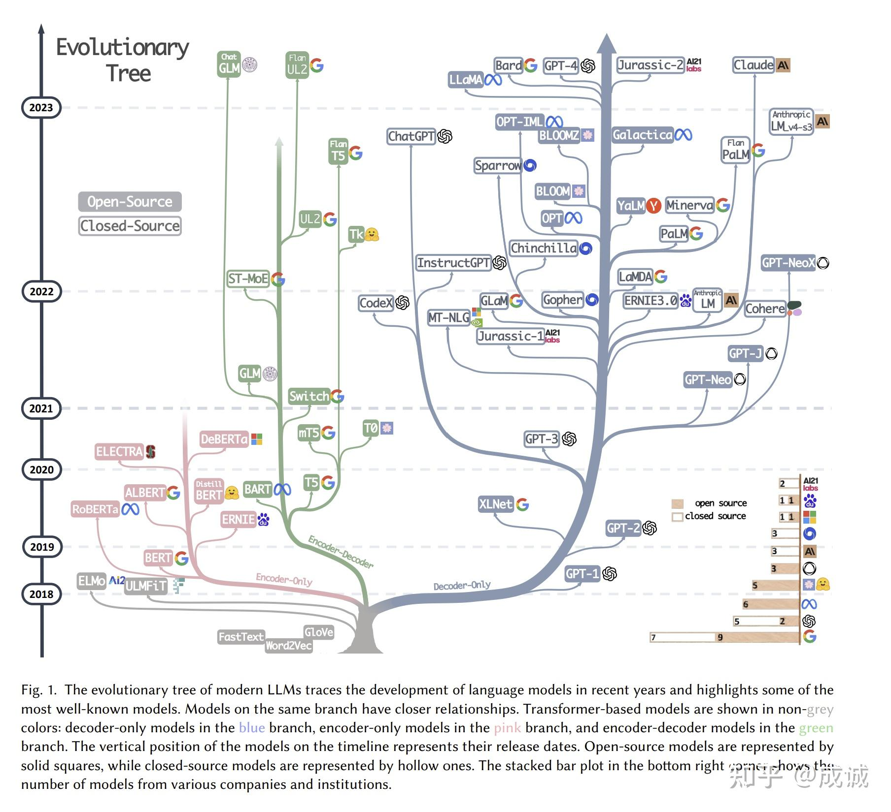

# LLM 整体概览

## LLM 发展历程

## LLM 的分类

- Encoder-Only
- Encoder-Decoder
- Decoder-Only
- MoE
- Multimodal

### Decoder-Only

Decoder-Only 模型基于 Scaling Laws 的实际训练成本最低。在相同参数量的训练效率上：Decoder-Only > Encoder-Only > Encoder-Decoder。

## 参考资料

- [<u>为什么现在的LLM都是Decoder only的架构？-成诚的回答-知乎</u>](https://www.zhihu.com/question/588325646/answer/3422090041)
- [<u>大模型时代，是 Infra 的春天还是冬天？</u>](https://zhuanlan.zhihu.com/p/656960458)
