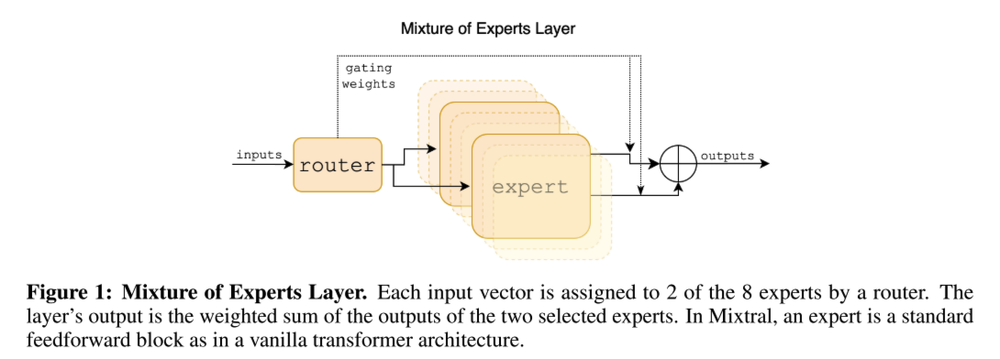
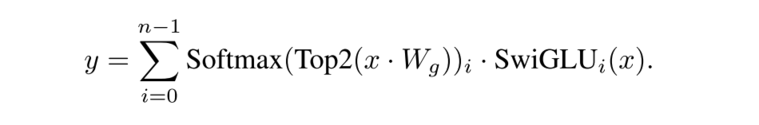

# Mixtral of Experts

---

## Overview

Each layer is composed of 8 feedforward blocks (i.e. **experts**). At each layer, a **router network** selects two experts to process the current state and combine their outputs. The selected experts can be different at each timestep.

**The output of MoE:**

Experts Layer 的输出 = Top K 个 Experts 输出的加权和

This technique **increases the number of parameters of a model** while **controlling cost and latency**, as the model only uses a fraction of the total set of parameters per token. (Allows faster inference speed at low batch-sizes, and higher throughput at large batch-sizes.)

- The model’s **total parameter** grows with **N** (the number of exports).
- The model’s **active parameter** (used for processing an individual token) grows with **K** up to N.

Thus, we can **increase the model’s parameter count while keeping its computational cost effectively constant**.

---

## Optimization

- **Kernel:** Casts the feed-forward network (FFN) operations of the MoE layer as large sparse matrix multiplications.
- **Expert Parallelism (EP):** Tokens meant to be processed by a specific expert are routed to the corresponding GPU for processing.

---

## References

- 《Mixtral of Experts》
- 《A review of sparse expert models in deep learning》
