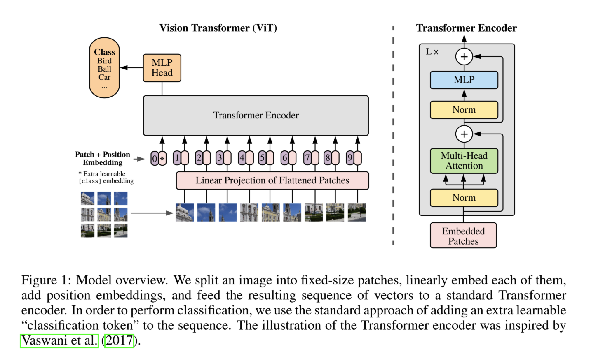

# Vision Transformer (ViT)

## Overview

ViT split an image into patches and provide the sequence of linear embeddings of these patches as an input to a Transformer. Image patches are treated the same way as tokens (words) in an NLP application.

