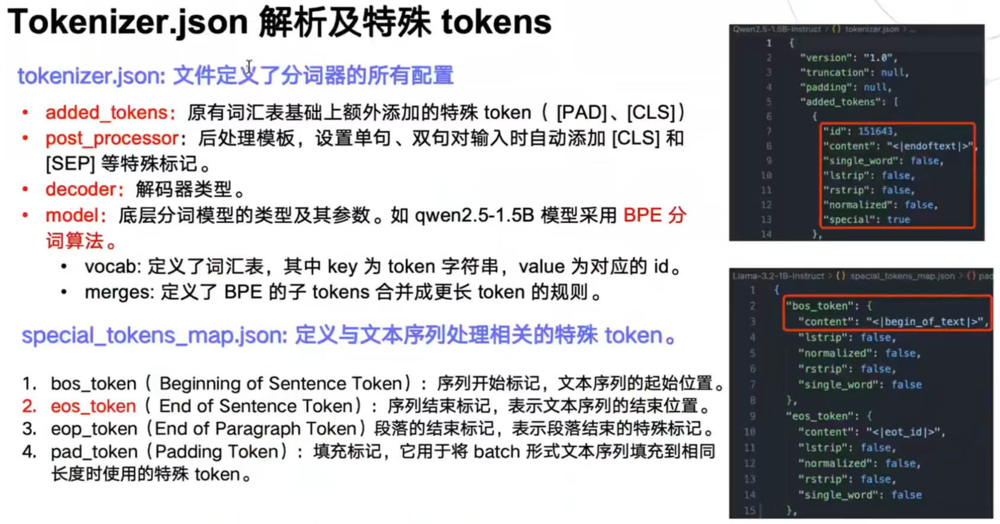
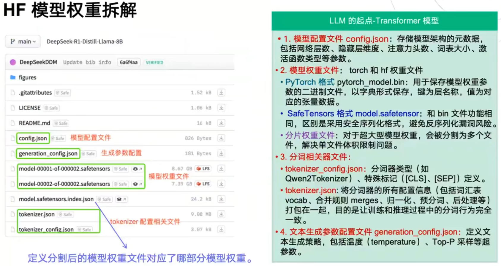
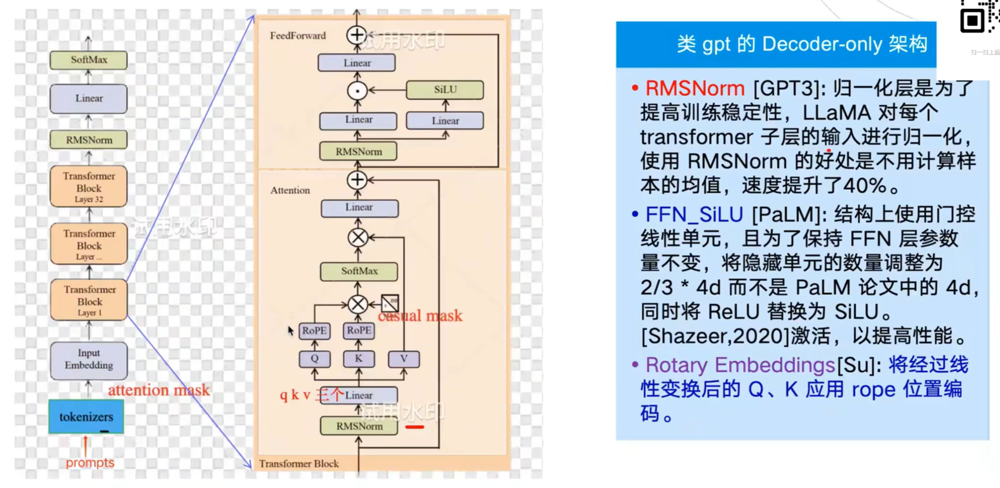
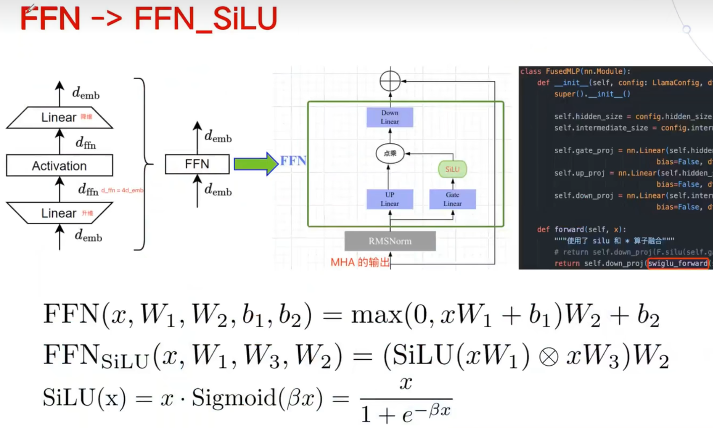
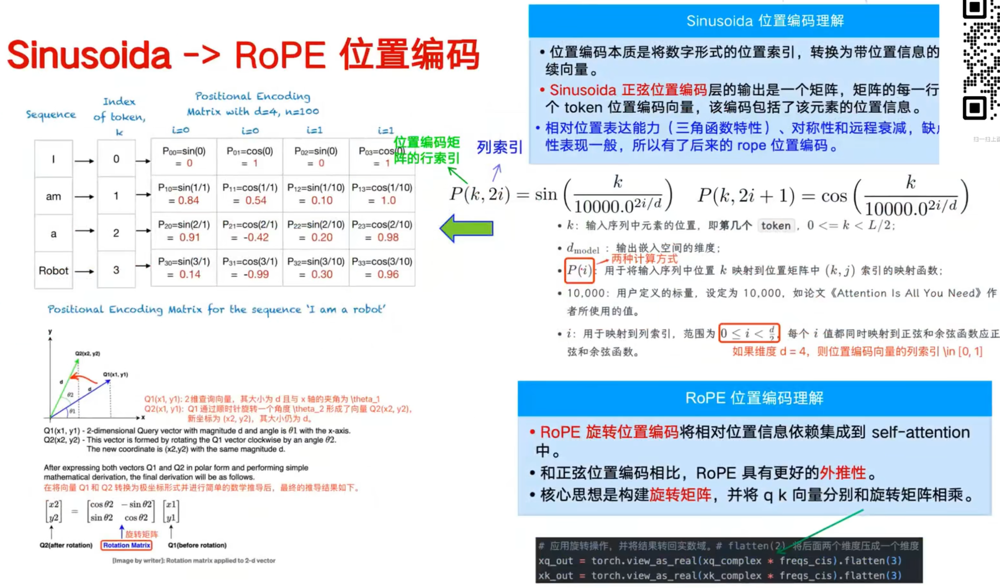
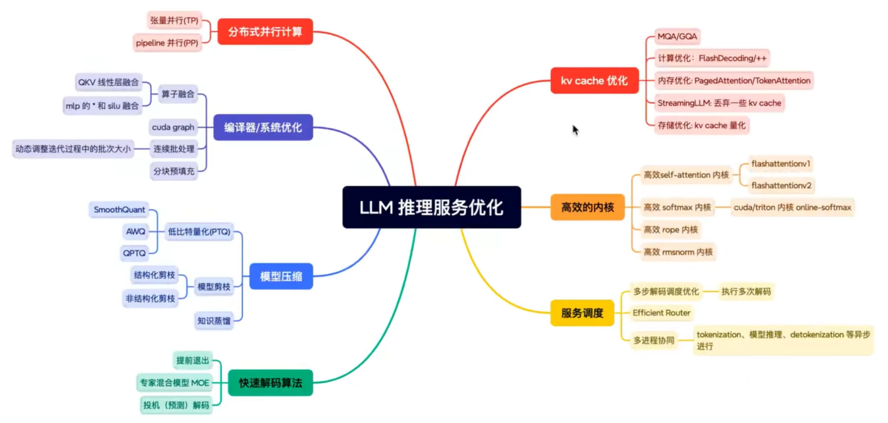
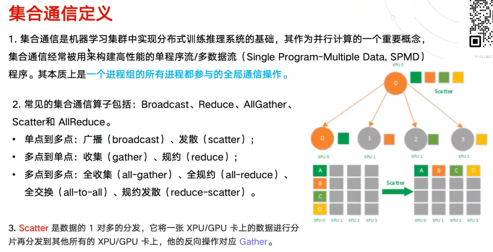
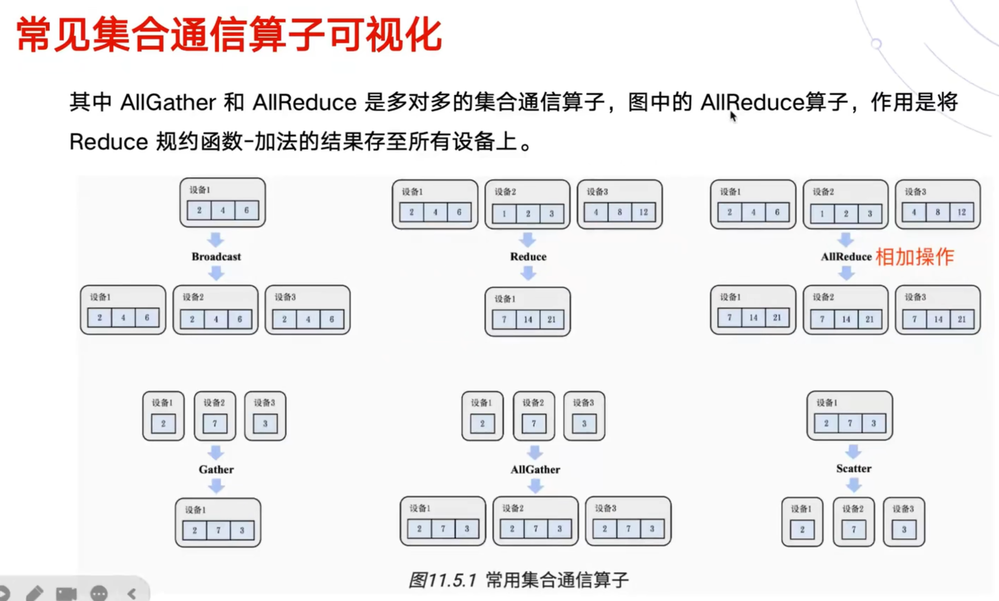
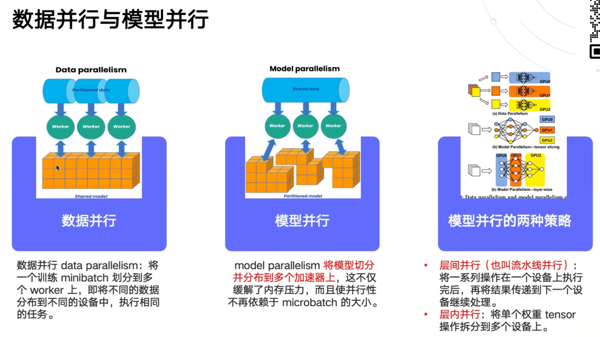

# 大模型基础知识

## Tokenizer

token：最小语义单元。多模态模型：图像等 -> token，再与文本的 token 进行拼接。

tokenizer：分词器。输入文本 -> token_id（input_id）。

input ids：token 的索引，是整数向量。

tokenizer.decode()：将 input_ids 转化为对应的 embedding 向量。



模型文件解析：



## Transformer

Transformer = Encoder + Decoder

- Encoder：适合理解型任务；
- Decoder：适合生成型任务。

Self-Attention：


Mask-Attention：

```python
>>> import torch
>>> seq_len = 4
>>> qkt = torch.randn([seq_len, seq_len])
>>> qkt
tensor([[ 0.0697,  0.7932, -0.1177,  0.0812],
        [ 0.3271, -1.1111, -0.8723,  1.2537],
        [ 1.7847, -0.2803,  1.3621, -1.1000],
        [ 0.5083,  0.5289,  1.9308, -0.0894]])
>>> masked = torch.tril(torch.ones([seq_len, seq_len])) # 返回矩阵的下三角部分
>>> masked
tensor([[1., 0., 0., 0.],
        [1., 1., 0., 0.],
        [1., 1., 1., 0.],
        [1., 1., 1., 1.]])
>>> qkt1 = qkt.masked_fill(masked == 0, float('-inf'))
>>> qkt1
tensor([[ 0.0697,    -inf,    -inf,    -inf],
        [ 0.3271, -1.1111,    -inf,    -inf],
        [ 1.7847, -0.2803,  1.3621,    -inf],
        [ 0.5083,  0.5289,  1.9308, -0.0894]])
```

参考：[masked-attention 算法详解](https://www.armcvai.cn/2024-11-10/masked-attention.html)

MHA（Multi-Head Attention，多头注意力）

MLP（又叫 FFN）：升维 -> 激活 -> 降维。MLP 占了 Transformer 中最多的参数量和计算量。

- 激活：增强模型的非线性表达能力；
- 升维：更宽的线性层可以增强模型的表达能力。

Embedding：单词 embedding（不包含时序信息）+ 位置 embedding（逐点相加）。

## Llama 模型结构



FFN_SiLU：



RoPE 位置编码：



## 大模型推理技术综述



## 张量并行

### 集合通信





### 并行技术


