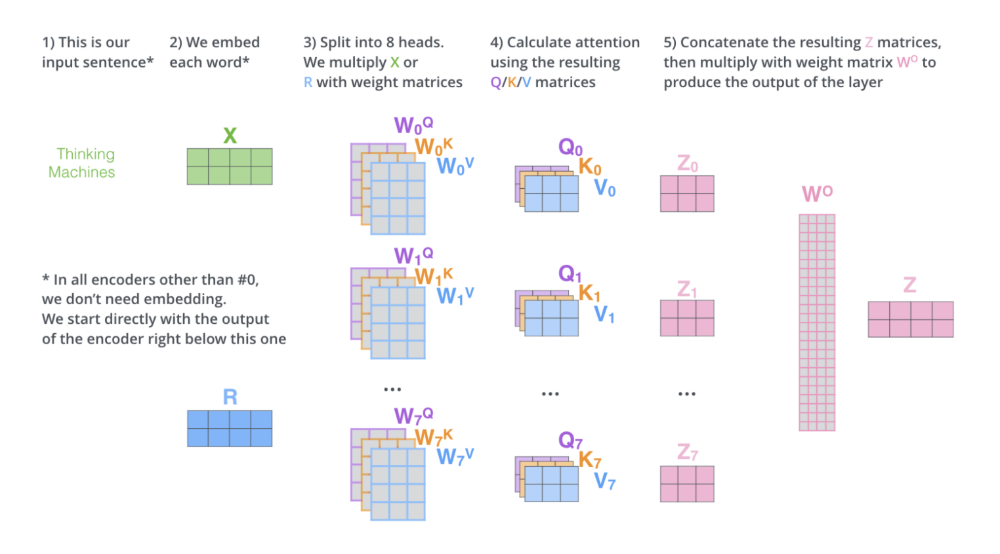

# Transformer 原理

## Attention

### 基本概念

**单头注意力**，最经典的 Attention 计算公式：

> 缩放因子（key 的维度取根号）的作用：避免数值过大导致梯度消失问题（？）。

**多头注意力（Multi-Head Attention，MHA）**，通过将输入数据分解为多个“头”，分别计算其注意力，从而能够捕捉到输入数据中不同子空间的特征。

与单头注意力不同的是，最后我们需要将所有头的输出合并（concat）起来并乘以一个权重矩阵，从而将输出映射回原始维度。

**多请求注意力（Multi-Query Attention，MQA）**：……

**分组请求注意力（Group-Query Attention，GQA）**：……

**多头潜注意力（Multi-Head Latent Attention，MLA）**：……

### 参考资料

- [<u>Transformer – Jay Alammar</u>](https://jalammar.github.io/illustrated-transformer/)
- [<u>Transformer Self-Attention</u>](https://zhuanlan.zhihu.com/p/455399791)
- [<u>各类 Attention 总结</u>](https://zhuanlan.zhihu.com/p/26911261250)
- [<u>彻底理解 MLA（Multi-Head Latent Attention）</u>](https://zhuanlan.zhihu.com/p/16730036197)
- [<u>缓存与效果的极限拉扯：从 MHA、MQA、GQA 到 MLA</u>](https://kexue.fm/archives/10091)

## RoPE

**RoPE**（Rotary Positional Embeddings，旋转位置编码）：

- [<u>位置编码算法背景知识</u>](https://www.armcvai.cn/2024-10-22/pe-basic.html)
- [<u>RoPE 位置编码算法详解</u>](https://www.armcvai.cn/2024-10-24/rope.html)
- [<u>十分钟读懂旋转编码（RoPE）</u>](https://zhuanlan.zhihu.com/p/647109286)
- [<u>一文看懂 LLaMA 中的旋转式位置编码（Rotary Position Embedding）</u>](https://zhuanlan.zhihu.com/p/642884818)
