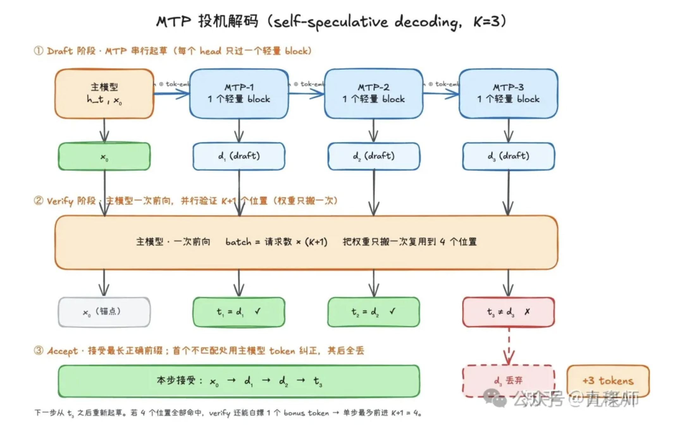

# MTP

## 参考资料

Papers:

- [ ] [Better & Faster Large Language Models via Multi-token Prediction](https://arxiv.org/pdf/2404.19737)

Blogs:

- [x] [MTP 为什么有效，又为什么能成为 LLM 标配？深度讲解 MTP 的模型结构细节](https://mp.weixin.qq.com/s?__biz=MzI1MzEwMzIwOQ==&mid=2247517009&idx=2&sn=4720a0d520f85e9f4d5dcf903f3119a5&chksm=e9db5e57deacd74186d341aabc02764ae6ca9bf6fd8902035960b8bf3b5dd41481daeb47c8fb&cur_album_id=3448912707083026439&scene=189#wechat_redirect)
