# LoRA 微调

> 学习目标：
>
> - 了解 LoRA 技术诞生背景，学习 LoRA/QLoRA/LONGLoRA 等主流 LoRA 技术的动机、原理和优缺点等知识；
> - 基于 llama-factory 框架，在 NPU 上完成 Qwen 模型的 LoRA 微调；
> - 通过社区交流/演讲等方式了解真实的用户如何在生产环境进行微调及改进（如：k8s），并以 LoRA 大模型微调为主题，在组内完成技术分享。

## LLM 微调知识全景


### 基本概念

**大模型训练流程：**

- **预训练（Pre Training, PT）**：这一阶段是模型训练的基础，利用海量数据、大量算力通过无监督训练得到基座模型。预训练后的模型具备强大的语言生成能力，但由于它主要是无监督训练的结果，可能不会直接适应具体的任务（如问答、对话），需要进一步的微调；
- **监督微调（Supervised Fine-Tuning, SFT）**：这一阶段则是对基座模型进行微调，让模型能够适用特定任务，最终得到一个 SFT 模型；
- **强化学习（Reinforcement Learning from Human Feedback, RLHF）**：这一阶段通过引入人类反馈（或者基于人类反馈训练的奖励模型）进一步优化模型的生成质量，使其生成的回答更符合用户的期望和人类的价值观。由于直接从人类获取反馈的成本较高，通常会先训练一个奖励模型（Reward Model，RM）来代替人类打分，这样可以在 RL 的框架下进行大规模的自动优化。

Post-training typically encompasses supervised instruction fine-tuning and alignment.


开源模型为了能够直接使用，一般会提供经过问答任务微调的版本，即 Chat 模型：


量化模型：它通过将模型中的高精度浮点数参数转换为低精度的整数参数来减少模型的存储和计算需求。这样做可以显著降低模型的内存占用，加快推理速度，并减少能耗。量化可以带来显著的效率提升，但也可能引入一些精度损失。

**如何训练垂直领域大模型？**

是否需要继续预训练（Continue PreTraining）？

- Chat 模型 + SFT：资源消耗少、模型通用能力有所降低；
- Base 模型 + 增量预训练 (Continue PreTraining) + SFT：资源消耗大、模型通用能力完整保留。

- **Continue PreTraining (增量预训练)**: 一般垂直大模型是基于通用基座大模型进行二次的训练，为了给模型注入领域知识，就需要用领域内的语料进行继续预训练（注入领域知识）；
- **SFT (Supervised Finetuning, 有监督微调)**: 通过 SFT 可以激发大模型理解领域内的各种问题并进行回答的能力（激发能力）；
- **强化学习**（对齐人类偏好，一般是二选一）：
  - **RLHF** (奖励建模、强化学习训练)：通过 RLHF 可以让大模型的回答对齐人们的偏好，比如行文的风格；
  - **DPO** (直接偏好优化)。

**什么是微调？**

大模型微调，通常指有监督微调（Supervised Fine-Tuning, SFT），是在预训练模型（一般称为“基座模型”）的基础上进行的训练过程。

预训练模型通常已经掌握了广泛的语言知识和语义表示，但为了让模型在特定任务或领域上表现得更好，我们会在特定任务的数据集上对其进行微调。

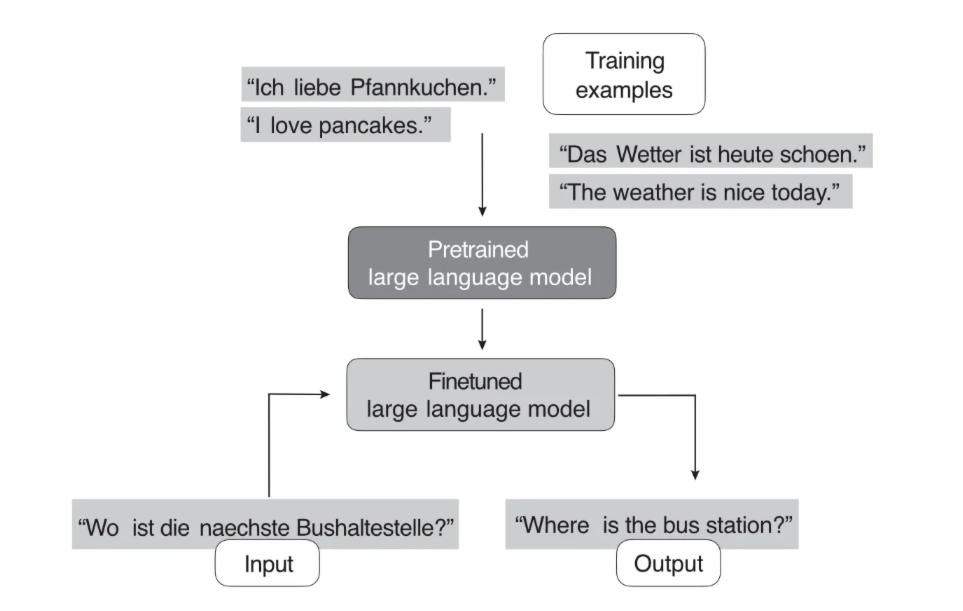

**为什么需要微调？**

- **任务特定性能提升**：预训练模型虽然有广泛的语言理解能力，但在特定任务上（如情感分析、问答系统、机器翻译等）的表现可能不尽如人意。微调通过在任务特定的数据上进一步训练，使模型能够更好地理解和执行该任务。
- **领域适应性**：预训练模型可能在一些通用领域表现良好，但在特定领域（如医学、法律、金融等）中可能难以准确理解专业术语和内容结构。通过微调，可以让模型更好地适应这些领域的语言特点，提高在这些领域中的应用效果。
- **数据稀缺性**：对于一些数据稀缺的任务或领域，获取大量标签数据可能比较困难。微调允许在有限的数据集上进行有效训练，从而在数据稀缺的情况下也能取得较好的性能。
- **防止过拟合**：预训练过程中模型可能会过度拟合于无监督学习的任务（如下一个词预测），而在特定任务中表现不佳。通过微调，可以让模型专注于特定任务的数据，这有助于减少过拟合的风险，提高模型在该任务上的泛化能力。
- **成本效益**：与使用 prompt 来引导模型行为相比，微调通常可以更高效地优化模型的表现。微调后的模型通常可以更直接地执行任务，减少了对复杂提示的依赖。同时，微调可以在更小的模型上实现类似于大型模型的性能，从而降低推理的计算成本和延迟，比如与使用通用的 GPT-3.5 模型相比，经过微调的小型模型（如LLaMA-7B）在成本效益上可能更具优势，尤其是在特定任务的执行上。

**微调方法分类：**

- **全量参数更新 Full Fine-tuning（FFT）**：即对预训练模型的所有参数进行更新，训练速度较慢，消耗机器资源较多；
- **参数高效微调 Parameter-Efficient Fine-Tuning（PEFT）**：只对部分参数做调整，训练速度快，消耗机器资源少。

FFT 的问题：

- 一个是训练的成本会比较高，因为全量微调的参数量跟预训练的是一样多的。随着模型规模变得越来越大，这使得在消费级硬件上进行全量微调变得不可行；
- 一个是叫灾难性遗忘（Catastrophic Forgetting），用特定训练数据去微调可能会把这个领域的表现变好，但也可能会把原来表现好的别的领域的能力变差。

常见的 PEFT 方法：BitFit、Prompt Tuning、Prefix Tuning、P-Tuning、P-Tuning V2、Adapter Tuning、LoRA、QLoRA、MAM Adapter、UniPELT、Freeze tuning 等。

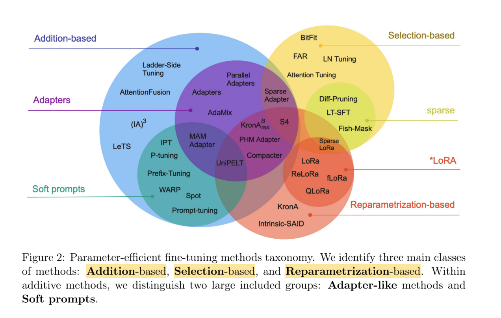

- **添加额外参数的 Addition-based (A)**：introduce new parameters (Prefix Tuning、Prompt Tuning、Adapter Tuning 及其变体)
  - 类似适配器的方法（Adapter-like methods）
  - 软提示（Soft prompts）
- **选取部分参数更新 Selection-based (S)**：fine-tune existing ones (BitFit)
- **引入重参数化 Reparametrization-based (R)**：reparameterize them (LoRA、AdaLoRA、QLoRA)

现在比较主流的几种 PEFT：**Prompt Tuning、Prefix Tuning、LoRA、QLoRA**。

- **Addition-based methods:** Addition-based methods augment the pre-trained model with additional parameters or layers and train only the newly introduced elements.
  - **Adapters:** proposing the addition of fully-connected networks after attention and FFN layers in Transformer.
  - **Soft Prompts:**
    - **Prompt Tuning:** proposes to prepend the input embeddings.
    - **Prefix Tuning:** shared trainable parameters are prepended to the hidden states of all layers.
  - ...
- **Selective methods:** selects parameters to tune based on carefully designed selection criteria.
- **Reparametrization-based methods:** leverage low-rank representations to minimize the number of trainable parameters.
  - **LoRA:** Parameter update for a weight matrix in LoRA is decomposed into a product of two low-rank matrices.
  - **GLoRA**
  - **AdaLoRA**
  - **QLoRA**
- **Hybrid methods:** ...


**use and finetune pretrained LLMs:**

- **In-Context Learning (zero-shot/few-shot learning、prompting):** is a valuable and user-friendly method for situations where direct access to the large language model (LLM) is limited, such as when interacting with the LLM through an API or user interface.
- **Conventional Feature-Based and Finetuning Approaches:** have access to the LLM, adapting and finetuning it on a target task using data from a target domain usually leads to superior results.
  - Feature-Based and Finetuning Approach
  - Finetuning 1
  - Finetuning 2
- **Parameter-Efficient Finetuning (PEFT):** minimizing the computational and resource footprints, updating a subset of the model parameters. **(SFT)**
  - Promp Tuning
    - Hard Promp Tuning
    - Soft Prompt Tuning
    - Prefix Tuning
  - Adapter Method
  - Reparameterization
    - Low-Rank Adaptation (LoRA)
    - QLoRA
    - LongLoRA
- **Reinforcement Learning with Human Feedback (RLHF)**

prompt tuning, prefix tuning 和 p-tuning v1 有一定的联系，这几种方法都是基于优化 continuous prompt。

P-Tuning，简称 PT，是一种针对于大模型的 soft-prompt 方法，包括两个版本：

- **P-Tuning**：仅对大模型的 Embedding 加入新的参数；
- **P-Tuning-V2**：将大模型的 Embedding 和每一层前都加上新的参数，这个也叫深度 prompt。

### In-Context Learning

which doesn’t require us to further train or finetune pretrained LLMs if we want to perform specific or new tasks that the LLM wasn’t explicitly trained on. Instead, we can directly provide a few examples of a target task via the input prompt.

in-context learning aims to provide context or examples of the task within the input or prompt, allowing the model to infer the desired behavior and generate appropriate responses. This approach takes advantage of the model’s ability to learn from vast amounts of data during pretraining, which includes diverse tasks and contexts.

For example, suppose we want to use in-context learning for few-shot German–English translation using a large-scale pretrained language model like GPT-3. To do so, we provide a few examples of German–English translations to help the model understand the desired task, as follows:


优点：

in-context learning has its advantages.

- It can be particularly useful when labeled data for finetuning is limited or unavailable.
- It also enables rapid experimentation with different tasks without finetuning the model parameters in cases where we don’t have direct access to the model or where we interact only with the model through a UI or API (for example, ChatGPT).

In-context learning is very useful if we don’t have direct access to the model, for instance, if we are using the model through an API.

缺点：

Generally, in-context learning does not perform as well as finetuning for certain tasks or specific datasets since it relies on the pretrained model’s ability to generalize from its training data without further adapting its parameters for the particular task at hand.

**Hard Prompt Tuning:**

Hard prompt tuning aims to optimize the prompt itself to achieve better performance. Prompt tuning does not modify the model parameters, but it may involve using a smaller labeled dataset to identify the best prompt formulation for the specific task.

For example, to improve the prompts for the previous German–English translation task, we might try the following three prompting variations:

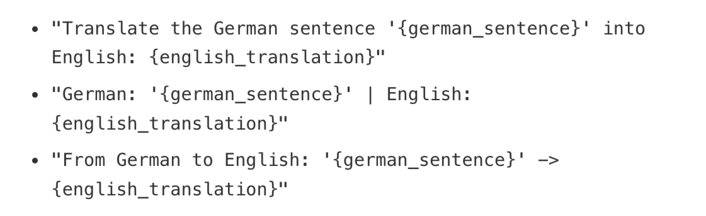

缺点：

- performance is usually not as good as full model finetuning, as it does not update the model’s parameters for a specific task, potentially limiting its ability to adapt to task-specific nuances.
- Furthermore, prompt tuning can be labor intensive since it requires either human involvement comparing the quality of the different prompts or another similar method to do so.

**Indexing:**

...

### Finetuning Approaches

However, if we have access to the LLM, adapting and finetuning it on a target task using data from a target domain usually leads to superior results.

conventional methods for utilizing pretrained transformers:

- training another model on feature embeddings
- finetuning output layers
- finetuning all layers


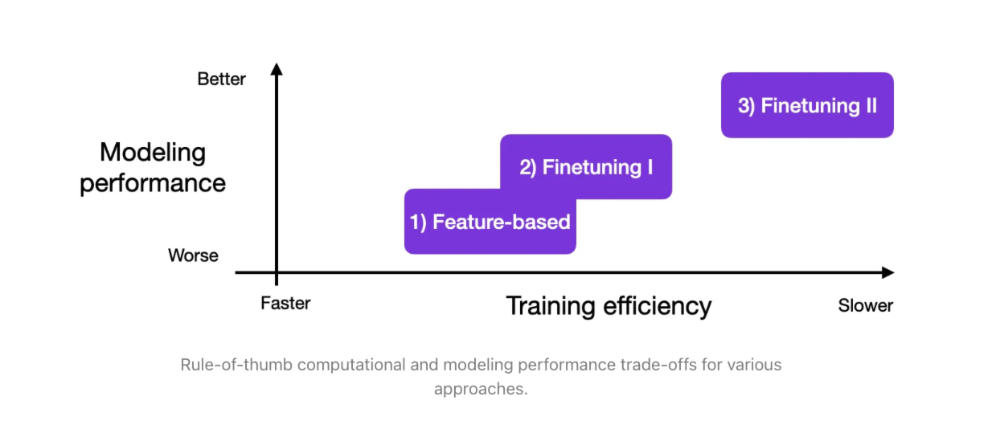

### Parameter-Efficient Finetuning

allows us to reuse pretrained models while minimizing the computational and resource footprints.

1. Reduced computational costs (requires fewer GPUs and GPU time);
2. Faster training times (finishes training faster);
3. Lower hardware requirements (works with smaller GPUs & less smemory);
4. Better modeling performance (reduces overfitting);
5. Less storage (majority of weights can be shared across different tasks).

finetune LLM with high modeling performance while only requiring the training of only a small number of parameters. These methods are usually referred to as **parameter-efficient finetuning techniques (PEFT)**.

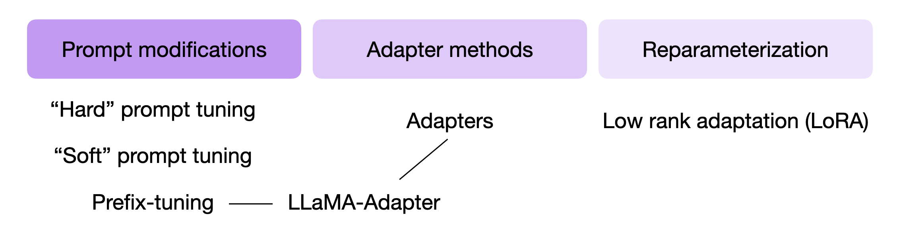

**Soft Prompt Tuning:**

prepend a trainable parameter tensor (the “soft prompt”) to the embedded query tokens. The prepended tensor is then tuned to improve the modeling performance on a target dataset using gradient descent.

```python
x = EmbeddingLayer(input_ids)
x = concatenate([soft_prompt_tensor, x], dim=seq_len)
output = model(x)
```

where the soft_prompt_tensor has the same feature dimension as the embedded inputs produced by the embedding layer. Consequently, the modified input matrix has additional rows (as if it extended the original input sequence with additional tokens, making it longer).

Prompt Tuning 可以看作是 Prefix Tuning 的简化版本，它给每个任务定义了自己的 Prompt，然后拼接到数据上作为输入，但只在输入层加入 prompt tokens（在输入 embedding 层加入一段定长的可训练的向量，在微调的时候只更新这一段 prompt 的参数），另外，virtual token的位置也不一定是前缀，插入的位置是可选的。

**P-tuning v2**：在每一层都加入了 Prompts tokens 作为输入，而不是仅仅加在输入层，可学习的参数更多（从 P-tuning 和 Prompt Tuning 的 0.01% 增加到 0.1%-3%），prompts 与更深层相连，对模型输出产生更多的直接影响。

**Prefix Tuning:**

prepend trainable tensors (soft prompts) to each transformer block instead of only the embedded inputs, which can stabilize the training.


Both soft prompt tuning and prefix tuning are considered parameter efficient since they require training only the prepended parameter tensors and not the LLM parameters themselves.

**Adapter Methods:**

In the original adapter method, additional fully connected layers were added after the multi-head self-attention and existing fully connected layers in each transformer block.

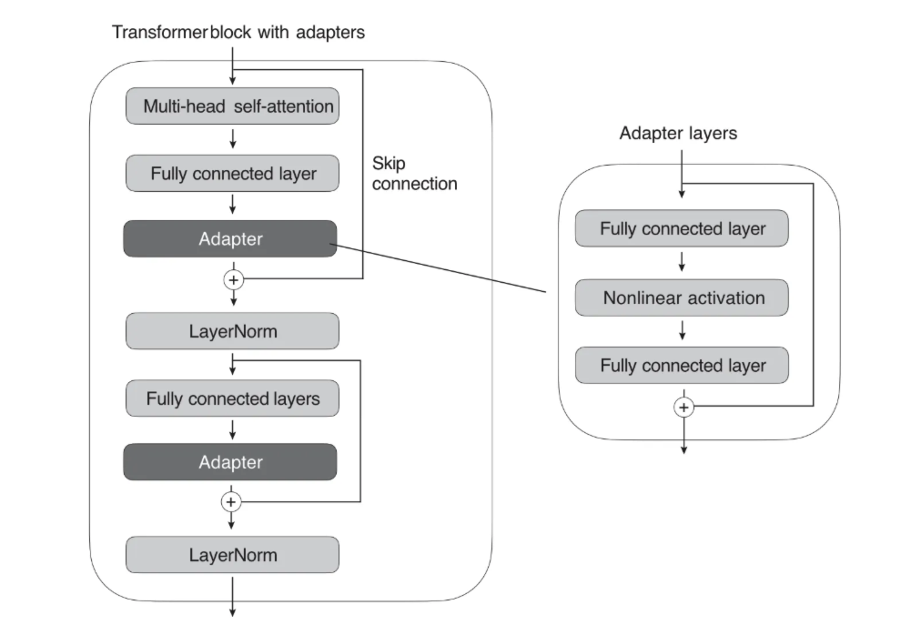

Only the new adapter layers are updated when training the LLM, while the remaining transformer layers remain frozen. the first fully connected layer in an adapter block projects its input into a low-dimensional representation, while the second layer projects it back into the original input dimension.

**Low-rank adaptation (LoRA):**

finding a combination of fewer dimensions that can effectively capture most of the information in the original data. Popular low-rank transformation techniques include principal component analysis and singular vector decomposition.

**PEFT 总结：**

In a nutshell, they all involve **introducing a small number of additional parameters that we finetuned** (as opposed to finetuning all layers as we did in the Finetuning II approach above). In a sense, Finetuning I (only finetuning the last layer) could also be considered a parameter-efficient finetuning technique. However, techniques such as prefix tuning, adapters, and low-rank adaptation, all of which **“modify” multiple layers**, achieve much better predictive performance (at a low cost).

除 Prefix Tuning 用于 NLG 任务外，Prompt Tuning、P-Tuning、P-Tuning V2 均用于 NLU，P-Tuning 和 Prompt Tuning 技术本质等同，Prefix Tuning 和 P-Tuning V2 技术本质等同。

> 对于领域化的数据定制处理，P-Tune（Parameter Tuning）更加合适。领域化的数据通常包含一些特定的领域术语、词汇、句法结构等，与通用领域数据不同。对于这种情况，微调模型的参数能够更好地适应新的数据分布，从而提高模型的性能。相比之下，LORA（Layer-wise Relevance Propagation）更注重对模型内部的特征权重进行解释和理解，通过分析模型对输入特征的响应来解释模型预测的结果。虽然LORA也可以应用于领域化的数据定制处理，但它更适合于解释模型和特征选择等任务，而不是针对特定领域的模型微调。
> ???

### Reinforcement Learning with Human Feedback (RLHF)

The conventional way to adapt or finetune an LLM for a new target domain or task is to use a supervised approach with labeled target data.

In RLHF, a pretrained model is finetuned using a combination of supervised learning and reinforcement learning.

Human feedback is collected by having humans rank or rate different model outputs, providing a reward signal. The collected reward labels can be used to train a reward model that is then used to guide the LLMs’ adaptation to human preferences. The reward model is learned via supervised learning, typically using a pretrained LLM as the base model, and is then used to adapt the pretrained LLM to human preferences via additional finetuning.

RLHF uses a reward model instead of training the pretrained model on the human feedback directly because involving humans in the learning process would create a bottleneck since we cannot obtain feedback in real time.

**RM**：训练一个奖励模型（Reward Model），用于评估生成模型的输出质量。收集生成模型输出及其对应的人类反馈。这些反馈可以是评分、选择最佳输出、直接修改等形式。使用这些反馈数据训练奖励模型，使其能够对生成的输出进行评分。奖励模型通常是一个监督学习模型，通过最小化预测评分与人类反馈评分之间的差距进行训练。

**RL**：使用强化学习算法（如 PPO（Proximal Policy Optimization））进一步优化第一步中生成的模型，使其输出更符合人类反馈的期望。

### Conclusion

Fine-tuning all layers of a pretrained LLM remains the gold standard for adapting to new target tasks, but there are several efficient alternatives for using pretrained transformers. Methods such as **feature-based approaches**, **in-context learning**, and **parameter-efficient finetuning techniques** enable effective application of LLMs to new tasks while minimizing computational costs and resources.

Moreover, **reinforcement learning with human feedback (RLHF)** serves as an alternative to supervised finetuning, potentially enhancing model performance.

## 背景介绍

**微调**：把已经训练好的模型（pretrained model）拿来，给它吃特定的下游任务数据，使得模型在预训练权重上继续训练，直至满足下游任务性能标准。

**全量微调**：在下游任务的训练中，对预训练模型的每一个参数都做更新（训练代价昂贵）。

**局部微调**：

**Adapter Tuning**：在微调时，除了 Adapter 的部分，其余的参数都是被冻住的（freeze），这样我们就能有效降低训练的代价。

缺点：添加了 Adapter 后，模型整体的层数变深，会增加训练速度和推理速度。

- 需要耗费额外的运算量在 Adapter 上；
- 并行训练时（例如：Transformer 架构常用的张量模型并行），Adapter 层会产生额外的通讯量，增加通讯时间。

**Prefix Tuning**：通过对输入数据增加前缀（prefix）来做微调（prefix 不仅可以加在输入层，还可以加在 Transformer Layer 输出的中间层）。在后续微调中，只需要冻住模型其余部分，单独训练 prefix token 相关的参数即可，每个下游任务都可以单独训练一套 prefix token。prefix 的作用是引导模型提取输入中的特定信息，进而更好地生成结果。


Based on intuition from prompting, we believe that having a proper context can steer the LM without changing its parameters.


缺点：

- 较难训练，且模型的效果并不严格随 prefix 参数量的增加而上升；
- 使输入层有效信息长度减少。为了节省计算量和显存，我们一般会固定输入数据长度。增加了 prefix 之后，留给原始文字数据的空间就少了，因此可能会降低原始文字中 prompt 的表达能力。

Prefix Tuning（面向文本生成领域（NLG））在输入 token 之前构造一段任务相关的 virtual tokens 作为 Prefix，训练的时候只更新 Prefix 部分的参数，而 PLM 中的其他部分参数固定。

总结：**全参数微调太贵，Adapter Tuning 存在训练和推理延迟，Prefix Tuning 难训且会减少原始训练数据中的有效文字长度**。

## LoRA 技术原理

LoRA（Low-Rank Adaptation，低秩适配器）：

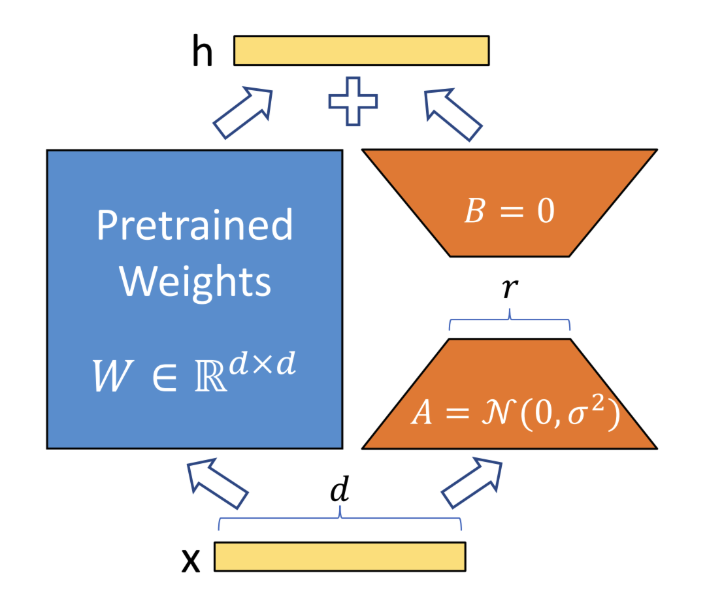

> 问题：
>
> - 为什么可以这样拆分？怎么拆？（SVD 分解）
> - 这样拆为什么有效？（经实验证明可以）
> - 为什么要这样初始化？（矩阵 A 和 B 只要有一个为 0 就行）
> - 与其它竞品相比的优势？

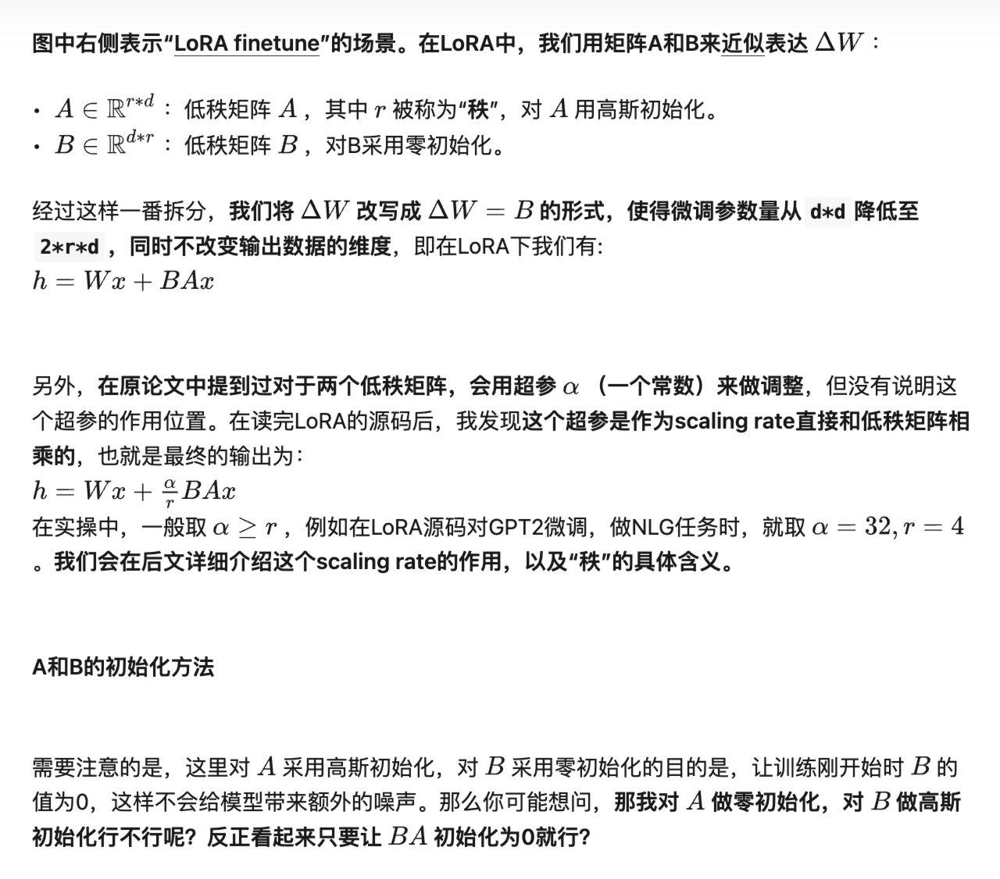

LoRA 在做推理时有一个显著的优势：可以将低秩适配器的权重直接合并到预训练权重里，这样就和全参数微调一样，不会产生推理上的额外耗时。

### 训练

为了计算 B 的梯度，我们需要用到和全参数微调过程中一样大小的中间值结果。对 LoRA 来说，这一层的峰值显存，和全量微调基本是一致的（甚至略高）。

- LoRA 并不是作用在模型的每一层；
- LoRA 虽然会导致某一层的峰值显存高于全量微调，但计算完梯度后，这个中间结果就可以被清掉了，不会一直保存；
- 待训练权重从 `d*d` 降为 `2*r*d`，需要保存的 optimizer states 也减少了。

### 推理

在推理过程中，合并低秩矩阵和预训练权重，然后正常做 forward 推理。这样我们完全不会更改模型的架构，因此不会像 Adapter Tuning 一样产生推理上的延时。

在切换不同下游任务时，我们可以灵活从 W 中移除低秩权重的部分。每个下游任务，都可以有自己的一套低秩权重。可以将“预训练权重”和“低秩权重”分开存储。

### 超参数 r

**秩**表示的是矩阵的信息量。如果矩阵中的某一维，总可以通过其余维度线性推导而来，那么对模型来说，这一维的信息是冗余的，是重复表达的。秩不满，我们称为秩亏（rank deficient），否则称为满秩（full rank）。

全参数微调中的增量权重可能也存在冗余的信息，因此我们并不需要用完整的 `d*d` 尺寸来表示它。找出增量权重中真正有用的特征维度：**SVD（奇异值分解）**。

微调的目的是给模型注入和下游任务相关的领域新知识，我们的目的是要去新知识中拆解信息量丰富的维度。

W 确定，其秩 r 就确定，其 SVD 分解的结果就确定。

LoRA 的做法：**把秩 r 当成一个超参，再让模型自己去学低秩矩阵 A 和 B**。

### 超参数 a

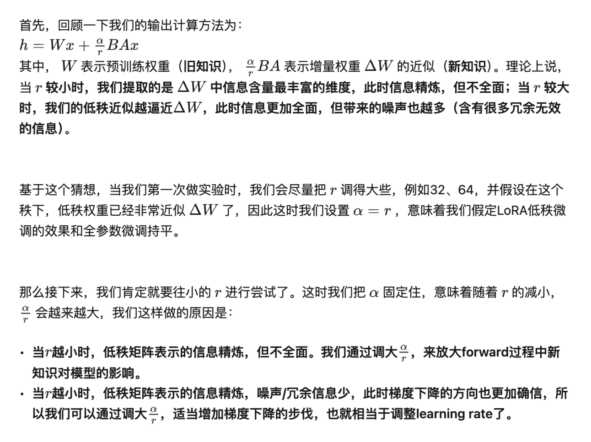

### 实验结论

小秩空间中，信息量越高的那几维特征，和大秩空间的相交度越高，因此它们也是**小秩空间表现能持平大秩空间**的主要原因，这也更加论证了作者所说的“低秩”的有效性。

模型会尽可能往信息最丰富的维度学，但不能保证 r 取多少，最终学出来的一定就是客观存在的增量权重 W 的 top r，只能说**当 r 取的比较小时，模型更有可能贴近真正的 top r；当 r 取比较大时，模型学出的是部分有价值的信息和一些噪声**（另外，也许增量权重 W 真正的秩还可能小于 r 呢），而这个实验则刚好论证了这一点。

设置两组不同的随机种子，跑出两组不同的低秩矩阵。**两组低秩矩阵都能学到的信息，大概率就是有用的信息了。**

预训练权重（旧知识）和增量权重（新知识）的分布间是存在显著差异的。**增量权重对预训练权重中那些没有强调的信息进行了放大**，秩越小，放大程度越明显（根据 r 进行了缩放）。

## 源码分析

```python
import loralib as lora
# ------------------------------------------------
# model是指已经添加过lora低秩适配器的model
# 其lora相关的layer，名字都以"lora_"开头
# ------------------------------------------------
model = Model()

# ------------------------------------------------
# 使用lora微调时，我们冻结pretrain，只训练低秩适配器
# 通过mark_only_lora_as_trainable，我们将所有
# 不是以"lora_"开头的参数层的requires_grad设为False
# ------------------------------------------------
lora.mark_only_lora_as_trainable(model)
```

经过改造的基础模型分为“预训练部分”和“低秩适配器”部分。

当我们开启 `model.train()` 时，我们是用拆开的预训练和低秩适配器做训练的；当我们开启 `model.eval()` 时，我们则是先将低秩适配器合入预训练权重，再做推理。

> 问题：
>
> - 预训练模型要如何改写？
> - 模型的训练（train）和验证（validate）具体逻辑是怎么样的？
> - 低秩适配权重是否要合进预训练权重，怎么合进预训练权重？

使用 `lora.MergedLinear` 改写原始训练模型。

```python
class Attention(nn.Module):
    def __init__(self, nx, n_ctx, config, scale=False):
        super(Attention, self).__init__()
        # ...

        # ------------------------------------------------
        # 使用lora.MergedLinear改写attention层
        # 改写过后的attention层包括预训练部分和低秩适配器部分
        # ------------------------------------------------
        self.c_attn = lora.MergedLinear(
            nx, # embed_dim
            n_state * 3, # embed_dim * 3，因为这里将qkv融合成一个矩阵处理
            r=config.lora_attn_dim, # r值，即lora中的秩
            lora_alpha=config.lora_attn_alpha, # alpha值，用于表示微调过程中对新知识的侧重程度
            lora_dropout=config.lora_dropout, # dropout值
            enable_lora=[True, False, True], # 表示对qkv三个矩阵中的q，v做低秩适配，k保持原样
            fan_in_fan_out=True, # 表示在计算时是否要做矩阵专置
            merge_weights=False # 表示是否想将低秩适配权重合并到预训练权重中
        )

        # ...
```

LoRA 的参数：

- `r`：即 LoRA 中的秩；
- `alpha`：用于表示微调过程中对新知识的侧重程度；
- `dropout`：？

> 在作者之前的研究中发现，对于数据经过矩阵 B、但还没有过激活层时的那个数值，其波动幅度和 r 有相关性。因此通过 1/r 这样的因子，来消除这种影响，使得模型训练更稳定，否则，就需要去调 learning rate 了（猜想之所以波动幅度和 r 相关，也是因为越大的 r 带来的噪声冗余越多，这点之前在原理篇有给过分析）。从这点上说，alpha 可以纯被解释为模型对新知识的侧重程度，而 1/r 则是一种 scaling rate。

`train_validate()`（训练核心函数）：

```python
def train_validate(...):
    # 模型训练：开启训练模式，此时 pretrain 和低秩适配部分是分开的
    model.train()

    # ...

    # 遍历每一个 batch
    for idx, data in enumerate(train_loader):
        # ...
        # 梯度累积更新
        # ...

        # 模型验证：开启 model.eval()，记录基于验证数据集的最好模型效果
        valid_loss, valid_ppl = evaluate(model, valid_loader, args)

        # ...

        # 验证完毕后，需要重新开启 model.train() 模式
        model.train()
        distributed_sync(args)
    
    # 保存模型训练结果，只保存 lora 部分的结果
```

梯度累积更新：我们有时不会一个 step 更新一次梯度，而是累积若干次 step（即代码中的 grac_acc 值）再做一次梯度更新。

- 减少模型的更新频率，一定程度上加速训练速度；
- 节省显存。可以理解为，当一个大 batch 将显存打爆时，我把它拆成若干个小 batch 来跑，此时我们理所当然希望这个大 batch 和这若个干小 batch 对梯度计算的结果尽量是一样的。（？）

> 对于 pytorch 来说，我们知道梯度是挂在 tensor.grad 这个属性下的。如果你做完 loss.backward()，但是不做 optimizer.zero_grad()，那么权重的 tensor.grad 这个属性就会累加。

`lora.MergedLinear`：……

## LoRA 的变体

### LoRA

LoRA 的核心理念是相对于全量微调而言，只训练极少的参数，同时保持全量微调所能达到的性能。

- 放大了其针对新任务或新数据集所需的特定适应性；
- 模型的 Checkpoint size 大小减少；
- 使用 LoRA 微调时训练速度提高了，这是因为在 LoRA 的训练过程中，绝大部分参数都未计算梯度；
- 不会引入推理延迟。这是由于其简单的线性设计，使其部署时可以将新添加的矩阵（A 和 B）与冻结权重（W）合并，因此可以完全按照常规方式推理；
- 超参数 r 比相应权重矩阵的维度小几个数量级。我们注意到 r=1 的表现几乎与任何其他更高的阶数一样好，这即表明，低秩矩阵 A 和 B 可以是简单的行矩阵或和列矩阵。

### LoRA-FA

LoRA-FA（Frozen-A）：

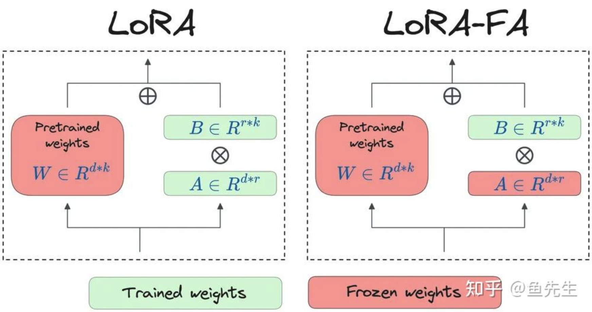

- 矩阵 A 在初始化后被冻结，作为随机投影；
- 矩阵 B 在用零初始化之后进行训练（就像在原始 LoRA 中一样）。这将参数数量减半，但具有与普通LoRA 相当的性能。

这种方法确保模型权重的调整保持在一个低秩空间内，从而最大限度地减少存储全秩输入激活所需的内存。

使用 LoRA-FA 而不是 LoRA 时，并未出现模型性能显著下降的情况（甚至超过 LoRA）。

> 问题：
>
> - 什么是输入激活内存？

### VeRA

VeRA（Vector-based Random Matrix Adaptation，基于向量的随机矩阵适应）技术可以进一步减少 LoRA 中可训练参数数量，同时能够匹配或接近 LoRA 的精度。


在 VeRA 中，矩阵 A 和 B 被冻结和随机化，并在所有模型层之间共享。这消除了在不同层之间训练和更新大量参数的需求，简化了模型架构。VeRA 不更新这些矩阵 A 和 B ，而是专注于学习小型的、层特定的缩放向量（layer-specific scaling vectors），记作 b 和 d ，它们是此设置中唯一的可训练参数。这些向量不跨层共享。

- 矩阵 A 从正态分布中随机初始化，并且在微调过程中不进行训练。与 LoRA 的不同在于，VeRA 的这个权重矩阵在所有层之间共享；
- 矩阵 B 也从正态分布中随机初始化。在 LoRA 中，B 的初始化值是零，但在 VeRA 中不能这样做，因为矩阵 B 不训练，初始化为零将导致输出全为零。这个权重矩阵也在所有层之间共享；
- 向量 d 的初始值为全 1，并在微调过程中进行训练；
- 向量 b 的初始值为全 0，同样微调过程中进行训练。以零初始化确保在微调开始时不对模型进行任何更新。

VeRA 的内存需求明显更低。此外，VeRA 的可训练参数数量比 LoRA 小几个数量级。

大多数情况下，VeRA 与 LoRA 的性能指标差异不大。

### QLoRA

QLoRA（Quantized LoRA）：QLoRA 是一个使用量化思想对 LoRA 进行优化的量化算法，可以显著的降低训练大模型时所需要的显存资源。

QLoRA 的优化有三个核心要点：

- 第一个工作是结合了分位数量化和分块量化的 4 位标准浮点数量化（4-bit NormalFloat Quantization）；
- 第二个工作是对模型进行两次量化的双重量化（Double Quantization），它的第二次量化只作用在第一次量化产生的量化常数上，可以进一步节约显存占用；
- 第三个工作是分页优化（Paged Optimizer），使用 CPU 内存代替 GPU 显存保存部分梯度参数。

#### 数学原理

**分位数量化（Quantile Quantization）**：隶属于非线性量化，分位数（Quantile）在数学上的定义指的是把顺序排列的一组数据分割为若干个相等块的分割点的数值。

**解决了什么问题？**
如果我们粗暴的使用 round 操作去映射到低精度的更近的值，我们可能造成大量的数据都被量化到同一个数上，这样特征之间的差异性在量化过程中就被丢失了。使用分位数将张量分成了大小相同的若干个块，这样我们得到更加均匀的量化特征，这也就是分位数量化。每两个分位数的中点便是模型量化到这个区间映射的值。

**分块 k 位量化（block-wise k-bit quantization）**：通过将张量分成若干个块，让每个块都有独立的量化常数 c，从而解决模型参数的极大极小的异常值的问题。分块量化的另外一个好处是减少了核之间的通信，可以实现更好的并行性，并充分利用硬件的多核的能力。

在量化过程中，状态张量被分块处理，通过每个块的最大值进行归一化，最后得到的是最近的值以及它所在块的最大值。在反量化时，我们根据存储的量化后的低精度的值以及它所在块的最大值恢复到高精度的值。

#### 四位标准浮点数量化

QLoRA 采用分块量化：

量化分位数的计算：

示例：假设一个张量有 16 个值，被分成了 4 块。

1. 根据每个块的特征的绝对值的最大值，我们为每个块保存一个量化常数（每个块中的特征取绝对值后的最大值）；
2. 计算每个张量的量化值了（实际值/该块的量化常数）；
3. 在 Q（normal_map）中找到与每个张量最接近的值，并将其量化为该值对应的索引值。

`normal_map` 的计算：

```python
from scipy.stats import norm
import torch

def create_normal_map(offset=0.9677083, use_extra_value=True):
    if use_extra_value:
        # one more positive value, this is an asymmetric type
        v1 = norm.ppf(torch.linspace(offset, 0.5, 9)[:-1]).tolist() # 正数部分
        v2 = [0]*(256-15) ## we have 15 non-zero values in this data type
        v3 = (-norm.ppf(torch.linspace(offset, 0.5, 8)[:-1])).tolist() #负数部分
        v = v1 + v2 + v3
    else:
        v1 = norm.ppf(torch.linspace(offset, 0.5, 8)[:-1]).tolist()
        v2 = [0]*(256-14) ## we have 14 non-zero values in this data type
        v3 = (-norm.ppf(torch.linspace(offset, 0.5, 8)[:-1])).tolist()
        v = v1 + v2 + v3

    values = torch.Tensor(v)
    values = values.sort().values
    values /= values.max()
    assert values.numel() == 256
    return values


Q = create_normal_map()
# Q = [-1.0, -0.6961928009986877, -0.5250730514526367, -0.39491748809814453, -0.28444138169288635, -0.18477343022823334, -0.09105003625154495, 0.0, 0.07958029955625534, 0.16093020141124725,0.24611230194568634, 0.33791524171829224, 0.44070982933044434, 0.5626170039176941, 0.7229568362236023, 1.0]
```

> `norm.ppf()`：[用法](https://www.cnblogs.com/jiangkejie/p/15292260.html)。

在模型保存时，除了要保存量化后的值，我们还要保存每个块对应的量化常数，因为这个值在我们进行反量化时需要用到。在反量化时，我们以量化结果作为索引，从 Q 中查找到它对应的分位数，再乘以为每个块保存的量化常数，便可以得到最终的结果。

> 问题：
>
> - 这样量化的好处是什么？——处理离群值、0 点映射、其它？
> - 模型量化后，是怎么进行推理的？

#### 双重量化

QLoRA 的双重量化是指对量化常数再做一次 8 bit 的量化，在进行量化常数的量化时，QLoRA 以每 256 个量化常数为一组再做一次量化。

在进行反量化时我们也需要进行两次反量化才能把量化后的值还原。

好处：减少了存储量化常数带来的额外显存占用。

#### 分页优化

QLoRA 分页优化其实就是当显存不足是，将保存的部分梯度检查点转移到 CPU 内存上，和计算机的内存数据转移到硬盘上的常规内存分页一个道理。

#### QLoRA 微调

对于 LLM 的参数 W（预训练参数），我们首先将它量化到 NF4 的精度，在进行特征计算时，我们通过双重反量化将它还原到 BF16 精度。QLoRA 也在原参数一侧添加了一个与原参数并行的低秩适配器，它的精度是 BF16。

QLoRA 有一个 NF4 的存储数据类型和 BF16 的计算数据类型。在进行前向和反向传播时，我们需要将存储数据类型反量化为计算数据类型，但是计算梯度时我们只计算添加的适配器的梯度，这一点和 LoRA 是一致的。

#### QLoRA 总结

> 问题：想问一下既然 QLoRA 的主要工作是模型量化，为什么文章着墨点确实微调呢，而且微调方法完全是与 LoRA 一致， 是因为用 QLoRA 的方法直接量化效果不好，微调效果才好么？

QLoRA 的核心工作其实是模型量化，通过定义一个 NF4 的精度单位将原模型的参数精度减小了数倍，从而大幅节约了训练时占用的显存。

- Default LoRA with **16-bit brain floating point (BF16)** precision
- QLoRA with **4-bit Normal Floats (4NF)**

> 关于 LLM 数据类型的说明：[<u>淺談 DeepLearning 的浮點數精度 FP32/FP16/TF32/BF16……</u>](https://medium.com/@averyaveavi/%E6%B7%BA%E8%AB%87deeplearning%E7%9A%84%E6%B5%AE%E9%BB%9E%E6%95%B8%E7%B2%BE%E5%BA%A6fp32-fp16-tf32-bf16-%E4%BB%A5llm%E7%82%BA%E4%BE%8B-9bfb475e50be)。

QLoRA 优缺点：

- Training time ⬆️
- Memory used ⬇️

Indeed, I found that one can save 33% of GPU memory when using QLoRA. However, this comes at a 39% increased training runtime caused by the additional quantization and dequantization of the pretrained model weights in QLoRA.

### LongLoRA

因为 Multi-head attention 的计算会消耗大量的显存，相比于常规的 2048 长度的预训练模型微调，如果你想扩大 4 倍的 context 长度到 8192，差不多需要 16 倍的训练资源。本文首先提出 shift short attention 策略，可以让模型在微调的时候长度远远短于推理时候的长度，并且保持跟全参微调差不多的效果。其次，为了更适用，对长 context 微调的 lora 进行了测试并优化，使用新的 lora 策略可以达到全参微调的效果。整个优化策略可以用 2 行代码实现，可以使用补丁的方式合并到自己的微调代码中，所以几乎能适用所有在做领域模型的朋友们。

> 长度外推微调？

核心技术：

- shift short attention；
- 相比于加到 query/key/value 等部分上的 lora，这里是将 lora 加到 embedding 和 normaliztion 层上；

mhsa 里面，计算不是全局 global attention 了，而是局部的带偏置的了。
只是计算 group 内部的几个 tokens 之间的 attention ，即 short attention。
不增加训练复杂度，但是能达到和标准 attention 一致的效果。
采用 shift 操作，模型困惑度（perplexity）指标变小。

S2-Attn 在训练过程中通过局部注意力和移位操作，显著减少了计算成本，同时确保了组与组之间的信息流动。在推理阶段，模型仍然使用标准的自注意力机制。

[<u>LongLoRA GitHub</u>](https://github.com/dvlab-research/LongLoRA)

### 其它

- Delta-LoRA
- LoRA+
- LoRA-drop
- DoRA
- ……

## 微调技巧

### Multiple Training Epochs

multi-epoch training might not benefit instruction finetuning since it can deteriorate the results. This performance decline is likely due to increased overfitting, which warrants additional investigation.

### Balancing LoRA Hyperparameters: R and Alpha

Choosing alpha as two times r is a common rule of thumb when using LoRA for LLMs.

### Can LoRA Weights be Combined?

During training, we keep the LoRA weights separate from the pretrained weights and add them during each forward pass.

If you have a real-world application with many sets of LoRA weights, for example, one set for each application customer, it makes sense to store these weights separately to save disk space.

## 真实的用户是如何在生产环境下（如 k8s）进行大模型微调的？

### 微调教程

fine tuning Llama 2 with a Hugging Face dataset using multiple CPU nodes. Several different components are involved to run this job on the cluster.


- Helm Char: 管理配置（食谱）
- PyTorchJob with multiple workers for fine tuning the model: 执行微调（厨师）
- Persistent Volume Claim (PVC) used as a shared storage: 存储数据（冰箱）
- Secret for gated models (Optional)
- Data access pod (Optional)

**Helm Char:**

brings together all the different components that are used for our job and allows us to deploy everything using one `helm install` command.

**Storage (NFS storage location):**

We need a storage location that can be shared among the workers to access the dataset, and save model files. We are using a vanilla K8s cluster with an NFS backed storage class.

our NFS storage location doesn't get added to the container. Instead, the storage location gets mounted into the container so that we have access to read and write from that location without it being built into the image. To achieve this, we are using a **persistent volume claim (PVC)**.

[<u>PersistentVolume</u>](https://kubernetes.io/docs/concepts/storage/persistent-volumes/) subsystem provides an API for users and administrators that abstracts details of how storage is provided from how it is consumed.

A **PersistentVolumeClaim (PVC)** is a request for storage by a user. It is similar to a Pod. Pods consume node resources and PVCs consume PV resources. Pods can request specific levels of resources (CPU and Memory). Claims can request specific size and access modes (e.g., they can be mounted ReadWriteOnce, ReadOnlyMany, ReadWriteMany, or ReadWriteOncePod, see AccessModes).

**Secret:**

The last ingredient that we're adding in is the secret sauce. Gated or private models require you to be logged in to download the model. For authentication from the K8s job, we define a secret with a Hugging Face User Read Only Access Token. The token from the secret will be mounted into the container. If the model being trained is not gated or private, this isn't required.

**环境准备：**

This tutorial requires **Kubeflow** to be installed on your cluster. Kubeflow provides features and custom resources that simplify running and scaling machine learning workloads on K8s clusters. In this example, we are going to be using the **PyTorch training operator** from Kubeflow. The PyTorch training operator allows us to run distributed PyTorch training jobs on the cluster without needing to manually set environment variables.

Client：kubectl、helm.

[微调具体流程](https://huggingface.co/blog/dmsuehir/llama2-fine-tuning-k8s#tutorial-fine-tuning-llama-2-using-a-kubernetes-cluster)

### Kubeflow

Kubeflow is a community and ecosystem of open-source projects to address each stage in the machine learning (ML) lifecycle with support for best-in-class open source tools and frameworks. Kubeflow makes AI/ML on Kubernetes simple, portable, and scalable.

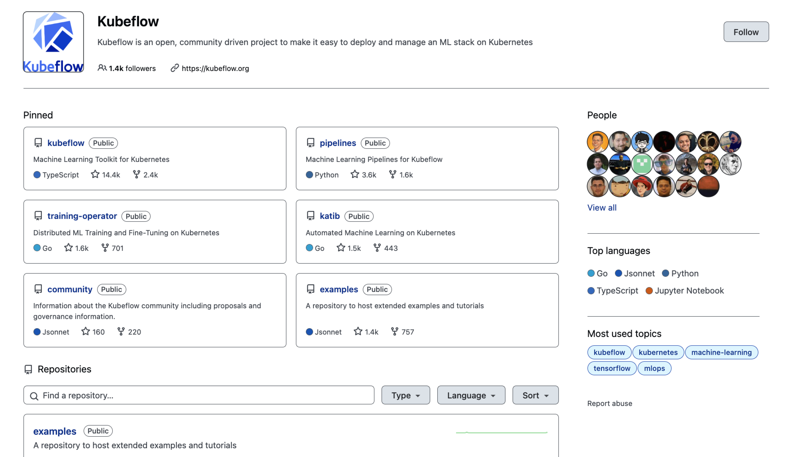

- Standalone Kubeflow Components
- Kubeflow Platform

**Standalone Kubeflow Components:**

The Kubeflow ecosystem is composed of multiple open-source projects that address different aspects of the ML lifecycle. Many of these projects are designed to be usable both within the Kubeflow Platform and independently. These Kubeflow components can be installed standalone on a Kubernetes cluster. It provides flexibility to users who may not require the full Kubeflow Platform capabilities but wish to leverage specific ML functionalities such as model training or model serving.

...

**Kubeflow Platform:**

The Kubeflow Platform refers to the full suite of Kubeflow components bundled together with additional integration and management tools. Using Kubeflow as a platform means deploying a comprehensive ML toolkit for the entire ML lifecycle.

**Kubeflow Overview Diagram:**


**Kubeflow Ecosystem:**


> 目前还不支持昇腾 NPU。

**ML Lifecycle for Production and Development Phases:**


In the **Data Preparation step** you ingest raw data, perform feature engineering to extract ML features for the offline feature store, and prepare training data for model development. Usually, this step is associated with data processing tools such as Spark, Dask, Flink, or Ray.

In the **Model Development step** you choose an ML framework, develop your model architecture and explore the existing pre-trained models for fine-tuning like BERT or Llama.

In the **Model Optimization step** you can optimize your model hyperparameters and optimize your model with various AutoML algorithms such as neural architecture search and model compression. During model optimization you can store ML metadata in the Model Registry.

In the **Model Training step** you train or fine-tune your model on the large-scale compute environment. You should use a distributed training if single GPU can’t handle your model size. The results of the model training is the trained model artifact that you can store in the Model Registry.

In the **Model Serving step** you serve your model artifact for online or batch inference. Your model may perform predictive or generative AI tasks depending on the use-case. During the model serving step you may use an online feature store to extract features. You monitor the model performance, and feed the results into your previous steps in the ML lifecycle.

**LLM Fine-Tuning with Training Operator:**

[PyTorch Training (PyTorchJob)](https://www.kubeflow.org/docs/components/training/user-guides/pytorch/): The PyTorchJob is a Kubernetes custom resource to run PyTorch training jobs on Kubernetes. The Kubeflow implementation of the PyTorchJob is in the **training-operator**.


Once user executes train API, Training Operator creates PyTorchJob with appropriate resources to fine-tune LLM.

Storage initializer InitContainer is added to the PyTorchJob worker 0 to download pre-trained model and dataset with provided parameters.

PVC with ReadOnlyMany access mode it attached to each PyTorchJob worker to distribute model and dataset across Pods. Note: Your Kubernetes cluster must support volumes with ReadOnlyMany access mode, otherwise you can use a single PyTorchJob worker.

Every PyTorchJob worker runs LLM Trainer that fine-tunes model using provided parameters.

## 微调框架

- LLaMa-Factory
- Torch-Tune

比较主流的几个微调工具：

- huggingface/transformers：最基础的一个库,提供了丰富的预训练模型和微调工具，支持大多数主流的NLP任务（如文本分类、序列标注、生成任务等）。适合进行快速实验和生产部署，有着广泛的社区支持。
- huggingface/peft：Parameter-Efficient Fine-Tuning，huggingface 开源的微调基础工具
- modelscope/ms-swift：modelscope 开源的轻量级微调框架
  - 以中文大模型为主，支持各类微调方法
  - 可以通过执行脚本进行微调，也可以在代码环境中一键微调
  - 自带微调数据集和验证数据集，可以一键微调 + 模型验证
- hiyouga/LLaMA-Factory：全栈微调工具
  - 支持海量模型 + 各种主流微调方法
    - 运行脚本微调
    - 基于 Web 端微调
  - 自带基础训练数据集
  - 除微调外，支持增量预训练和全量微调
- NVIDIA/Megatron-LM：NVIDIA开发的大模型训练框架，支持大规模的预训练和微调。适用于需要极高性能和规模的大模型训练和微调。

总结：快速实验选择 Transformers 即可，超大规模的选择 NVIDIA/Megatron-LM，普通规模就选择使用较为简单的 hiyouga/LLaMA-Factory。

## 参考资料

- [<u>大模型低秩适配器 LoRA 原理</u>](https://zhuanlan.zhihu.com/p/646831196)
- [<u>大模型低秩适配器 LoRA 源码解读与实操</u>](https://zhuanlan.zhihu.com/p/654897296)
- [<u>LoRA 系列微调技术概述</u>](https://zhuanlan.zhihu.com/p/990958034)
- [<u>QLoRA 详解</u>](https://zhuanlan.zhihu.com/p/666234324)
- [<u>LongLoRA - 高效微调长上下文的 LLMs</u>](https://zhuanlan.zhihu.com/p/659226557)
- [<u>LLM 长 context 微调技巧 - LongLora</u>](https://zhuanlan.zhihu.com/p/658043624)
- [<u>LoRA、QLoRA、LoRA+、LongRA、DoRA、MaLoRA、GaLore 方案</u>](https://zhuanlan.zhihu.com/p/8954237216)
- [<u>New LLM Pre-training and Post-training Paradigms</u>](https://magazine.sebastianraschka.com/p/new-llm-pre-training-and-post-training)

更多文章：[<u>ahead of ai</u>](https://magazine.sebastianraschka.com/archive)，搜：Finetuning、Lora。

- [<u>Finetuning Large Language Models</u>](https://magazine.sebastianraschka.com/p/finetuning-large-language-models?utm_source=publication-search)
- [<u>Using and Finetuning Pretrained Transformers</u>](https://magazine.sebastianraschka.com/p/using-and-finetuning-pretrained-transformers?utm_source=publication-search)
- [<u>Practical Tips for Finetuning LLMs Using LoRA</u>](https://magazine.sebastianraschka.com/p/practical-tips-for-finetuning-llms?utm_source=publication-search)

微调原理：

- [<u>LLM 微调理论</u>](https://qiankunli.github.io/2023/10/29/llm_finetune_theory.html)
- [<u>GPT 是如何炼成的：大模型微调基础概念指北</u>](https://www.lixueduan.com/posts/ai/04-finetune-concept/)

微调实践：

- [<u>LLM 微调实践</u>](https://qiankunli.github.io/2024/07/28/llm_finetune_practice.html)
- [<u>Fine Tuning a LLM Using Kubernetes with Intel® Xeon® Scalable Processors</u>](https://huggingface.co/blog/dmsuehir/llama2-fine-tuning-k8s)
- [<u>Airflow pipeline to finetune LLM on Kubernetes</u>](https://github.com/kaushil24/llm-finetune-pipeline)
- [<u>How to Fine-Tune LLMs with Kubeflow</u>](https://www.kubeflow.org/docs/components/training/user-guides/fine-tuning/)
- [<u>LLM Fine-Tuning with Training Operator - Architecture</u>](https://www.kubeflow.org/docs/components/training/reference/fine-tuning/)
- [<u>LLM Fine-Tuning with the Training Operator</u>](https://www.kubeflow.org/docs/components/training/explanation/fine-tuning/)

SFT：

- [<u>LLM 训练-sft</u>](https://zhuanlan.zhihu.com/p/809229182)
- [<u>抖音豆包大模型 SFT-监督微调最佳实践</u>](https://blog.csdn.net/qq_45156060/article/details/142170719)

论文：

- [<u>Scaling Down to Scale Up: A Guide to Parameter-Efficient Fine-Tuning</u>](https://arxiv.org/abs/2303.15647)
- [<u>Prefix-Tuning: Optimizing Continuous Prompts for Generation</u>](https://arxiv.org/abs/2101.00190)
- [<u>LoRA: Low-Rank Adaptation of Large Language Models</u>](https://arxiv.org/abs/2106.09685)
- [<u>QLoRA: Efficient Finetuning of Quantized LLMs</u>](https://arxiv.org/abs/2305.14314)
- [<u>LongLoRA: Efficient Fine-tuning of Long-Context Large Language Models</u>](https://arxiv.org/abs/2309.12307)
