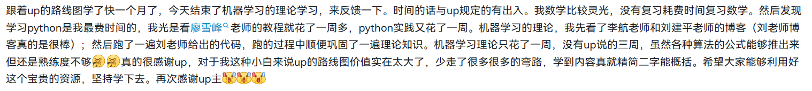
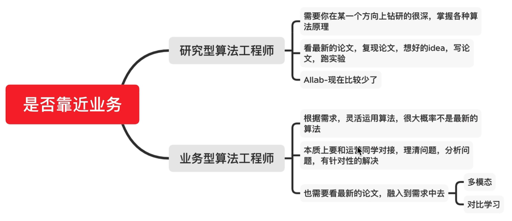
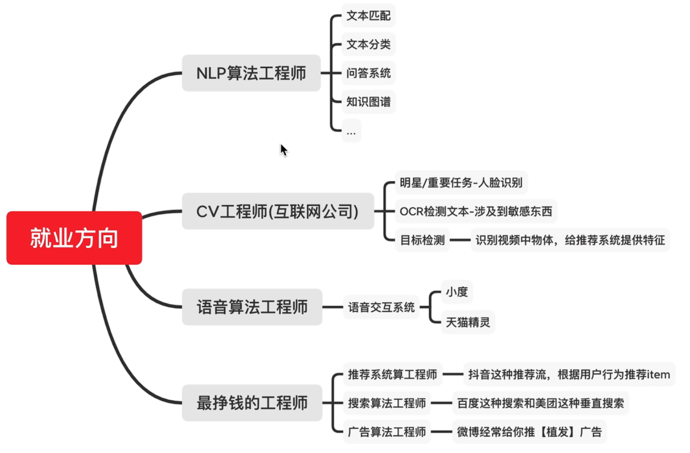

# 如何系统学习机器学习

顺序上，先学机器学习再学深度学习。学习方法上来说，两者都不要陷入只看书只推公式但是不写代码的陷阱，那样的话，你非常容易陷入痛苦之中。

## 1  基础知识

### 1.1  数学

- 线性代数：向量、矩阵、运算、范数、特征向量和特征值；
- 微积分：导数，梯度，泰勒公式；
- 概率论：条件概率，最大似然估计。

### 1.2  Python

- 推荐课程：廖雪峰（学习到常用的第三方模块之后，有了一定的 Python 基础，就可以不用学习了）；
- 推荐书籍：《利用 Python 进行数据分析》（这本书的内容，在我们往后的机器学习和深度学习关系很密切，因为我们在构建模型之前，需要很多操作去处理数据，用到这本书介绍的这两个 api 包）。

## 2  机器学习理论

- 推荐书籍：李航《统计学习方法》；
- 技术博客：刘建平；
- Python 包：sklearn。

### 2.1  学习方法

李航《统计学习方法》：

- 作为入门选手，不要每章都去看。在看的过程中，如果有不懂的怎么办？就是我刚才推荐一个刘建平老师的博客；
- 不要用 Python 从零去造轮子实现这本书里面的算法，千万不要这样做，太浪费时间。因为 sklearn 可以很好的帮助你。你应该去搞清楚这个算法的输入数据，输出数据，每个参数的含义是什么；可以自己调一下参数，看看不同参数下最终效果有什么不同；但是在这里不要花费太大精力在调参上，因为你现在代码实现的是一个 demo，数据量很小，调参没什么意义；
- 对于重点章节算法必须能做到手推公式，包括：逻辑回归、朴素贝叶斯、以及提升树里的 xgboost 算法；别的算法，你能够自己复述一遍讲出来，就够了。

### 2.2  学习重点

李航《统计学习方法》（重点章节：一、二、四、五、六、八）：

- 第一章是统计学习概论；这章是在学习整个机器学习的一些基础概念，比如说什么是回归问题，什么是分类问题；什么是正则化，什么是交叉验证，什么是过拟合等等基础概念；必须掌握，没有商量的余地；
- 第二章是感知机，是最简单的机器学习模型，也和后面的神经网络有关系，必须掌握；
- 第三章是 K 近邻算法，这个你现在不需要看，跳过它；
- 第四章是朴素贝叶斯算法，这个非常重要，里面的概念比如说后验概率，极大似然估计之类的，必须掌握；
- 第五章是决策树：这很简单，就是如何进行特征选择，两个决策树算法；也要掌握；
- 第六章是逻辑回归和最大熵；要看；
- 第七章支持向量机，我说一下我的观念哈，我认为这章不需要看；为什们呢？首先在我自己的工作中，几乎没用过支持向量机；而且现在，在今天，如果你在面试深度学习岗位的时候，有的面试官还在让你手推 SVM 公式的话，我认为这个面试官是不合格的，这个公司可能未必是你很好的一个选择；
- 第八章提升树，必看，这个提升树算法非常重要；
- 第九章、第十章和第十一章，都不需要看；对于隐马尔科夫和条件随机场，之后你如果想深入学 NLP，再来看；对于 EM 算法，入门之后你碰到的时候再去看。

> 整个机器学习理论部分，如果你真的认真去学习，三周时间，你肯定能搞定；你想啊，总共看六章，每章你看四天，这四天，你其中三天看理论部分，一天用代码跑一遍熟悉一下感觉。

## 3  机器学习实战

- 推荐书籍：《阿里云天池大赛赛题解析—机器学习篇》。

> 天池是一个竞赛平台，这本书里面它包含了四个实战型的任务。你挑其中的一个或者两个，不需要都看。在一周的七天中，三天看一个，七天看两个，或者七天你就看一个，比如第一个，把它吃透就够了。看完之后，你会对之前学习的统计学习书籍里面机器学习算法有一个非常清楚的认识。

### 3.1  学习方法

1. 赛题理解；
2. 数据探索；
3. 特征工程；
4. 模型训练；
5. 模型验证；
6. 特征优化；
7. 模型融合。

## 4  深度学习理论

> 在网上很多朋友在推荐深度学习入门路线的时候，会谈到李沐老师的《动手学深度学习》，但如果是带入一个初学者的角度去看这门课程，可能会有听不懂的情况。

- 推荐视频：cs231n、cs224n。

### 4.1  cs231n（CV）

整个视频在 B 站是分为了 33 讲，作为入门来说，主要是学习 p1 - p22。

- 这个视频不是让你一直看，看完一部分之后，要去完成对应作业。
- 不需要自己从零去做这个作业，直接看给的代码仓库，去看人家怎么实现的，当然你如果有自信而且想要锻炼自己，没问题，可以从零去实现。但是对于大部分人，你去对照着代码一行行的看，去理解为什么这儿写，输出输入是什么。
- 框架的学习，我推荐大家使用 Pytorch（框架学习：B 站刘二大人）。

### 4.2  cs224（NLP）

在 B 站的官方主页，它包含了 18 讲的内容；在入门阶段，你只需要看 P1-P5 和 P8、P9、P11。

- 必须掌握：反向传播、词向量、RNN、GRU、Lstm、Seq2Seq 以及 attention 机制，初步了解卷积神经网络。
- 作业也不是都写，重点看 a1，a2，a4。

### 4.3  Pytorch框架

- 推荐视频：B 站的刘二大人《PyTorch 深度学习实践》。

## 5  深度学习实战

## 6  面试

- 推荐书籍：《百面机器学习》。

## 7  经验分享

