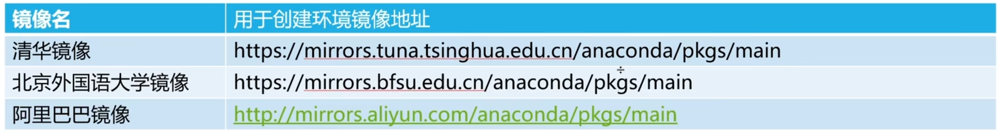
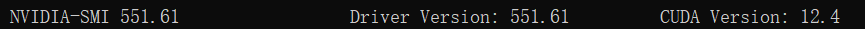
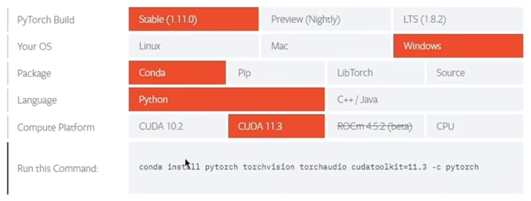
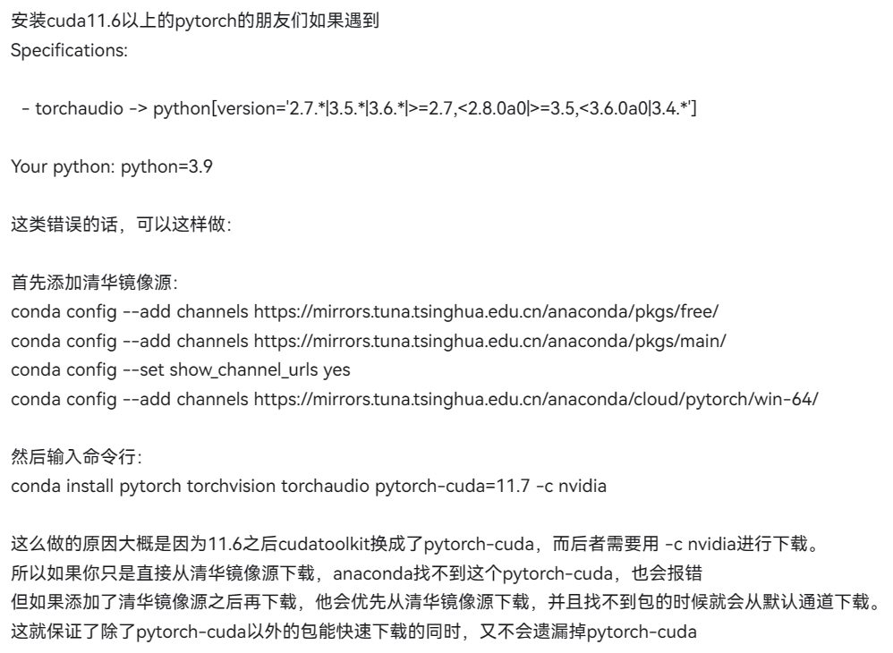

# PyTorch 深度学习实践

## 概述

> 课程链接：
>
> - [《PyTorch深度学习实践》完结合集](https://www.bilibili.com/video/BV1Y7411d7Ys/?p=1&vd_source=2754a9b73cb316d2cad8eb1195f5aa23)。

### 环境配置

> 安装教程：
>
> - [最详细的 Windows 下 PyTorch 入门深度学习环境安装与配置 CPU GPU 版 | 土堆教程_哔哩哔哩_bilibili](https://www.bilibili.com/video/BV1S5411X7FY/?spm_id_from=333.999.0.0&vd_source=2754a9b73cb316d2cad8eb1195f5aa23)。

#### 确认 GPU

GPU（Graphics Processing Unit），显卡，用于在屏幕上显示图像、视频。

驱动：让计算机识别特定的硬件。

深度学习显卡，一般是用 NVIDIA（英伟达），AMD 的显卡不能用于深度学习。因为英伟达有 CUDA 平台，让用户可以通过 CUDA 操纵显卡，从而加速深度学习的训练。

CUDA 软件的版本（Cuda runtime version）要 <= CUDA 硬件驱动的版本（Cuda driver version）。

GPU 为什么可以加速训练？因为相比于 CPU，GPU 具有大量的 ALU（逻辑处理单元）用于计算。

#### 安装 Anaconda

虚拟环境：

```
创建虚拟环境：
conda create -n [环境名称] python=版本

添加镜像加速：
conda create -n [环境名称] python=版本 -c [镜像地址]

删除虚拟环境：
conda remove -n [环境名称] --all

查看所有虚拟环境：
conda env list

进入虚拟环境：
conda activate [环境名称]

退出虚拟环境：
conda deactivate

查看已安装的包：
conda list
```

通道（channel）：就相当于下载地址。

```
添加持久通道：
conda config --add channels [通道地址]

删除通道：
conda config --remove channels [通道地址]

查看已配置的通道：
conda config --get/show
```

国内镜像（通道）：



#### 安装 CUDA

CUDA 是一个让显卡可以进行并行计算的平台（软件）。

确认版本：

1. 确定显卡算力（RTX 2060：7.5）；
2. 确定 CUDA Runtime Version，要能支持显卡的算力（CUDA SDK 10.0 以上）；
3. 确保 CUDA Runtime Version <= CUDA Driver Version。

查看 CUDA 驱动版本：

```
nvidia-smi
```


因此，10.0 <= 应该安装的 CUDA 版本 <= 11.4。

#### 更新显卡驱动

> 英伟达官网：https://www.nvidia.cn。

重新确定 CUDA Driver Version。



#### 安装 PyTorch

> PyTorch 官网：https://pytorch.org。

如果没有显卡，就装 CPU 的版本（CUDA 选 None）。如果有 GPU，就需要先去装 CUDA。安装 CUDA 的时候要选自定义，把 visual studio 的支持去掉，否则可能会出错。



安装命令：

```
从官网下载：
conda install pytorch torchvision torchaudio pytorch-cuda=12.1 -c pytorch -c nvidia

使用镜像下载：
conda install pytorch torchvision torchaudio pytorch-cuda=12.1 -c https://mirrors.tuna.tsinghua.edu.cn/anaconda/cloud/pytorch/win-64/

综合上面两种方法：
conda install pytorch torchvision torchaudio pytorch-cuda=12.1 -c nvidia
```

#### 验证 PyTorch

```
conda activate pytorch_2.2.1
conda list
python
>> import torch
>> torch.cuda.is_availabel()
True
```

#### 注意事项


---



## 线性模型

训练集、开发集（验证集）、测试集。

Loss（损失函数）。

MSE（Mean Square Error，平均平方误差）。

模型训练可视化工具：Visdom。

画 3 维图形：`np.meshgrid()`。

## 梯度下降算法

### 凸优化

凸函数，凸优化，局部最优 -> 全局最优。

在优化问题中，鞍点是一种特殊的局部最优解，是一个难以优化的点，因为优化算法可能很难从鞍点附近找到全局最优解（学习高原）。

### 随机梯度下降（SGD）

含义：用单个样本（随机选一个）的 loss 对权重求导作为梯度（而不是用所有样本的 loss 求梯度），然后更新权重。

原理：这相当于引入了一个随机噪声（随机数据），当学习遇到鞍点（学习高原）时，随机噪声可能推动模型继续学习，并最终找到全局最优点。

该方法在神经网络中被证明为一种非常有效的方法。

缺点：SGD 使用单个样本进行梯度下降容易被噪声带来巨大干扰。

因此，我们可以将多个样本分为一组，作为一个 mini-batch，每一次使用一个小批量的数据进行更新。

## 反向传播

矩阵计算公式：matrix-cook-book。

tensor（张量）：是 pytorch 中用于构造数据的一个类（最基本的组件），用于存储数据的值（权重，可以保存多维数组）和梯度（loss 对权重的偏导）。

> 张量 = 数据 + 梯度。
>
> 参考资料：
>
> - [【PyTorch系例】torch.Tensor详解和常用操作_torch.tensor函数-CSDN博客](https://blog.csdn.net/sazass/article/details/109304327)。

示例：

```python
import torch

w = torch.Tensor([1.0])
# 开启计算梯度
w.requires_grad = True
```

写 tensor 代码本质上就是在构建计算图。

tensor 实例可以通过调用 backward() 方法，获得计算图中所有的梯度，并存到 w 中，然后整张计算图就被释放了。

即在每一次计算反向传播后，就会将当前的计算图释放，下一次计算 loss 时会重新构建新的计算图（这是一种非常灵活的方式）。

```python
import torch

...

# 更新权重
w.data = w.data - 0.01 * w.grad.data

# 每一次backward求得的grad会不断累计，因此，每更新一次权重，需要将grad归零
w.grad.data.zero_()

...
```

`w` 是一个 tensor，`w.grad` 也是一个 tensor。

更新权重时，只需要进行数值上的更新，而不会用到梯度，因此需要 `.data` 取到数值后再计算。

> 补充：`w.grad.item()` 获取 tensor 对应的标量，从而避免产生计算图。

总结：构建计算图（forward）使用 tensor 计算，更新权重使用 data 计算。

## 用 PyTorch 实现线性回归

> 官方教程：[Learning PyTorch with Examples — PyTorch Tutorials 2.4.0+cu121 documentation](https://pytorch.org/tutorials/beginner/pytorch_with_examples.html)。
