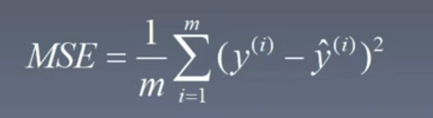
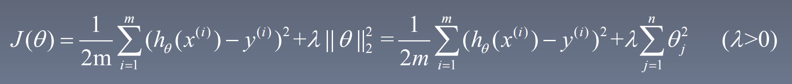

# 引言

## 1  机器学习的流程

1. 数据收集：
   - 训练数据：图片、声音、文本、数据；
   - 标签数据。
2. 数据清洗（格式化）
3. 特征工程（向量化 -> 特征向量）
4. 数据建模（算法 -> 模型）

## 2  机器学习的分类

- 有监督学习：
  - 回归
  - 分类
- 无监督学习（训练数据没有标签）：
  - 聚类
  - 降维
- 强化学习

## 3  预备知识

- 高等数学
- 线性代数
- 概率论
- Python

# 线性回归

## 1  基本概念

### 1.1  假设函数

假设函数（hypotheses function）：预测函数。
$$
h_{θ} = \sum_{i=0}^{n}θ_{i}x_{i} = θ^Tx
$$

> y = ax + b  ->  h(x):   b -> θ<sub>0</sub>x<sub>0</sub> (x<sub>0</sub> = 1);   a -> θ<sub>1</sub>;   x -> x<sub>1</sub>。

- 当 *X* 为二维时，假设函数为一条直线；
- 当 *X* 为三维时，假设函数为一个平面；
- 当 *X* 大于三维时，假设函数为一个超平面。

### 1.2  损失函数

损失函数（loss function）：预测值（*h*）与实际值（*y*）之间的差距。
$$
L(θ) = (h_{θ}(x)-y)^2
$$

### 1.3  代价函数

代价函数（cost function）：损失函数的均值。
$$
J(θ) = \frac{1}{2m}\sum_{i=1}^{m}(h_{θ}(x^{(i)})-y^{(i)})^2
$$

## 2  梯度下降

### 2.1  算法原理

*J*(*θ*) 的梯度（导数）为 ∇*J*(*θ*)：

- 随机初始化 *θ*；
- 设置步长 *α*；
- 设置迭代次数 *m*。

```
for i = 0 to m:
	θ = θ - α∇J(θ)
```

> 缺点：可能会出现只下降到局部最低，而达不到全局最低的情况。

### 2.2  代码实现

```python
import numpy as np
import matplotlib.pyplot as plt

x = np.linspace(-6, 4, 100)
y = x**2 + 2*x + 5

plt.plot(x, y)

# 初始化起点、步长、迭代次数
x = 3
alpha = 0.8
iteratorNum = 10

# 迭代
for i in range(iteratorNum):
    # y的导数为2x+2
    x = x - alpha*(2*x + 2)

print(x)
```

- 若 α 太小，则会导致迭代次数过多，下降速度慢；
- 若 α 太大，则会导致在最低点附近来回震荡，收敛速度慢；

## 3  线性回归

### 3.1  算法原理

使用梯度下降法求解线性回归问题：使代价函数的损失值最小。

迭代公式：


> - m 为样本数量；
> - j 为 n 维特征的其中一个。

### 3.2  代码实现

```python
# 梯度下降
def gradientDescent(X, y, theta, iterations, alpha):
    # 向原始数据手动添加一个全为1的列
    c = np.ones(X.shape[0]).transpose()
    X = np.insert(X, 0, values=c, axis=1)
    m = X.shape[0]  # 行数
    n = X.shape[1]  # 列数
    
    for num in range(iterations):
        for j in range(n):
            theta[j] = theta[j] + (alpha/m)*(np.sum((y-np.dot(X, theta))*X[:, j].reshape(-1, 1)))


# 特征归一化（减去平均值，除以方差）
def featureNormalize(X):
    mu = np.average(X, axis=0)
    sigma = np.std(X, axis=0, ddof=1)  # ddof=1，代表除的是n-1，否则除的是n
    X = (X-mu)/sigma
    return X, mu, sigma


X, y = loaddata()
X, mu, sigma = featureNormalize(X)
theta = np.zeros(X.shape[1]+1).reshape(-1, 1)
iterations = 400
alpha = 0.01
theta = gradientDescent(X, y, theta, iterations, alpha)
```

## 4  算法分类

### 4.1  批量梯度下降

每一次 *θ* 的更新，都会用到所有的数据进行计算。

### 4.2  随机梯度下降

每一次 *θ* 的更新，只选择其中一个样本进行计算。

> 缺点：效果不稳定，可能会产生震荡。

### 4.3  小批量梯度下降

每一次 *θ* 的更新，只选择样本中的一批（batch_size）数据进行计算。

## 5  评价指标

均方误差（MSE）：用每一个样本的实际值减去预测值，再对所有的样本取平均。



均方根误差（RMSE）：


平均绝对误差（MAE）：


## 6  正则化

### 6.1  岭回归

L2 范数正则化解决过拟合（Ridge Regression，岭回归）：



迭代公式：


λ 越大，对模型的惩罚就越大，模型就越简单（起主要作用的特征数量就越少），就越可以减少过拟合的风险。

### 6.2  LASSO 回归

L1 范数正则化解决过拟合（LASSO 回归）：


### 6.3  弹性网

L1 与 L2 结合解决过拟合（Elastic Net，弹性网）：


## 7  最小二乘法

$$
θ = (X^TX)^{-1}X^Ty
$$

# 逻辑回归

