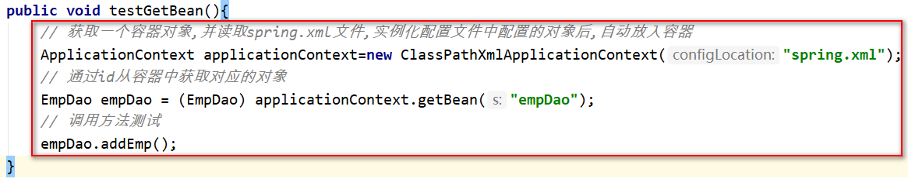

# Spring

## 基本概念

四个核心依赖：

- `spring-core`：核心 jar 包
- `spring-beans`：对象创建 jar 包
- `spring-context`：上下文容器 jar 包（包含了其它 3 个依赖）
- `spring-expression`：表达式 jar 包

## IOC

### 1. 基本概念

IOC：控制反转。

创建对象的权利，或者是控制的位置，由 Java 代码转移到 spring 容器，由 spring 的容器控制对象的创建，就是控制反转。

「对象的创建交给容器」

spring 创建对象时，会读取配置文件中的信息，然后使用反射给我们创建好对象之后在容器中存储起来，当我们需要某个对象时，通过 id 获取对象即可，不需要我们自己去 new。

### 2. 配置文件

- 文件位置：`resources`
- 文件名：`xxx.xml`

配置 bean 对象：`<bean id="..." class="..."></bean>`

### 3. 获取对象

1. 创建一个容器（IOC）对象并解析 xml 配置文件。
2. 实例化配置文件中的 bean 对象（反射）并发放入容器。
   1. 获得类的字节码：`Class clazz = Class.forName("com.msb.dao.impl.EmpDaoImpl")`
   2. 通过字节码实例化对象：`Object obj = clazz.newInstance()`
   3. 将对象放到一个 Map 中：`map.put("empDao",obj)`
3. 通过 bean id 从容器中获取对象。
   1. 工厂模式返回 bean 对象：`getBean(beanId)`

### 4. IOC 接口

实际开发一般使用：

- 接口：`ApplicationContext`
- 实现类：`ClassPathXmlApplicationContext`

### 5. 应用示例



### 6. 依赖注入

DI：依赖注入（bean 对象属性的赋值）

对象的属性包括：基本数据类型、其它类、引用类型。DI 处理的是对象的属性赋值和互相依赖的关系。

### 7. Bean 对象

#### (1) 属性设置

`scope`：

- `singleton`：单例
- `prototype`：每一次获取会创建新的实例（相当于 `new`）
- `request`：请求域
- `session`：会话域
- `application`：应用域

`lazy-init`：

- 懒加载：调用 `getBean()` 时再实例化对象

####  (2) 生命周期

1. 通过构造器创建 bean 实例（构造方法）
   - 默认使用无参的构造方法
2. 为 bean 属性赋值（`set` 方法）
   - 基本数据类型赋值
   - 引用类型注入
3. 后置处理器：`BeanPostProcesser`
4. 初始化 bean（`init` 方法）
   - 需要在 bean 标签中配置 `init-method="方法名"`
5. 后置处理器：`BeanPostProcesser`
6. bean 的获取（`getBean` 方法）
7. 关闭容器并销毁 bean 工厂（`destroy` 方法）
   - 容器关闭：`context.close()`
   - 需要在 bean 标签中配置 `destroy-method="方法名"`

定义后置处理器：

```java
public class MyBeanProcesser implements BeanPostProcessor {
    // Object bean    : 实例化的 bean（要干预的 bean）
    // String beanName: bean 的 id
    @Override
    public Object postProcessBeforeInitialization(Object bean, String beanName) throws BeansException {
        ...
        // 这里必须 return bean
        return bean; 
    }
    
    @Override
    public Object postProcessAfterInitialization(Object bean, String beanName) throws BeansException {
        ...
        // 这里必须 return bean
        return bean;
    }
}
```

配置后置处理器：

`<bean id="myBeanProcesser" class="com.msb.beanProcesser.MyBeanProcesser"></bean>`

#### (3) 自动装配

`Autowire`：

- `byName`：根据目标 id 值（bean id）和属性值注入
- `byType`：根据类型（bean class）注入

#### (4) 常用注解

对象创建：

- `@Component`：放在类上，用于标记，告诉 spring 当前类需要由容器进行实例化并放入容器中（所有对象均可以使用该注解）。
- `@Controller`：控制层
- `@Service`：业务层
- `@Repository`：持久层

依赖注入：

- `@Autowired`：根据属性数据类型自动装配
  - 不需要依赖 `set` 方法
  - 属性类型可以是接口，会自动匹配对应的实现类对象
  - 同一个类型，在 bean 中只能有一个对象，否则会报错
- `@Qualifier`：根据属性名称注入依赖
  - 当一个接口有多个实现类，可以使用 `@Qualifier` 指定要使用的实现类名称
  - 在实际开发中一般不会使用 `@Qualifier`，因为一般在 DAO 层，一个接口只会有一个实现类
- `@Resources`：根据类型或名称注入
  - 不配置 name，根据类型注入
  - 配置 name，根据名称注入，如：`@Resource(name="userDaoImplB")`
- `@Value`：注入普通数据类型

## AOP

### 1. 基本概念

AOP：面向切面编程

- 可以对业务逻辑的各个部分进行隔离，从而使得业务逻辑各部分之间的耦合度降低，提高程序的可重用性和开发的效率。
- 可以在不修改现有代码的情况下，对程序的功能进行拓展，往往用于日志处理、权限控制、性能检测、事务控制等。

原理：动态代理。

常用术语：

- Joint point（连接点）：可以被增强的方法
- Pointcut（切入点）：实际被增强的方法
- Advice（通知）：实际增强的逻辑部分
- Target（目标对象）：被代理的对象
- Aspect（切面）：功能相关的一些 Advice 方法放在一起声明成的一个 Java 类
- Weaving（织入）：创建代理对象并实现功能增强（将 Aspect 和其它对象连接起来，并创建 Adviced object 的过程）

### 2. 代理模式

#### (1) 静态代理

- 代理类与被代理类都需要实现同一个接口
- 一个静态代理类只能代理一个类

静态代理需要事先知道我们要代理哪个类才能写代理类，如果我们有其他类还想使用代理那就必须再写一个代理类。然而在实际开发中我们是可能是有非常多的类是需要被代理的，并且事先我们可能并不知道我们要代理哪个类。所以如果使用静态代理会增加许多的工作量，并且效率低下，代码复用率也不好。

#### (2) 动态代理

- 可以对不特定的类、方法进行代理
- 可以在程序运行时动态的变化代理的规则
- 代理类在程序运行时才创建

分类：

- `Proxy`：JDK 动态代理（面向接口）
- `Cglib`：第三方依赖（面向父类）

使用示例：

```java
// 通过 Porxy 动态代理类获得一个代理对象，在代理对象中，对某个方法进行增强
接口类型 代理对象 = (接口类型)Proxy.newProxyInstance(1,2,3);
代理对象.增强方法;

// 被代理对象的类加载器
1: ClassLoader loader
    
// 被代理对象所实现的所有接口
2: Class<?>[] interfaces
    
// 执行处理器对象，定义增强的规则（invoke）
3: InvocationHandler h
// 代理对象调用任何方法时，都会触发 invoke 方法的执行
```

总结：在不修改原有代码，或者没有办法修改原有代码的情况下，增强对象功能。使用代理对象，代替原来的对象去完成功能，进而达到拓展功能的目的。

### 3. 配置文件

依赖文件：

- `spring-aspects`：切面包
- `aspectjweaver`：织入包
- `aopalliance`：AOP 联盟包

自动生成代理对象：

`<aop:aspectj-autoproxy/>`

### 4. 切点表达式

`execution([权限修饰符] [返回值类型] [类的全路径名] [方法名](参数列表))`

- `*` 表示所有的权限修饰符
- 返回值类型可以省略不写
- 参数列表 `(..)` 表示不做限制

### 5. 切面

```java
@Component  // 实例化该类，初始化bean
@Aspect     // 告诉spring这是一个切面 
public class DaoAspect {
    
    // 定义公共切点
    // 切点表达式应直接指向接口，而不应写实现类，这样可以降低耦合度
    // 参数不定，写 ..
    @Pointcut("execution(* com.msb.dao.*.add*(..))")
    public void addPointCut(){}

    /*
    * 前置通知: 切点方法执行之前先执行的功能
    * 参数列表可以用JoinPoint接收切点对象
    * 这里的joinPoint表示切点正在运行的方法，可以通过joinPoint获取方法执行的参数
    * */
    @Before("addPointCut()")
    public void methodBefore(JoinPoint joinPoint){
        System.out.println("Before invoked");
    }

    /*
    * 后置通知: 方法执行之后要增强的功能
    * 无论切点方法是否出现异常都会执行（因此也叫最终通知）
    * 参数列表可以用JoinPoint接收切点对象
    * */
    @After("addPointCut()")
    public void methodAfter(JoinPoint joinPoint){
        System.out.println("After invoked");
    }
    
    /*
     * 返回通知: 切点方法正常运行结束后增强的功能
     * 如果方法运行过程中出现异常,则该功能不运行
     * 先于后置通知执行
     * 参数列表可以用joinPoint接收切点对象
     * 可以用res接收方法返回值,需要用returning指定返回值名称
     * */
    @AfterReturning(value = "addPointCut()", returning = "res")
    public void methodAfterReturning(JoinPoint joinPoint, Object res){
        System.out.println("AfterReturning invoked");
    }

    /*
     * 异常通知: 切点方法出现异常时运行的增强功能
     * 如果方法运行没有出现异常,则该功能不运行
     * 参数列表可以用Exception接收异常对象，需要通过throwing指定异常名称
     * */
    @AfterThrowing(value = "addPointCut()", throwing = "ex")
    public void methodAfterThrowing(Exception ex){
        System.out.println("AfterThrowing invoked");
    }

    /*
    * 环绕通知: 在切点方法之前和之后都进行功能的增强
    * 需要在通知中定义方法执行的位置,并在执行位置之前和之后自定义增强的功能
    * 方法列表可以通过ProceedingJoinPoint获取执行的切点
    * 通过proceedingJoinPoint.proceed()方法控制切点方法的执行位置
    * proceedingJoinPoint.proceed()方法会将切点方法的返回值获取到,并交给我们,可以做后续处理
    * 我们在环绕通知的最后需要将切点方法的返回值继续向上返回（Object类型）,否则切点方法在执行时接收不到返回值
    * aroundA 会先于前置通知执行
    * aroundB 会在后置通知后执行
    * */
    @Around("addPointCut()")
    public Object methodAround(ProceedingJoinPoint proceedingJoinPoint) throws Throwable {
        System.out.println("aroundA invoked");
        // 控制切点方法在这里执行
        Object proceed = proceedingJoinPoint.proceed();
        System.out.println("aroundB invoked");
        return proceed;
    }
}
```

执行流程：

1. 环绕通知（`@Around`）
2. 前置通知（`@Before`）
3. 切点方法
4. 返回通知（`@AfterReturning`）
5. 后置通知（`@After`）
6. 环绕通知（`@Around`）

## 声明式事务

### 1. 基本概念

事务的管理应该放在 service 层进行处理。

声明式事务的底层实现就是 AOP（动态代理）。

### 2. 配置文件

```xml
<!--配置事务管理器-->
<bean id="transactionManager" class="org.springframework.jdbc.datasource.DataSourceTransactionManager">
        <!--将数据源注入事务管理器-->
        <property name="dataSource"  ref="dataSource">     </property>
</bean>

<!--开启事务注解-->
<tx:annotation-driven transactionmanager="transactionManager"/>
```

### 3. 注解

`@Transactional`：

自动实现事务控制，方法前自动开启事务，若出现异常，则自动回滚后提交；若方法正常执行完成，则自动提交事务。

- 加在类上：对类中的所有方法都添加了事务控制
- 加在方法上：仅对当前方法添加了事务控制

参数设置：

```java
@Transactional(
    propagation = Propagation.REQUIRED,
    isolation = Isolation.READ_UNCOMMITTED, 
    readOnly = true, 
    rollbackFor = ClassCastException.class, 
    noRollbackFor = NullPointerException.class, 
    timeout = 10
)
```

#### (1) 传播行为

当在一个事务中又包含了几个更小的事务，多事务方法之间发生调用时，事务是如何管理的？

`propagation`：

- `PROPAGATION_REQUIRED`：如果当前没有事务，就新建一个事务，如果已经存在一个事务中，加入到这个事务中。（默认）
- `PROPAGATION_REQUIRES_NEW`：新建事务，如果当前存在事务，把当前事务挂起。

#### (2) 隔离级别

`isolation`：……

# SpringMVC

## 执行流程

核心：前端控制器

三大组件：处理器映射器、处理器适配器、视图解析器。


- **前端控制器**：MVC 模式中的 C，是整个流程控制的中心，由它调用其它组件处理用户的请求。
- **处理器映射器**：根据用户请求（URL）找到对应的处理器（Handler，即 Controller 中的处理单元）。
- **处理器适配器**：对处理器进行执行。
- **视图解析器**：将处理结果生成 View 视图，然后对 View 进行渲染并通过页面展示给用户。

## 常用注解

`@RequestMapping`：用于建立请求 URL 和处理请求方法之间的对应关系。

`@RequestParam`：把请求中指定名称的参数给 Controller 中方法的形参赋值。

```java
@RequestMapping("/getRequestParam") 
public String getRequestParam(@RequestParam("name")String uname, @RequestParam(value="age",required=false)Integer age) { 
    System.out.println(username + "," + age); 
    return "success"; 
}
```

`@PathVariable`：用于绑定 URL 中的占位符。

```java
@RequestMapping("/testPathVariable/{id}/{username}")
public String testPathVariable(@PathVariable("id")Integer id, @PathVariable("username")String username){
    System.out.println("id:" + id);
    System.out.println("username:" + username);
    return "success";
}
```

`@ResponseBody`：让 Controller 方法返回 json 数据。

单元方法的返回值不按照请求转发或者重定向处理，而是按照直接响应处理，将单元方法的返回值直接响应给浏览器。

`@RestController`：`@Controller` + `@ResponseBody`

返回 json 数据不需要在方法前面加 `@ResponseBody` 注解了，但使用 `@RestController` 这个注解，就不能返回 jsp、html 页面，视图解析器无法解析 jsp、html 页面。

## 拦截器

## 异常处理器
