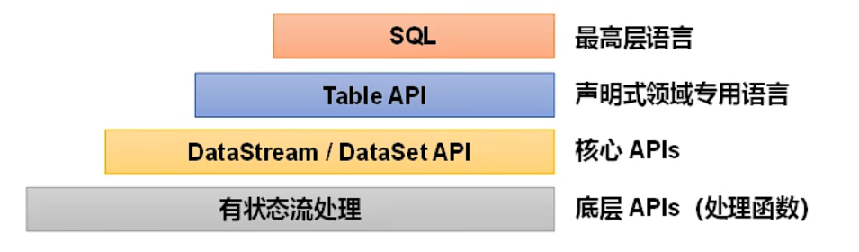
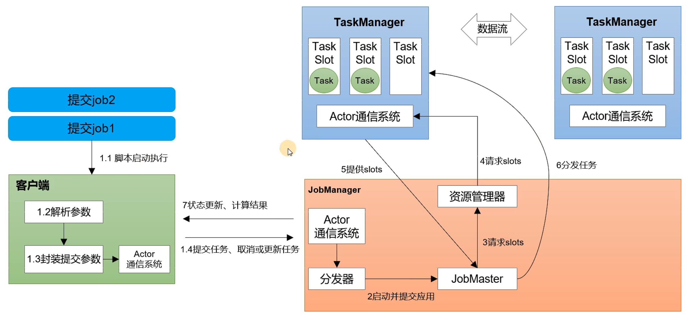

# 概述

## 1  Flink 的优点

- 批流统一：同一套代码（或 SQL），既可以跑流，也可以跑批；
- 性能卓越：高吞吐、低时延，每秒可以处理数百万个事件，毫秒级延迟；
- 规模计算：支持水平扩展架构，支持超大状态与增量检查机制；
- 高可用性：具有故障自动重试等机制。

## 2  基本概念

Flink 是一个框架和分布式处理引擎，用于对数据流进行有状态计算。

> 数据流分为无界和有界：
>
> - 无界数据流：有流的开始，但没有流的结束，会无休止地产生数据；
> - 有界数据流：有流的开始，也有流的结束，可以在接收所有数据后再进行计算。

Flink 的特点：

- 事件驱动型应用（只会被动响应）；
- 流&批数据分析；
- 有状态的流处理；
- 时间语义（事件时间、处理时间）；
- 窗口多、灵活；
- 流式 SQL；

「有状态」的流处理：把流处理需要的额外数据保存成一个「状态」，然后针对这条数据进行处理并更新状态。

> 状态一般存储在内存中，速度快，但可靠性差。

## 3  分层 API

- DataStream API：流处理；
- DataSet API：批处理。

> Flink 1.12 以后，DataStream API 已经实现了真正的流批一体，DataSet API 已经过时了。

# 部署

## 1  集群角色

- 客户端（Client）：获取代码并做转换，之后提交给协调调度中心；
- 协调调度中心（JobManager）：对作业进行中央调度管理，当它获取到要执行的作业后，会进一步做处理转换，然后分发给众多的工作节点；
- 工作节点（TaskManager）：对数据进行处理。

## 2  集群搭建

# 运行时架构

## 1  系统架构

> 一个 Job（作业）对应 JobManager 中的一个 JobMaster。

## 2  基本概念

### 2.1  并行度

将一个算子操作复制多份到多个节点，数据可以到其中任意一个节点去执行，这样一来一个任务就被拆分为了多个并行的子任务，实现了并行计算。

当一个作业包含多个算子时，该作业的并行度为所有的算子中最大的并行度。

### 2.2  算子链

一个数据流在算子之间传输数据的形式可以是一对一的直通模式，也可以是打乱的重分区模式，具体是哪一种形式，取决于算子的种类。

- 一对一模式：直接发送数据，不需要重新分区，也不需要调整数据的顺序（如：map、filter、flatmap）；
- 重分区模式：每一个算子的子任务，会根据数据传输的策略，把数据发送到不同的下游目标任务（一对多）。

合并算子链（Operator Chain）：并行度相同的一对一算子，可以直接链接在一起形成一个更大的任务（task），每个子任务会被一个线程执行（合并后并行度不变）。

> 合并算子链的优点：可以减少线程之间的切换和基于缓存区的数据交换，在减少时延的同时提升吞吐量。

### 2.3  任务槽

每一个 TaskManager 都是一个 JVM 进程，它可以启动多个独立的线程，并行执行多个子任务。

为了控制并发量，我们需要对每个子任务运行所占用的资源做出明确的划分，这就是任务槽（task slot）。

每个任务槽表示拥有计算资源的固定大小的子集。

任务槽的共享：在同一个 job（作业）中，不同任务节点的并行子任务可以放到同一个任务槽上去执行。

> 相同算子的多个子任务不能存在于同一个任务槽中。

任务槽的特点：

- 均分隔离内存，不隔离 CPU；
- 可以被多个子任务共享：
  - 同一个作业中不同算子的子任务才可以共享，同时运行；
  - 当这些算子都属于同一个 slot 共享组时，才可以共享同一个任务槽，默认都是 default。

### 2.4  总结

- 并行度：是动态的概念，指 TaskManager 运行程序时实际使用的并发能力，可以通过参数进行配置；
- 任务槽：是静态的概念，指 TaskManager 具有的并发执行能力（最大的并发上限），可以通过参数进行配置。

> 只有当  slot 数量  >=  job 并行度（算子的最大并行度）时，该  job 才能被正常运行。

# DataStream API

## 1  编程模型

- 获取执行环境（environment）；
- 读取数据源（source）；
- 转换操作（transformation）；
- 输出（sink）；
- 触发执行（execute）。

# 窗口

## 1  基本概念

窗口：将无限的数据（无界数据流）切割成有限的数据块进行处理，这些数据块就叫做窗口（水桶），它不是静态准备好的，而是动态创建的（事件驱动）。

窗口的分类：

- 按驱动类型可以分为：
  - 时间窗口：以时间点来定义窗口的开始和结束；
  - 计数窗口：基于元素的个数来截取数据。
- 按数据分配的规则可以分为：
  - 滚动窗口：将数据均匀切分，首尾相接，没有重叠和间隔；
  - 滑动窗口：窗口的大小是固定的，窗口之间是重叠的，滑动步长代表了窗口计算的频率（适合于更新频率非常高的场景）；
  - 会话窗口：基于会话（session）对数据进行分组，窗口的长度不固定，起始和结束的时间也不固定；
  - 全局窗口：窗口没有结束的时候，默认不会触发计算。

# 时间语义

## 1  基本概念

- 事件时间：数据产生的时间（时间戳）；
- 处理时间：数据真正被处理的时间。

> 在实际应用中，事件时间语义会更加常见，一般在业务的日志数据中都会记录数据产生时的时间戳，这就是事件时间。

# 水位线

# 双流联结

# 处理函数

# 状态管理

# 容错机制

# Flink SQL

## 1  sql-client

## 2  流处理中的表

关系型数据表和 SQL 主要是针对批处理设计的，在流处理中，数据表为动态表，查询操作为持续查询。

- 动态表：会动态地插入数据，表中的数据一直在发生变化；
- 持续查询：当数据源是无界的，那么查询就会一直执行，动态地更新查到的结果（每来一条数据就查一条，也叫追加查询）。

将动态表转换为流：

- 追加流（append only）：仅追加数据；
- 撤回流（retract）：包含 add（新增）和 retract（撤回）两种消息，一次 update（更新）可以表示为一次撤回和一次新增；
- 插入流（upsert）：insert（插入）和 update（更新）统一被编码为 upsert，删除为 delete。

## 3  时间属性

## 4  数据定义

## 5  查询