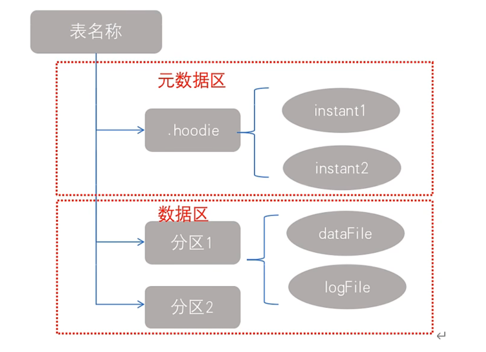

# 引言

## 1  概述

Apache Hudi（Hadoop Upserts Delete and Incremental）是下一代流数据湖平台，包括核心仓库和数据库，提供了表、（轻量）事务、高效的 upsert/delete、高级索引、流摄取服务、数据集群/压缩优化和并发等功能，同时保持数据的开源格式。

> upsert：插入即更新，若不存在则插入，若存在则更新。

## 2  Hudi 的特点

- 流批一体，支持流工作负载、增量批处理；
- 可插拔（可随时增加或删除）索引机制支持快速地 upsert/delete；
- 支持事务的提交和回滚；
- 支持常见大数据引擎的 SQL 读写；
- 自动管理小文件，可以实现数据聚簇、压缩、清理；
- 流式摄入，内置 CDC 源和工具；
- 向后兼容，支持表结构的变更；
- Hudi 是一个 lib，非常轻量（将编译好的 jar 包放入项目依赖即可）。

## 3  Hudi 的应用场景

- 近实时写入：上游支持多种数据源格式，可以通过 CDC 增量导入关系型数据库中的数据；
- 近实时分析：下游支持多种查询引擎；
- 增量处理管道（ETL）：可以处理延时数据、具有更短的调度间隔；
- 增量导出：可以在部分场景中替代 Kafka，数据可以直接导出到在线服务（如 ES）进行存储。

> 近实时：提供分钟级的时效性，相对于秒级存储，更加节省资源，并且可以支撑可以更加高效的查询。

# 基本概念

## 1  时间轴

Hudi 的核心是维护表上在不同的即时时间（instant）执行的所有操作的时间轴（timeline）。

一个 instant（时刻）包含三个组成部分：

- Action：动作；
- Time：时刻；
- State：状态。

两个时间概念：

- Arrival Time（到达时间）：数据到达 Hudi 的时间（commit time）；
- Event Time（事件时间）：record 中记录的数据本身产生的时间。

> 注意：迟到的数据通过增量提交，也能落入对应的（时间）分区。

## 2  文件管理

Hudi 将一个表映射为如下的文件结构：

文件管理：

- 表被划分为多个分区（文件夹）；
- 在每个分区中，文件被划分为文件组（group），由文件 ID 唯一地进行标识；
- 每个文件组包含几个文件片（FileSlice）；
- 每个文件片包含：
  - 一个基本文件（`.parquet`）：在某个时刻提交的数据；
  - 多个日志文件（`.log.*`）：后续对该基本文件进行插入和更新的记录。

## 3  索引

# 编译安装

# 集成 Spark

# 集成 Flink

# 集成 Hive