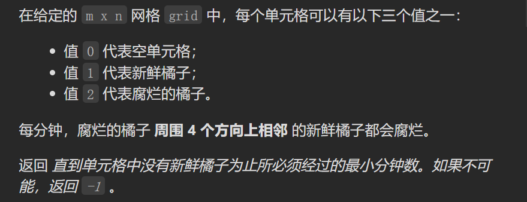
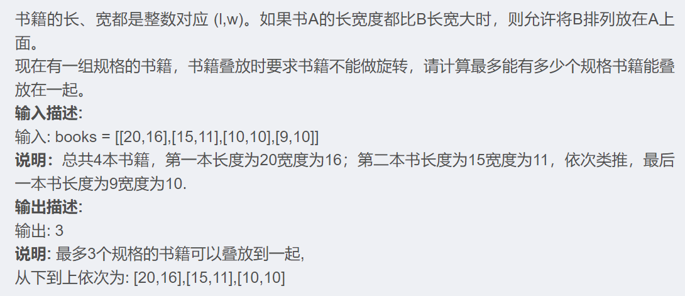
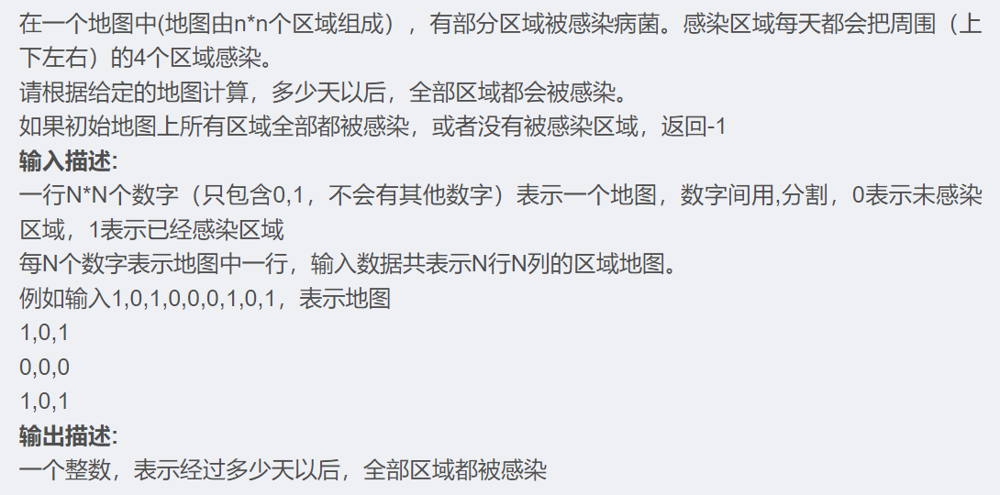
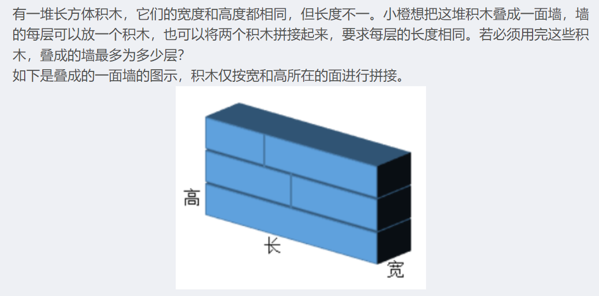

# 动态规划

## 1. 爬楼梯问题

n 级台阶，每次可上 1 或 2 步，求到达顶端一共有几种不同的走法？

### (1) 基础版本

### (2) 可回退

有一次机会可以在任意台阶上回退一步，也可以选择放弃回退机会。

输入示例：

| 输入 | 输出 |
| :--- | ---- |
| 1    | 1    |
| 2    | 4    |

代码实现：

```java
public static int solution(int n) {
    int[] dp = new int[n + 1];
    
    dp[0] = 1;
    dp[1] = 1;
    
    // 不回退的情况
    for(int i = 2; i <= n; i++) {
        dp[i] = dp[i-1] + dp[i-2];
    }
    
    int res = dp[n];
    
    // 要回退的情况
    // 最后一级台阶处不能回退
    for(int i = 1; i < n; i++) {
        // 在第 i 级台阶处回退，剩余 n-i+1 级台阶
        res += (dp[i] * dp[n - i + 1]);
    }
    
    return res;
}
```

## 2. 背包问题

### 01 背包

含义：每个物品只能拿一次。

#### (1) 求容量为 target 的背包最多能装多少？（最大价值）

```java
for(int i = 0; i < 物品数量; i++) {
    // 遍历背包：从后到前
    for(int j = target; j >= weights[i]; j--) {
        dp[j] = Math.max(dp[j], dp[j - weights[i]] + values[i]);
    }
}
```

#### (2) 求装满容量为 target 的背包有几种装法？（组合问题）

```java
// 求组合问题时，需要注意 dp[0] 的初始化
// target 为 0 时，有 1 种装法，即不装任何一个物品
dp[0] = 0;

for(int i = 0; i < 物品数量; i++) {
    // 遍历背包：从后到前
    for(int j = target; j >= weights[i]; j--) {
        dp[j] += dp[j - weights[i]];
    }
}
```

#### (3) 物品的重量有两个维度，求背包能装的最大物品个数？（最大数量）

```java
// dp[i][j] 表示背包装的物品的两个维度总和分别为 i 和 j 时，当前背包能装的最大物品个数
int[][] dp = new int[m + 1][n + 1];

for(int i = 0; i < 物品数量; i++) {
    // 计算当前物品两个维度的重量
    int weight1 = ...;
    int weight2 = ...;
    // 遍历背包：从后到前
    for(int i = m; i >= weight1; i--) {
        for(int j = n; j >= weight2; j--) {
            dp[i][j] = Math.max(dp[i][j], dp[i - weight1][j - weight2] + 1);
        }
    }
}
```

### 完全背包

含义：每个物品可以拿无数次。

#### (1) 求容量为 target 的背包最多能装多少？（最大价值）

```java
for(int i = 0; i < 物品数量; i++) {
    // 遍历背包：从前到后
    for(int j = weights[i]; j <= target; j++) {
        // 与 01 背包相同
        dp[j] = Math.max(dp[j], dp[j - weights[i]] + values[i]);
    }
}
```

#### (2) 求能装满容量为 target 的背包的物品组合数？（组合数）

**组合**：元素相同，顺序不同 -> 算一种组合。

**外层循环遍历物品，内层循环遍历背包。**

```java
dp[0] = 1;

// 递推公式
dp[j] += dp[j - weights[i]];
```

#### (3) 求能装满容量为 target 的背包的物品排列数？（排列数）

**排列**：元素相同，顺序不同 -> 算不同排列。

**外层循环遍历背包，内层循环遍历物品。**

```java
dp[0] = 1;

for(int i = 0; i <= target; i++) {
    for(int j = 0; j < 物品数量; j++) {
        if(i - weight[j] >= 0) {
            dp[i] += dp[i - weights[j]];
        }
    }
}
```

#### (4) 求能装满容量为 target 的背包的最少物品数？（最少数量）

```java
// 注意 dp 数组的初始化
dp = {0, Integer.MAX_VALUE, ... , Integer.MAX_VALUE};

for(int i = 0; i < 物品数量; i++) {
    // 遍历背包：从前到后
    for(int j = weights[i]; j <= target; j++) {
        // 遇到 Integer.MAX_VALUE 就代表这里还没有被初始化，无法装满这样的背包
        if(dp[j - coins[i]] != Integer.MAX_VALUE) {
            dp[j] = Math.min(dp[j], dp[j - coins[i]] + 1);
        }
    }
}

// 最后需要判断一下能否装满
return dp[target] == Integer.MAX_VALUE ? -1 : dp[target];
```

#### (5) 能否装满容量为 target 的背包？（能否装满）

```java
// 这里的 dp 数组为 boolean 类型
boolean dp[] = ...;
// dp[0] 需要初始化为 true，否则后面递推出的都是 false
dp[0] = true;

for(int i = 0; i < 物品数量; i++) {
    // 遍历背包：从前到后
    for(int j = weights[i]; j <= target; j++) {
        if(j 到 i 是某个物品 && dp[j]) {
            dp[i] = true;
        }
    }
}
```

# 贪心算法

## 1. 区间问题

- 使区间尽量**多重叠**：按**起点**排序。
- 是区间尽量**不重叠**：按**终点**排序。

### (1) 用最少数量的箭引爆气球

按**起点**排序，从左到右遍历。使每组重叠的区间尽量多，即尽量复用。

贪心策略：

- 每次都选取当前区间的右边界，这样可以尽可能地射掉更多的气球。
- 动态更新当前分组的**最小右边界**。

### (2) 无重叠区间

按**终点**排序，从左到右遍历。求使左右区间不重叠需要移除的最少区间数量。使不重叠的区间尽量多，即尽量避免冲突。

贪心策略：

- 动态更新当前分组的**最小右边界**。

### (3) 合并区间

按**起点**排序，从左到右遍历。合并所有重叠区间，即尽量使重叠的区间更多。

贪心策略：

- 动态更新当前分组的**最大右边界**。
- 动态更新当前分组的**最小左边界**。

不能按终点排序，反例：[][][2,3] , [4,5] , [6,7] , [1,10]。

若按终点排序，则结果为：[2,3] , [4,5] , [1,10]。而正确答案为：[1,10]。

## 2. 循环数组的旋转问题

### (1) 左旋 k 个位置

1. 反转 0 ~ k 和 k ~ 末尾的部分
2. 反转整体

### (2) 右旋 k 个位置

1. 反转整体
2. 反转 0 ~ k 和 k ~ 末尾的部分

# 深度优先搜索

## 1. 岛屿问题

### (1) 求岛屿的数量？

#### 题目描述

给定一个二维数组 matrix，里面的值只有 0 和 1，上下左右相邻的 1 可以被认为是一片岛，求 matrix 中的岛屿数量。

#### 代码实现

```java
class Main {
    public static int numIsland(char[][] board) {
        int island = 0;
        for(int i = 0; i < board.length; i++) {
            if(board[i][j] == '1') {
                island++;
                infect(board, i, j);
            }
        }
        return island;
    }
    
    // 感染算法
    // 从 (i, j) 这个位置出发，把所有连成一片的 1 变为 2
    public static void infect(char[][] board, int i, int j) {
        // 终止条件
        if(i < 0 || i == board.length || j < 0 || j == board[0].length || board[i][j] == 0) {
            return;
        }
        
        board[i][j] = 0;
        
        // 上下左右扩展
        infect(board, i - 1, j);
        infect(board, i + 1, j);
        infect(board, i, j - 1);
        infect(board, i, j + 1);
    }
}
```

# 广度优先搜索

## 1. 腐烂的橘子

### 题目描述



### 解题思路

多源广度优先搜索

### 代码实现

```java
public class Solution994 {
    // 上下左右
    public int[] dx = {-1, 1, 0, 0};
    public int[] dy = {0, 0, -1, 1};
    
    public int orangesRotting(int[][] grid) {
        int m = grid.length;
        int n = grid[0].length;

        // 新鲜的橘子数量
        int good = 0;

        // 已经腐烂的橘子
        Queue<int[]> queue = new LinkedList<>();

        for (int i = 0; i < m; i++) {
            for (int j = 0; j < n; j++) {
                if (grid[i][j] == 1) {
                    good++;
                } else if (grid[i][j] == 2) {
                    queue.offer(new int[]{i, j});
                }
            }
        }

        // 因为 0 分钟时已经没有新鲜橘子了，所以答案就是 0
        if (good == 0) {
            return 0;
        }

        int time = 0;

        // 多源广度优先搜索
        while (!queue.isEmpty()) {
            int size = queue.size();
            for (int i = 0; i < size; i++) {
                // 当前节点
                int[] cur = queue.poll();
                int x = cur[0];
                int y = cur[1];
                // 向四周扩散
                for (int j = 0; j < 4; j++) {
                    int newX = x + dx[j];
                    int newY = y + dy[j];
                    if (newX >= 0 && newX < m && newY >= 0 && newY < n && grid[newX][newY] == 1) {
                        good--;
                        grid[newX][newY] = 2;
                        queue.offer(new int[]{newX, newY});
                    }
                }
            }
            time++;
        }

        return good == 0 ? time - 1 : -1;
    }
}
```

# 单调栈

## 基本概念

- 求比当前元素大的最近元素：若当前元素 <= 栈顶元素，则入栈。
- 求比当前元素小的最近元素：若当前元素 >= 栈顶元素，则入栈。

## 1. 每日温度

```java
public class Solution739 {
    public int[] dailyTemperatures(int[] temperatures) {
        int len = temperatures.length;

        int[] ans = new int[len];

        // 存的是下标
        Deque<Integer> stack = new LinkedList<Integer>();

        for (int i = 0; i < len; i++) {
            // 弹栈：直到栈顶元素 <= 当前元素 或 栈为空
            while (!stack.isEmpty() && temperatures[stack.peek()] < temperatures[i]) {
                int index = stack.pop();
                ans[index] = i - index;
            }
            // 当前元素入栈
            stack.push(i);
        }

        return ans;
    }
}
```

## 2. 接雨水

```java
public class Solution42 {
    public int trap(int[] height) {
        int len = height.length;

        int sum = 0;

        // 存的是下标
        Deque<Integer> stack = new LinkedList<>();

        for (int i = 0; i < len; i++) {
            // 出栈
            while (!stack.isEmpty() && height[stack.peek()] < height[i]) {
                // 当前凹槽
                int index = stack.pop();
                // 计算雨水
                if (!stack.isEmpty()) {
                    int left = height[stack.peek()];
                    int mid = height[index];
                    int right = height[i];

                    int h = Math.min(left, right) - mid;
                    int w = i - stack.peek() - 1;

                    sum += h * w;
                    // System.out.println("结束位置：" + i + "  面积： " + h * w);
                }
            }
            stack.push(i);
        }

        return sum;
    }
}
```

## 3. 柱状图中最大的矩形

```java
public class Solution84 {
    public int largestRectangleArea(int[] heights) {
        int[] newHeights = new int[heights.length + 2];

        for (int i = 1; i < newHeights.length - 1; i++) {
            newHeights[i] = heights[i - 1];
        }

        int max = 0;

        // 存的是数组元素的下标
        Deque<Integer> stack = new LinkedList<>();

        stack.push(0);

        for (int i = 1; i < newHeights.length; i++) {
            while (newHeights[i] < newHeights[stack.peek()]) {
                int cur = stack.pop();
                int hig = newHeights[cur];
                int len = i - stack.peek() - 1;
                max = Math.max(max, hig * len);
            }
            stack.push(i);
        }

        return max;
    }
}
```

# 并查集

## 基本概念

使用代表节点表示一个集合，可以以 O(1) 的时间复杂度实现集合的查询与合并。

需要实现的方法：

- `boolean isSameSet()`：查询两个元素所在的集合是否为同一个集合
- `void union()`：将两个元素所在的集合合并为一个集合

代码实现：

```java
// 用节点封装元素值
public class Node<V> {
    // 元素值
    V value;

    public Node(V value) {
        this.value = value;
    }
}

// 并查集
public class UnionSet<V> {
    // 值和节点的映射关系
    public Map<V, Node<V>> nodes;

    // 记录每个节点的父节点
    public Map<Node<V>, Node<V>> parents;

    // 记录一张表的大小（节点个数），只有代表节点会有该属性
    public Map<Node<V>, Integer> sizeMap;

    // 初始化：一开始每个节点各自作为一个集合
    public UnionSet(List<V> values) {
        nodes = new HashMap<>();
        parents = new HashMap<>();
        sizeMap = new HashMap<>();
        for (V cur : values) {
            Node<V> node = new Node<>(cur);
            nodes.put(cur, node);
            parents.put(node, node);
            sizeMap.put(node, 1);
        }
    }

    // 返回一个集合的代表结点
    // 给你一个节点，请你往上到不能再往上，把代表返回
    public Node<V> findFather(Node<V> cur) {
        Deque<Node<V>> stack = new LinkedList<>();
        while (cur != parents.get(cur)) {
            stack.push(cur);
            cur = parents.get(cur);
        }
        // cur == parents.get(cur)
        // cur 是当期集合的代表节点
        // 链条扁平化：
        // 将链上被遍历到的节点都挂到代表节点下（减少后续查询所需的时间）
        while (!stack.isEmpty()) {
            parents.put(stack.pop(), cur);
        }
        return cur;
    }

    // 查询两个节点是否属于同一个集合
    public boolean isSameSet(V a, V b) {
        return findFather(nodes.get(a)) == findFather(nodes.get(b));
    }

    // 合并两个元素所属的集合
    public void union(V a, V b) {
        // 找到当前元素所在集合的代表节点
        Node<V> aHead = findFather(nodes.get(a));
        Node<V> bHead = findFather(nodes.get(b));
        // 判断是否属于同一个集合
        if (aHead != bHead) {
            int aSetSize = sizeMap.get(aHead);
            int bSetSize = sizeMap.get(bHead);
            // 将小集合的代表节点的父节点设为大集合的代表节点
            Node<V> big = aSetSize > bSetSize ? aHead : bHead;
            Node<V> small = big == aHead ? bHead : aHead;
            parents.put(small, big);
            // 更新大集合的代表节点的集合大小为两个集合的大小之和
            sizeMap.put(big, aSetSize + bSetSize);
            // 在 sizeMap 中移除小集合的头节点
            sizeMap.remove(small);
        }
    }
}
```

## 1. 朋友圈问题

### (1) 求互相独立的朋友圈的数量？

#### 题目描述

有一个矩阵，行和列代表不同的人。如果两个人认识，那么对应矩阵中的值为 1，否则为 0。对称的位置上的值相同。求有多少个相互独立的朋友圈？

#### 代码实现

```java
class Main {
    public static int findCircleNum(int[][] m) {
        int n = m.length;
        // 初始化并查集
        UnionFind unionFind = new UnionFind(n);
        for(int i = 0; i < n; i++) {
            // 只用考虑矩阵中一半的位置，且对角线上的位置不用考虑
            for(int j = i + 1; j < n; i++) {
                // 将朋友圈互关的人合并到同一个集合中
                if(M[i][j] == 1) {
                    unionFind.union(i, j);
                }
            }
        }
        return unionFind.sets();
    }
    
    // 并查集定义
    public static class UnionFind {
        // parent[i] = k，表示 i 的父节点是 k
        private int[] parent;
        
        // size[i] = k，表示 i 所在集合的大小是 k
        // 只有当 i 是代表节点，size[i] 才有意义
        private int[] size;
        
        // 互相独立的集合数量
        private int sets;
        
        // 辅助结构
        private int[] help;
        
        // 初始化
        public UnionFind(int n) {
            parent = new int[n];
            size = new int[n];
            help = new int[n];
            sets = n;
            for(int i = 0; i < n; i++) {
                // 初始化每个节点的父节点为其自身
                parent[i] = i;
                size[i] = 1;
            }
        }
        
        // 找到当前节点所在集合的代表节点
        private int find(int i) {
            int hi = 0;
            while(i != parent[i]) {
                help[hi++] = i;
                i = parent[i];
            }
            // 此时 i 为代表节点
            // 路径压缩：将遇到的节点挂到代表节点下
            hi--;
            while(hi > 0) {
                parent[help[hi]] = i;
            }
            return i;
        }
        
        // 合并两个集合
        public void union(int i, int j) {
            // 先通过代表节点判断 i 和 j 是否属于同一集合
            int f1 = find(i);
            int f2 = find(j);
            if(f1 != f2) {
                if(size[f1] >= size[f2]) {
                    size[f1] += size[f2];
                    parent[f2] = f1;
                } else {
                    size[f2] += size[f1];
                    parent[f1] = f2;
                } 
                sets--;
            }
        }
        
        // 返回集合的大小
        public int sets() {
            return sets;
        }
    }
} 
```

# 华为机试真题

## 1. 路灯照明问题

### 题目描述


### 解题思路

将所有区间划分为互不重叠的组，最后计算每组区间之间的间隙总和。

1. 将输入的每一个路灯能照亮的范围转换为区间的形式，如：[left, right]。
2. 按每个区间的 left 从小到大排序。
3. 遍历区间数组，并动态维护 left 和 right（当前区间组的最小左边界和最大右边界）。
   - 若当前左边界 > 上一组的右边界：出现了新的区间组，记录上一组区间组的 [left, right]，加入 list（记录互不重叠的区间组）。更新 left 为当前路灯的 left，right 同理。
   - 若当前左边界 < 上一组的右边界：当前区间与上一个区间组出现了重叠，比较并更新 left 和 right。
4. 从第 2 个元素（i = 1）开始遍历 list，累加 left[i] - right[i-1]。

### 代码实现

```java
public class Main {
    public static void main(String[] args) {
        Scanner sc = new Scanner(System.in); 
        int n = sc.nextInt();
        sc.nextLine();
        String[] str = sc.nextLine().split(" ");
 
        List<Node> list = new ArrayList<>();
 
        for(int i = 0; i < n; i++) {
            int x = Integer.valueOf(str[i]);
            int l = i*100 - x > 0 ? i*100 - x : 0;
            int r = i*100 + x > (n-1)*100 ? (n-1)*100 : i*100 + x;
            Node node = new Node(l, r);
            list.add(node);
        }
 
        Collections.sort(list);
        
        int left = list.get(0).left;
        int right = list.get(0).right;
        
        List<Node> list1 = new ArrayList<>();
 
        for(int i = 1; i < list.size(); i++) {
            Node node = list.get(i);
            if(node.left > right) {
                Node node1 = new Node(left, right);
                list1.add(node1);
                left = node.left;
                right = node.right;
            } else {
                left = Math.min(left, node.left);
                right = Math.max(right, node.right);
            }
        }
        list1.add(new Node(left, right));
        
        int res = 0;
        for(int i = 1; i < list1.size(); i++) {
            res += (list1.get(i).left - list1.get(i-1).right);
        }
 
        System.out.println(res);
    }
 
    static class Node implements Comparable<Node> {
        int left;
        int right;
 
        public Node(int left, int right) {
            this.left = left;
            this.right = right;
        }
 
        @Override
        public int compareTo(Node o) {
            if(this.left == o.left) {
                return this.right - o.right;
            }
            return this.left - o.left;
        }
    }
}
```

## 2. 解密犯罪时间

### 题目描述


### 解题思路


### 代码实现

```java
public class Main {
    public static void main(String[] args) {
        Scanner sc = new Scanner(System.in);
        String s = sc.nextLine();
        
        // 被加密的时间
        int errorTime = Integer.parseInt(s.substring(0,2) + s.substring(3));
        
        // 四个数字，用 String 类型存储，方便后续进行拼接
        String[] num = new String[4];
        num[0] = String.valueOf(s.charAt(0));
        num[1] = String.valueOf(s.charAt(1));
        num[2] = String.valueOf(s.charAt(3));
        num[3] = String.valueOf(s.charAt(4));
        
        int time;
        // 小于错误时间的最小时间（第二天）
        int min = Integer.MAX_VALUE; 
        // 大于错误时间的最小时间
        int minThan = Integer.MAX_VALUE;    
        
        // 遍历所有可能的组合
        for(int i = 0; i < 4; i++) {
            // 首位不能大于 2
            if(Integer.parseInt(num[i]) > 2) { 
                continue;
            }
            for(int j = 0; j < 4; j++) {
                // 第一位为 2 时，第二位不能大于 3
                if(Integer.parseInt(num[i]) == 2 && Integer.parseInt(num[j]) > 3){  
                    continue;
                }
                for(int k = 0; k < 4; k++) {
                    // 第三位不能大于等于 6
                    if(Integer.parseInt(num[k]) >= 6){ 
                        continue;
                    }
                    for(int l = 0; l < 4; l++) {
                        // 重构的时间
                        time = Integer.parseInt(num[i] + num[j] + num[k] + num[l]);
                        if(time < errorTime) {
                            min = Math.min(min,time);
                        } else if(time > errorTime) {
                            minThan = Math.min(minThan,time);
                        }
                    }
                }
            }
        }
        
        String res;
        if(minThan == Integer.MAX_VALUE) { 
            // 若重构的时间都小于错误时间，则时间为第二天时间
            res = String.valueOf(min);
        } else {
            res = String.valueOf(minThan);
        }
         
        System.out.println(res.substring(0,2) + ":" + res.substring(2));
    }
}
```

## 3. 书籍叠放

### 题目描述



### 解题思路

1. 从小到大排序，优先按长度排序，其次按宽度排序（即先固定一个维度）。
2. 转化为用动态规划求最长递增（宽度）子序列。

## 4. 计算疫情扩散时间

### 题目描述



### 解题思路

多源广度优先搜索

## 5. 第 k 个排列

### 题目描述


### 解题思路

递归 + 回溯

### 代码实现

```java
class Solution {
    public List<List<Integer>> permute(int[] nums) {
        List<List<Integer>> res = new ArrayList<List<Integer>>();

        List<Integer> output = new ArrayList<Integer>();
        for (int num : nums) {
            output.add(num);
        }

        int n = nums.length;
        backtrack(n, output, res, 0);
        
        // 将 res 中的 List<Integer> 转为数字并排序，然后返回第 k 个数字
        return ...;
    }

    public void backtrack(int n, List<Integer> output, List<List<Integer>> res, int first) {
        // 所有数都填完了
        if (first == n) {
            res.add(new ArrayList<Integer>(output));
        }
        for (int i = first; i < n; i++) {
            // 动态维护数组
            Collections.swap(output, first, i);
            // 继续递归填下一个数
            backtrack(n, output, res, first + 1);
            // 撤销操作
            Collections.swap(output, first, i);
        }
    }
}
```

## 6. 叠积木

### 题目描述




### 解题思路


解题关键：

- 如果能拼成一面墙，那么墙的长度只可能是最长积木的长度，或者最长积木+最短积木的长度。
- 每层的组成，除了单块积木的情况，应该是最长+最短，第二长+第二短，... ，这样的组合。

解题步骤：

1. 将所有积木按长度从小到大排序。
2. 分别以最长积木的长度和最长积木+最短积木的长度作为每层的长度计算最大层数，并取较大值（层数）。
3. 从后向前（j）遍历积木：
   - 如果当前积木的长度 = 层的长度，则墙的层数 + 1，j--。
   - 如果当前积木的长度 < 层的长度，则从前往后遍历（i），去匹配能凑成一层的较短积木，如果找不到就返回 -1；如果找到了，则墙的层数 + 1，i++，j--。
4. 最后判断积木是否用尽，若有积木没有使用到，则返回 -1；如果没有错误，返回层数。
