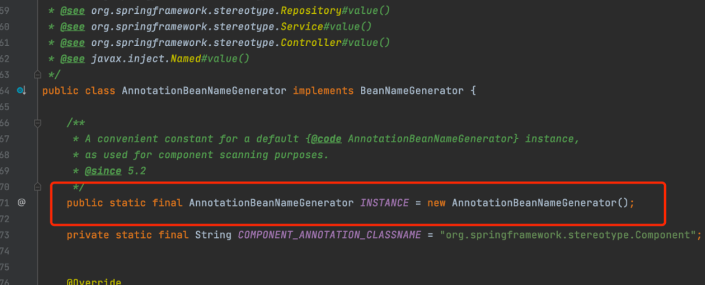
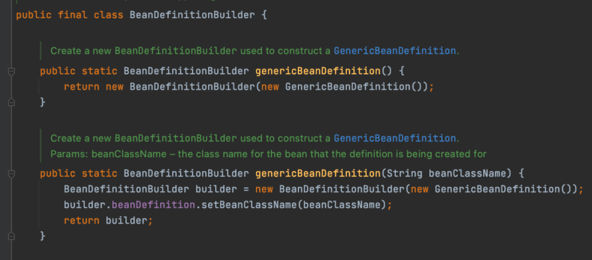
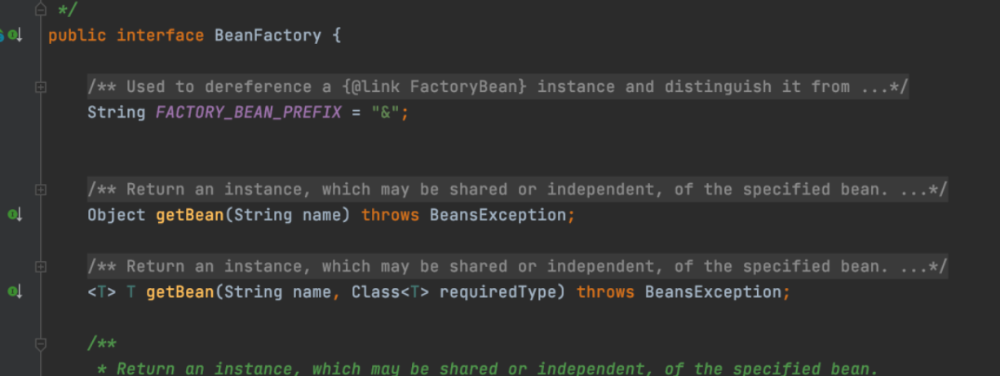

# 创建型

作用：如何创建对象

## 1 单例模式

单例模式（Singleton）创建分为饿汉式和懒汉式，但是在开源项目中使用最多的主要有两种写法。

### 1.1 静态常量

静态常量方式属于饿汉式，以静态变量的方式声明对象。这种单例模式在 Spring 中使用的比较多，举个例子，在 Spring 中对于 Bean 的名称生成有个类 AnnotationBeanNameGenerator 就是单例的。



### 1.2 双重检查机制

双重检查机制（DCL）方式属于懒汉式。

```java
public class Singleton {
    
    private volatile static Singleton INSTANCE;

    private Singleton() {}

    public static Singleton getInstance() {
        if (INSTANCE == null) {
            synchronized (Singleton.class) {
                if (INSTANCE == null) {
                    INSTANCE = new Singleton();
                }
            }
        }
        return INSTANCE;
    }
    
}
```

**外层判断 null 的作用**：其实就是为了减少进入同步代码块的次数，提高效率。你想一下，其实去了外层的判断其实是可以的，但是每次获取对象都需要进入同步代码块，实在是没有必要。

**内层判断 null 的作用**：防止多次创建对象。假设 AB 同时走到同步代码块，A 先抢到锁，进入代码，创建了对象，释放锁，此时 B 进入代码块，如果没有判断 null，那么就会直接再次创建对象，那么就不是单例的了，所以需要进行判断 null，防止重复创建单例对象。

**volatile 关键字的作用**：防止重排序。因为创建对象的过程不是原子，大概会分为三个步骤

- 第一步：分配内存空间给 Singleton 这个对象
- 第二步：初始化对象
- 第三步：将 `INSTANCE` 变量指向 Singleton 这个对象内存地址

假设没有使用 `volatile` 关键字发生了重排序，第二步和第三步执行过程被调换了，也就是先将 `INSTANCE` 变量指向 Singleton 这个对象内存地址，再初始化对象。这样在发生并发的情况下，另一个线程经过第一个 if 非空判断时，发现已经为不为空，就直接返回了这个对象，但是此时这个对象还未初始化，内部的属性可能都是空值，一旦被使用的话，就很有可能出现空指针这些问题。

## 2 建造者模式

将一个复杂对象的构造与它的表示分离，使同样的构建过程可以创建不同的表示，这样的设计模式被称为建造者模式（Builder）。它是将一个复杂的对象分解为多个简单的对象，然后一步一步构建而成。

这种模式用于分离复杂对象的构建和表示，构建时可以灵活地指定只构建哪部分的信息，在创建对象的时候看起来比较优雅，当构造参数比较多的时候，适合使用建造者模式。

我们都知道，Spring 在创建 Bean 之前，会将每个 Bean 的声明封装成对应的一个 `BeanDefinition`，而 `BeanDefinition` 会封装很多属性，所以 Spring 为了更加优雅地创建 `BeanDefinition`，就提供了 `BeanDefinitionBuilder` 这个建造者类。



建造者模式不仅在开源项目中有所使用，在 JDK 源码中也有使用到，比如 StringBuilder 类。

示例：

```java
class Person {    
	    
    private int id;
    private String name;    
    private int age;    
    private double weight;    
    private int score;    
    private Location loc;    
  
    // 构建器（静态内部类）
    public static class PersonBuilder {
        
        Person p = new Person();        
    
        public PersonBuilder basicInfo(int id, String name, int age) {        
        	p.id = id;     
            p.name = name;            
            p.age = age;            
            return this;        
        }        
    
    	public PersonBuilder weight(double weight) {
      		p.weight = weight;            
      		return this;        
    	}        
    
    	public PersonBuilder score(int score) {
      		p.score = score;            
      		return this;        
    	}        
    
    	public PersonBuilder loc(String city, String street) {                 
            p.loc = new Location(city, street);            			 return this;        
    	}        
    
    	public Person build() {            
      		return p;        
    	}
        
	}
     
}

class Location {
    
	private String city;    
    private String street;    

    public Location(String city, String street) {
		this.city = city;        
        this.street = street;    
    }
    
}

public class Main {
    
  	public static void main(String[] args) {        
        Person p = new Person.PersonBuilder()        
                             .basicInfo(1, "申杉杉", 24)  
                           //.weight(60.5)                
                           //.score(99)                
                            .loc("北京", "上园村3号")      
                            .build();  
  	}
    
}
```

> 参考资料：
>
> [建造者模式 | 菜鸟教程 (runoob.com)](https://m.runoob.com/design-pattern/builder-pattern.html?ivk_sa=1024320u)

## 3 工厂模式

工厂模式（Factory）可以分为：

- 简单工厂模式
- 工厂方法模式
- 抽象工厂模式

### 3.1 简单工厂模式

比如说，现在有个动物接口 Animal，具体的实现有猫 Cat、狗 Dog 等，而每个具体的动物对象创建过程很复杂，有各种各样地步骤，此时就可以使用简单工厂来封装对象的创建过程，调用者不需要关心对象是如何具体创建的。

```java
class SimpleAnimalFactory {

    public Animal createAnimal(String animalType) {
        if ("cat".equals(animalType)) {
            Cat cat = new Cat();
            // 一系列复杂操作
            return cat;
        } else if ("dog".equals(animalType)) {
            Dog dog = new Dog();
            // 一系列复杂操作
            return dog;
        } else {
            throw new RuntimeException("animalType=" + animalType + "无法创建对应对象");
        }
    }

}

public class Main {
    
  	public static void main(String[] args) {        
        SimpleAnimalFactory animalFactory = new SimpleAnimalFactory();
		Animal cat = animalFactory.createAnimal("cat");
  	}
    
}
```

需要注意的是，一般来说如果每个动物对象的创建只需要简单地 new 一下就行了，那么其实就无需使用工厂模式，工厂模式适合对象创建过程复杂的场景。

### 3.2 工厂方法模式

上面说的简单工厂模式看起来没啥问题，但是还是违反了七大设计原则的开闭原则。所谓的开闭原则就是对修改关闭，对扩展开放。

什么叫对修改关闭？就是尽可能不修改的意思。就拿上面的例子来说，如果现在新增了一种动物兔子，那么 createAnimal 方法就得修改，增加一种类型的判断，那么就此时就出现了修改代码的行为，也就违反了对修改关闭的原则。

所以解决简单工厂模式违反开闭原则的问题，就可以使用工厂方法模式来解决。

```java
// 工厂接口
public interface AnimalFactory {
    Animal createAnimal();
}

// 小猫工厂
public class CatFactory implements AnimalFactory {
    @Override
    public Animal createAnimal() {
        Cat cat = new Cat();
        // 一系列复杂操作
        return cat;
    }
}

// 小狗工厂
public class DogFactory implements AnimalFactory {
    @Override
    public Animal createAnimal() {
        Dog dog = new Dog();
        // 一系列复杂操作
        return dog;
    }
}

public class Main {
    
  	public static void main(String[] args) {        
        AnimalFactory animalFactory = new CatFactory();
		Animal cat = animalFactory.createAnimal();
  	}
    
}
```

此时假设需要新增一个动物兔子，那么只需要实现 AnimalFactory 接口就行，对于原来的猫和狗的实现，其实代码是不需要修改的，遵守了对修改关闭的原则，同时由于是对扩展开放，实现接口就是扩展的意思，那么也就符合扩展开放的原则。

### 3.3 抽象工厂模式

工厂方法模式其实是创建一个产品的工厂，比如上面的例子中，AnimalFactory 其实只创建动物这一个产品。而抽象工厂模式特点就是创建一系列产品，比如说，不同的动物吃的东西是不一样的，那么就可以加入食物这个产品，通过抽象工厂模式来实现。

在动物工厂中，新增了创建食物的接口，小狗小猫的工厂去实现这个接口，创建狗粮和猫粮，这里就不去写了。

```java
public interface AnimalFactory {
    
    Animal createAnimal();
    
    Food createFood();  
    
}
```

Spring 中的 Bean 是通过 `BeanFactory` 创建的，`BeanFactory` 就是 Bean 生成的工厂。一个 Spring Bean 在生成过程中会经历复杂的一个生命周期，而这些生命周期对于使用者来说是无需关心的，所以就可以将 Bean 创建过程的逻辑给封装起来，提取出一个 Bean 的工厂。



# 结构型

作用：如何组合对象

## 1 代理模式

## 2 适配器模式

# 行为型

如何：对象间如何交互、划分职责

## 1 策略模式

策略模式（Strategy）是指做同一件事的时候，采用不同的策略方式，不修改做这件事的代码，而是只用添加（扩展）不同的策略（开闭原则）。

举例：通过自己定义不同的比较器来实现按不同规则进行排序。

假设现在有一个需求，需要将消息推送到不同的平台。最简单的做法其实就是使用 if else 来做判断就行了，根据不同的平台类型进行判断，调用对应的 api 发送消息。

```java
public void notifyMessage(User user, String content, int notifyType) {
    if (notifyType == 0) {
        // 调用短信通知的 api 发送短信
    } else if (notifyType == 1) {
        // 调用 app 通知的 api 发送消息
    }
}
```

虽然这样能实现功能，但是跟上面的提到的简单工厂的问题是一样的，同样违反了开闭原则。当需要增加一种平台类型，比如邮件通知，那么就得修改 `notifyMessage` 的方法，再次进行 else if 的判断，然后调用发送邮件的邮件发送消息。

此时就可以使用策略模式来优化了。

```java
// 策略接口
public interface MessageNotifier {

    /**
     * 是否支持改类型的通知的方式
     * @param notifyType 0:短信 1:app
     * @return
     */
    boolean support(int notifyType);

    /**
     * 通知
     * @param user
     * @param content
     */
    void notify(User user, String content);

}

// 短信通知实现
public class SMSMessageNotifier implements MessageNotifier {
    
    @Override
    public boolean support(int notifyType) {
        return notifyType == 0;
    }

    @Override
    public void notify(User user, String content) {
        // 调用短信通知的 api 发送短信
    }
    
}

// app 通知实现
public class AppMessageNotifier implements MessageNotifier {
    
    @Override
    public boolean support(int notifyType) {
        return notifyType == 1;
    }

    @Override
    public void notify(User user, String content) {
       // 调用通知 app 通知的 api
    }
    
}

public class Main {
    
  	private List<MessageNotifier> messageNotifiers;

	public void notifyMessage(User user, String content, int notifyType) {
        for (MessageNotifier messageNotifier : messageNotifiers) {
            if (messageNotifier.support(notifyType)) {
                messageNotifier.notify(user, content);
            }
    	}
	}
    
}
```

那么如果现在需要支持通过邮件通知，只需要实现 `MessageNotifier` 接口，注入到 Spring 容器就行，其余的代码根本不需要有任何变动。

就拿上面举的例子来说，短信通知，app 通知等其实都是发送消息一种策略，而策略模式就是需要将这些策略进行封装，抽取共性，使这些策略之间相互替换。

## 2 模板方法模式

模板方法模式（TemplateMethod）是指，在父类中定义一个操作中的框架，而操作步骤的具体实现交由子类做。其核心思想就是，对于功能实现的顺序步骤是一定的，但是具体每一步如何实现交由子类决定。

比如说，对于旅游来说，一般有以下几个步骤：

- 做攻略，选择目的地
- 收拾行李
- 乘坐交通工具去目的地
- 玩耍、拍照
- 乘坐交通工具去返回

但是对于去哪，收拾什么东西都，乘坐什么交通工具，都是由具体某个旅行来决定。

```java
public abstract class Travel {

    public void travel() {
        // 做攻略
        makePlan();
        // 收拾行李
        packUp();
        // 去目的地
        toDestination();
        // 玩耍、拍照
        play();
        // 乘坐交通工具去返回
        backHome();
    }

    protected abstract void makePlan();

    protected abstract void packUp();

    protected abstract void toDestination();

    protected abstract void play();

    protected abstract void backHome();

}
```

> protected 访问符是为了适用继承的场景，父类想把一些属性和方法暴露给子类使用或者重写，又不想把这种权限放的很大，只想给子类，public、default 和 private 是不能够满足这个场景的，所以诞生了 protected。

## 3 责任链模式

在责任链模式（Chain Of Responsibility）里，很多对象由每一个对象对其下家的引用而连接起来形成一条链。请求在这个链上传递，由该链上的某一个对象或者某几个对象决定处理此请求，每个对象在整个处理过程中值扮演一个小小的角色。

举个例子，现在有个请假的审批流程，根据请假的人的级别审批到的领导不同，比如有有组长、主管、HR、分管经理等等。

先需要定义一个处理抽象类，抽象类有个下一个处理对象的引用，提供了抽象处理方法，还有一个对下一个处理对象的调用方法。

```java
public abstract class ApprovalHandler {

    // 责任链中的下一个处理对象
    protected ApprovalHandler next;

    // 设置下一个处理对象
    public void nextHandler(ApprovalHandler approvalHandler) {
        this.next = approvalHandler;
    }

    // 处理
    public abstract void approval(ApprovalContext approvalContext);

    // 调用下一个处理对象
    protected void invokeNext(ApprovalContext approvalContext) {
        if (next != null) {
            next.approval(approvalContext);
        }
    }

}

// 组长审批实现
public class GroupLeaderApprovalHandler extends ApprovalHandler {
    @Override
    public void approval(ApprovalContext approvalContext) {
        System.out.println("组长审批");
        // 调用下一个处理对象进行处理
        invokeNext(approvalContext);
    }
}

// 主管审批实现
public class DirectorApprovalHandler extends ApprovalHandler {
    @Override
    public void approval(ApprovalContext approvalContext) {
        System.out.println("主管审批");
        // 调用下一个处理对象进行处理
        invokeNext(approvalContext);
    }
}

// hr 审批实现
public class HrApprovalHandler extends ApprovalHandler {
    @Override
    public void approval(ApprovalContext approvalContext) {
        System.out.println("hr审批");
        // 调用下一个处理对象进行处理
        invokeNext(approvalContext);
    }
}

public class ApprovalHandlerChain {

    @Autowired
    private GroupLeaderApprovalHandler groupLeaderApprovalHandler;
    
    @Autowired
    private DirectorApprovalHandler directorApprovalHandler;
    
    @Autowired
    private HrApprovalHandler hrApprovalHandler;

    public ApprovalHandler getChain() {
        // 组长处理完下一个处理对象是主管
        groupLeaderApprovalHandler
            .nextHandler(directorApprovalHandler);
        // 主管处理完下一个处理对象是 hr
       directorApprovalHandler
           .nextHandler(hrApprovalHandler);
        // 返回组长，这样就从组长开始审批，一条链就完成了
        return groupLeaderApprovalHandler;
    }

}
```

之后对于调用方而言，只需要获取到链条，开始处理就行。一旦后面出现需要增加或者减少审批人，只需要调整链条中的节点就行，对于调用者来说是无感知的。

## 4 观察者模式

当对象间存在一对多关系时，则使用观察者模式（Observer）。比如，当一个对象被修改时，则会自动通知依赖它的对象。

举个例子来说，假设发生了火灾，可能需要打 119、救人，那么就可以基于观察者模式来实现，打 119、救人的操作只需要观察火灾的发生，一旦发生，就触发相应的逻辑。

观察者的核心优点就是观察者和被观察者是解耦合的。就拿上面的例子来说，火灾事件（被观察者）根本不关系有几个监听器（观察者），当以后需要有变动，只需要扩展监听器就行，对于事件的发布者和其它监听器是无需做任何改变的。
