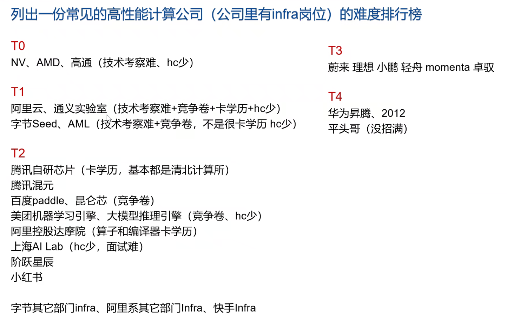

# AI Infra 就业分享

## 岗位分类 & 要求（面试难度由难到易）

**高性能计算/异构计算工程师：**

CUDA：手撕 CUDA、算子优化、**CUDA-learn-notes** 手写算子练习、知乎博客（**read**）、profiler 工具。

LeetCode 算法题也得准备，但一般是直接写算子。

**大模型推理引擎工程师：**

- AI 推理引擎（有 IR，需要会 IR 图优化：模型转换、切图、capture、……）；
- 大模型推理引擎（vllm、sglang、……，问：为什么高吞吐？减少内存碎片化、投机解码、连续批处理、……）；
- 机器学习引擎。

对算子的要求不如专门写算子的组要求高。（大模型的算子种类少）

八股问的比较多，但是也会要求手撕算子，或者 LeetCode，要会 C++。

自研芯片公司：vllm 和 sglang 必会，需要适配自家芯片。

**AI 训练框架研发工程师：**

……

**AI 编译器、工具链工程师：**

……

## 公司列表

