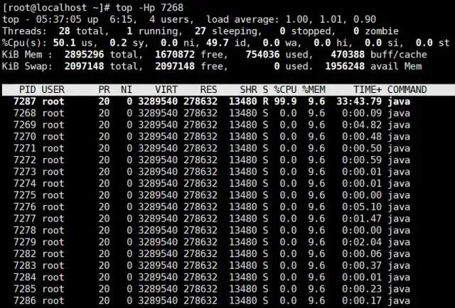
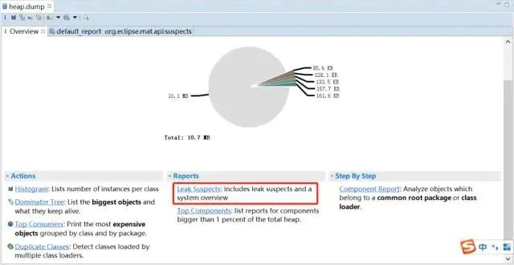
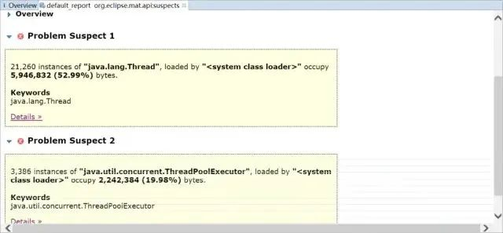

# CPU 占用过高

## 1 问题分析

cpu 占用过高要分情况讨论，是不是业务上在搞活动，突然有大批的流量进来，而且活动结束后 cpu 占用率就下降了，如果是这种情况其实可以不用太关心，因为请求越多，需要处理的线程数越多，这是正常的现象。话说回来，如果你的服务器配置本身就差，cpu 也只有一个核心，这种情况，稍微多一点流量就真的能够把你的 cpu 资源耗尽，这时应该考虑先把配置提升。

第二种情况，cpu 占用率**长期过高**，这种情况下可能是你的程序有那种循环次数超级多的代码，甚至是出现死循环了，排查步骤如下。

## 2 排查步骤

**（1）用 `top` 命令查看 cpu 占用情况**


这样就可以定位出 cpu 过高的进程。在 linux 下，`top` 命令获得的进程号和 jps 工具获得的 `vmid` 是相同的：


**（2）用 `top -Hp [pid]` 命令查看线程的情况**



可以看到是线程 id 为 7287 这个线程一直在占用 cpu。

**（3）把线程号转换为 16 进制**

```shell
[root@localhost ~]# printf "%x" 7287
1c77
```

记下这个 16 进制的数字，下面我们要用。

**（4）用 jstack 工具查看线程栈情况**

```shell
[root@localhost ~]# jstack 7268 | grep 1c77 -A 10
"http-nio-8080-exec-2" #16 daemon prio=5 os_prio=0 tid=0x00007fb66ce81000 nid=0x1c77 runnable [0x00007fb639ab9000]
   java.lang.Thread.State: RUNNABLE
 at com.spareyaya.jvm.service.EndlessLoopService.service(EndlessLoopService.java:19)
 at com.spareyaya.jvm.controller.JVMController.endlessLoop(JVMController.java:30)
 at sun.reflect.NativeMethodAccessorImpl.invoke0(Native Method)
 at sun.reflect.NativeMethodAccessorImpl.invoke(NativeMethodAccessorImpl.java:62)
 at sun.reflect.DelegatingMethodAccessorImpl.invoke(DelegatingMethodAccessorImpl.java:43)
 at java.lang.reflect.Method.invoke(Method.java:498)
 at org.springframework.web.method.support.InvocableHandlerMethod.doInvoke(InvocableHandlerMethod.java:190)
 at org.springframework.web.method.support.InvocableHandlerMethod.invokeForRequest(InvocableHandlerMethod.java:138)
 at org.springframework.web.servlet.mvc.method.annotation.ServletInvocableHandlerMethod.invokeAndHandle(ServletInvocableHandlerMethod.java:105)
```

通过 jstack 工具输出现在的线程栈，再通过 `grep` 命令结合上一步拿到的线程 16 进制的 id 定位到这个线程的运行情况，其中 jstack 后面的 7268 是第（1）步定位到的进程号，`grep` 后面的是（2）、（3）步定位到的线程号。

从输出结果可以看到这个线程处于运行状态，在执行 `com.spareyaya.jvm.service.EndlessLoopService.service` 这个方法，代码行号是 19 行，这样就可以去到代码的 19 行，找到其所在的代码块，看看是不是处于循环中，这样就定位到了问题。

## 3 总结

1. 使用 `top` 命令查看各个进程的 CPU 占用情况，找到 CPU 占用率最高的进程，并记录其进程号，记为 pid
2. 使用 `top -HP [pid]` 查看该进程下各个线程的 CPU 占用情况，找到 CPU 占用率最高的线程，并记录其线程号，记为 tid
3. 使用 `printf "%x" [tid]` 得到该线程号的 16 进制表示，记为 0xtid
4. 使用 jstack 工具执行 `jstack [tid] | grep [0xtid] -A 10` 命令来查看该线程的状态以及线程栈（正在执行的方法），然后就可以定位到可能有问题的代码了（`-A 10`：表示只打印 10 行）

# 死锁

## 1 问题分析

死锁并没有第一种场景那么明显，web 应用肯定是多线程的程序，它服务于多个请求，程序发生死锁后，死锁的线程处于等待状态（`WAITING` 或 `TIMED_WAITING`），等待状态的线程不占用 cpu，消耗的内存也很有限，而表现上可能是请求没法进行，最后超时了。在死锁情况不多的时候，这种情况不容易被发现，可以使用 jstack 工具来查看。

## 2 排查步骤

**（1）jps 查看 java 进程**

```shell
[root@localhost ~]# jps -l
8737 sun.tools.jps.Jps
8682 jvm-0.0.1-SNAPSHOT.jar
```

**（2）jstack 查看死锁问题**

由于 web 应用往往会有很多工作线程，特别是在高并发的情况下线程数更多，于是这个命令的输出内容会十分多。jstack 最大的好处就是会把产生死锁的信息（包含是什么线程产生的）输出到最后，所以我们只需要看最后的内容就行了。

```shell
Java stack information for the threads listed above:
===================================================
"Thread-4":
 at com.spareyaya.jvm.service.DeadLockService.service2(DeadLockService.java:35)
 - waiting to lock <0x00000000f5035ae0> (a java.lang.Object)
 - locked <0x00000000f5035af0> (a java.lang.Object)
 at com.spareyaya.jvm.controller.JVMController.lambda$deadLock$1(JVMController.java:41)
 at com.spareyaya.jvm.controller.JVMController$$Lambda$457/1776922136.run(Unknown Source)
 at java.lang.Thread.run(Thread.java:748)
"Thread-3":
 at com.spareyaya.jvm.service.DeadLockService.service1(DeadLockService.java:27)
 - waiting to lock <0x00000000f5035af0> (a java.lang.Object)
 - locked <0x00000000f5035ae0> (a java.lang.Object)
 at com.spareyaya.jvm.controller.JVMController.lambda$deadLock$0(JVMController.java:37)
 at com.spareyaya.jvm.controller.JVMController$$Lambda$456/474286897.run(Unknown Source)
 at java.lang.Thread.run(Thread.java:748)

Found 1 deadlock.
```

发现了一个死锁，原因也一目了然。

## 3 总结

1. 现象：请求超时
2. 使用 jps 工具执行 `jps -l` 查看各个进程
3. 使用 jstack 工具查看线程的死锁信息，定位具体的代码位置

# 内存泄漏

## 1 问题分析

我们都知道，Java 和 C++ 的最大区别是前者会自动收回不再使用的内存，后者需要程序员手动释放。在 c++ 中，如果我们忘记释放内存就会发生内存泄漏。但是，不要以为 jvm 帮我们回收了内存就不会出现内存泄漏。

程序发生内存泄漏后，进程的可用内存会慢慢变少，最后的结果就是抛出 OOM 错误。发生 OOM 错误后可能会想到是内存不够大，于是把 -Xmx 参数调大，然后重启应用。这么做的结果就是，过了一段时间后，OOM 依然会出现。最后无法再调大最大堆内存了，结果就是只能每隔一段时间重启一下应用。

> JVM 调优参数：
>
> - -Xms：设置最小堆空间的大小
> - -Xmx：设置最大堆空间的大小
> - -Xmn：设置新生代空间的大小

内存泄漏的另一个可能的表现是请求的响应时间变长了。这是因为频繁发生的 GC 会暂停其它所有线程（Stop The World）造成的。

为了模拟这个场景，使用了以下的程序：

```java
import java.util.concurrent.ExecutorService;
import java.util.concurrent.Executors;

public class Main {
    public static void main(String[] args) {
        Main main = new Main();
        // 每间隔 1s 就开一个线程去执行任务
        while (true) {
            try {
                Thread.sleep(1);
            } catch (InterruptedException e) {
                e.printStackTrace();
            }
            main.run();
        }
    }

    private void run() {
        ExecutorService executorService = Executors.newCachedThreadPool();
        for (int i = 0; i < 10; i++) {
            executorService.execute(() -> {
                // do something...
            });
        }
    }
}
```

运行参数是 `-Xms20m -Xmx20m -XX:+PrintGC`，把可用内存调小一点，并且在发生 gc 时输出信息，运行结果如下：

```
...
[GC (Allocation Failure)  12776K->10840K(18432K), 0.0309510 secs]
[GC (Allocation Failure)  13400K->11520K(18432K), 0.0333385 secs]
[GC (Allocation Failure)  14080K->12168K(18432K), 0.0332409 secs]
[GC (Allocation Failure)  14728K->12832K(18432K), 0.0370435 secs]
[Full GC (Ergonomics)  12832K->12363K(18432K), 0.1942141 secs]
[Full GC (Ergonomics)  14923K->12951K(18432K), 0.1607221 secs]
[Full GC (Ergonomics)  15511K->13542K(18432K), 0.1956311 secs]
...
[Full GC (Ergonomics)  16382K->16381K(18432K), 0.1734902 secs]
[Full GC (Ergonomics)  16383K->16383K(18432K), 0.1922607 secs]
[Full GC (Ergonomics)  16383K->16383K(18432K), 0.1824278 secs]
[Full GC (Allocation Failure)  16383K->16383K(18432K), 0.1710382 secs]
[Full GC (Ergonomics)  16383K->16382K(18432K), 0.1829138 secs]
[Full GC (Ergonomics) Exception in thread "main"  16383K->16382K(18432K), 0.1406222 secs]
[Full GC (Allocation Failure)  16382K->16382K(18432K), 0.1392928 secs]
[Full GC (Ergonomics)  16383K->16382K(18432K), 0.1546243 secs]
[Full GC (Ergonomics)  16383K->16382K(18432K), 0.1755271 secs]
[Full GC (Ergonomics)  16383K->16382K(18432K), 0.1699080 secs]
[Full GC (Allocation Failure)  16382K->16382K(18432K), 0.1697982 secs]
[Full GC (Ergonomics)  16383K->16382K(18432K), 0.1851136 secs]
[Full GC (Allocation Failure)  16382K->16382K(18432K), 0.1655088 secs]
java.lang.OutOfMemoryError: Java heap space
```

可以看到虽然一直在 gc，占用的内存却越来越多，说明程序有的对象无法被回收。但是上面的程序对象都是定义在方法内的，属于局部变量，局部变量在方法运行结束后，所引用的对象在 gc 时应该被回收啊，但是这里明显没有。

## 2 排查步骤

### 2.1 方式一

为了找出到底是哪些对象没能被回收，我们加上运行参数 `-XX:+HeapDumpOnOutOfMemoryError -XX:HeapDumpPath=heap.bin`，意思是发生 OOM 时把堆内存信息 dump 出来。运行程序直至异常，于是得到 heap.dump 文件，然后我们借助 eclipse 的 MAT 插件来分析，如果没有安装需要先安装。

然后 File->Open Heap Dump... ，然后选择刚才 dump 出来的文件，选择 Leak Suspects：



MAT 会列出所有可能发生内存泄漏的对象：



可以看到居然有 21260 个 Thread 对象，3386 个 ThreadPoolExecutor 对象，如果你去看一下 `java.util.concurrent.ThreadPoolExecutor` 的源码，可以发现线程池为了复用线程，会不断地等待新的任务，线程也不会回收，需要调用其 `shutdown()` 方法才能让线程池执行完任务后停止。

其实线程池定义成局部变量，好的做法是设置成单例。

上面只是其中一种处理方法。

### 2.2 方式二

在线上的应用，内存往往会设置得很大，这样发生 OOM 再把内存快照 dump 出来的文件就会很大，可能大到在本地的电脑中已经无法分析了（因为内存不足够打开这个 dump 文件），因此这里再介绍另一种处理办法。

**（1）用 jps 定位到进程号**

```shell
C:\Users\spareyaya\IdeaProjects\maven-project\target\classes\org\example\net>jps -l
24836 org.example.net.Main
62520 org.jetbrains.jps.cmdline.Launcher
129980 sun.tools.jps.Jps
136028 org.jetbrains.jps.cmdline.Launcher
```

因为已经知道了是哪个应用发生了 OOM，这样可以直接用 jps 找到进程号 135988。

**（2）用 jstat 分析 gc 的活动情况**

jstat 是一个统计 java 进程内存使用情况和 gc 活动的工具，参数可以有很多，可以通过 `jstat -help` 查看所有参数以及含义。

```shell
C:\Users\spareyaya\IdeaProjects\maven-project\target\classes\org\example\net>jstat -gcutil -t -h8 24836 1000
Timestamp         S0     S1     E      O      M     CCS    YGC     YGCT    FGC    FGCT     GCT
           29.1  32.81   0.00  23.48  85.92  92.84  84.13     14    0.339     0    0.000    0.339
           30.1  32.81   0.00  78.12  85.92  92.84  84.13     14    0.339     0    0.000    0.339
           31.1   0.00   0.00  22.70  91.74  92.72  83.71     15    0.389     1    0.233    0.622
```

上面命令的意思是输出 gc 的情况，输出时间，每 8 行输出一个行头信息，统计的进程号是 24836，每 1000 毫秒输出一次信息。

输出信息中的 `Timestamp` 是距离 jvm 启动的时间，`S0`、`S1`、`E` 是新生代的两个 Survivor 和 Eden，`O` 是老年代区，`M` 是 Metaspace，CCS 使用压缩比例，YGC 和 YGCT 分别是新生代 gc 的次数和时间，FGC 和 FGCT 分别是老年代 gc 的次数和时间，GCT 是 gc 的总时间。虽然发生了 gc，但是老年代内存占用率根本没下降，说明有的对象没法被回收（当然也不排除这些对象真的是有用）。

**（3）用 jmap 工具 dump 出内存快照**

jmap 可以把指定 java 进程的内存快照 dump 出来，效果和第一种处理办法一样，不同的是它不用等 OOM 就可以做到，而且 dump 出来的快照也会小很多。

```
jmap -dump:live,format=b,file=heap.bin 24836
```

这时会得到 heap.bin 的内存快照文件，然后就可以用 eclipse 来分析了。

## 3 总结

- 现象：频繁出现 OOM 异常或请求的响应时间变长（因为频繁发生 gc）
- 方式一：
  1. 发生 OOM 时把堆内存信息 dump 出来
  2. 分析 dump 文件
- 方式二：
  1. 用 jps 定位到进程号
  2. 用 jstat 分析 gc 的活动情况
  3. 用 jmap 工具 dump 出内存快照
  4. 分析 dump 文件

# 总结

以上三种严格地说还算不上 JVM 的调优，只是用了 JVM 工具把代码中存在的问题找了出来。我们进行 JVM 调优的主要目的是尽量减少停顿时间，提高系统的吞吐量。

但是如果我们没有对系统进行分析就盲目去设置其中的参数，可能会得到更坏的结果，JVM 发展到今天，各种默认的参数可能是实验室的人经过多次的测试来做平衡的，适用大多数的应用场景。

如果你认为你的 JVM 确实有调优的必要，也务必要取样分析，最后还得慢慢多次调节，才有可能得到更优的效果。

JVM 工具：

- jps：查看 Java 进程的 pid
- jstack：查看 Java 进程的线程栈信息，包括：线程的状态、正在执行的方法、死锁信息等
- jstat：查看 Java 进程的内存使用情况和 gc 活动情况
- jmap：可以把指定 Java 进程的内存快照 dump 出来用于分析